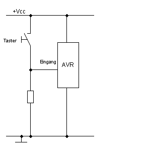
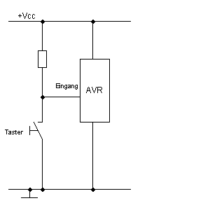

<!--
author:   Sebastian Zug, Karl Fessel
email:    sebastian.zug@informatik.tu-freiberg.de

version:  0.0.1
language: de
narrator: Deutsch Female

import:  https://raw.githubusercontent.com/liascript-templates/plantUML/master/README.md
         https://github.com/LiaTemplates/AVR8js/main/README.md
         https://github.com/liascript/CodeRunner

icon: https://upload.wikimedia.org/wikipedia/commons/d/de/Logo_TU_Bergakademie_Freiberg.svg
-->

[](https://liascript.github.io/course/?https://github.com/TUBAF-IfI-LiaScript/VL_DigitaleSysteme/main/exercises/00_Einfuehrung.md#1)

# Erste Gehversuche

| Parameter                | Kursinformationen                                                                                                                                                                    |
| ------------------------ | ------------------------------------------------------------------------------------------------------------------------------------------------------------------------------------ |
| **Veranstaltung:**       | `Übungen Digitale Systeme`                                                                                                                                                      |
| **Semester**             | `Sommersemester 2022`                                                                                                                                                                |
| **Hochschule:**          | `Technische Universität Freiberg`                                                                                                                                                    |
| **Inhalte:**             | `Einarbeitung und digitale Input/Output Operationen`                                                                                            |
| **Link auf den GitHub:** | [https://github.com/TUBAF-IfI-LiaScript/VL_DigitaleSysteme/blob/main/lectures/00_Einfuehrung.md](https://github.com/TUBAF-IfI-LiaScript/VL_DigitaleSysteme/blob/main/lectures/00_Einfuehrung.md) |
| **Autoren**              | @author                                                                                                                                                                              |


---

## Organisation der Übungen

Wir treffen uns in der ersten Phase der Veranstaltung donnerstags um 7:30 und besprechen die Umsetzung der in den Vorlesungen vermittelten Inhalte. Darauf bauen verschiedene Übungsaufgaben auf, die Sie selbstständig lösen.

In der zweiten Phase betten wir Ihre Vorträge ein.

> Ich möchte vorschlagen, dass Sie die Aufgaben gemeinsam realisieren und dafür GitHub nutzen. Das erleichtert mir auch die Begleitung der Entwicklung.


## Entwicklungsumgebungen

1. Arduino Umgebung mittels `avrlibc`

    + Aktivieren Sie die Ausgaben beim Compilieren und Flashen
    + Testen Sie die Nutzung der Seriellen Schnittstelle

2. Unabhängiges C Projekt mit Makefile

    + Arbeiten Sie sich ggf. in die Makefile-Syntax ein
    + Nutzen Sie existierende Makefile-Implementierungen [Link](https://www.heise.de/developer/artikel/Auf-Kommando-3361570.html)
    + Integrieren Sie das Projekt in Ihren präferierten Editor

3. Plattform IO

    + Machen Sie sich mit dem CLI von PlatformIO vertraut [Link](https://platformio.org/)
    + Integrieren Sie den Ansatz in Ihre präferierte Entwicklungsumgebung

4. Spezifische IDEs für die AVR Familie

    + MLAB (IDE der Firma Mikrochip)
    + Atmel Studio


## Bitoperationen in C

| Operation | Bedeutung               |
| --------- | ----------------------- |
| `>>`      | Rechts schieben         |
| `<<`      | Links schieben          |
| `|`       | binäres, bitweises ODER |
| `&`       | binäres, bitweises UND  |
| `^`       | binäres, bitweises XOR  |

```cpp                     Bitshifting.cpp
#include <iostream>
#include <bitset>

int main()
{
  char v = 0x1;
  for (int i = 0; i <=7; i++){
    std::cout << std::bitset<8>((v<<i)) << std::endl;
  }
  return 0;
}
```
@LIA.eval(`["main.c"]`, `g++ -Wall main.c -o a.out`, `./a.out`)

Mit diesen Operationen werden sogenannte Masken gebildet und diese dann auf die
Register übertragen.

### Setzen eines Bits

```cpp                     BitSetting.cpp
#include <iostream>
#include <bitset>

/* übersichtlicher mittels Bit-Definitionen */
#define PB0 0
#define PB1 1
#define PB2 2

int main()
{
  char PORTB;  // Wir "simulieren" die Portbezeichnung
  PORTB = 0;
  std::cout << std::bitset<8>(PORTB) << std::endl;

  // Langschreibweise
  PORTB = PORTB | 1;
  std::cout << std::bitset<8>(PORTB) << std::endl;
  // Kurzschreibweise
  PORTB |= 0xF0;
  std::cout << std::bitset<8>(PORTB) << std::endl;

  // Kurzschreibweise mit mehrteiliger Maske (setzt Bit 0 und 2 in PORTB auf "1")
  PORTB |= ((1 << PB0) | (1 << PB2));
  std::cout << std::bitset<8>(PORTB) << std::endl;
}
```
@LIA.eval(`["main.c"]`, `g++ -Wall main.c -o a.out`, `./a.out`)

### Löschen eines Bits

Das Löschen basiert auf der Idee, dass wir eine Maske auf der Basis der invertierten
Bits generieren und diese dann mit dem bestehenden Set mittels `&` abbilden.

```cpp                     BitSetting.cpp
#include <iostream>
#include <bitset>

/* übersichtlicher mittels Bit-Definitionen */
#define PB0 0
#define PB1 1
#define PB2 2

int main()
{
  char PORTB = ((1 << PB0) | (1 << PB2));
  std::cout << std::bitset<8>(PORTB) << std::endl;

  PORTB &= ~(1 << PB0);
  std::cout << std::bitset<8>(PORTB) << std::endl;
}
```
@LIA.eval(`["main.c"]`, `g++ -Wall main.c -o a.out`, `./a.out`)

### Prüfen eines Bits

```cpp                     BitSetting.cpp
#include <iostream>
#include <bitset>

/* übersichtlicher mittels Bit-Definitionen */
#define PB0 0
#define PB1 1
#define PB2 2

int main()
{
  char PORTB = ((1 << PB0) | (1 << PB2));
  std::cout << std::bitset<8>(PORTB) << std::endl;

  if (PORTB & (1 << PB0))
       std::cout << "Bit 2 gesetzt" << std::endl;
  if (!(PORTB & (1 << PB0)))
       std::cout << "Bit 2 nicht gesetzt" << std::endl;
  // Ist PB0 ODER PB2 gesetzt?
  if (PORTB & ((1 << PB0) | (1 << PB2)))
     std::cout << "Bit 0 oder 2 gesetzt" << std::endl;
}
```
@LIA.eval(`["main.c"]`, `g++ -Wall main.c -o a.out`, `./a.out`)

## Aufgaben




- [ ] Wo liegt der Unterschied in den Schaltungen? Wie heißen die jeweiligen Widerstände? Warum werden die Widerstände verwendet?


- [ ] Schreiben Sie ein Programm, welches beim Drücken eines angeschlossenen Schalters an Pin 12 die eingebaute LED an Pin 13 schnell blinken lässt. Nutzen Sie dabei den folgenden Aufbau. Wie hängt dieser Aufbau mit Übung 3 zusammen? Wo ist der benötigte Widerstand?

- [ ] Recherchieren Sie die Abläufe zum Entprellen eines Tasters in Software. Wie ließe sich diese Lösung auf eine Hardware abbilden?

- [ ] Schreiben Sie ein Programm, welches einen String mittels Morse-Code über die eingebaute LED ausgibt, sobald ein Schalter gedrückt wird.

```c
//For letters
const char *letters[] = {
  ".-", "-...", "-.-.", "-..", ".", "..-.", "--.", "....", "..", // A-I
  ".---", "-.-", ".-..", "--", "-.", "---", ".--.", "--.-", ".-.", // J-R
  "...", "-", "..-", "...-", ".--", "-..-", "-.--", "--.." // S-Z
};

//For Numbers
const char *numbers[] = {
  "-----", ".----", "..---", "...--", "....-", ".....",
  "-....", "--...", "---..", "----."
};
```

- [ ] Fügen Sie in der simavr Umgebung eine weitere Untersuchung für `float` und `double` Variablen ein.

    https://github.com/TUBAF-IfI-LiaScript/VL_DigitaleSysteme/tree/main/codeExamples/avr/fixedPoint/pySimAVR/vcdBased
