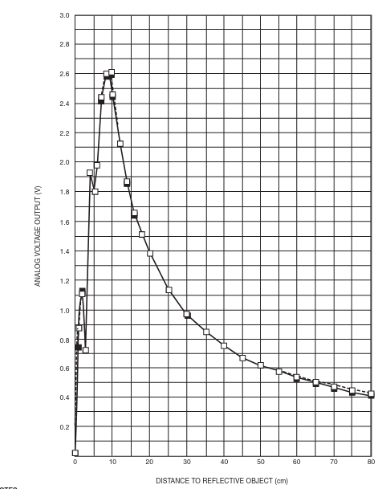
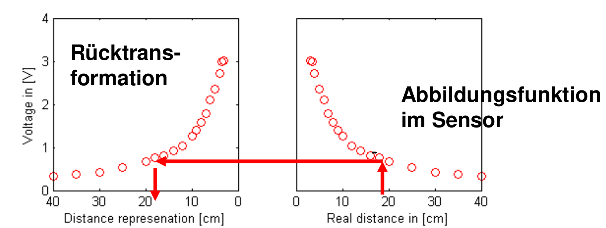
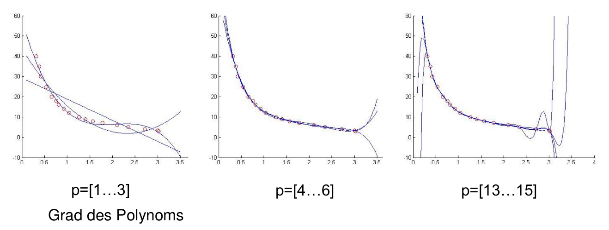

<!--
author:   Sebastian Zug, Karl Fessel
email:    sebastian.zug@informatik.tu-freiberg.de

version:  0.0.2
language: de
narrator: Deutsch Female

import:  https://raw.githubusercontent.com/liascript-templates/plantUML/master/README.md
         https://github.com/LiaTemplates/AVR8js/main/README.md
         https://github.com/liascript/CodeRunner

icon: https://upload.wikimedia.org/wikipedia/commons/d/de/Logo_TU_Bergakademie_Freiberg.svg
-->

[](https://liascript.github.io/course/?https://github.com/TUBAF-IfI-LiaScript/VL_DigitaleSysteme/main/exercises/01_AnalogDigitalWandler.md#1)

# Analog-Digital-Wandler

| Parameter                | Kursinformationen                                                                                                                                                                    |
| ------------------------ | ------------------------------------------------------------------------------------------------------------------------------------------------------------------------------------ |
| **Veranstaltung:**       | `Übungen Digitale Systeme`                                                                                                                                                      |
| **Semester**             | `Sommersemester 2021`                                                                                                                                                                |
| **Hochschule:**          | `Technische Universität Freiberg`                                                                                                                                                    |
| **Inhalte:**             | `Einarbeitung und digitale Input/Output Operationen`                                                                                            |
| **Link auf den GitHub:** | [https://github.com/TUBAF-IfI-LiaScript/VL_DigitaleSysteme/blob/main/lectures/01_AnalogDigitalWandler.md](https://github.com/TUBAF-IfI-LiaScript/VL_DigitaleSysteme/blob/main/lectures/01_AnalogDigitalWandler.md) |
| **Autoren**              | @author                                                                                                                                                                              |


---

## Diskussion des vergangenen Aufgabenblattes

Lösungsansätze
============================================

> Hier sind Sie gefragt ...

Einbettung der Simulation in die Entwicklungsumgebung
============================================

Plattformio integiert zwei Debugging Tools für den Arduino Uno unmittelbar:

+ `simavr` als reine Simulationumgebung [Link](https://docs.platformio.org/en/latest/plus/debug-tools/simavr.html)
+ `avr-stub` als Hardware-in-the-loop Debugger [Link](https://docs.platformio.org/en/latest/plus/debug-tools/avr-stub.html#debugging-tool-avr-stub)
+ `avr-jtag`
+ `unity` als Serial basierte Testumgebung 
+ ...
+ `pysimavr` als Python-basiertes Testtool

## Hinweise und Anregungen


### Transformation von Wandlerergebnissen





> **Frage:** Wie bilden wir das Abbildungsverhalten in unserem eingebetteten Programm ab?

                 {{1}}
************************************************

**Variante 1 - Interpolierte Funktion**



Bedenken Sie die Hardwarebeschränkungen des Controllers und evaluieren Sie die Berechnungsdauer der Kalkulation.

> **Hinweis:** Implementieren Sie Polynome analog zum Horner Schema anstatt in der üblichen Schreibweise. Dies erschwert zwar die Lesbarkeit ein wenig, reduziert aber die Zahl der Multiplikationen ($2(n-1) -> n$) deutlich.
>
> $y(x) = a_0 + x\cdot(a_1 +x \cdot(a_2 +  ... (a_{n-1} + a_nx)))))$

************************************************

                        {{2}}
************************************************

**Variante 2 - Lookup-Table**

Lookup-Tabellen (LUT) werden verwendet, um Informationen statisch zu definieren und diese zur Laufzeit des Programms – zur Vermeidung aufwändiger Berechnungen – zu benutzen.

```c
static const uint8_t lookup[256] =
{0,0,0,0 ... 20,23,26,30,31,30,28,...,4,4,4,4,4,3,3,3,...0,0,0};
distance= lookup[ADC_output];
```

Der ohnehin häufig knappe Speicher des ATmega328P (2KBytes) lässt sich mit dem in `avr/pgmspace.h` enthaltenen Variablenmodifikator `PROGMEM` schonen. In diesem Fall werden zugehörige Datensätze im Programmspeicher (32KBytes) abgelegt.

```c
#include <avr/io.h>
#include <avr/pgmspace.h>

const uint8_t lookup_FLASH[256] PROGMEM = {
0,0,0,0 ... 20,23,26,30,31,30,28,...,4,4,4,4,4,3,3,3,...0,0,0
}
```

> **Frage:** Welche Größe einer LUT macht im Zusammenhang mit ADC Resultaten maximal Sinn?

************************************************

[^Sharp]: Sharp Corporation, GP2D12 Optoelectic Device - Datasheet, https://engineering.purdue.edu/ME588/SpecSheets/sharp_gp2d12.pdf

### Filtern von Ergebnissen

Ein digitales Filter manipuliert diskrete Signale mit spezifischer Hardware oder in Form einer Software. Ein übliches Vorgehen ist die nachfolgend diskutierte Trennung zwischen der Auslegung und der Realisierung auf der konkreten Hardware.

Vorteile gegenüber analogen Filtern

+ keine Schwankungen durch Toleranz der Bauteile
+ keine Alterung der Bauteile
+ kein manueller Abgleich in der Fertigung notwendig, daher raschere Endprüfung von Geräten
+ mögliche Filterfunktionen, die mit Analogfiltern nur schwer oder gar nicht realisierbar sind, beispielsweise Filter mit linearer Phase.

Nachteile digitaler Filter

+ begrenzter Frequenzbereich (aufgrund endlicher Abtastraten)
+ begrenzter Wertebereich (durch Wertequantisierung)
+ durch interne Rundungs-, Abschneide- und Begrenzungsoperationen zur Wortlängenbegrenzung weisen digitale Filter in der Praxis Quantisierungsrauschen und andere nichtlineare Effekte auf
+ bei nichtelektrischen Ein- und Ausgangsgrößen zusätzlicher Aufwand für die Wandlung.

Beispiel FIR Filter

$$
y(n) = \sum_{n=0}^{N} b_i x(n-i)
$$

Realisierung des Filters mit der scipy Methode [firwin](https://docs.scipy.org/doc/scipy/reference/generated/scipy.signal.firwin.html).

```python       IllustrateFIR.py
from numpy import sin, arange, pi
from scipy.signal import lfilter, firwin
import matplotlib.pyplot as plt

#------------------------------------------------
# Create a signal for demonstration.
#------------------------------------------------
# 320 samples of (1000Hz + 15000 Hz) at 48 kHz
sample_rate = 48000.
nsamples = 320

F_1KHz = 1000.
A_1KHz = 1.0

F_15KHz = 15000.
A_15KHz = 0.5

t = arange(nsamples) / sample_rate
signal = A_1KHz * sin(2*pi*F_1KHz*t) + A_15KHz*sin(2*pi*F_15KHz*t)

#------------------------------------------------
# Create a FIR filter and apply it to signal.
#------------------------------------------------
# The Nyquist rate of the signal.
nyq_rate = sample_rate / 2.

# The cutoff frequency of the filter: 6KHz
cutoff_hz = 6000.0

# Length of the filter (number of coefficients, i.e. the filter order + 1)
numtaps = 9

# Use firwin to create a lowpass FIR filter
fir_coeff = firwin(numtaps, cutoff_hz/nyq_rate)

# Use lfilter to filter the signal with the FIR filter
filtered_signal = lfilter(fir_coeff, 1.0, signal)

#------------------------------------------------
# Plot the original and filtered signals.
#------------------------------------------------

# The first N-1 samples are "corrupted" by the initial conditions
warmup = numtaps - 1

# The phase delay of the filtered signal
delay = (warmup / 2) / sample_rate

fig, ax = plt.subplots()
# Plot the original signal
ax.plot(t, signal)

# Plot the filtered signal, shifted to compensate for the phase delay
ax.plot(t-delay, filtered_signal, 'r-')

# Plot just the "good" part of the filtered signal.  The first N-1
# samples are "corrupted" by the initial conditions.
ax.plot(t[warmup:]-delay, filtered_signal[warmup:], 'g', linewidth=4)

ax.grid(True)

print ("Koffizienten =" + ''.join(["%+.10f" % x for x in fir_coeff]))


#plt.show()  
plt.savefig('foo.png') # notwendig für die Ausgabe in LiaScript
```
@LIA.eval(`["main.py"]`, `none`, `python3 main.py`)

Die nachfolgende Lösung illustriert die intuitive Umsetzung des Ansatzes anhand von Gleitkommazahlen. Welche Adaptionen drängen sich auf?

```c          FIRimplementation.c
#define nc 11    // Anzahl der Filterkoeffizienten  
int i = 0, zeiger = 0;
float new_sample, y, circular_buffer[nc];

// Filterkoeffizienten b[0] = b_N, ..., b[nc - 1] = b_0
float b[nc] = {0.0637, 0, -0.1061, 0, 0.3183, 0.5, 0.3183, 0, -0.1061, 0, 0.0637};
float circular_buffer[i] = {0};

// Der folgende Code wird jedes Mal ausgeführt, wenn ein
// neuer Eingangswert (new_sample) zur Verfügung steht  
// Schreibe neuen Eingangswert in Buffer  

circular_buffer[zeiger] = new_sample;
// Inkrementiere Zeiger modulo nc  
zeiger = (zeiger + 1) % nc;

// Berechne neuen Ausgangswert  
y = 0;
for(i = 0; i < nc; i++){
  y += (b[i] * circular_buffer[(zeiger + i) % nc]);
}
```

## Beispiel - Analoger Comperator


```c    AnalogComperator.c
#define F_CPU 16000000UL

#include <Arduino.h>

#include <avr/io.h>
#include <util/delay.h>

void Init(){
  DDRB|=(1<<PB5);       
  DDRC&=~(1<<PC3);      
  PORTC&=~(1<<PC3);     
  ADCSRB |=(1<<ACME);   
  ADCSRB&=~(1<<ADEN);   
  ADMUX|=(0<<MUX2)|(1<<MUX1)|(1<<MUX0);
  ACSR|= (0<<ACD)|      
         (1<<ACBG)|     
         (1<<ACIE)|     
         (0<<ACIC)|     
         (0<<ACIS1)|    
         (0<<ACIS0);
  Serial.println("Initalisierung abgeschlossen");
  Serial.flush();
}

int main (void) {  

   Serial.begin(9600);
   Serial.println("Hello World");
   Serial.flush();

   Init();
   while(1){
      if (ACSR & (1<<ACO)) // Check ACO bit of ACSR register
      PORTB&=~(1<<PB5);    //LED is ON
      else  PORTB|=(1<<PB5);
   }
   return 0;
}
```

[^AtmelHandbuch]: Firma Microchip, megaAVR® Data Sheet, [Link](http://ww1.microchip.com/downloads/en/DeviceDoc/ATmega48A-PA-88A-PA-168A-PA-328-P-DS-DS40002061A.pdf)

## Aufgaben

- [ ] Erfassen Sie die Werte des internen Temperatursensors des ATmega328 mit den Daten des Heizleiters [Link](https://www.mangolabs.de/product/steel-head-thermistor/). Nutzen Sie dafür ggf. den SerialPlotter der Arduino-Umgebung oder ein alternatives Visualsierungstool [Python](https://thepoorengineer.com/en/arduino-python-plot/).

- [ ] Verbinden Sie den Joystick mit dem Arduino über GND und +5V mit den zugehörigen Pins auf dem Arduino. Vx und Vy entsprechen analogen Werten zwischen 0V und 5V der jeweiligen Achsen. SW entspricht einem Druck auf den Joystick und ist ein digitaler Schalter. Schreiben Sie eine Funktion, um den ADC zu initialisieren und eine Funktion, um die analogen Werte des Joysticks auszulesen.

- [ ] Entwerfen Sie einen Filter für die Glättung der Joystick-Daten. Experimentieren Sie mit unterschiedlichen Konfigurationen des Filters!

- [ ] Speichern Sie die Filterparameter mit `progmem` im Programmspeicher. Analysieren Sie die Konsequnzen anhand einer Analyse des Assemblercodes - evaluieren Sie den Geschwindigkeitsnachteil.
