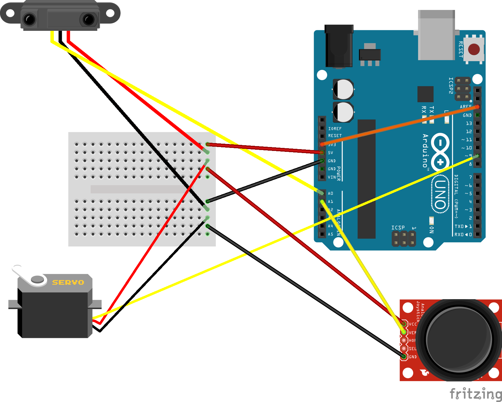

<!--
author:   Sebastian Zug, Karl Fessel
email:    sebastian.zug@informatik.tu-freiberg.de

version:  0.0.2
language: de
narrator: Deutsch Female

import:  https://raw.githubusercontent.com/liascript-templates/plantUML/master/README.md
         https://github.com/LiaTemplates/AVR8js/main/README.md
         https://github.com/liascript/CodeRunner
         https://github.com/LiaTemplates/Pyodide

icon: https://upload.wikimedia.org/wikipedia/commons/d/de/Logo_TU_Bergakademie_Freiberg.svg
-->

[](https://liascript.github.io/course/?https://github.com/TUBAF-IfI-LiaScript/VL_DigitaleSysteme/main/exercises/02_Timer.md#1)

# Timer

| Parameter                | Kursinformationen                                                                                                                                                                    |
| ------------------------ | ------------------------------------------------------------------------------------------------------------------------------------------------------------------------------------ |
| **Veranstaltung:**       | `Übungen Digitale Systeme`                                                                                                                                                      |
| **Semester**             | `Sommersemester 2021`                                                                                                                                                                |
| **Hochschule:**          | `Technische Universität Freiberg`                                                                                                                                                    |
| **Inhalte:**             | `Praktische Diskussion der Timer Funktionalität`                                                                                            |
| **Link auf den GitHub:** | [https://github.com/TUBAF-IfI-LiaScript/VL_DigitaleSysteme/blob/main/lectures/01_AnalogDigitalWandler.md](https://github.com/TUBAF-IfI-LiaScript/VL_DigitaleSysteme/blob/main/lectures/02_Timer.md) |
| **Autoren**              | @author                                                                                                                                                                              |


---

## Diskussion des vergangenen Aufgabenblattes

> Hier sind Sie gefragt ...


## Tongenerierung

In einem ersten Beispiel wollen wir die Tongenerierung mit Hilfe der Timer besprechen. Gleichzeitig sollen diese Beispiele als Ausgangspunkt für die Diskussion der Darstellung der Registerzugriffe dienen.

Nehmen wir also an, dass in einem Projekt der Quellcode einer bestehenden Implementierung auf einen neuen Controller übertragen werden soll. Die Ausgangsbasis finden Sie unter [Link](https://mezdata.de/avr/110_pieper/). Der Quellcode wurde für einen AtTiny mit 1MHz Taktfrequenz geschrieben.

```c
// *** Piepser V1.0 (c) Oliver Mezger 16.9.2010

#include <avr/io.h>
#include <util/delay.h>

int main(){
  DDRB = 0b00010000; // PB4 als Ausgang
  TCCR1A = 0b00100011; // Ausgang OC1B bei 0 setzen und bei OCR1B loeschen
  TCCR1B = 0b00011001; // Waveform Generation Mode: Fast PWM it OCR1A als Top, Timer mit CPU-CLK
  OCR1A = 1000; // Timer 1ms
  OCR1B = 500;  // Impulslaenge 500us
  while (1){  // Spielwiese fuer Tonerzeugung
    for(int i = 2000;i>100;i--){
      OCR1A = i;
      for (int k = i/2; k>2;k--){
        OCR1B = k;
      //_delay_ms(1);
      }
    }
  }
}
```

Welche Änderungen sind für den Wechsel auf die neue Hardware nötig?

## Servomotor

<!--
style="width: 80%; min-width: 420px; max-width: 720px;"
-->
```ascii


           Nulllage (1500ms)
    Minima(1ms)  |  Maxima (2ms)
              |  v  |
High   |      v     v                
       |  +------+...                        +---                            
       |  |   :  |  :                        |     
       |  |   :  |  :                        |               
       |  |   :  |  :                        |               
       |  |   :  |  :                        |               
       |  |   :  |  :                        |                             
       |  |   :  |  :                        |   
       |--+      +---------------------------+
       |
       +-------------------------------------|---->                           .
           0                                20ms
```

Für die Umsetzung bieten sich verschiedene Timer Modi an. In der Vorlesung wurde eine Variante mit einem Vergleichswert gezeigt. Die Implementierung im Beispielordner illustriert ein alternatives Vorgehen.


## Aufgaben

- [ ] Lesen Sie die Daten des Distanzsensors ein, Linearisieren Sie die Ergebnisse und geben Sie diese in `cm` aus.

- [ ] Implementieren Sie eine Timerfunktion, die eine Schwenkbewegung des Servomotors ausführt. Lesen Sie die aktuelle Position in einer Schrittweite von 5 Grad aus.



- [ ] Montieren Sie den Servo-Motor am die Infrarot-Distanzsensor. Bewegen Sie den Sensorkopf mit dem Servomotor entsprechend den Sensoreingaben und führen Sie dabei Distanzmessungen aus. Leiten Sie die Wertepaare (gemessener Distanzwert zu Winkel) per UART an den Entwicklerrechner weiter und stellen Sie diese dort grafisch dar.
