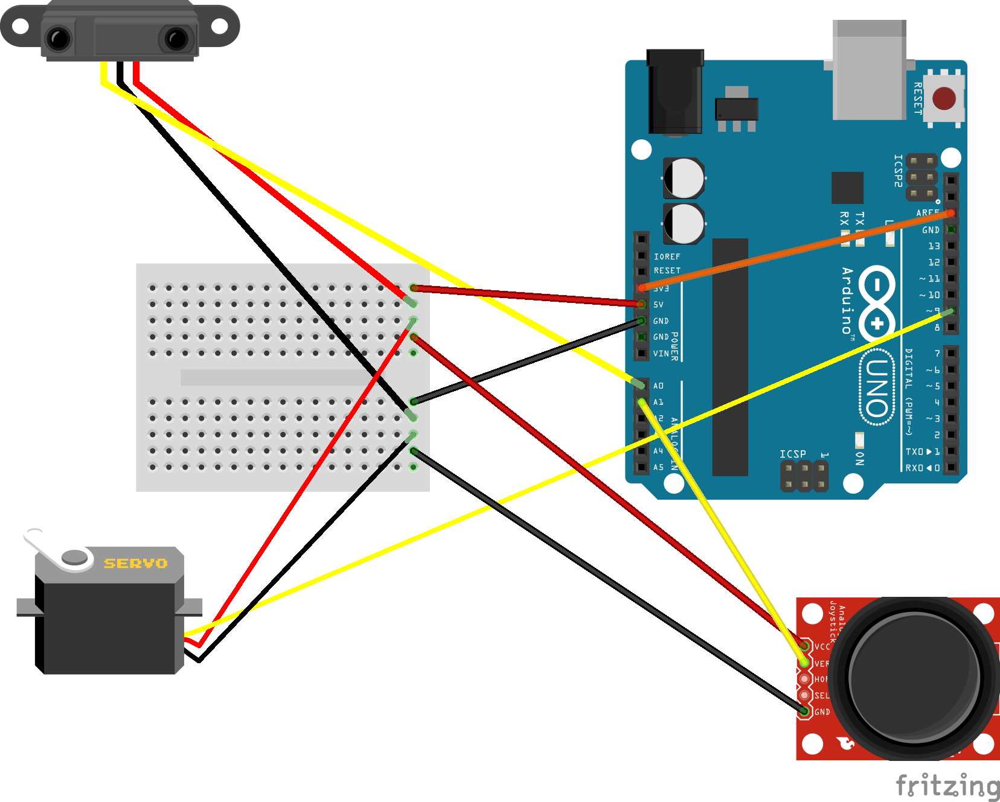

<!--
author:   Sebastian Zug, Karl Fessel
email:    sebastian.zug@informatik.tu-freiberg.de

version:  0.1.0
language: de
narrator: Deutsch Female

import:  https://raw.githubusercontent.com/liascript-templates/plantUML/master/README.md
         https://github.com/LiaTemplates/AVR8js/main/README.md
         https://github.com/liascript/CodeRunner
         https://github.com/LiaTemplates/Pyodide

icon: https://upload.wikimedia.org/wikipedia/commons/d/de/Logo_TU_Bergakademie_Freiberg.svg
-->

[](https://liascript.github.io/course/?https://github.com/TUBAF-IfI-LiaScript/VL_SoftwareentwicklungEingebetteteSysteme/main/exercises/02_Timer.md#1)

# Timer auf dem ATmega4809

| Parameter                | Kursinformationen                                                                                                                                                                    |
| ------------------------ | ------------------------------------------------------------------------------------------------------------------------------------------------------------------------------------ |
| **Veranstaltung:**       | `Übungen Softwareentwicklung Eingebettete Systeme`                                                                                                                                   |
| **Semester**             | `Sommersemester 2026`                                                                                                                                                                |
| **Hochschule:**          | `Technische Universität Freiberg`                                                                                                                                                    |
| **Inhalte:**             | `Wechsel auf den ATmega4809, TCA-Timer, Servoansteuerung, IR-Distanzscanner`                                                                                                         |
| **Link auf den GitHub:** | [https://github.com/TUBAF-IfI-LiaScript/VL_SoftwareentwicklungEingebetteteSysteme/blob/main/exercises/02_Timer.md](https://github.com/TUBAF-IfI-LiaScript/VL_SoftwareentwicklungEingebetteteSysteme/blob/main/exercises/02_Timer.md) |
| **Autoren**              | @author                                                                                                                                                                              |


---

## Diskussion des vergangenen Aufgabenblattes

> Hier sind Sie gefragt ...

## Plattformwechsel — vom 328P zum 4809

Mit dieser Übung wechseln wir die Hardware: Vom **Arduino Uno R3** (ATmega328P) zum **Arduino Uno WiFi Rev. 2** (ATmega4809). Ab hier laufen alle folgenden Übungen auf dem 4809. Wir tauschen die Hardware genau in dem Moment, in dem das Thema Timer ansteht — der 4809 bringt mit dem `TCA`-Modul und der `struct`-basierten Registerdarstellung neue Konzepte mit, die wir gleich an einer konkreten Aufgabe einüben.

> **Was Sie vom 328er mitnehmen:** Das Verständnis für PWM, Vergleichseinheiten, Prescaler und Interrupts. Diese Konzepte gelten unverändert.
>
> **Was neu wird:** Die Registerzugriffe (`TCA0.SINGLE.CTRLA` statt `TCCR1A`), die Periode-/Compare-Trennung (`PER` + `CMP0..2`), die variable Pin-Belegung über `PORTMUX` und der Default-Prescaler des Systemtaktes.

## Setup — Toolchain für den 4809

Der Arduino Uno WiFi Rev. 2 wird über PlatformIO mit dem `atmelmegaavr`-Platform unterstützt. Eine minimale Projektkonfiguration sieht so aus:

```ini platformio.ini
[env:uno_wifi_rev2]
platform = atmelmegaavr
board = uno_wifi_rev2
board_build.mcu = atmega4809
board_build.f_cpu = 16000000L
```

> **Stolperdraht 1 — der echte Takt:** `board_build.f_cpu = 16000000L` definiert nur das `F_CPU`-Macro für `<util/delay.h>` und die Baudratenberechnung. Der **tatsächliche** Takt nach Reset beträgt 16 MHz ÷ 6 ≈ **3,33 MHz**, weil der Default-Prescaler im Register `CLKCTRL.MCLKCTRLB` aktiv ist. Will man wirklich mit 16 MHz arbeiten, muss der Prescaler in Software deaktiviert werden:
>
> ```c
> #include <avr/io.h>
>
> void clock_init_16MHz(void) {
>     // Configuration-Change-Protected Register — Unlock-Sequenz nötig:
>     CPU_CCP = CCP_IOREG_gc;
>     CLKCTRL.MCLKCTRLB = 0;   // Prescaler aus → volle 16 MHz
> }
> ```
>
> Vergleichen Sie das einmal mit [codeExamples/xmega/xMegaADC/src/main.cpp](../codeExamples/xmega/xMegaADC/src/main.cpp), wo `F_CPU` auf `2666666` gesetzt ist — der Autor hat dort *bewusst* den Default-Prescaler beibehalten und das `F_CPU`-Macro angepasst. Beide Wege sind legitim, aber Sie müssen den Zusammenhang verstehen, sonst stimmt keine Baudrate, kein Delay, kein PWM.

> **Stolperdraht 2 — Pinout ≠ 328er:** Die Arduino-Pinnummern (`D2`, `D3`, …) sind beim WiFi Rev. 2 auf andere Ports gemappt als beim klassischen Uno. Halten Sie das Pinout-PDF von Arduino bereit, wenn Sie direkt auf Register zugreifen. Beispiel: `D13` (Onboard-LED) liegt auf `PORTE.PIN2` statt auf `PORTB.PIN5`.

> **Stolperdraht 3 — Linux: `/dev/ttyACM*` erscheint nicht.** Der Uno WiFi Rev. 2 nutzt als USB-Bridge einen Onboard-Programmer (mEDBG) mit der USB-Kennung `03eb:2145`. Das Flashen über `avrdude` funktioniert sofort (Zugriff über HID), aber die **serielle CDC-Bridge** zur Host-Konsole (`/dev/ttyACM0`) wird unter Linux nur dann sauber gebunden, wenn der `ModemManager` das Device in Ruhe lässt. Symptom: Upload klappt, aber `pio device monitor` findet keinen Port.
>
> **Lösung** (einmalig, mit root-Rechten):
>
> ```bash
> # Arduino liefert ein vorgefertigtes Skript mit dem megaavr-Board-Package:
> sudo ~/.arduino15/packages/arduino/hardware/megaavr/<version>/scripts/create_dfu_udev_rule
> # Board einmal ab- und wieder anstecken, dann prüfen:
> ls /dev/ttyACM*
> ```
>
> Das Skript legt `/etc/udev/rules.d/99-arduino-uno-wifi-rev2.rules` an und setzt `ENV{ID_MM_DEVICE_IGNORE}="1"` — damit blendet `ModemManager` das Device aus und das Kernel-Modul `cdc_acm` kann es als `/dev/ttyACM*` einbinden. Sie müssen dafür einmal das Arduino-IDE-Board-Package "megaAVR" installiert haben (über den Board-Manager der Arduino IDE), damit das Skript verfügbar ist. Alternativ kann die Regel auch von Hand angelegt werden — Inhalt siehe Skript.

### Hinweis zum Debugging

Der mEDBG ist **technisch** ein vollwertiger CMSIS-DAP-Debugger und könnte den 4809 über UPDI auch interaktiv halten/inspizieren. Praktisch ist die Toolchain dafür aber unbequem: PlatformIO unterstützt das `atmelmegaavr`-Platform nicht out-of-the-box für Debugging, und der Workaround über `pyAVRdbg` als GDB-Server-Brücke erfordert ein Custom-Setup, das den Übungsrahmen sprengen würde. Hinzu kommt eine harte Hardware-Grenze: der 4809 bietet **nur einen Hardware-Breakpoint**.

> **Praktischer Debug-Workflow für diese Übung:**
>
> 1. **`USART3` als Debug-Print-Kanal** — die mEDBG-Bridge stellt direkt `/dev/ttyACM0` bereit, jeder `printf`-Ersatz landet ohne Zusatzhardware im Terminal.
> 2. **LED-Toggles** zum sichtbaren Markieren von Codepfaden, ISR-Eintritten oder Timer-Ereignissen.
> 3. **Logic Analyzer** (falls verfügbar) für die Verifikation von PWM-Signalen — besonders nützlich für die Servo-Aufgabe.
>
> Mit der Cortex-M-Plattform in Übung 03 wechseln wir auf SWD/ST-Link und können dann mit `pio debug` direkt aus VS Code Breakpoints setzen, Variablen inspizieren und Single-Steppen. Der bewusste Verzicht hier macht den Mehrwert dort sichtbar.

## Einstieg — Register-Zugriff am Timer-Beispiel

In der Vorlesung wurde ein Piepser-Beispiel von Oliver Mezger gezeigt ([Originalquelle](https://mezdata.de/avr/110_pieper/)). Der Code stammt vom AtTiny mit 1 MHz Takt und nutzt den Timer 1 im Fast-PWM-Modus mit `OCR1A` als TOP-Wert:

```c
// *** Piepser V1.0 (c) Oliver Mezger 16.9.2010
#include <avr/io.h>
#include <util/delay.h>

int main(){
  DDRB = 0b00010000;     // PB4 als Ausgang
  TCCR1A = 0b00100011;   // OC1B bei 0 setzen und bei OCR1B löschen
  TCCR1B = 0b00011001;   // Fast PWM mit OCR1A als TOP, Timer mit CPU-CLK
  OCR1A = 1000;          // Timer-Periode = 1 ms
  OCR1B = 500;           // Impulslänge = 500 µs
  while (1){
    for(int i = 2000; i > 100; i--){
      OCR1A = i;
      for (int k = i/2; k > 2; k--){
        OCR1B = k;
      }
    }
  }
}
```

> Diesen Code lesen wir gemeinsam — er ist **nicht** zum Übersetzen gedacht. Wir nutzen ihn, um die Konzept-Übertragung auf den 4809 anhand bekannter Strukturen zu diskutieren.

### Übertragung auf den 4809

Der 4809 kennt weder `TCCR1A` noch `OCR1B`. Die `struct`-basierte Darstellung der avrlibc (vgl. Vorlesung 05) ersetzt sie durch `TCA0.SINGLE.CTRLA`, `TCA0.SINGLE.CTRLB`, `TCA0.SINGLE.PER` und `TCA0.SINGLE.CMP0..CMP2`. Der Single-Slope-PWM-Modus mit `PER` als Periode entspricht funktional dem Fast-PWM-Modus 14 des 328er.

| 328P (vertraut)            | 4809 (neu)                                               | Funktion                          |
| -------------------------- | -------------------------------------------------------- | --------------------------------- |
| `DDRB \|= (1<<DDB4)`       | `PORTB.DIRSET = PIN4_bm`                                 | Pin als Ausgang                   |
| Periode via `OCR1A`        | `TCA0.SINGLE.PER = 1000`                                 | Periodenlänge                     |
| Pulsbreite via `OCR1B`     | `TCA0.SINGLE.CMP0 = 500`                                 | Pulsbreite (Kanal 0)              |
| `TCCR1A` Compare-Output    | `TCA0.SINGLE.CTRLB \|= TCA_SINGLE_CMP0EN_bm`             | Compare-Kanal 0 auf Pin routen    |
| `TCCR1A/B` Waveform-Modus  | `TCA0.SINGLE.CTRLB \|= TCA_SINGLE_WGMODE_SINGLESLOPE_gc` | PWM-Modus wählen                  |
| `TCCR1B` Prescaler + Start | `TCA0.SINGLE.CTRLA = TCA_SINGLE_CLKSEL_DIV1_gc \| TCA_SINGLE_ENABLE_bm` | Takt + Enable        |

> **Kanalzuordnung beachten:** Welcher physische Pin von `CMP0`, `CMP1`, `CMP2` bedient wird, hängt von der Konfiguration des `PORTMUX.TCAROUTEA`-Registers ab. Das ist neu gegenüber dem 328er, wo `OC1A`/`OC1B` fest mit `PB1`/`PB2` verdrahtet waren. Damit wird auch klar, warum es 6 Ausgabekanäle für 3 Compare-Einheiten gibt (vgl. Vorlesungsfrage in [05_XMEGA.md:108](../lectures/05_XMEGA.md#L108)) — der Split-Mode teilt den 16-Bit-Timer in zwei 8-Bit-Timer mit je 3 Compare-Ausgängen.

## Servomotor

Ein Standard-Hobby-Servo erwartet ein PWM-Signal mit **20 ms Periode** und einer Pulsbreite zwischen **1 ms** (Endlage 1) und **2 ms** (Endlage 2):

<!--
style="width: 80%; min-width: 420px; max-width: 720px;"
-->
```ascii


           Nulllage (1500ms)
    Minima(1ms)  |  Maxima (2ms)
              |  v  |
High   |      v     v
       |  +------+...                        +---
       |  |   :  |  :                        |
       |  |   :  |  :                        |
       |  |   :  |  :                        |
       |  |   :  |  :                        |
       |  |   :  |  :                        |
       |  |   :  |  :                        |
       |--+      +---------------------------+
       |
       +-------------------------------------|---->                           .
           0                                20ms
```

Am 4809 ergibt sich bei 16 MHz Systemtakt und Prescaler 64 eine entspannte Rechnung:

$$
T_{tick} = \frac{64}{16\,\text{MHz}} = 4\,\mu s \quad \Rightarrow \quad \text{PER} = \frac{20\,\text{ms}}{4\,\mu s} = 5000
$$

Damit liegt eine 1-ms-Pulsbreite bei `CMP0 = 250`, eine 2-ms-Pulsbreite bei `CMP0 = 500`. Schöne, runde Zahlen.

> Eine 328P-Referenzimplementierung mit `ICR1`-basiertem Phase-and-Frequency-Correct-Modus findet sich unter [codeExamples/avr/ServoMotor/](../codeExamples/avr/ServoMotor/) — zum Vergleich, falls Sie die Rechnung auf der vertrauten Plattform nachvollziehen wollen.

## Distanzscanner

Das Endziel der Übung: ein Scanner-Aufbau aus Servomotor und IR-Distanzsensor, der seine Wertepaare (Winkel, Distanz) per UART zum Host streamt.



Hier laufen ADC, Timer und UART am 4809 zusammen. Da Sie den ADC aus Übung 01 bisher nur am 328er kennen, brauchen Sie eine kurze Einarbeitung in `ADC0` und `USART3` des 4809. Beide sind in [codeExamples/xmega/xMegaADC/src/main.cpp](../codeExamples/xmega/xMegaADC/src/main.cpp) und [codeExamples/xmega/xMegaUart/](../codeExamples/xmega/xMegaUart/) als Referenz vorhanden.

## Aufgaben

> Pflicht ist 1 + 2 + 3. Aufgabe 4 ist optional und schließt den Bogen zur Vorlesung 05 (Eventsystem) elegant.

- [ ] **1. Pieper auf dem 4809.** Schreiben Sie den oben gezeigten Mezger-Code auf den 4809 um. Nutzen Sie die Vergleichstabelle als Ausgangspunkt. Schließen Sie einen Piezo-Buzzer an einen Pin an, der von einem `CMP`-Ausgang von `TCA0` bedient werden kann (siehe Pinout). Variieren Sie Periode und Pulsbreite und beobachten Sie das Tonsignal.

  > **Lern-Output:** Sie können erklären, welche Zeile des 328er-Originals welcher Zeile Ihres 4809-Codes entspricht — und welche Zeilen *zusätzlich* nötig wurden (Prescaler-Auflösung, `PORTMUX`).

- [ ] **2. Servoansteuerung.** Implementieren Sie eine Funktion `servo_init()` und `servo_set_angle(int8_t deg)`, die einen Hobby-Servo über `TCA0` mit 20 ms Periode ansteuert. Schwenken Sie den Servo in der Hauptschleife in 5°-Schritten zwischen −90° und +90° hin und her. Orientieren Sie sich an der Rechnung oben.

- [ ] **3. Distanzscanner.** Kombinieren Sie die Servoansteuerung (Aufgabe 2) mit einer ADC0-Auslesung des IR-Distanzsensors am 4809 und einer UART-Ausgabe über USART3. Senden Sie die Wertepaare (Winkel, Distanz) an den Host und visualisieren Sie sie dort grafisch (z.B. mit [PySerial + Matplotlib](https://thepoorengineer.com/en/arduino-python-plot/)).

  > **Hinweis:** Die Linearisierung des IR-Sensors haben Sie konzeptionell schon aus dem 328er-Kontext — sie ist plattformunabhängig. Neu ist nur die ADC-Konfiguration: schauen Sie sich vorab den Akkumulator (`SAMPNUM`) und die `REFSEL`-Konfiguration in [xMegaADC/main.cpp](../codeExamples/xmega/xMegaADC/src/main.cpp) an.

__Kür__

- [ ] **4. ADC-Trigger über das Eventsystem.** Bauen Sie Aufgabe 3 so um, dass der TCA0-Overflow den ADC direkt per Event-Channel triggert — **ohne CPU-Beteiligung**. Vergleichen Sie die zeitliche Stabilität (Jitter) der Abtastung mit und ohne Event-System. Eine Vorlage finden Sie im Eventsystem-Beispiel der Vorlesung ([05_XMEGA.md:347](../lectures/05_XMEGA.md#L347)).

__Alternativ__

- [ ] **5. PWM-Pin via PORTMUX umverdrahten.** Konfigurieren Sie `PORTMUX.TCAROUTEA` so, dass die Servo-PWM auf einem alternativen Pin ausgegeben wird. Was sind die Anwendungsfälle einer solchen Umverdrahtung? (Hinweis: PCB-Layout, Konflikt mit anderer Peripherie.)
