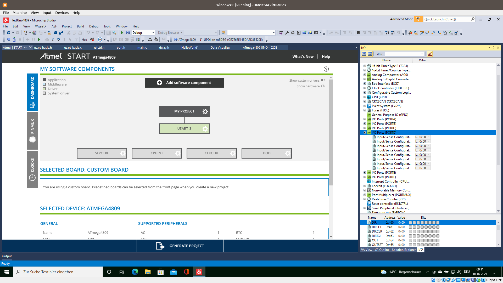

<!--
author:   Sebastian Zug, Karl Fessel
email:    sebastian.zug@informatik.tu-freiberg.de

version:  0.0.3
language: de
narrator: Deutsch Female

import:  https://raw.githubusercontent.com/liascript-templates/plantUML/master/README.md
         https://github.com/LiaTemplates/AVR8js/main/README.md

icon: https://upload.wikimedia.org/wikipedia/commons/d/de/Logo_TU_Bergakademie_Freiberg.svg
-->

# Verwendung der IDE

| Parameter                | Kursinformationen                                                                                                                                                                    |
| ------------------------ | ------------------------------------------------------------------------------------------------------------------------------------------------------------------------------------ |
| **Veranstaltung:**       | `Übungen Digitale Systeme`                                                                                                                                                      |
| **Semester**             | `Sommersemester 2021`                                                                                                                                                                |
| **Hochschule:**          | `Technische Universität Freiberg`                                                                                                                                                    |
| **Inhalte:**             | `Vorteile/Nachteile einer IDE bei der Programmierung`                                                                                            |
| **Link auf den GitHub:** | [https://github.com/TUBAF-IfI-LiaScript/VL_DigitaleSysteme/blob/main/lectures/04_IDE_4809.md](https://github.com/TUBAF-IfI-LiaScript/VL_DigitaleSysteme/blob/main/lectures/04_IDE_4809.md) |
| **Autoren**              | @author                                                                                                                                                                              |

---

## Diskussion des vergangenen Aufgabenblattes

> Hier sind Sie gefragt ...

## Microchip Studio

+ Definition des Taktsystem
+ Konfiguration einzelner Komponenten
+ Einbettung der Dokumentation

Weiterführende Informationen finden sich unter [Tutorial](https://onlinedocs.microchip.com/pr/GUID-54E8AE06-C4C4-430C-B316-1C19714D122B-en-US-2/index.html?GUID-56E76D63-B972-4917-AC33-1D2619DB0C26).

> **Achtung:** Aus unerfindlichen Gründen muss bei der UART-Kommunikation die Taktfrequenz angepasst werden.

## Aufgaben

- [ ] Implementieren Sie für den 4809 die Aktivierung einer LED ausgehend vom Eingangswert an einem analogen Pin. Nutzen Sie dazu den Comperator und das Eventsystem.
- [ ] Erweitern Sie die Implementierung um die Überwachung des Analogen Signals. Sofern ein Schwellwert überschritten wurde, erfolgt die eigentliche Messung. Deren Abschluss triggert das versenden einer UART Nachricht, die dann mit dem Visualisierungstool in der IDE dargestellt wird.
