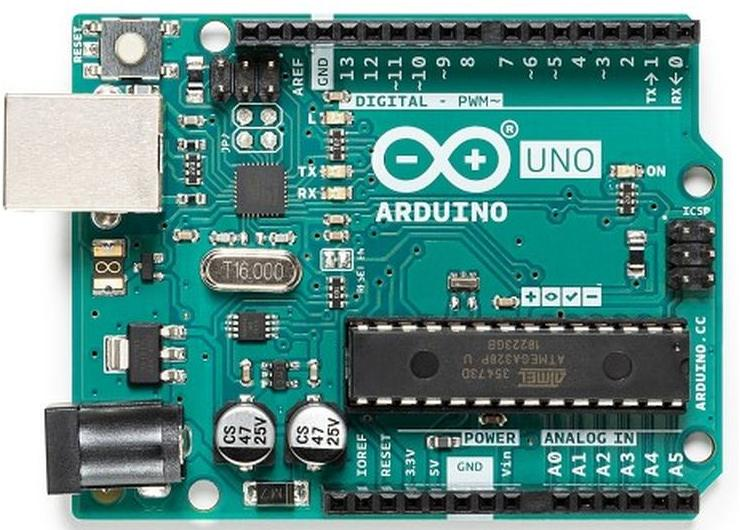
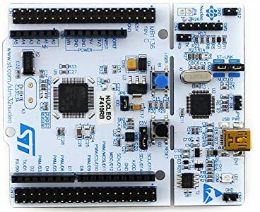
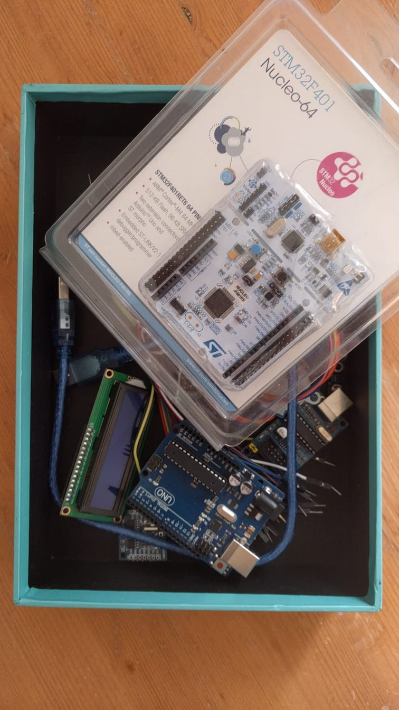

<!--
author:   Sebastian Zug, Karl Fessel & Andrè Dietrich
email:    sebastian.zug@informatik.tu-freiberg.de

version:  0.0.1
language: de
narrator: Deutsch Female

import:  https://raw.githubusercontent.com/liascript-templates/plantUML/master/README.md
         https://github.com/LiaTemplates/AVR8js/main/README.md

icon: https://upload.wikimedia.org/wikipedia/commons/d/de/Logo_TU_Bergakademie_Freiberg.svg
-->

[](https://liascript.github.io/course/?https://github.com/TUBAF-IfI-LiaScript/VL_DigitaleSysteme/main/lectures/00_Einfuehrung.md#1)

# Einführung und Motivation

| Parameter                | Kursinformationen                                                                                                                                                                    |
| ------------------------ | ------------------------------------------------------------------------------------------------------------------------------------------------------------------------------------ |
| **Veranstaltung:**       | `Vorlesung Digitale Systeme`                                                                                                                                                      |
| **Semester**             | `Sommersemester 2022`                                                                                                                                                                |
| **Hochschule:**          | `Technische Universität Freiberg`                                                                                                                                                    |
| **Inhalte:**             | `Motiviation und Organisation der Veranstaltung `                                                                                            |
| **Link auf den GitHub:** | [https://github.com/TUBAF-IfI-LiaScript/VL_DigitaleSysteme/blob/main/lectures/00_Einfuehrung.md](https://github.com/TUBAF-IfI-LiaScript/VL_DigitaleSysteme/blob/main/lectures/00_Einfuehrung.md) |
| **Autoren**              | @author                                                                                                                                                                              |


------------------------------------------------

```cpp       avrlibc.cpp
// preprocessor definition
#define F_CPU 16000000UL
#define ANSWER_TO_LIFE 42

#include <avr/io.h>
#include <util/delay.h>

int main (void) {
  Serial.begin(9600);

  volatile byte a;

  asm ("ldi %0, %1\n\t"
      : "=r" (a)
      : "M" (ANSWER_TO_LIFE));

  Serial.print("Antwort auf die Frage, warum ich an dieser Vorlesung teilnehme: ");
  Serial.println(a);

  while(1) {
       _delay_ms(1000);
  }
  return 0;
}
```

## Zielstellung

                                      {{0-1}}
********************************************************************************

Was steht im Modulhandbuch über diesen Kurs?

**Qualifikationsziele /Kompetenzen:**

+ die Komponenten realer eingebetteter Controller-Architekturen(8Bit -32Bit) zu beschreiben und analysieren zu können
+ Controller im Hinblick auf bestimmte Anforderungsprofile zu beurteilen
+ Elemente eingebetteter Anwendungen (insbesondere Sensoren)in ihrer Funktion und Eignung auszuwählen und in Software und Hardware in eine Anwendung zu integrieren Methoden des Softwareentwurfes und verschiedenen Tool-Chains für die Implementierung eingebetteter Systeme anwenden zu können
+ Codefragmente im Hinblick auf die Qualität und mögliche Fehler zu analysieren

**Inhalte**

* Gegenüberstellung verschieden Architekturen etablierter Controller
* Integration von Controllern in eingebetteten Anwendungen
* Erweiterung als Sensor-Aktor-Systeme,
* Parameter von Sensorssystemen,
* Betriebssystemkonzepte für eingebettete Controller


********************************************************************************

                                      {{1-2}}
********************************************************************************

**Und was heißt das nun konkret? Worum geht es?**

**Hardware-Plattformen**

<!--data-type="none"-->
| Arduino Uno Board                                                                                                 | Nucleo 64                                                                                          |
| ----------------------------------------------------------------------------------------------------------------- | -------------------------------------------------------------------------------------------------- |
| <!-- style="width: 100%; auto; max-width: 415px;" --> | <!-- style="width: 100%; max-width=315px;" --> |
| Microchip ATmega 328p                                                                                             | STM32F401                                                                                          |
| 8-Bit AVR Familie                                                                                                 | 32-Bit Cortex M4 Prozessor                                                                         |
| C, Assembler                                                                                                      | C, C++                                                                                             |
| avrlibc, FreeRTOS                                                                                                 | CMSIS, mbedOS, FreeRTOS                                                                            |
| 10 Bit Analog-Digital-Wandler, 16 Bit Timer,                                                                      | 10 timers, 16- and 32-bit (84 MHz), 12-bit ADC                                                     |


********************************************************************************

                                      {{2-3}}
********************************************************************************

**Inhalte der Vorlesung**

| VL  | Tag    | Inhalt der Vorlesung                           |
| --- | ------ |:---------------------------------------------- |
| 0   | 06.04. | Einführung und Motivation                      |
| 1   | 13.04. | ATmega Architektur                             |
| 2   | 20.04. | ATmega Komponenten                             |
| 3   | 27.04. | Performancebeschränkungen der Architektur      |
| 4   | 04.04. | Analog Digitalwandler                          |
| 5   | 12.05. | _Ausfall wegen Konferenzreise_                 |
| 6   | 18.05. | Kommunikationsprotokolle                       |
| 7   | 25.05. | Echtzeitanwendungen                            |
| 8   | 01.06. | Scheduling Algorithmen                         |
| 9   | 08.06. | FreeRTOS                                       |
| 10  | 15.06. | megaAVR 0 Series - xMega Controller            |
| 11  | 22.06. | megaAVR 0 Series - xMega Controller Abgrenzung |
| 12  | 29.06. | ARM Controllern Architektur                    |
| 13  | 06.07. | Komponenten des STM32F4                        |
| 14  | 13.07. | mbedOS                                         |


********************************************************************************

                                      {{3-4}}
********************************************************************************

Dabei werden unterschiedliche Ebenen der Abstraktion der Abläufe im Rechner adressiert.

<!--
style="width: 80%; min-width: 420px; max-width: 720px;"
-->
```ascii

                Abstraktionsebenen

           +----------------------------+ -.
  Ebene 6  | Problemorientierte Sprache |  |
           +----------------------------+  |
                                           ⎬ Anwendungssoftware
           +----------------------------+  |
  Ebene 5  | Assemblersprache           |  |
           +----------------------------+ -.

           +----------------------------+
  Ebene 4  | Betriebssystem             |     Systemsoftware
           +----------------------------+

           +----------------------------+
  Ebene 3  | Istruktionsset             |     Maschinensprache
           +----------------------------+

           +----------------------------+ -.
  Ebene 2  | Mikroarchitektur           |  |
           +----------------------------+  |
                                           ⎬ Automaten, Speicher, Logik
           +----------------------------+  |  
  Ebene 1  | Digitale Logik             |  |  
           +----------------------------+ -.  

           +----------------------------+
  Ebene 0  | E-Technik, Physik          |     Analoge Phänomene
           +----------------------------+                                      .
```

********************************************************************************

## Organisation

| Name                    | Email                                   |
|:----------------------- |:--------------------------------------- |
| Prof. Dr. Sebastian Zug | sebastian.zug@informatik.tu-freiberg.de |
| Georg Jäger             | georg.jaeger@informatik.tu-freiberg.de  |

> Bitte melden Sie sich im OPAL unter [Eingebettete Systeme](https://bildungsportal.sachsen.de/opal/auth/RepositoryEntry/26860322818/CourseNode/102563572218999) für die Veranstaltung an. Dies ist im Kontext der Pandemiesituation Teil des Hygienekonzepts der Universität.

### Zeitplan

Die Veranstaltung wird sowohl für die Vorlesung als auch die Übung in Präsenz durchgeführt.

| Veranstaltungen | Tag        | Zeitslot   | Bemerkung      |
| --------------- | ---------- | ---------- | -------------- |
| Vorlesung       | Mittwoch   | 9:00-10:30 |                |
| Praktikum       | Donnerstag | 7:30-9:00  | ungerade Woche |
| Übungen         | Donnerstag | 7:30-9:00  | gerade Woche   |

Die Veranstaltung vollständig als Online-Kurs umgesetzt. Der BBB Link zur Vorlesung lautet: https://teach.informatik.tu-freiberg.de/b/seb-2rs-com-0go. Diese wird aufgezeichnet und steht im Nachgang als Download zur Verfügung.

### Prüfungsmodalitäten

> *Credit-Points:* 6

> *Arbeitsaufwand:* Der Zeitaufwand beträgt 180h und setzt sich zusammen aus 60h Präsenzzeit und 120h Selbststudium. Letzteres umfasst die Vor- undNachbereitung der Lehrveranstaltung, die eigenständige Lösung von Übungsaufgaben sowie die Prüfungsvorbereitung.

> *Prüfungsform:* Die Veranstaltung wird mit einer mündlichen Prüfung abgeschlossen. Dabei starten wir zunächst mit einem von Ihnen gewählten Codebeispiel und gehen dann auf die Inhalte der Vorlesungen und Übungen ein.

## Schreiben Sie an den Materialien mit!

                              {{0-1}}
****************************************************************************

Die Lehrmaterialien finden Sie unter GitHub, einer Webseite für das Versionsmanagement und die Projektverwaltung.

[https://github.com/TUBAF-IfI-LiaScript/VL_EingebetteteSysteme/blob/dev/01_HistorischerUeberblick.md](https://github.com/TUBAF-IfI-LiaScript/VL_EingebetteteSysteme/blob/dev/01_HistorischerUeberblick.md)

Die Unterlagen selbst sind in der Auszeichnungsprache LiaScipt verfasst und öffentlich verfügbar.

****************************************************************************

                         {{1-2}}
****************************************************************************

Allerdings vermisst Markdown trotz seiner Einfachheit einige Features, die
für die Anwendbarkeit in der (Informatik-)Lehre sprechen:

* Ausführbarer Code
* Möglichkeiten zur Visualisierung
* Quizze Tests und Aufgaben
* spezifische Tools für die Modellierung Simulation etc.

<div>
  <wokwi-led color="red" pin="13" port="B" label="13"></wokwi-led>
  <span id="simulation-time"></span>
</div>
```cpp       avrlibc.cpp
#ifndef F_CPU
#define F_CPU 16000000UL // 16 MHz clock speed
#endif

//16.000.000 Hz / 1024 = 15.625

int main(void)
{
  Serial.begin(9600);
  DDRB |= (1 << PB5);  // Ausgabe LED festlegen
  // Timer 1 Konfiguration
  //         keine Pins verbunden
  TCCR1A  = 0;
  TCCR1B  = 0;
  // Timerwert
  TCNT1   = 0;
  TCCR1B |= (1 << CS12) | (1 <<CS10);  // 1024 als Prescale-Wert

  while (1) //infinite loop
  {
     if (TCNT1>15625){
        TCNT1 = 0;  
        PINB = (1 << PB5); // LED ein und aus
     }
  }
}
```
@AVR8js.sketch

> **Frage:** Welche Komponente des Controllers wird hier genutzt? An welcher Stelle hätten Sie alternative Ideen?

Eine Reihe von Einführungsvideos findet sich unter [Youtube](https://www.youtube.com/channel/UCyiTe2GkW_u05HSdvUblGYg). Die Dokumentation von LiaScript ist hier [verlinkt](https://liascript.github.io/course/?https://raw.githubusercontent.com/liaScript/docs/master/README.md#1)

***************************************************************************

## Trotz Simulation und Virtuellem ...

... braucht es aber auch immer etwas zum anfassen.

> Wir stellen Ihnen die entsprechenden Controller beider Plattformen zur Verfügung.



## Wie können Sie zum Gelingen der Veranstaltung beitragen?

* Stellen Sie Fragen, seinen Sie kommunikativ!

> Hinweis auf OPAL Forum!

* Organisieren Sie sich in Arbeitsgruppen!

> Bearbeiten Sie Aufgaben gemeinsam online.

* Bringen Sie sich mit Implementierungen in die Veranstaltung ein.

## Und jetzt sind Sie an der Reihe

> Mit welchen Systemen haben Sie bereits gearbeitet und welche Projekte haben Sie damit verwirklicht?

## Hausaufgabe

+ Legen Sie sich, sofern das noch nicht geschehen ist, einen GitHub Account an ... und seien Sie der erste, der einen Fehler, eine unglückliche Formulierung usw. in den Unterlagen findet und diesen als _Contributer_ korrigiert :-)
+ Überlegen Sie sich, zu welches Thema Sie im Praktikum vorstellen wollen:

  + DSP Implementierung im STM32F4    
  + STM32 Cube.AI                         
  + mbedOS vs FreeRTOS
  + LCD Programmierung mit dem STM  
  + CAN Bus - Theorie und Anwendung

  Die Präsentationen sollten 30 Minuten einnehmen und mit einer praktischen Demonstration kombiniert werden.

+ Setzen Sie sich mit Plattform.io auseinder und testen Sie die Features zum Debugging.
