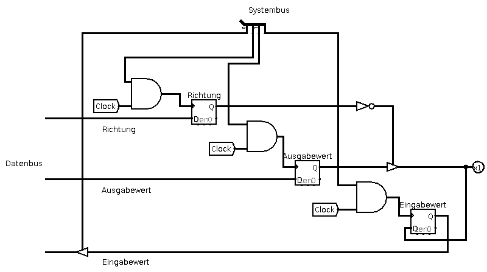

<!--
author:   Sebastian Zug, Karl Fessel & Andrè Dietrich
email:    sebastian.zug@informatik.tu-freiberg.de

version:  0.0.1
language: de
narrator: Deutsch Female

import:  https://raw.githubusercontent.com/liascript-templates/plantUML/master/README.md
         https://github.com/LiaTemplates/AVR8js/main/README.md

icon: https://upload.wikimedia.org/wikipedia/commons/d/de/Logo_TU_Bergakademie_Freiberg.svg
-->

[](https://liascript.github.io/course/?https://github.com/TUBAF-IfI-LiaScript/VL_DigitaleSysteme/main/lectures/01_Grundbegriffe.md#1)

# Einführung und Motivation

| Parameter                | Kursinformationen                                                                                                                                                                    |
| ------------------------ | ------------------------------------------------------------------------------------------------------------------------------------------------------------------------------------ |
| **Veranstaltung:**       | `Vorlesung Digitale Systeme`                                                                                                                                                      |
| **Semester**             | `Sommersemester 2021`                                                                                                                                                                |
| **Hochschule:**          | `Technische Universität Freiberg`                                                                                                                                                    |
| **Inhalte:**             | `Wiederholung Grundbegriffe`                                                                                            |
| **Link auf den GitHub:** | [https://github.com/TUBAF-IfI-LiaScript/VL_DigitaleSysteme/blob/main/lectures/01_Grundbegriffe.md](https://github.com/TUBAF-IfI-LiaScript/VL_DigitaleSysteme/blob/main/lectures/01_Grundbegriffe.md) |
| **Autoren**              | @author                                                                                                                                                                              |


---

# Grundbegriffe des Rechneraufbaus

Die interaktive Version des Kurses ist unter diesem [Link](https://liascript.github.io/course/?https://raw.githubusercontent.com/TUBAF-IfI-LiaScript/VL_DigitaleSysteme/main/lectures/01_Grundbegriffe.md#1) zu finden.

**Lernziele**

* Wiederholung der Grundbegriffe der Rechnerarchitektur
* Diskussion von generellen Unterscheidungsmerkmalen bei der Auswahl eines Prozessors
* Ablauf des Compiliervorganges

**Fragen an die heutige Veranstaltung ...**

* Zählen Sie die Basiskomponenten eines Rechners auf.
* Erläutern Sie den Unterschied zwischen dem RISC und CISC Ansatz.
* Erklären Sie das Grundkonzept des Pipelining.
* Beschreiben Sie die Abläufe bei der Abarbeitung von Befehlen.
* Was bedeutet die Angabe _8Bit-Controller_?

## Was sind die Grundkomponenten eines Rechners?
<!--
@CS: $\overline{CS}$
@AA: $A_{21-0}$
-->

Der von Neumann-Rechner arbeitet sequentiell. Befehl für Befehl wird abgeholt, interpretiert, ausgeführt und das Resultat abgespeichert. Seine Komponenten definieren sich zu

+ Steuerwerk (Taktgeber und Befehlszähler)
+ Speicherwerk
+ Rechenwerk (CPU)
+ E/A-Einheit.

Die Datenbreite, Adressierungsbreite, Registeranzahl und Befehlssatz können als "Gestaltungsparameter" verstanden werden.

```text @plantUML.png
@startuml
ditaa
  ^  |
  |  V
+-+----+     +----------------------------+
|c8F8  |     |c88F   Speicherwerk         |
|      |<--->|   +--------+  +--------+   |
|      |     |   |Programm|  | Daten  |   |
|      |     |   +--------+  +--------+   |
|      |     +------+---------------------+
|      |         ^  |             ^
| E/A- | Adressen:  | Befehle     | Daten
| Werk |         |  V             V
|      |     +---+------+    +------------+
|      |     |cF88      |    | Rechenwerk |
|      |     |          |    |cFF4        |
|      |     |          |<-=-+ +--------+ |
|      |<--=-+Steuerwerk|    | |Register| |
|      |     |          +-=->| +--------+ |
|      |     |          |    | |  ALU   | |
|      |     |          |    | +--------+ |
+------+     +----------+    +------------+
@enduml
```


### Das Steuerwerk

Das Steuerwerk ist für die Ausführung der Befehlsfolgen, die aus dem Speicher gelanden werden verantwortlich.

+ Befehlszähler (Programm Counter)
+ Einheit zur Befehlsentschlüsselung  
+ Einheit zur Steuerung der Befehlsausführung

> **Merke:** Steuerwerke koordinieren das Laden und die Ausführung der Maschinenbefehle. Dafür muss das Steuerwerk selbst und die anderen Elemente konfiguriert werden.

<!-- style="background-color: lightgray;"-->
> **Frage:** Was passiert von seiten des Steuerwerkes bei der Ausführung von `i=i+1;`?

Die Umsetzung der Befehle im Steuerwerke kann _hart verdrahtet_ oder auf der Basis von [Mikroprogrammen](https://en.wikipedia.org/wiki/Microcode) realisiert werden.

| Aspekt                      | Kombinatorische Logik                  | Mikroprogramm     |
| --------------------------- | -------------------------------------- | ----------------- |
| Grundlegende Repräsentation | Endlicher Automat                      | Programm          |
| Fortschaltung der Kontrolle | Expliziter Folgezustand                | Programmzähler    |
| Logische Repräsentation     | Boolsche Gleichungen                   | Wahrheitstabelle  |
| Implementierungstechnik     | Gatter, Programmierbare Logikbausteine | R/W-Speicher, ROM |

Zur Wiederholung sei ggf. auf die Vorlesung eingebettete Systeme verwiesen [Model CPU](https://liascript.github.io/course/?https://raw.githubusercontent.com/TUBAF-IfI-LiaScript/VL_EingebetteteSysteme/master/11_Modell_CPU.md#1).

### Das Rechenwerk (ALU)

Der Begriff Rechenwerk wird häufig synonym mit arithmetisch-logische Einheit (ALU) gebraucht, genau genommen stellt eine ALU jedoch lediglich eine (von oft vielen) Funktionseinheiten eines Rechenwerks dar, das zusätzlich aus einer Reihe von Hilfs- und Statusregistern besteht.

Folgende Klassen von Verknüpfungen sind in der ALU integriert:

+ Arithmetische Operationen, wie Addition, Subtraktion, Vergleiche, Multiplikation und Division die

  + sich für einfache Controller auf Integerwerte beschränkt,

  + für leistungsfähigere Systeme aber Fließkomma-Operationen abdecken

+ Logische Verknüpfungen, wie Disjunktion (ODER), Konjunktion (UND), Negation (NOT), Einer-Komplement (XOR)

+ Verschiebeoperationen, wie Rotation, arithmetischer und logischer Shift

Wie lässt sich ein solches System praktisch realsieren? Schauen wir uns eine 4-Bit PIPO Schieberegister genauer an.

[^1]

[^1]: Ali Alnoaman, Foreneintrag Electrical Engineering, [Link](https://electronics.stackexchange.com/questions/443939/need-a-simple-explanation-of-a-left-right-shift-register)


Die spezifische ALUs integriert neben üblichen Hardware-Addierern/Multiplizieren auch spezielle Einheiten Multiply-Accumulate-Einheiten (MAC) oder [Barrel-Shifter](https://de.wikipedia.org/wiki/Barrel-Shifter).

### Speicherwerk

Das Speicherwerk umfasst das Programm und den Arbeitsspeicher. Im kommenden Abschnitt wird auf die Kombination beider Inhalte in ein und demselben Speicherbereich diskutiert.

Grundlegende Designvorgaben:

+ Hinter jeder Adresse verbirgt sich nur ein Speicherbereich / Bauteil
+ Der Adressraum wird maximal ausgenutzt, jedes Bauteil sollte nur unter einer Adresse zu erreichen sein.
+ Der Speicher sollte kontinuierlich besetzt sein und keine Lücken aufweisen.

<!--style="width: 80%; display: block; margin-left: auto; margin-right: auto;" -->
```ascii
  Speicherbaustein
    +----------+
    | 1 0 1 1  |<------
    | 0 1 0 1  |<------ Adressbus     "$2^3 Adressleitungen = 8 Adressen$"
    | 0 0 0 0  |<------
    | 1 1 0 1  |  
    | 1 0 1 1  |------>
    | 0 1 0 1  |------> Datenbus      "$2^4 Datenleitungen$"
    | 0 0 0 0  |------>
    | 1 1 0 1  |------>               "8 x 4 Bit = 32 Bit Speicherelement"
    +----------+
```

Wie verzahnen wir die Speicherkomponenten, wenn wir einen größeren Speicher in unseren Controller integrieren wollen?

Versuchen wir also einen zusammenhängenden Speicher von 16MByte zu entwerfen, der aus 4MByte Speicherelementen besteht. Daraus ergeben sich folgende Grundüberlegungen:

+ 1 MegaByte entspricht $2^{10} KB$ ($1024 KB$). Für die Adressierung von 4MByte benötigen wir also $2^{20} \cdot 4$ Adressen $2^{22} = 4194304$ referenzieren.
+ Wir benötigen 4 der 4MByte Chips, die neben den eigentlichen Adressleitungen individuell angesprochen werden müssen
+ Die Implmentierung soll erweiterbar sein, so dass wir als Chiphersteller unterschiedliche Speicherdimensionen anbieten können.

<!--style="width: 80%; display: block; margin-left: auto; margin-right: auto;" -->
```ascii
Moduladresse                                                                8 Datenbus
      |                 +---------------+---------------+---------------+---/------      
      /8                |               |               |               |      
+-----+-----+     +-----+------+  +-----+------+  +-----+------+  +-----+------+
|     Q     |     | Speicher-  |  | Speicher-  |  | Speicher-  |  | Speicher-  |
|  Adress-  |     | block 0    |  | block 1    |  | block 2    |  | block 3    |
|vergleicher+-+   |            |  |            |  |            |  |            |
|     P     | |   |"@CS @AA   "|  |"@CS @AA   "|  |"@CS @AA   "|  |"@CS @AA   "|
+-----+-----+ |   +--+-----+--+   +--+-----+---+  +--+-----+---+  +--+-----+---+
      |       |      |     |         |     |         |     |         |     |   
      |   +---+---+  |     |         |     |         |     |         |     |
      |   |       +--+     |         |     |         |     |         |     |
      |   |1 aus 4+--------+---------+     |         |     |         |     |
      |   |Dekoder+--------+---------------+---------+     |         |     |
      |   |       +--------+---------------+---------------+---------+     |
      |   +---+---+        |               |               |               |
      |       |            *---------------*---------------*---------------+
      |       |            |
      / 8     / 2          / 22    "$\Sigma = 32 Bit$"
      |       |            |
 Moduladresse |     Interne Adresse       
       Speicher Chip ID
```

Daraus ergibt sich dann folgende Speicheraufteilung:

<!--style="width: 80%; display: block; margin-left: auto; margin-right: auto;" -->
```ascii

                 +------------------+
Modul n          |                  |
                 ~                  ~
                 | Frei für weitere |
                 | Module           |
..............   +------------------+ "$0x1000$ $0000 = 2^{25}$"
                 | Chip 3           |
                 +------------------+ "$0x0C00$ $0000 = 2^{23} + 2^{24}$"
Modul 0          | Chip 2           |
"$A_{31-24}= 0$" +------------------+ "$0x0800$ $0000 = 2^{23}$"
                 | Chip 1           |
                 +------------------+ "$0x0400$ $0000 = 2^{22}$"
                 | Chip 0           |
                 +------------------+ "$0x0000$ $0000$"                        .

```

<!-- style="background-color: lightgray;"-->
> **Frage:** Was bedeutet das sogenannte Alignment innerhalb des Speichers?

### Ein- & Ausgabe

Diese Komponente übernimmt die unmittelbare Erfassung von externen Informationen bzw. deren Bereitstellung. Im einfachsten Fall können dies einzelne Anzeigeelemente / Schalter sein, darüber hinaus dient es als Interface für weitere technische Bausteine. Alternative Bezeichnungen sind _I/O Ports_ oder _I/O Kanäle_.

<!--style="width: 80%; display: block; margin-left: auto; margin-right: auto;" -->

Wie kann die Adresskodierung der I/O Komponenten vorgenommen werden?

<!--style="width: 80%; display: block; margin-left: auto; margin-right: auto;" -->
```ascii

        A0   ---------------------------------------*--------------------
                                                    |
        A1   ------------------------------------*--+--------------------
                                                 |  |
        A2   ---------------------------------*--+--+--------------------
                                              |  |  |
        A3   ------------------------------*--+--+--+--------------------
                                           |  |  |  |
        A4   ---------------------------*--+--+--+--+--------------------
                                        |  |  |  |  |
        A5   ------------------------*--+--+--+--+--+--------------------
                                     |  |  |  |  |  |
        A6   ---------------------*--+--+--+--+--+--+-------------------
                                  |  |  |  |  |  |  |
        A7   ------------------*--+--+--+--+--+--+--+--------------------
                               |  |  |  |  |  |  |  |
        A8   ---------*--------+--+--+--+--+--+--+--+--------------------
                      |        |  |  |  |  |  |  |  |
        A9   ------*--+--------+--+--+--+--+--+--+--+--------------------
                   |  |        |  |  |  |  |  |  |  |
                 +-+--+--+   +-+--+--+--+--+--+--+--+-+
                 | A1 A0 |   | Q7 Q6 Q5 Q4 Q3 Q2 Q1 Q0|
                 |       |   |                        |
Perepherie-      |  "@CS"+---+"$\overline{Q=P}$"      |  Adresslogik
baustein         |       |   |                        |  z.B. SN54HC688
                 |       |   | P7 P6 P5 P4 P3 P2 P1 P0|
                 +-------+   +-+--+--+--+--+--+--+--+-+
                               |  |  |  |  |  |  |  |
                           ----+--*--+--*--*--+--+--*------ High    
                               |     |        |  |
                           ----*-----*--------*--*--------- Low

            interne Adresse       Bausteinadresse
                (A8-A9)              (A0-A7)    
```

<!-- style="background-color: lightgray;"-->
> **Frage:** Was verbirgt sich hinter dem Begriff Memory-Mapped-IO?

### Bus

Busse bilden für Daten- oder Adressen ein gemeinsames physikalischen Verbindungsnetzes aus mehreren Leitungen, an dem die relevanten Komponenten angeschlossen sind.  

Vorteile:

+ Flexibilität bei der Integration neuer Geräte
+ Niedrige Kosten durch Mehrfachnutzung eines Kommunikationsmediums

Nachteile:

+ Mehrfachnutzung durch verschiedene Geräte bremst die Bandbreite aus
+ Kommunikationsflaschenhals (Maximale Bus-Datenrate kann Systemdurchsatz begrenzen)  
+ Größtes Anforderungsprofil bestimmt die Konfiguration / Kompromisslösung

## ... und wie wird daraus eine Architektur?

> Rechnerarchitektur ist ein Teilgebiet der Technischen Informatik, das sich mit dem Design von Rechnern (Computern) und speziell mit deren Organisation sowie deren externem und internem Aufbau (was ebenfalls mit 'Rechnerarchitektur' bezeichnet wird) beschäftigt.

> Die **Architektur** eines Rechners beschreibt dessen grundsätzlichen Aufbau (Hardwarestruktur) und das Zusammenspiel der Komponenten (Organisationsstruktur).


Unterschied  Harvard und die von Neumann-Architektur?**

## Umsetzung

Und wie sieht das Ganze in einem realen System aus? Der Intel 4004 ist ein 4-Bit-Mikroprozessor des Mikrochipherstellers Intel, der am 15. November 1971 auf den Markt kam. Er gilt als der erste Ein-Chip-Mikroprozessor, der in Serie produziert und am freien Markt vertrieben wurde. Der "Rechner" an sich setzte sich aus zunächst vier einzelne Bausteinen zusammen:

+ 4001: ein 2048-Bit-ROM (adressiert in 256 8-Bit-Adressen) mit einem 4-Bit-Ausgabeport
+ 4002: 80×4-Bit-RAM-Datenspeicher mit einem 4-Bit-I/O-Port
+ 4003: I/O-Erweiterungs-Chip, bestehend aus einem statischen Schieberegister
+ 4004: die eigentliche CPU

[^1]

[^1]: [Intel 4004 (Autor Appaloosa)](https://upload.wikimedia.org/wikipedia/commons/thumb/8/87/4004_arch.svg/1190px-4004_arch.svg.png)

<!--data-type="none"-->
| Element         | Bestandteile                                                                          |
| --------------- | ------------------------------------------------------------------------------------- |
| Steuerwerk      | _Instruction Register_, _Instruction Decoder_,  _Timing and Controll_                 |
| Rechenwerk      | _ALU_, _Flag Flip-Flops_, _Decimal Adjust_, _Temp Register_, _Accumulator[-register]_ |
| Eingabe-Ausgabe | nicht dargestellt                                                                     |
| Speicherwerk    | _Data Base Buffer_                                                                                      |

Speicherauszug den Intel 4004:

<!--data-type="none"-->
| Adresse | Speicherinhalt | OpCode     | Mnemonik  |
|:--------|:---------------|:-----------|:----------|
| 0010    | 1101 0101      | 1101 DDDD  | LD $5     |
| 0012    | 1111 0010      | 1111 0010  | IAC       |

Unterstützung für die Interpretation aus dem Nutzerhandbuch, dass das Instruction-Set beschreibt:

[^2]

[^2]: [Intel 4004 Assembler](http://e4004.szyc.org/asm.html)

## Befehlsabarbeitung und Instruktions-Sets

> **Einschub:** Die Abarbeitung eines Befehls kann in mehrere Teilschritte zerlegt werden:
>
> + Befehl holen (fetch)
> + Befehl entschlüsseln (decode)
> + Befehl ausführen (execute)
> + Ergebnis speichern (Write back)

> **Frage:** Welchen Befehlssatz sollte uns Prozessor umfassen?

RISC (Reduced Instruction Set) stellt tatsächlich eine “Entwurfs-Philosophie“ dar, in der das Ziel höchste Leistung ist, die im Zusammenspiel von Hardware und einem optimierenden
Compiler erreicht wird. Im RISC-Ansatz wird in der der Instruktionssatz in
Hinblick auf Einfachheit und Regularität entworfen, so daß die Verwendung der
Instruktionen durch den Compiler einfach und überschaubar ist.

| Nachteile                                 | Vorteile                             |
| ----------------------------------------- | ------------------------------------ |
| Mehr Speicherplatz für Programme          | Einfachheit der Hardwarerealisierung |
| Aufwändigere Implementierung IM ASSEMBLER | höhere Taktraten                     |
|                                           | Ausnutzung von Pipelining Techniken  |


|                                    | CISC          | RISC                 |
| ---------------------------------- | ------------- | -------------------- |
| Ausführungszeit einer Instruktion  | $geq 1$       | meist 1              |
| Instruktionssatz                   | groß          | klein                |
| Instruktionsformat                 | variabel      | strikt               |
| unterstützte Adressierungsschemata | komplex       | einfach (Load/Store) |
| CPU-Abarbeitungslogik              | Mikroprogramm | Hardware             |
| Komplexität                        | Hardware      | Compiler             |

> **Merke: ** Die Abgrenzung zwischen Complex Instruction Set (CISC) vs Reduced Instruction Set (RISC) ist heute kaum noch präsent. Vielmehr verschmelzen die Konzepte in aktuellen Prozessoren.

## Umsetzung in verschiedenen Controllern

<!--data-type="none"-->
| Aspekt          | Intel 4004 | Microchip Atmega | Texas Instruments MSP 430 | STM 32  |
| --------------- | ---------- | ---------------- | ------------------------- | ------- |
| Architektur     | Harvard    | Harvard          | von-Neumann               | Harvard |
| Busbreite       | 4          | 8                | 16                        | 32      |
| Registeranzahl  | 16         | 32               | 16                        | 16      |
| Befehlssatz     | 45         | 131              | 51                        |         |
| Geschwindigkeit | 740 kHz    | 16 MHz           | 25 MHz                    | 480 MHz |


## Vom C Programm zum ausführbaren Code

Aus den vorangegangen Aussagen ist klar geworden, wie die Komponenten des Rechners während der Abarbeitung eines Programmes zusammenarbeiten. Wie aber entsteht der **prozessorspezifische** Maschinencode?

Die Verarbeitungskette in folgender Grafik adressiert zwar explizit die AVR Tools, lässt sich aber auf jede Plattform übertragen.

```text @plantUML.png
@startuml
ditaa

+-----------------------------------------------------------------------------------------+
:  Entwicklungsrechner                                                                    |                  
|  +---------------+                                                                      |                
|  |c88FSimulink{o}|   Modellierungssprachen                                              |                                     
|  +---------------+                                                                      |                
|          |                                                                              |
|          v                                   Assemblerprogrammierung                    |
|  +---------------+     +---------------+     +---------------+                          |            
|  |c88F C/C++{o}  |---> |c8F8 avr-gcc   |---> |c88F *.asm{o}  |                          |            
|  +---------------+     +---------------+     +---------------+                          |           
|                                                      |                                  |
|   C/C++ Programmierung                               v                                  |
|                                              +---------------+                          |         
|                                              |c8F8 avr-as    |                          |         
|                                              +---------------+                          |         
|                                                      |                                  |
|                                                      v                                  |
|                                              +---------------+                          |         
|                                              |      *.o{o}   |                          |         
|                                              +---------------+                          |         
|                                                      |                                  |
|                                                      v                                  |
|             +---------------+                +---------------+      +---------------+   |                                
|             |c8F8 objcopy   |<-------+       |c8F8 avr-ld    | <----|    Library{o} |   |                                
|             +---------------+        |       +---------------+      +---------------+   |                                
|                      |               |               |                                  |
|         +------------+-----------+   +---------------+                                  |
|         |                        |                   |                                  |                
|         v                        v                   v                                  |
|  +---------------+       +---------------+   +---------------+                          |         
|  |      *.hex{o} |  ...  |    *.bin{o}   |   |    *.elf{o}   |                          |         
|  +---------------+       +---------------+   +---------------+                          |  
|         |                        |                   |                                  |
|         +------------------------+-------------------+                                  |
|                                  |                                                      |
|                                  v                                                      |
|                          +---------------+                                              |
|                          |c8F8 Programmer|                                              |
|                          +---------------+                                              |     
+-----------------------------------------------------------------------------------------+
                                   |
                                   +-------------------------+                 
+----------------------------------|-=-----------------------|----------------------------+
:                                  v                         v                            |
: +---------------+        +---------------+         +---------------+                    |
| |c2F8 SRAM      |<------ |c2F8 Flash     |         |c2F8 EEPROM    |                    |
| +---------------+        +---------------+         +---------------+                    |
| Mikrocontroller                                                                         |
+-----------------------------------------------------------------------------------------+
@enduml
```

## Hausaufgaben

Sofern Sie noch keine Erfahrung in der Entwicklung mit AVR-Controllern haben, sollten Sie sich mit den [avr-gcc Tutorials](https://www.mikrocontroller.net/articles/AVR-GCC-Tutorial) auseinander setzen.
