<!--
author:   Sebastian Zug, Karl Fessel & Andrè Dietrich
email:    sebastian.zug@informatik.tu-freiberg.de

version:  1.0.1
language: de
narrator: Deutsch Female
comment:  Darstellung der grundlegenden Eigenschaften der atmega Mikroncontroler-Familie, Abstraktionsebenen der Programmierung

import:  https://raw.githubusercontent.com/liascript-templates/plantUML/master/README.md
         https://github.com/LiaTemplates/AVR8js/main/README.md
         https://github.com/LiaTemplates/Pyodide

icon: https://upload.wikimedia.org/wikipedia/commons/d/de/Logo_TU_Bergakademie_Freiberg.svg
-->


[](https://liascript.github.io/course/?https://raw.githubusercontent.com/TUBAF-IfI-LiaScript/VL_SoftwareentwicklungEingebetteteSysteme/main/lectures/03_InterruptsTimerADC.md#1)


# Interrupts, Timer, ADC & 8-Bit-Limitierungen

| Parameter                | Kursinformationen                                                                                                                                                                    |
| ------------------------ | ------------------------------------------------------------------------------------------------------------------------------------------------------------------------------------ |
| **Veranstaltung:**       | `Vorlesung Softwareentwicklung für eingebettete Systeme`                                                                                                                                                      |
| **Semester**             | `Sommersemester 2026`                                                                                                                                                                |
| **Hochschule:**          | `Technische Universität Freiberg`                                                                                                                                                    |
| **Inhalte:**             | `Interrupt- und Timerkonzepte, ADC, arithmetische Beschränkungen des 8-Bit AVR`                                                                                            |
| **Link auf den GitHub:** | [https://github.com/TUBAF-IfI-LiaScript/VL_SoftwareentwicklungEingebetteteSysteme/blob/main/lectures/03_InterruptsTimerADC.md](https://github.com/TUBAF-IfI-LiaScript/VL_SoftwareentwicklungEingebetteteSysteme/blob/main/lectures/03_InterruptsTimerADC.md) |
| **Autoren**              | @author                                                                                                                                                                              |


---

## Analog-Digital-Wandlung

> **Hinweis:** Die allgemeinen Grundlagen (Abtasttheorem, Wandlerprinzipien, Quantisierung) werden in der Messtechnik-Vorlesung behandelt. Wir fokussieren hier auf die Nutzung des AD-Wandlers aus Sicht eines Mikrocontroller-Programms.

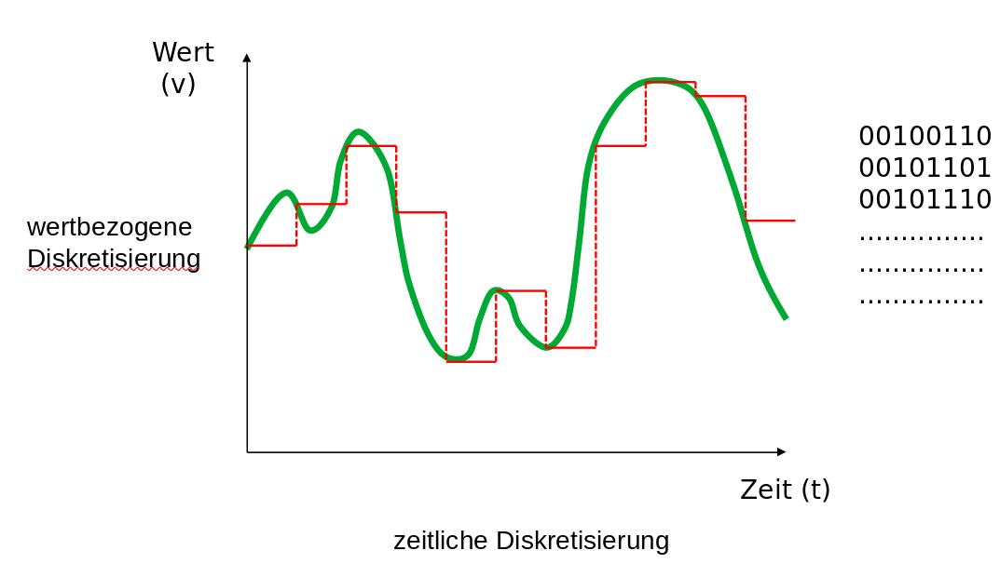

Dabei wird das zeit- und wertkontinuierliche Eingangssignal in eine zeit- und wertdiskrete Darstellung überführt.

!?[Wandlerprinzipien im Überblick](https://www.youtube.com/watch?v=IkPOZXeW_CM)

### Analog-Komparator als Einstieg

Ein Komparator ist eine elektronische Schaltung, die zwei Spannungen vergleicht. Der Ausgang zeigt in binärer/digitaler Form an, welche der beiden Eingangsspannungen höher ist. Damit handelt es sich praktisch um einen 1-Bit-Analog-Digital-Umsetzer.

!?[Funktionsweise eines Komparators](https://www.youtube.com/watch?v=A2E72-dxeqY)

<!-- style="width: 35%; max-width: 600px" -->

<!-- style="width: 55%; max-width: 600px" -->

<!--
style="width: 80%; min-width: 420px; max-width: 720px;"
-->
```ascii
                   ^
 Ideales       U_a |------------+
 Verhalten         |            |
                   |            |
                   |            |             U_i
                   +------------+------------->
                   |            | U_ref
                   |            |
                   |            |
                   |............+------------                                                .

                   ^
 Reales        U_a |--------+
 Verhalten         |        !\  
                   |        ! \  
                   |        !  \ U_ref        U_i
                   +--------!---+------------->
                   |        !    \  !
                   |        !     \ !  
                   |        !      \!
                   |........!.......+-----------                                                .

                            Hysterese
```

Im AVR findet sich ein Komparator, der unterschiedliche Eingänge miteinander vergleichen kann:
Für "+" sind dies die `BANDGAP Reference` und der Eingang `AIN0` und für "-" der Pin `AIN1` sowie alle analogen Eingänge.  

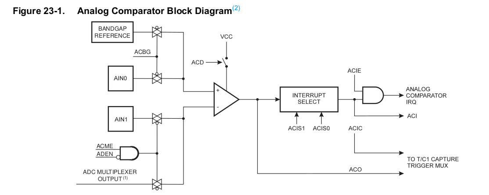<!-- style="width: 85%; max-width: 1000px" -->

Die grundlegende Konfiguration erfolgt über die Konfiguration der Bits / Register :

| Bits                   | Register | Bedeutung                                              |
| ---------------------- | -------- | ------------------------------------------------------ |
| `ACBG`                 | `ACSR`   | Analog Comparator Bandgap Select                       |
| `ACME`                 | `ADCSRB` | Analog Comparator Multiplexer Enable - Bit im Register |
| `ADEN`                 | `ADCSRA` | Analog Digital Enable                                  |
| `MUX2`, `MUX1`, `MUX0` | `ADMUX`  | Mulitiplexer Analog input                              |

Dazu kommen noch weitere Parameterisierungen bezüglich der Interrupts, der Aktivitierung von Timerfunktionalität oder der Synchronisierung.

> **Aufgabe:** An welchen Pins eines Arduino Uno Boards müssen Analoge Eingänge angeschlossen werden, um die zwei Signale mit dem Komparator zu vergleichen. Nutzen Sie den Belegungsplan (Schematics) des Kontrollers, der unter [Link](https://store.arduino.cc/arduino-uno-rev3) zu finden ist.

Ein Beispiel für den Vergleich eines Infrarot Distanzsensors mit einem fest vorgegebenen Spannungswert findet sich im _Example_ Ordner der Veranstaltung.

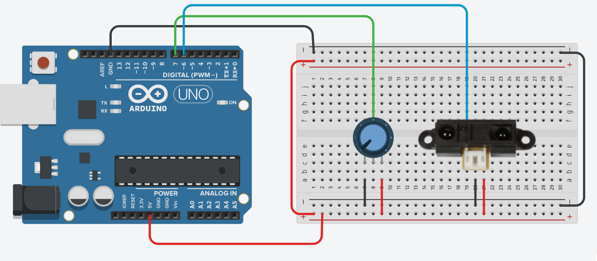<!-- style="width: 85%; max-width: 1000px" -->

```cpp
#define F_CPU 16000000UL
#include <avr/io.h>

int main()
{
  ADCSRB = (1<<ACME);
  DDRB = (1<<PB5);

  while(1)
  {
    if (ACSR & (1<<ACO))/* Check ACO bit of ACSR register */
       PORTB &= ~(1 << PB5); /* Then turn OFF PB5 pin */
    else    /* If ACO bit is zero */
        PORTB = (1<<PB5); /* Turn ON PB5 pin */
  }
}
```

### Vom Komparator zum 10-Bit-ADC

Erweitert man das Prinzip des 1-Bit-Komparators auf höhere Auflösung, landet man bei einem echten Analog-Digital-Wandler. Der ATmega328 bringt einen 10-Bit-ADC mit, der intern nach dem Prinzip der sukzessiven Approximation arbeitet.

| Handbuch des Atmega328p                             | Bedeutung                                                                                       |
| --------------------------------------------------- | ----------------------------------------------------------------------------------------------- |
| 10-Bit Auflösung                                    |                                                                                                 |
| 0.5 LSB Integral Non-Linearity                      | maximale Abweichung zwischen der idealen und der eigentlichen analogen Signalverlauf am Wandler |
| +/- 2 LSB Absolute Genauigkeit                      | Summe der Fehler inklusive Quantisierungsfehler, Offset Fehler etc.  (worst case Situation)     |
| 13 - 260μs Conversion Time                          | Die Dauer der Wandlung hängt von der Auflösung und der der vorgegebenen Taktrate  ab.           |
| Up to 76.9kSPS (Up to 15kSPS at Maximum Resolution) |                                                                                                 |
| 0 - V CC ADC Input Voltage Range                    |  Es sind keine negativen Spannungen möglich.                                                    |
| Temperature Sensor Input Channel                    |                                                                                                 |
| Sleep Mode Noise Canceler                           |    Reduzierung des Steuquellen durch einen "Sleepmode" für die CPU                              |

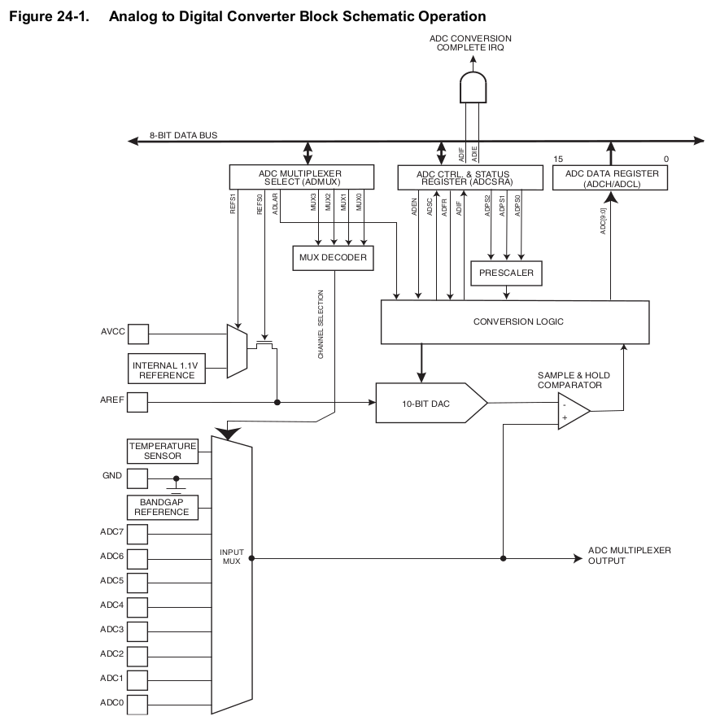

**Trigger für die Wandlung**

Grundsätzlich sind 3 Modi für die Wandlung möglich:

+ Programmgetriggerte Ausführung der Wandlung
+ Kontinuierliche Wandlung
+ ereignisgetriebener Start

")

")

**Ergebnisregister**

Die Atmega Prozessoren bieten eine Auflösung von 10Bit oder 8Bit für die analogen Wandlungen. Entsprechend stehen zwei Register `ADCL` und `ADCH` für die Speicherung bereit. Standardmäßig (d.h. `ADLAR == 0`) werden die niederwertigsten 8 im Register `ADCL` bereitgehalten und die zwei höherwertigsten im Register `ADCH`.

<!--
style="width: 80%; min-width: 420px; max-width: 720px;"
-->
```ascii
             ADCH                                   ADCL
  +---+---+---+---+---+---+---+---+   +---+---+---+---+---+---+---+---+
  |   |   |   |   |   |   |   |   |   |   |   |   |   |   |   |   |   |
  +---+---+---+---+---+---+---+---+   +---+---+---+---+---+---+---+---+
                            9   8       7   6   5   4   3   2   1   0
```

Das Ergebnis ergibt sich dann zu

```c
uint8_t theLowADC = ADCL
uint16_t theTenBitResults = ADCH<<8 | theLowADC;
```

Ist keine 10-bit Genauigkeit erforderlich, wird diese Zuordnung durch das Setzen des `ADLAR` Bits im `ADMUX` Register angepasst. Auf diese Weise kann das ADC Ergebnis direkt als 8 Bit Zahl aus `ADCH` ausgelesen werden.

<!--
style="width: 80%; min-width: 420px; max-width: 720px;"
-->
```ascii
             ADCH                                   ADCL
  +---+---+---+---+---+---+---+---+   +---+---+---+---+---+---+---+---+
  |   |   |   |   |   |   |   |   |   |   |   |   |   |   |   |   |   |
  +---+---+---+---+---+---+---+---+   +---+---+---+---+---+---+---+---+
    9   8   7   6   5   4   3   2       1   0
```

> **Merke: ** Immer zuerst ADCL und erst dann ADCH auslesen.

Beim Zugriff auf ADCL wird das ADCH Register gegenüber Veränderungen vom ADC gesperrt. Erst beim nächsten Auslesen des ADCH-Registers wird diese Sperre wieder aufgehoben. Dadurch ist sichergestellt, dass die Inhalte von ADCL und ADCH immer aus demselben Wandlungsergebnis stammen, selbst wenn der ADC im Hintergrund im Free-Conversion-Mode arbeitet.

### Beispiel: Analoger Distanzsensor

Für das Beispiel wird der AtMega2560 verwendet, der eine interne Referenzspannung von 2.56 V anstatt der des AtMega328 von 1.1 V bereit stellt.

")

Die Bedeutung ergibt sich beim Blick ins Datenblatt des Sensors GP2D, dessen Maximalwertausgabewert liegt bei etwa 2.55V

```c
#ifndef F_CPU
#define F_CPU 16000000UL // 16 MHz clock speed
#endif

#include <avr/io.h>
#include <util/delay.h>

int readADC(int channel) {
  int i; int result = 0;
  // Den ADC aktivieren und Teilungsfaktor auf 64 stellen
  ADCSRA = (1<<ADEN) | (1<<ADPS2) | (1<<ADPS1);
  // Kanal des Multiplexers & Interne Referenzspannung (2,56 V)
  ADMUX = channel | (1<<REFS1) | (1<<REFS0);
  // Den ADC initialisieren und einen sog. Dummyreadout machen
  ADCSRA |= (1<<ADSC);
  while(ADCSRA & (1<<ADSC));
  ADCSRA |= (1<<ADSC);
  while(ADCSRA & (1<<ADSC)); // Auf Ergebnis warten...
  // Lesen des Registers "ADCW" takes care of how to read ADCL and ADCH.
  result = ADCW;
  // ADC wieder deaktivieren
  ADCSRA = 0;
  return result;
}

int main(void)
{
  Serial.begin(9600);
  while (1) //infinite loop
  {
    int result_individual = readADC(0);
    Serial.println(result_individual);
    Serial.flush();
    _delay_ms(10); //1 second delay
  }
  return  0; // wird nie erreicht
}
```

> _The first ADC conversion result after switching reference voltage source may be inaccurate, and the user is advised to discard this result._ Handbuch Seite 252

[^AtmelHandbuch]: Firma Microchip, megaAVR® Data Sheet, Seite 243, [Link](http://ww1.microchip.com/downloads/en/DeviceDoc/ATmega48A-PA-88A-PA-168A-PA-328-P-DS-DS40002061A.pdf)

[^WikipediaOmegatron]: Wikipedia, Autor Omegatron - Eigenes Werk, CC BY-SA 3.0, https://commons.wikimedia.org/w/index.php?curid=983276

[^HandbuchAtmega]: Firma Microchip, megaAVR® Data Sheet, Seite 247, [Link](http://ww1.microchip.com/downloads/en/DeviceDoc/ATmega48A-PA-88A-PA-168A-PA-328-P-DS-DS40002061A.pdf)

---

## Interrupts

Ein Interrupt beschreibt die kurzfristige Unterbrechung der normalen Programmausführung, um einen, in der Regel kurzen, aber zeitlich kritischen, Vorgang abzuarbeiten.


Beispiele

| Trigger                     | Beispiel                                          |
| --------------------------- | ------------------------------------------------- |
| Pin Zustandswechsel         | Drücken des Notausbuttons                         |
| Kommunikationsschnittstelle | Eintreffen eines Bytes                            |
| Analog-Komparator           | Resultat einer Analog-Komparator-Auswertung       |
| Analog-Digital-Wandler      | Abschluss einer Wandlung                          |
| Timer                       | Übereinstimmung von Vergleichswert und Zählerwert |


### Ablauf

| Schritt      | Beschreibung                                                                                                                                                                                                                                                                                                                                                                       |
| ------------ | ---------------------------------------------------------------------------------------------------------------------------------------------------------------------------------------------------------------------------------------------------------------------------------------------------------------------------------------------------------------------------------- |
|              | Normale Programmabarbeitung ...                                                                                                                                                                                                                                                                                                                                                    |
| Vorbereitung | <ul> <li>Beenden der aktuelle Instruktion </li> <li>(Deaktivieren der   Interrupts)</li><li>Sichern des Registersatzes auf dem Stack </li> </ul>                                                                                                                                                                                                                                    |
| Ausführung   | <ul> <li>Realisierung der Interrupt-Einsprung-Routine </li> <li>Sprung über die Interrupt-Einsprungtabelle zur Interrupt-Behandlungs-Routine </li><li>Ausführung der Interrupt-Behandlungs-Routine </li></ul> |
| Rücksprung             | <ul><li>Wiederherstellen des Prozessorzustandes und des Speichers vom Stack </li><li>Sprung in den Programmspeicher mit dem zurückgelesenen PC </li></ul>                                                                                                                                                                                                                                        |
|              | Fortsetzung des Hauptprogrammes ...                                                                                                                                                                                                                                                                                                                                                |
Notwendige Funktionalität und Herausforderungen:

+ Erkenne die Interruptquelle
+ Bewerte die Relevanz für das aktuelle Programm
+ Unterbreche den Programmablauf transparent und führe die ISR aus
+ Beachte unterschiedliche Prioritäten für den Fall gleichzeitig eintreffender Interrupts

> **Merke** ISRs sollten das Hauptprogramm nur kurz unterbrechen! Ein blockierendes Warten ist nicht empfehlenswert! Zudem darf die Abarbeitungsdauer nicht länger sein als die höchste Wiederauftretensfrequenz des Ereignisses.

### Umsetzung auf dem AVR

                        {{0}}
********************************************************************************

Interrupts müssen individuell aktiviert werden. Dazu dient auf praktisch allen Mikrocontrollern ein zweistufiges System.

+ Die Globale Interruptsteuerung erfolgt über ein generelles CPU-Statusbit, für den AVR Core is dies das I-Bit (Interrupt) im Statusregister (SREG).
+ Die jeweilige lokale Interruptsteuerung erlaubt die individuelle Aktivierung über ein Maskenbit jeder Interruptquelle.

Damit können wahlweise Interrupts generell deaktiviert werden während die einzelne Konfiguration unverändert bleibt. Umgekehrt lassen sich spezifische Funktionalitäten ansprechen.

Eine ISR wird demnach nur dann ausgeführt, wenn

+ die Interrupts global freigeschaltet sind
+ das individuelle Maskenbit gesetzt ist
+ der Interrupt (in dem konfigurierten Muster) eintritt


********************************************************************************

                         {{1}}
********************************************************************************

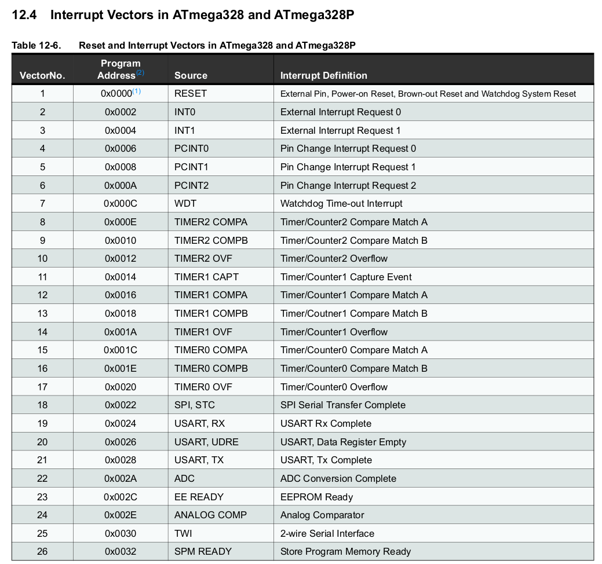

Im Anschluss wird die Integration der Interrupt-Vektortabelle im Speicher dargestellt.

*******************************************************************************

                            {{2}}
********************************************************************************

Der AVR deaktiviert die Ausführung von Interrupts, wenn er eine ISR aktiv ist. Dies kann aber manuell überschrieben werden.

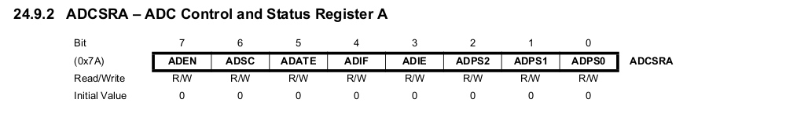

_ADIF is cleared by hardware when executing the corresponding interrupt handling vector. Alternatively, ADIF is cleared by writing a logical one to the flag. Beware that if doing a Read-Modify-Write on ADCSRA, a pending interrupt can be disabled._

> **Merke:** Der "Speichermechanismus" ein und des selben Interrupts ist ein Bit groß. Von anderen Interrupts, die zwischenzeitlich eintreffen kann jeweils ein Auftreten gespeichert werden.

*******************************************************************************

[^AVR328]: Firma Microchip, megaAVR® Data Sheet [Link](http://ww1.microchip.com/downloads/en/DeviceDoc/ATmega48A-PA-88A-PA-168A-PA-328-P-DS-DS40002061A.pdf)

### Praktische Interruptprogrammierung

**Atomarer Datenzugriff**

> **Merke:** Das Hauptprogramm kann grundsätzlich an jeder beliebigen Stelle unterbrochen werden, sofern die Interrupts aktiv sind.

Das bedeutet, dass entsprechende Variablen und Register, die sowohl im Hauptprogramm als auch in Interrupts verwendet werden, mit Sorgfalt zu behandeln sind.

Dies ist umso bedeutsamer, als das ein C Aufruf `port |= 0x03;` in drei Assemblerdirektiven übersetzt wird. An welcher Stelle wäre ein Interrupt kritisch?

```asm
  IN  r16, port
  ORI r16, 0x03
  OUT port, r16
```

```c
// Manuelle Methode
cli(); // Interrupts abschalten
port |= 0x03;
sei(); // Interrupts wieder einschalten

// Per Macros aus dem avr gcc, schöner lesbar und bequemer
// siehe Doku der avr-libc, Abschnitt <util/atomic.h>
ATOMIC_BLOCK(ATOMIC_FORCEON) {
  port |= 0x03;  
}
```

Mit Blick auf die Wiederverwendbarkeit des Codes sollte geprüft werden, ob die globalen Interrupts überhaupt aktiviert waren! Die avr-libc hält dafür die Methode ` ATOMIC_BLOCK(ATOMIC_RESTORESTATE)` bereit.

**Volatile Variablen**

`volatile` Variabeln untersagen dem Compiler Annahmen zu deren Datenfluss zu treffen. Mit

```c      volatile.c
volatile uint8_t i;

ISR( INT0_vect ){
  i++;
}

int main(){
  ...
  i = 0;
  while( 1 ) {
     Serial.println(i);
  }
}
```

### Einführungsbeispiele

**Externe Interrupts**

Wenden wir das Konzept mal auf einen konkreten Einsatzfall an und lesen die externen Interrupts in einer Schaltung. Dabei sollen Aktivitäten an einem externen Interruptsensiblen Pin überwacht werden.

> **Aufgabe:** Ermitteln Sie mit die PORT zugehörigkeit und die ID der Externen Interrupt PINs `INT0` und `INT1`. Welche Arduino Pin ID gehört dazu?

```cpp       main.cpp
#define F_CPU 16000000UL

#include <avr/io.h>
#include <avr/interrupt.h>

ISR(INT0_vect) {
  PORTB |= (1 << PB5);
}

int main (void) {
   DDRB |= (1 << PB5);
   DDRD &= ~(1 << DDD2);       // Pin als Eingang
   PORTD |= (1 << PORTD2);     // Pullup-Konfiguration
   EIMSK |= ( 1 << INT0);
   EICRA |= ( 1 << ISC01);
   sei();
   while (1);
   return 0;
}
```

> **Merke:** Der AtMega328 unterscheidet zwei Modi des externen Interrupts - eine 1:1 Zuordnung für für die "echten" externen Interrupts" und die sogenannten "Pin Change Interrupts" `PCINT23...0`.

 und Pin Change Mask Register (PCMSK) [^AVR328] Seite 79")

**Analog Digitalwandler**

Das folgende Beispiel nutzt den Analog-Digital-Wandler in einem teilautonomen Betrieb. Innerhalb der Interrupt-Routine wird das Ergebnis ausgewertet und jeweils eine neue Wandlung aktiviert.

Als Demonstrator dient ein Spannungsteiler über einen lichtabhängigen Widerstand.

```c
#include <avr/io.h>
#include <avr/interrupt.h>

// Interrupt subroutine for ADC conversion complete interrupt
ISR(ADC_vect) {
   //Serial.println(ADCW);
   if(ADCW >= 600)            
       PORTB |= (1 << PB5);
   else
       PORTB &=~(1 << PB5);
   ADCSRA |= (1<<ADSC);       
}

int main(void){
    Serial.begin(9600);
    DDRB |= (1 << PB5);  
    ADMUX = (1<<REFS0);  
    ADCSRA |= (1 << ADPS2) | (1 << ADPS1) | (1<<ADPS0) | (1<<ADEN)|(1<<ADIE);              
    ADCSRA |= (1<<ADSC);              // Dummy read
    while(ADCSRA & (1<<ADSC));
    ADCSRA |= (1<<ADSC);              // Start conversion "chain"
    (void) ADCW;
    sei();                            // Set the I-bit in SREG

    int i = 0;
    while (1) {
       Serial.print("Ich rechne fleißig ... ");
       Serial.println(i++);
       _delay_ms(50);
    }

    return 0;                         
}
```

[^AVR328]: Firma Microchip, megaAVR® Data Sheet [Link](http://ww1.microchip.com/downloads/en/DeviceDoc/ATmega48A-PA-88A-PA-168A-PA-328-P-DS-DS40002061A.pdf)

### Interrupt-Vektortabelle im AVR Programm

Und warum funktioniert das Ganze? Lassen Sie uns ein Blick hinter die Kulissen werfen.

Folgendes Programm, dass den externen Interrupt 0 auswertet wurde disassembliert.

```c
#define F_CPU 16000000UL

#include <avr/io.h>
#include <avr/interrupt.h>

ISR(INT0_vect) {
  PORTB |= (1 << PB5);
}

int main (void) {
   DDRB |= (1 << PB5);
   DDRD &= ~(1 << DDD2);    
   PORTD |= (1 << PORTD2);   
   EIMSK |= ( 1 << INT0);
   EICRA |= ( 1 << ISC01);
   sei();
   while (1);
   return 0;
}
```

```asm        main.asm
; Interrupt Vector Tabelle mit zugehörigen Sprungfunktionen
00000000 <__vectors>:
   0:	0c 94 34 00 	jmp	0x68	; 0x68 <__ctors_end>
   4:	0c 94 40 00 	jmp	0x80	; 0x80 <__vector_1>
   8:	0c 94 3e 00 	jmp	0x7c	; 0x7c <__bad_interrupt>

  60:	0c 94 3e 00 	jmp	0x7c	; 0x7c <__bad_interrupt>
  64:	0c 94 3e 00 	jmp	0x7c	; 0x7c <__bad_interrupt>

; Initialisierungsroutine für den Controller
00000068 <__ctors_end>:
  68:	11 24       	eor	r1, r1    ;       0 in R1
  6a:	1f be       	out	0x3f, r1	;       SREG = 0
  6c:	cf ef       	ldi	r28, 0xFF	; 255   
  6e:	d8 e0       	ldi	r29, 0x08	; 8     SP -> 0x8FF
  70:	de bf       	out	0x3e, r29	; 62    SPH (0x3e)
  72:	cd bf       	out	0x3d, r28	; 61    SPL (0x3d)
  74:	0e 94 4b 00 	call	0x96	; 0x96 <main>
  78:	0c 94 56 00 	jmp	0xac	; 0xac <_exit>

; Restart beim Erreichen eines nicht definierten Interrupts
0000007c <__bad_interrupt>:
  7c:	0c 94 00 00 	jmp	0	; 0x0 <__vectors>

; Interrupt Routine für External Interrupt 0
00000080 <__vector_1>:
  80:	1f 92       	push	r1
  82:	0f 92       	push	r0
  84:	0f b6       	in	r0, 0x3f	; 63
  86:	0f 92       	push	r0
  88:	11 24       	eor	r1, r1
  ; PORTB |= (1 << PB5);
  8a:	2d 9a       	sbi	0x05, 5	; 5
  8c:	0f 90       	pop	r0
  8e:	0f be       	out	0x3f, r0	; 63
  90:	0f 90       	pop	r0
  92:	1f 90       	pop	r1
  94:	18 95       	reti

00000096 <main>:
  ;DDRB |= (1 << PB5);
  96:	25 9a       	sbi	0x04, 5	; 4
  ; DDRD &= ~(1 << DDD2);    
  98:	52 98       	cbi	0x0a, 2	; 10
  ; PORTD |= (1 << PORTD2);   
  9a:	5a 9a       	sbi	0x0b, 2	; 11
  ; EIMSK |= ( 1 << INT0);
  9c:	e8 9a       	sbi	0x1d, 0	; 29
  ; EICRA |= ( 1 << ISC01);
  9e:	80 91 69 00 	lds	r24, 0x0069	; 0x800069 <__DATA_REGION_ORIGIN__+0x9>
  a2:	82 60       	ori	r24, 0x02	; 2
  a4:	80 93 69 00 	sts	0x0069, r24	; 0x800069 <__DATA_REGION_ORIGIN__+0x9>
  ; sei();
  a8:	78 94       	sei
  aa:	ff cf       	rjmp	.-2      	; 0xaa <main+0x14>

000000ac <_exit>:
  ac:	f8 94       	cli

000000ae <__stop_program>:
  ae:	ff cf       	rjmp	.-2      	; 0xae <__stop_program>
```

## Timer

Aufgaben von Timer/Counter Lösungen in einem Mikrocontroller:

+ Zählen von Ereignissen
+ Messen von Zeiten, Frequenzen, Phasen, Perioden
+ Erzeugen von Intervallen, Pulsfolgen, Interrupts
+ Überwachen von Ereignissen und Definition von Zeitstempeln

### Basisfunktionalität

Die Grundstruktur eines Zählerbaustein ergibt sich aus folgenden Komponenten:

```text @plantUML.png
@startuml
ditaa
+------------+
|            |
|            v                    
|   +-------------------+        interner   Interrupt
|   : Startwertregister |          Takt      
|   +-------------------+            |          ^            
|            |                       v          |            
|            v                    +-----------------+
|   +-------------------+         |                 | <---- Externer Takt
|   | Zählereinheit     |<------->| Steuerung       |       
|   | vorwärts/rückwärts|         | (Taktauswahl    | <---- Aktivierung
|   +-------------------+         |  Ausgabe)       |
|            |                    |                 | ----> Ausgabe
|            v                    +++++++++++++++++++
|   +-------------------+
|   : Zählerregister    |
|   +-------------------+
|            |
+------------+
@enduml
```

Capture/Compare-Einheiten Nutzen die Basis-Timerimplementierung. Sie können externe Signale aufnehmen und vergleichen, aber beispielsweise auch Pulsmuster erzeugen.

Sie besitzt meist mehrere Betriebsmodi:

+ Timer/Zähler-Modus: Aufwärtszählen mit verschiedenen Quellen als Taktgeber. Bei Zählerüberlauf kann ein Interrupt ausgelöst werden.

+ Capture-Modus: Beim Auftreten eines externen Signals wird der Inhalt des zugeordneten (laufenden) Timers gespeichert. Auch hier kann ein Interrupt ausgelöst werden.

```text @plantUML.png
@startuml
ditaa
+------------+
|            |
|            v                             +-------------------+  
|   +-------------------+        interner  | Interrupt cFF4    |
|   : Startwertregister |          Takt    +-------------------+   
|   +-------------------+            |          ^            
|            |                       v          |            
|            v                    +-----------------+
|   +-------------------+         |                 | <---- Externer Takt
|   | Zählereinheit     |<------->| Steuerung       |       +-------------------------+
|   | vorwärts/rückwärts|         | (Taktauswahl    | <---- |Aktivierung über Pin cFF4|
|   +-------------------+         |  Ausgabe)       |       +-------------------------+
|            |                    |                 | ----> Ausgabe
|            v                    +++++++++++++++++++
|   +-------------------+
|   : Zählerregister    |
|   +-------------------+
|            |     |
+------------+     v
                +--------------------+
                |Captureregister cFF4|
                +--------------------+
@enduml
```

+ Compare-Modus: Der Zählerstand des zugeordneten Timers wird mit dem eines Registers verglichen. Bei Übereinstimmung kann ein Interrupt ausgelöst werden.

```text @plantUML.png
@startuml
ditaa
+------------+
|            |
|            v                             +-------------------+  
|   +-------------------+        interner  | Interrupt cFF4    |
|   : Startwertregister |          Takt    +-------------------+   
|   +-------------------+            |          ^            
|            |                       v          |            
|            v                    +-----------------+
|   +-------------------+         |                 | <---- Externer Takt
|   | Zählereinheit     |<------->| Steuerung       |       
|   | vorwärts/rückwärts|         | (Taktauswahl    | <---- Aktivierung über Pin
|   +-------------------+   +---->|  Ausgabe,       |       +-------------------------+
|            |              |     |  Vergleich)     | ----> | Ausgabe             cFF4|
|            v              |     +++++++++++++++++++       +-------------------------+
|   +-------------------+   |             ^
|   : Zählerregister    |---+             |
|   +-------------------+                 v
|            |                   +--------------------+   
+------------+                   |Compareregister cFF4|   
                                 +--------------------+           
@enduml
```

> **Merke:** Diese Vorgänge laufen ausschließlich in der Peripherie-Hardware ab, beanspruchen also, abgesehen von eventuellen Interrupts, keine Rechenzeit.

Entsprechend ergibt sich für den Compare-Modus verschiedene Anwendungen und ein zeitliches Verhalten entsprechend den nachfolgenden Grafiken.

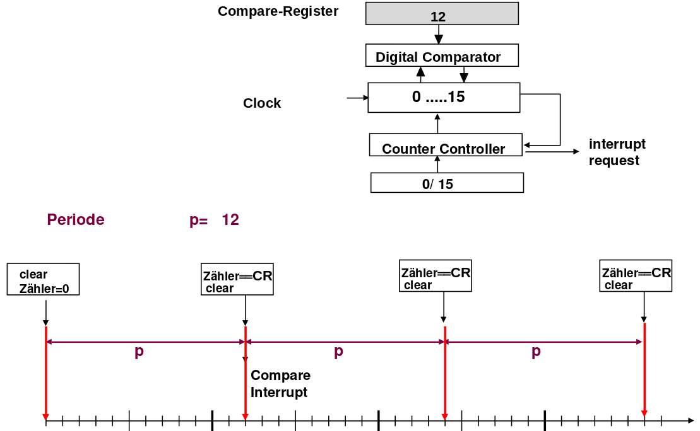

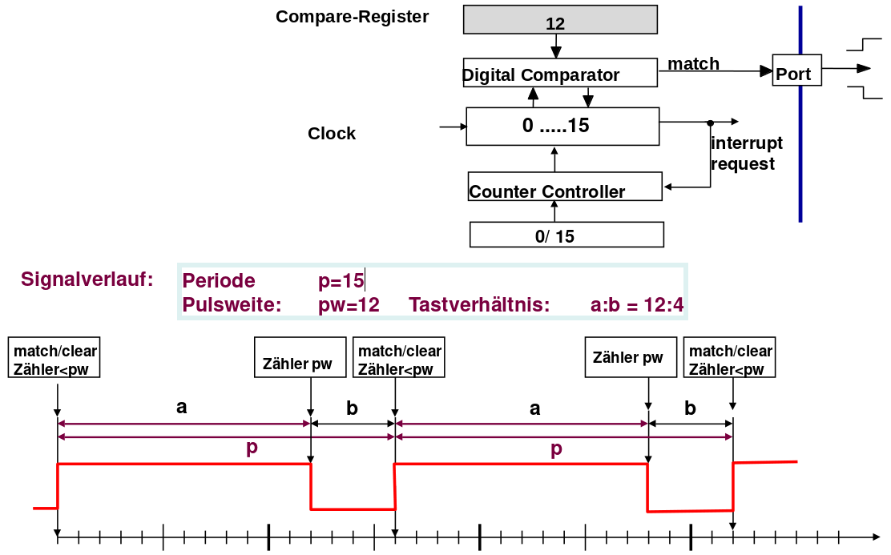

### Umsetzung im AVR

Der AtMega328 bringt 4 unabhängige Timersysteme mit:

+ _Two 8-bit Timer/Counters with Separate Prescaler and Compare Mode_
+ _One 16-bit Timer/Counter with Separate Prescaler, Compare Mode, and Capture Mode_
+ _Real Time Counter with Separate Oscillator_
+ _Six PWM Channels_

Dabei soll die Aufmerksamkeit zunächst auf dem 16-bit Timer/Zähler liegen.

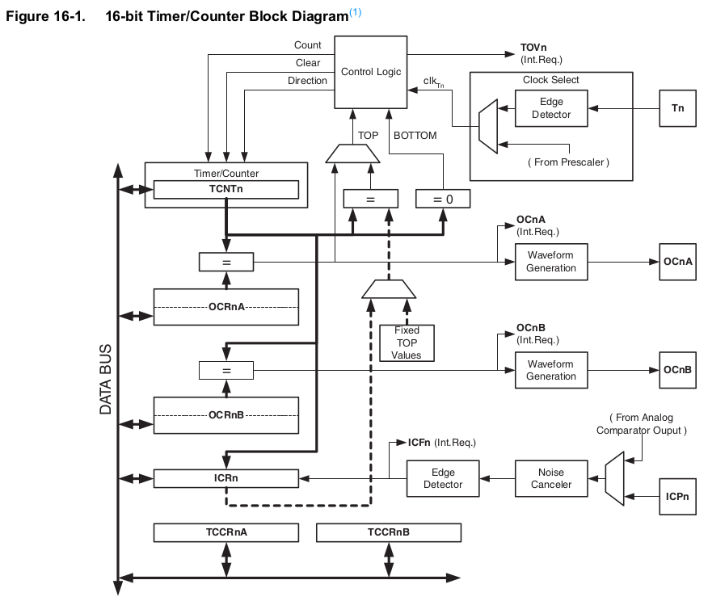

Folgende Fragen müssen wir die Nutzung des Timers beantwortet werden:

+ Wer dient als Trigger?
+ Wie groß wird der Prescaler gewählt?
+ Welche maximalen und die minimalen Schranken des Zähler werden definiert?
+ Wird ein Ausgang geschaltet?

[^AVR328]: Firma Microchip, megaAVR® Data Sheet, [Link](http://ww1.microchip.com/downloads/en/DeviceDoc/ATmega48A-PA-88A-PA-168A-PA-328-P-DS-DS40002061A.pdf)

#### Timer Modi

Timer-Modi bestimmen das Verhalten des Zählers und der angeschlossenen Ausgänge / Interrupts. Neben dem als Normal-Mode bezeichneten Mechanismus existieren weitere Konfigurationen, die unterschiedliche Anwendungsfelder bedienen.

**Clear to Compare Mode (CTC)**

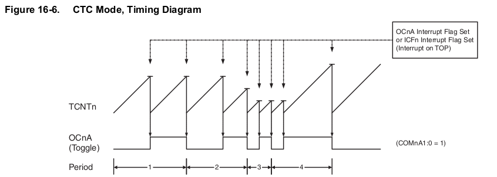

Die Periode über eine `OCnA` Ausgang ergibt sich entsprechend zu

$$
f_{OCnA} = \frac{f_{clk_i/o}}{2 \cdot N \cdot (1 + OCRnA)}
$$

Der Counter läuft zwei mal durch die Werte bis zum Vergleichsregister `OCRnA`. Die Frequenz kann durch das Setzen eine Prescalers korrigiert werden.

**Fast PWM**

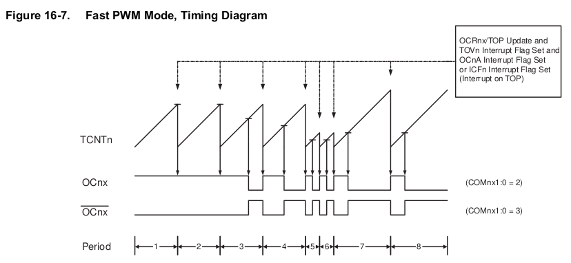

Die Periode des Signals an `OCRnA` wechselt während eines Hochzählens des Counters. Damit kann eine größere Frequenz bei gleicher Auflösung des Timers verglichen mit CTC erreicht werden.

$$
f_{OCnA} = \frac{f_{clk_i/o}}{N \cdot (1 + TOP)}
$$

**Phase Correct PWM**

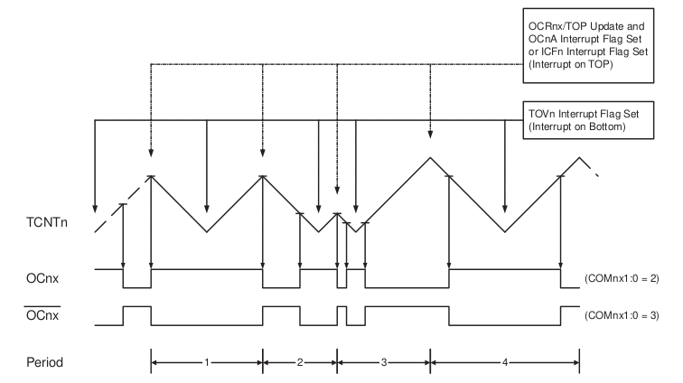

$$
f_{OCnA} = \frac{f_{clk_i/o}}{2 \cdot N \cdot TOP}
$$

[^AVR328]: Firma Microchip, megaAVR® Data Sheet, [Link](http://ww1.microchip.com/downloads/en/DeviceDoc/ATmega48A-PA-88A-PA-168A-PA-328-P-DS-DS40002061A.pdf)

#### Timer-Funktionalität (Normal-Mode)

Für die Umsetzung eines einfachen Timers, der wie im nachfolgenden Beispiel jede
Sekunde aktiv wird, genügt es einen entsprechenden Vergleichswert zu bestimmen,
den der Zähler erreicht haben muss.

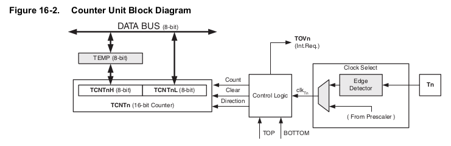

<div>
  <wokwi-led color="red" pin="13" port="B" label="13"></wokwi-led>
  <span id="simulation-time"></span>
</div>
```cpp       avrlibc.cpp
#ifndef F_CPU
#define F_CPU 16000000UL // 16 MHz clock speed
#endif

//16.000.000 Hz / 1024 = 15.625

int main(void)
{
  Serial.begin(9600);
  DDRB |= (1 << PB5);  // Ausgabe LED festlegen
  // Timer 1 Konfiguration
  //         keine Pins verbunden
  TCCR1A  = 0;
  TCCR1B  = 0;
  // Timerwert
  TCNT1   = 0;
  TCCR1B |= (1 << CS12) | (1 <<CS10);  // 1024 als Prescale-Wert

  while (1) //infinite loop
  {
     if (TCNT1>15625){
        TCNT1 = 0;  
        PINB = (1 << PB5); // LED ein und aus
     }
  }
}
```
@AVR8js.sketch

> Was stört Sie an dieser Umsetzung?

Wir lassen den Controller den Vergleichswert kontinuierlich auslesen. Damit haben wir noch nichts gewonnen, weil der Einsatz der Hardware unser eigentliches System nicht entlastet. Günstiger wäre es, wenn wir ausgehend von unseren Zählerzuständen gleich eine Schaltung des Ausganges vornehmen würden.

[^AVR328]: Firma Microchip, megaAVR® Data Sheet, [Link](http://ww1.microchip.com/downloads/en/DeviceDoc/ATmega48A-PA-88A-PA-168A-PA-328-P-DS-DS40002061A.pdf)

#### Compare Mode

Wir verknüpfen unseren Timer im Comparemodus mit einem entsprechenden Ausgang und stellen damit sicher, dass wir die Ausgabe ohne entsprechende Ansteuerung im Hauptprogramm aktivieren.

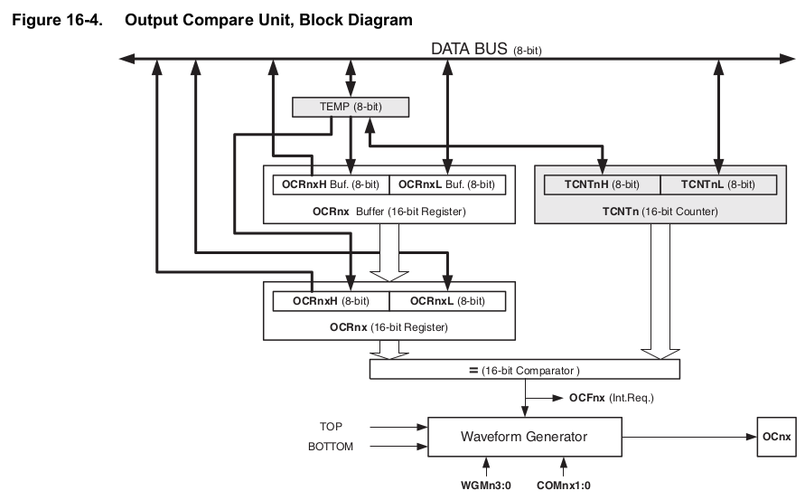

> **Frage:** Welchen physischen Pin des Controllers können wir mit unserem Timer 1 ansteuern?

Setzen wir also die Möglichkeiten des Timers vollständig ein, um das Blinken im Hintergrund ablaufen zu lassen. Ab Zeile 13 läuft dieser Prozess komplett auf der
Hardware und unser Hauptprogramm könnte eigenständige Aufgaben wahrnehmen.

**Normal Mode Konfiguration**

<div>
  <wokwi-led color="green" pin="9" port="B" label="B1"></wokwi-led>
  <span id="simulation-time"></span>
</div>
```cpp       avrlibc.cpp
#ifndef F_CPU
#define F_CPU 16000000UL // 16 MHz clock speed
#endif

int main(void)
{
  DDRB |= (1 << PB1);  // Ausgabe LED festlegen
  TCCR1A = 0;
  TCCR1B = 0;
  TCCR1B |= (1 << CS12) | (1 <<CS10);  // 1024 als Prescale-Wert
  TCCR1A |= (1 << COM1A0);
  OCR1A = 15625;

  while (1) _delay_ms(500);
}
```
@AVR8js.sketch

Was passiert, wenn die Aktivierung und Deaktivierung mit einer höheren Frequenz vorgenommen wird? Die effektiv wirkende Spannung wird durch den Mittelwert repräsentiert. Damit ist eine Quasi-Digital-Analoge Ausgabe ohne eine entsprechende Hardware möglich.

> **Merke:** Reale Analog-Digital-Wandler würden ein Ergebnis zwischen 0 und $2^n$ projiziert auf eine Referenzspannung ausgeben. PWM generiert diesen Effekt durch ein variierendes Verhältnis zwischen an und aus Phasen.

<!--
style="width: 80%; min-width: 420px; max-width: 720px;"
-->
```ascii
            Tastverhältnis
         ^  "1/4"    "2/3"
Spannung |  +---+........       +----
         |  |   |       .       |
         |  |   |       .       |
         |  |   |       .       |
         |  |   |       .       |
         |  |   |       .       |
         |--+   +---------------+
         +------------------------------->
            <------------------>
                  Periode                                                       .
```

Im folgenden wird der **Fast PWM Mode** genutzt, um auf diesem Wege die LED an
PIN 9 zu periodisch zu dimmen. Dazu wird der Vergleichswert, der in OCR1A enthalten ist kontinuierlich verändert.

```cpp       avrlibc.cpp
#ifndef F_CPU
#define F_CPU 16000000UL // 16 MHz clock speed
#endif

int main(void){
  DDRB |=  (1<<PORTB1); //Define OCR1A as Output
  TCCR1A |= (1<<COM1A1) | (1<<WGM10);  //Set Timer Register   
  TCCR1B |= (1<<WGM12) | (1<<CS11);
  OCR1A = 0;
  int timer;
  while(1) {
  		while(timer < 255){ //Fade from low to high
  		   timer++;
  		   OCR1A = timer;
  		   _delay_ms(50);
  		}
  		while(timer > 1){ //Fade from high to low
  		   timer--;
  		   OCR1A = timer;
  		   _delay_ms(50);
  		}
   }
}
```

[^AVR328]: Firma Microchip, megaAVR® Data Sheet, [Link](http://ww1.microchip.com/downloads/en/DeviceDoc/ATmega48A-PA-88A-PA-168A-PA-328-P-DS-DS40002061A.pdf)

#### Capture Mode

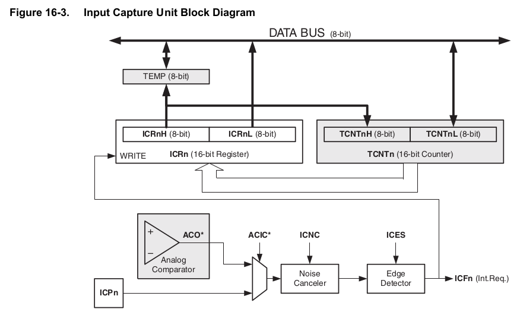

```cpp       avrlibc.cpp
#include <avr/io.h>
#include <util/delay.h>

int main(void)
{
  Serial.begin(9600);
  DDRB = 0;
  PORTB = 0xFF;

  TCCR1A = 0; // Normal Mode
  TCCR1B = 0;
  //         1024 als Prescale-Wert     Rising edge    Filter
  TCCR1B  = (1 << CS12) | (1 <<CS10) | (1 << ICES1) | (1 << ICNC1);  
  TIFR1 = (1<<ICF1);  // Löschen des Zählerwertes

  while (1)
  {
      Serial.println("Waiting for Button push");
      Serial.flush();
      TCNT1 = 0;  // Löschen des Zählerwertes
      while ((TIFR1 & (1<<ICF1)) == 0);
      TIFR1 = (1<<ICF1);
      Serial.println(ICR1);
      Serial.flush();
      _delay_ms(500);
  }
  return  0;
}
```

Mit dem Schreiben des Flags `ICF1` kann der Eintrag gelöscht werden.

__This flag is set when a capture event occurs on the ICP1 pin. When the Input Capture Register (ICR1) is set by the WGM13:0 to be used as the TOP value, the ICF1 Flag is set when the counter reaches the TOP value. ICF1 is automatically cleared when the Input Capture Interrupt Vector is executed. Alternatively, ICF1 can be cleared by writing a logic one to its bit location._

Entwicklung des Timerinhalts
80000  |
       |                +                              
       |               +                               
       |              +        
       |             +  
Zähler |    +       +                      
       |   +       +                     
       |  +    +  +                      
       | +    +  +       +                             
       |+    +  +       +    
 0     +------------------------------------------
        0     Zeit in Ticks nach Prescaler     100

> **Frage:** Sie wollen die Ausgabe in Ticks in eine Darstellung in ms überführen. Welche Kalkulation ist dafür notwendig?

> **Problem:** Wie große ist das maximal darstellbare Zahlenintervall?

[^AVR328]: Firma Microchip, megaAVR® Data Sheet, [Link](http://ww1.microchip.com/downloads/en/DeviceDoc/ATmega48A-PA-88A-PA-168A-PA-328-P-DS-DS40002061A.pdf)

### Anwendungen


####  Zähler von Aktivitäten


Wir wollen einen Eingangszähler entwerfen, der die Ereignisse als Zählerimpulse betrachtet und zusätzlich mit einem Schwellwert vergleicht.

```cpp       avrlibc.cpp
#include <avr/io.h>
#include <util/delay.h>

ISR (TIMER1_COMPA_vect)
{
  Serial.print("5 Personen gezählt");
  TCNT1 = 0;
}

int main(void)
{
  Serial.begin(9600);
  // CTC Modus (Fall 4)
  TCCR1B |= (1 << CS12) | (1 << CS11) | (1 << CS10) | (1<<WGM12);
  OCR1A = 5;
  TIMSK1 |= (1<<OCIE1A);
  sei();

  while (1)
  {
    Serial.print(TCNT1);
    Serial.print(" ");
    _delay_ms(500);
  }
  return  0;
}
```

[^AVR328]: Firma Microchip, megaAVR® Data Sheet, [Link](http://ww1.microchip.com/downloads/en/DeviceDoc/ATmega48A-PA-88A-PA-168A-PA-328-P-DS-DS40002061A.pdf)

#### Servomotoren

Als Servomotor werden Elektromotoren bezeichnet, die die Kontrolle der Winkelposition ihrer Motorwelle sowie der Drehgeschwindigkeit und Beschleunigung erlauben. Sie integrieren neben dem eigentlichen Elektromotor, eine Sensorik zur Positionsbestimmung und eine Regelelektronik. Damit kann die Bewegung des Motors entsprechend einem oder mehreren einstellbaren Sollwerten – wie etwa Soll-Winkelposition der Welle oder Solldrehzahl – bestimmt werden.


<!--
style="width: 80%; min-width: 420px; max-width: 720px;"
-->
```ascii


           Nulllage (1500ms)
    Minima(1ms)  |  Maxima (2ms)
              |  v  |
High   |      v     v                
       |  +------+...                        +---                            
       |  |   :  |  :                        |     
       |  |   :  |  :                        |               
       |  |   :  |  :                        |               
       |  |   :  |  :                        |               
       |  |   :  |  :                        |                             
       |  |   :  |  :                        |   
       |--+      +---------------------------+
       |
       +-------------------------------------|---->                           .
           0                                20ms
```

Diese Funktionalität lässt sich mit einem Timer entsprechend umsetzen.

$$
20ms = 2500 x 0.008ms
$$


```c
#define F_CPU 1000000UL
#include <avr/io.h>
#include <avr/interrupt.h>
#include <util/delay.h>

ISR( TIMER1_COMPA_vect ){
  OCR1A = 2500-OCR1A;	     }

int main (void){
  TCCR1A = (1<<COM1A0);    // Togglen bei Compare Match
  TCCR1B = (1<<WGM12) |
           (1<<CS11);      // CTC-Mode; Prescaler 8
  TIMSK1 = (1<<OCIE1A);    // Timer-Compare Interrupt an
  OCR1A = 2312;            // Neutralposition
  sei();                   // Interrupts global an
  while( 1 ) {
    ...
    OCR1A = OCR1A + 3;
    _delay_ms(40);
    ...
  }
  return 0;
}
```

[^wikimediaServo]: Wikipedia, Autor Bernd vdB, Servo and receiver connections, [Link](https://commons.wikimedia.org/wiki/File:Rc-receiver-servo-battery_b.jpg)

#### Gleichstrommotor

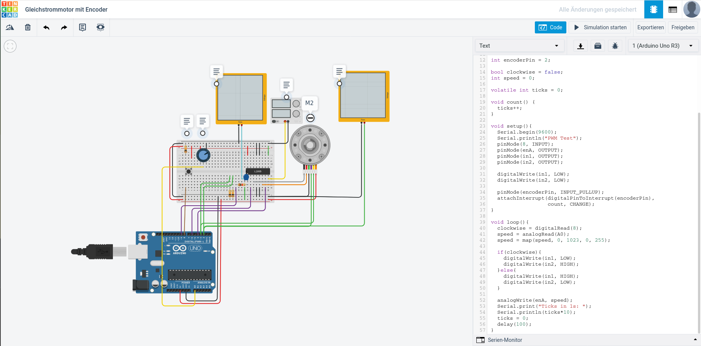<!-- style="width: 75%; max-width: 750px" -->

https://www.tinkercad.com/things/lu1Gt48hNsL-gleichstrommotor-mit-encoder/editel


## Welche Einschränkungen ergeben sich aus der Architektur?

> Warum sprechen wir im Zusammenhang mit den Controllern von fehlender Performance verglichen mit anderen Systemen?

<!--data-type="none"-->
| Arduino Uno Board                                                                                                 | Nucleo 64                                                                                          |
| ----------------------------------------------------------------------------------------------------------------- | -------------------------------------------------------------------------------------------------- |
| 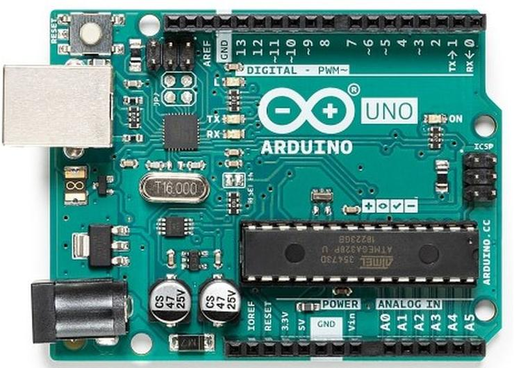<!-- style="width: 100%; auto; max-width: 415px;" --> | 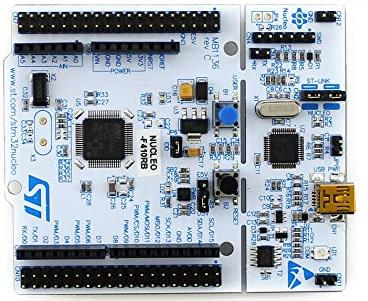<!-- style="width: 100%; max-width=315px;" --> |
| Microchip ATmega 328p                                                                                             | STM32F401                                                                                          |
| 8-Bit AVR Familie                                                                                                 | 32-Bit Cortex M4 Prozessor                                                                         |
| C, Assembler                                                                                                      | C, C++                                                                                             |
| avrlibc, FreeRTOS                                                                                                 | CMSIS, mbedOS, FreeRTOS                                                                            |
| 10 Bit Analog-Digital-Wandler, 16 Bit Timer,                                                                      | 10 timers, 16- and 32-bit (84 MHz), 12-bit ADC                                                     |

### 8-Bit Datenbreite


                            {{0-1}}
*******************************************************************

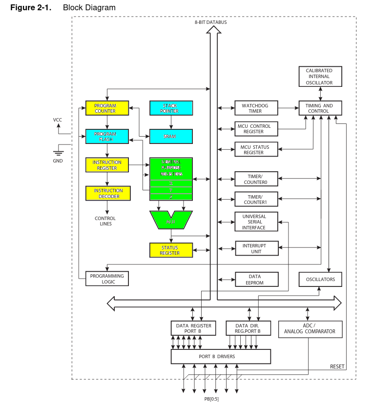

Die Festlegung auf 8-Bit Operanden und Ausgabe bei den arithmetisch/logischen Operationen erfordert umfangreiche Berechnungen schon bei bescheidenen Größenordnungen.

```cpp       avrlibc.cpp
#define F_CPU 16000000UL

#include <avr/io.h>
#include <util/delay.h>

int main (void) {
  Serial.begin(9600);

  volatile int sample;

  asm volatile("ldi  r16, 250" "\n\t"
               "ldi  r17, 100" "\n\t"
               "mul  r16, r17" "\n\t"
               "movw %0, r0" "\n\t"
               "eor r1, r1" "\n\t"
              : "=a" (sample)
              :
              : "r16", "r17");

  Serial.print("Das Ergebnis ist ");
  Serial.println(sample);
  Serial.flush();

  while(1) {
       _delay_ms(1000);
  }
  return 0;
}
```

> Wie lange dauert die Berechnung für die in Zeile 11 - 13 genannten Befehle?

> Warum scheitert das Ganze, wenn `r1` keine 0 enthält?

Das Beispiel findet sich im Projektordner unter `../codeExamples/avr/inlineAssembly/`.

*******************************************************************

                            {{1-2}}
*******************************************************************

Mit dem 8-Bit Multiplikator decken wir aber nur Konstellationen hab, für die gilt das die Faktoren beide immer kleiner als 256 sein müssen. Um das Problem mit größeren Binärzahlen zu lösen, betrachten wir zunächst nur diese Kombination aus 16 und 8. Das Verständnis dieses Konzepts hilft, die Methode zu verstehen, so dass Sie später in der Lage sein werden, das 32-mal-64-Bit-Multiplikationsproblem zu lösen.

     --{{2}}--
Die Mathematik dafür ist einfach, ein 16-Bit-Binär sind einfach zwei 8-Bit-Binäre, wobei der höchstwertige dieser beiden mit dezimal 256 oder hex 100 multipliziert wird. Das 16-Bit-Binär $m1$ ist also gleich $256*m1_H$ plus $m1_L$, wobei $m1_H$ das MSB und $m1_L$ das LSB ist. Die Multiplikation von $m1$ mit dem 8-Bit-Binär $m2$ ist also, mathematisch formuliert:

$$
m1 \cdot m2 = (256 \cdot m1_H + m1_L) \cdot m2 = 256 \cdot m1_H \cdot m2 + m1_L \cdot m2
$$

Welche Abschnitte sind in der Brechnung notwendig?

<!--
style="width: 80%; min-width: 420px; max-width: 720px;"
-->
```ascii
    +--------+          +--------+--------+
    | "$m2$" | "$\cdot$"|"$m1_H$"|"$m1_L$"|
    +--------+          +--------+--------+
    ---------------------------------------
                        +-----------------+
                        |"$m2 \cdot m1_L$"|     
                        +-----------------+
               +-----------------+
               |"$m2 \cdot m1_H$"|     
    +          +-----------------+
    ---------------------------------------
               +--------------------------+  
               |      "$m2 \cdot m1$"     |   <- 24 Bit Ergebnis
               +--------------------------+                                    .
```


Wir brauchen also nur zwei Multiplikationen durchzuführen und beide Ergebnisse zu addieren. Die Multiplikation mit 256 erfordert keine Hardware, da es sich um einen  Sprung zum nächsthöheren Byte handelt. Lediglich der Übertrag bei der Additionsoperation muss beachtet werden.

<!--
style="width: 80%; min-width: 420px; max-width: 720px;"
-->
```ascii

         +----------+
     r16 |   0x10   | Faktor 1   low Byte  "$m1_L$"
         +----------+ 8208
     r17 |   0x20   |            high Byte "$m1_H$"
         +----------+
     r18 |   0xFF   | Faktor 2             "$m2$"
         +----------+ ........ -. .........................................                 
%A0  r19 |   0xF0   | Ergebnis  |       
         +----------+ 2093040   ⎬ "$m1_L\cdot m2$"-.
%B0  r20 |   0xEF   |           |                  |   
         +----------+          -.                  ⎬ "$m1_H \cdot m2$"
%C0  r21 |   0x1F   |                              |                 carry
         +----------+                             -.
%D0  r22 |   0x00   |      0
         +----------+                                                               .
```

```cpp       avrlibc.cpp
#define F_CPU 16000000UL

#include <avr/io.h>
#include <util/delay.h>

int main (void) {
  Serial.begin(9600);

  volatile long sample;

  asm volatile("ldi  r16, 0x10" "\n\t"
               "ldi  r17, 0x20" "\n\t"
               "ldi  r18, 0xFF" "\n\t"
               "eor  %D0, %D0" "\n\t"
               "mul  r16, r18" "\n\t"
               "mov  %A0, r0" "\n\t"
               "mov  %B0, r1" "\n\t"
               "mul  r17, r18" "\n\t"
               "add  %B0, r0" "\n\t"
               "mov  %C0, r1" "\n\t"
               "brcc NoInc" "\n\t"
               "inc  %C0" "\n\t"
               "NoInc:" "\n\t"
               "eor r1, r1" "\n\t"
                ""
              : "=r" (sample)
              :
              : "r16", "r17", "r18" );


  Serial.print("Das Ergebnis ist ");
  Serial.println(sample);
  Serial.flush();

  while(1) {
       _delay_ms(1000);
  }
  return 0;
}
```

Für die Muliplikation von größeren Werten wird die Berechnung entsprechend aufwändiger.

*******************************************************************

[^AtTinyArchitecture]: Firma Microchip, Handbuch AtTiny Family, https://ww1.microchip.com/downloads/en/DeviceDoc/Atmel-2586-AVR-8-bit-Microcontroller-ATtiny25-ATtiny45-ATtiny85_Datasheet.pdf

### Fehlende Fließkommaeinheit

Die Gleitkommadarstellung besteht dann aus dem Vorzeichen, der Mantisse und dem Exponenten. Für binäre Zahlen ist diese Darstellung in der [IEEE 754](https://de.wikipedia.org/wiki/IEEE_754) genormt.

<!--
style="width: 100%; max-width: 560px; display: block; margin-left: auto; margin-right: auto;"
-->
```ascii
  +-+---- ~ -----+----- ~ ----+
  |V|  Mantisse  |  Exponent  |   V=Vorzeichenbit
  +-+---- ~ -----+----- ~ ----+

   1      23           8          = 32 Bit (float)
   1      52          11          = 64 Bit (double)                            .
```

> **Merke:** Die Verrechnung von Gleitkommazahlen ist entsprechend aufwändig:
>
> 1. Homogenisierung der Exponenten und Mantissen
> 2. Berechnung des Ergebnisses
> 3. Normierung des Resultats

<!-- style="width: 100%; max-width: 560px" -->


<iframe width="100%" height="60%" src="https://godbolt.org/e#g:!((g:!((g:!((h:codeEditor,i:(filename:'1',fontScale:14,fontUsePx:'0',j:1,lang:c%2B%2B,selection:(endColumn:2,endLineNumber:22,positionColumn:2,positionLineNumber:22,selectionStartColumn:2,selectionStartLineNumber:22,startColumn:2,startLineNumber:22),source:'%23define+F_CPU+16000000UL%0A%0A%23include+%3Cavr/io.h%3E%0A%0Aint+main+(void)+%7B%0A%0A++char+a+%3D+5%3B%0A++char+b+%3D+6%3B%0A++char+c+%3D+0%3B%0A%0A++//float+a+%3D+5.1%3B%0A++//float+b+%3D+6.3%3B%0A++//float+c+%3D+0%3B%0A%0A++for+(int+i+%3D+1%3B+i+%3C+11%3B+%2B%2Bi)%0A++%7B%0A++++c+%3D+a+%2B+b%3B%0A++++if+(c%3E15)+break%3B%0A++%7D%0A%0A++return+0%3B%0A%7D'),l:'5',n:'0',o:'C%2B%2B+source+%231',t:'0')),k:50,l:'4',n:'0',o:'',s:0,t:'0'),(g:!((h:compiler,i:(compiler:avrg930,deviceViewOpen:'1',filters:(b:'0',binary:'1',binaryObject:'1',commentOnly:'0',demangle:'0',directives:'0',execute:'1',intel:'0',libraryCode:'0',trim:'1'),flagsViewOpen:'1',fontScale:14,fontUsePx:'0',j:1,lang:c%2B%2B,libs:!(),options:'',selection:(endColumn:1,endLineNumber:1,positionColumn:1,positionLineNumber:1,selectionStartColumn:1,selectionStartLineNumber:1,startColumn:1,startLineNumber:1),source:1),l:'5',n:'0',o:'+AVR+gcc+9.3.0+(Editor+%231)',t:'0')),k:50,l:'4',n:'0',o:'',s:0,t:'0')),l:'2',n:'0',o:'',t:'0')),version:4"></iframe>

> Ändern Sie die Operation in Zeile 17 von einer Addition in eine Mulitplikation. Was beobachten Sie und warum?
> Welche Änderungen beobachten Sie, wenn Sie den Datentyp auf `float` setzen?


###  Fehlende Festkommaeinheit

Neben den Fließkommadarstellungen lassen sich auch Festkommakonzepte für die Darstellung gebrochener Zahlen in Hardware/Software umsetzen. Dabei wird die Speicherbreite in den Anteil vor und nach einer spezifischen und unveränderlichen Kommaposition eingeteilt.

Ein Beschreibungsformat dafür ist die Q-Notation bei der die Anzahl der Nachkommastellen (und optional die Anzahl der ganzzahligen Bits) angegeben wird. Eine Q15-Zahl hat z. B. 15 Nachkommastellen; eine Q1.14-Zahl hat 1 ganzzahliges Bit und 14 Nachkommastellen.

> **Achtung:** Für vorzeichenbehaftete Festkommazahlen gibt es zwei widersprüchliche Verwendungen des Q-Formats. Bei der einen Verwendung wird das Vorzeichenbit als Ganzzahlbit gezählt, in der anderen Variante jedoch nicht. Zum Beispiel könnte eine vorzeichenbehaftete 16-Bit-Ganzzahl als Q16.0 oder Q15.0 bezeichnet werden. Um diese Unklarheit zu beseitigen wird teilweise ein U für `unsigned` eingefügt.

<!-- data-type="none" -->
| Konfiguration | Bit 7 | Bit 6 | Bit 5 | Bit 4 | Bit 3 | Bit 2 | Bit 1 | Bit 0 | Wert  |
| ------------- | ----- | ----- | ----- | ----- | ----- | ----- | ----- | ----- | ----- |
| UQ0.8         | 1     | 1     | 1     | 0     | 0     | 0     | 0     | 0     | 0.875 |
| UQ1.7         | 1     | 1     | 1     | 0     | 0     | 0     | 0     | 0     | 1.75  |
| UQ2.6         | 1     | 1     | 1     | 0     | 0     | 0     | 0     | 0     | 3.5   |

<!-- data-type="none" -->
| Konfiguration | Auflösung | größte Zahl      | kleinste Zahl |
| ------------- | --------- | ---------------- | ------------- |
| `Qm.n`        | $2^{-n}$  | $2^{m-1}-2^{-n}$ | $-2^{m-1}$    |
| `UQm.n`       | $2^{-n}$  | $2^{m}-2^{-n}$   | $0$           |

Eine 16 Bit breite, vorzeichenbehaftete Festkommazahl `Q15.1` kann also Zahlenwerte im Bereich $[-16384.0, +16383.5]$ abbilden. Die Auflösung der Darstellung ist $2^{-n} = 0.5$

> **Merke:** Anders als für eine Fließkommazahl, ist die Auflösung der Festkommazahl konstant!

Bei der Rechnung mit Festkommazahlen werden die binären Muster prinzipiell so verarbeitet wie bei der Rechnung mit ganzen Zahlen. Festkomma-Arithmetik kann daher von jedem digitalen Prozessor durchgeführt werden, der arithmetische Operationen mit ganzen Zahlen unterstützt. Dennoch sind einige Regeln zu beachten, die sich auf die Position des Kommas vor und nach der Rechenoperation beziehen:

+ Bei Addition und Subtraktion muss die Position des Kommas für alle Operanden identisch sein. Ist dies nicht der Fall, sind die Operanden durch Schiebeoperationen entsprechend anzugleichen. Die Kommaposition des Ergebnisses entspricht dann der Kommaposition der Operanden.
+ Bei Multiplikation entspricht die Anzahl der Nachkommastellen des Ergebnisses der Summe der Anzahlen der Nachkommastellen aller Operanden.
+ Die Wortbreite des Endergebnisses wird auf die gewünschte Breite reduziert. Dabei wird häufig Sättigungsarithmetik und Rundung verwendet.

```c
int16_t q_add(int16_t a, int16_t b)
{
    return a + b;
}

int16_t q_add_sat(int16_t a, int16_t b)
{
    int16_t result;
    int32_t tmp;

    tmp = (int32_t)a + (int32_t)b;
    if (tmp > 0x7FFF)
        tmp = 0x7FFF;
    if (tmp < -1 * 0x8000)
        tmp = -1 * 0x8000;
    result = (int16_t)tmp;

    return result;
}
```

Der Dynamikbereich von Festkommawerten ist zwar wesentlich geringer als der von Fließkommawerten mit gleicher Wortgröße. Warum sollte man dann einen Mikrocontroller oder Prozessor mit Festkomma-Hardwareunterstützung verwenden?

+ **Größe und Stromverbrauch** - Die logischen Schaltungen der Festkomma-Hardware sind viel weniger kompliziert als die der Fließkomma-Hardware. Das bedeutet, dass die Festkomma-Chipgröße im Vergleich zur Fließkomma-Hardware kleiner ist und weniger Strom verbraucht.

+ **Speicherverbrauch und Geschwindigkeit** - Im Allgemeinen benötigen Festkommaberechnungen weniger Speicher und weniger Prozessorzeit.

+ **Kosten** - Festkomma-Hardware ist kostengünstiger, wenn Preis/Kosten eine wichtige Rolle spielen. Wenn digitale Hardware in einem Produkt verwendet wird, insbesondere bei Massenprodukten, kostet Festkomma-Hardware viel weniger als Fließkomma-Hardware.

Wie ist das Ganze implementiert? Seit der Version 4.8 integriert der [avr-gcc](https://gcc.gnu.org/wiki/avr-gcc) eine entsprechende Bibliothek `stdfix.h`, die vordefinierte Typen integriert: 

<!-- data-type="none" -->
| Typname | Typ       | Größe in Byte | QU    | Q          |
| ------- | --------- | ------------- | ----- | ---------- |
| _Fract  | short     | 1             | 0.8   | $\pm$0.7   |
|         | long      | 4             | 0.32  | $\pm$0.31  |
|         | long long | 8             | 0.64  | $\pm$0.63  |
| _Accum  | short     | 2             | 8.8   | $\pm$8.7   |
|         | long      | 4             | 32.32 | $\pm$32.31 |
|         | long long | 8             | 16.48 | $\pm$16.47 |

> **Merke:** Daneben existieren verschiedene andere Festkommabibliotheken, die andere Konfigurationen unterstützen und verschiedene Implementierungen aufzeigen.

Lassen Sie uns einen genaueren Blick auf die Implementierung werfen. Im Codebeispiel, dass Sie im Projektordner finden, addieren wir zwei Variablen unterschiedlichen Formates.

```c    FixedPoint.c
#define F_CPU 16000000UL

#include <avr/io.h>
#include <stdfix.h>

int main (void) {

  unsigned short _Accum fixVarA = 1.5K;
  short _Accum fixVarB =  -1.5K;
  long _Accum fixResult = fixVarA * fixVarB;

  while(1);
  return 0;
}
```

Für die `variableA` ergibt sich dabei folgender Auszug des Programmspeichers, sofern das Beispielprogramm ohne Optimierung übersetzt wird.

```
short _Accum fixVarB =  -1.5K;
11c:	80 e4       	ldi	r24, 0x40	; 64
11e:	9f ef       	ldi	r25, 0xFF	; 255

     +--------+
r24  |01000000|     r25
     +--------+   --------
r25  |11111111| = 111111110.1000000
     +--------+           ---------
                             r24

 1.5 = (3 >> 1)

  0011 = 3
  1100 invertiert  
  0001 +1
  ----
  1101 = -3   --> 110.1 == -1.5                           
```

### Vergleich der Softwarelösungen auf dem AVR

Um eine Evaluation durchzuführen wurde der Python Wrapper `pysimavr` für die AVR Core Simulation genutzt.

https://github.com/buserror/simavr

Im Projektordern finden Sie unter `../codeExamples/avr/fixedPoint/pySimAVR` das Miniprojekt. Dabei sind zwei Beispiele vorgesehen:

+ Evaluation der Laufzeit mittels UART Ausgaben
+ Evaluation der Laufzeit über togglende Pins

Im Ergebnis zeigt sich folgendes Bild:

<!-- data-type="none" -->
| Variable                | Dauer           |
| ----------------------- | --------------- |
| `_delay_ms (100);`      | 100000.12500 us |
| `unsigned short _Accum` | 2771.68700 us   |
| `unsigned long _Accum`  | 45760.37500 us  |
| `long _Accum`           | 50463.25000 us  |

## Aufgaben

- [ ] Variieren Sie die Helligkeit der boardinternen LED mit dem zugehörigen Timer. Ermitteln Sie dessen Pin Belegung.

- [ ] Integrieren Sie PWM Funktionen in unsere Simulationsumgebung und evaluieren Sie diese. Stellen Sie die Impulse dar und Messen Sie die Genauigkeiten der Zeitvorgaben.
