<!--
author:   Sebastian Zug, Karl Fessel & Andrè Dietrich, Bastian Zötzl
email:    sebastian.zug@informatik.tu-freiberg.de

version:  1.0.6
language: de
narrator: Deutsch Female

import:  https://raw.githubusercontent.com/liascript-templates/plantUML/master/README.md
         https://github.com/LiaTemplates/AVR8js/main/README.md
         https://github.com/LiaTemplates/Pyodide

icon: https://upload.wikimedia.org/wikipedia/commons/d/de/Logo_TU_Bergakademie_Freiberg.svg
-->


[](https://liascript.github.io/course/?https://raw.githubusercontent.com/TUBAF-IfI-LiaScript/VL_SoftwareentwicklungEingebetteteSysteme/main/lectures/04_Kommunikationsprotokolle.md#1)


# Kommunikationsprotokolle

| Parameter                | Kursinformationen                                                                                                                                                                    |
| ------------------------ | ------------------------------------------------------------------------------------------------------------------------------------------------------------------------------------ |
| **Veranstaltung:**       | `Vorlesung Softwareentwicklung für eingebettete Systeme`                                                                                                                             |
| **Semester**             | `Sommersemester 2026`                                                                                                                                                                |
| **Hochschule:**          | `Technische Universität Freiberg`                                                                                                                                                    |
| **Inhalte:**             | `Kommunikationsprotokolle: UART, I2C, SPI, CAN Bus`                                                                                            |
| **Link auf den GitHub:** | [https://github.com/TUBAF-IfI-LiaScript/VL_SoftwareentwicklungEingebetteteSysteme/blob/main/lectures/04_Kommunikationsprotokolle.md](https://github.com/TUBAF-IfI-LiaScript/VL_SoftwareentwicklungEingebetteteSysteme/blob/main/lectures/04_Kommunikationsprotokolle.md) |
| **Autoren**              | @author                                                                                                                                                                              |


---

## Ausgangspunkt

                    {{0-1}}
********************************************************************************

Im Rahmen der Veranstaltung wollen wir vier Kommunikationsprotokolle, die durch den AVR unterstützt werden, näher betrachten:

* UART - Universal Asynchronous Receiver Transmitter
* I2C - Inter-Integrated Circuit (in der "Atmel Welt" als _Two Wire Interface_ (TWI) bezeichnet)
* SPI - Serial Peripheral Interface
* CAN - Controller Area Network

> **Merke** `UART` beschreibt eine Schnittstelle während `I2C` und `SPI` konkrete Protokolldefinitionen darstellen.

> **Merke** Die drei Erstgenannten sind nativ von den meisten Mikrocontrollern unterstützt. Für CAN braucht es ggf. zusätzliche Hardware.

Alle vier Schnittstellen/Protokolle sind auf die serielle Kommunikation von Daten ausgerichtet!


********************************************************************************

                                  {{1-2}}
********************************************************************************

**Beispiele Paralleler Datenaustausch - Zugriff Externen SRAM**

Ein paralleler Austausch von 8Bit breiten Daten ist für die AVRs zum Beispiel im Zusammenhang mit der Adressierung von externem Arbeitsspeicher vorgesehen.

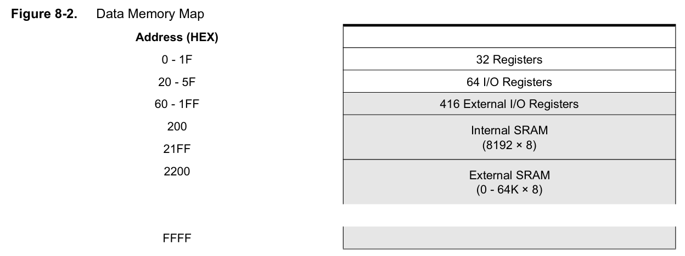
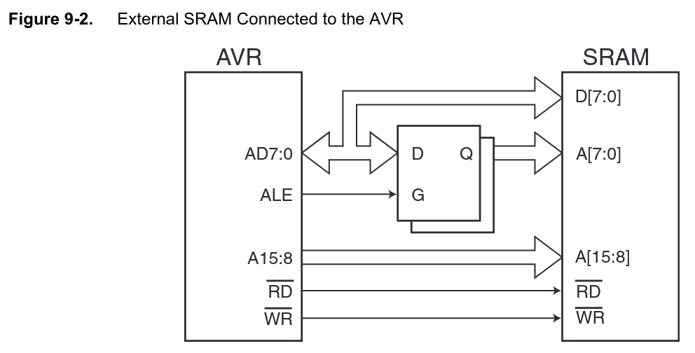
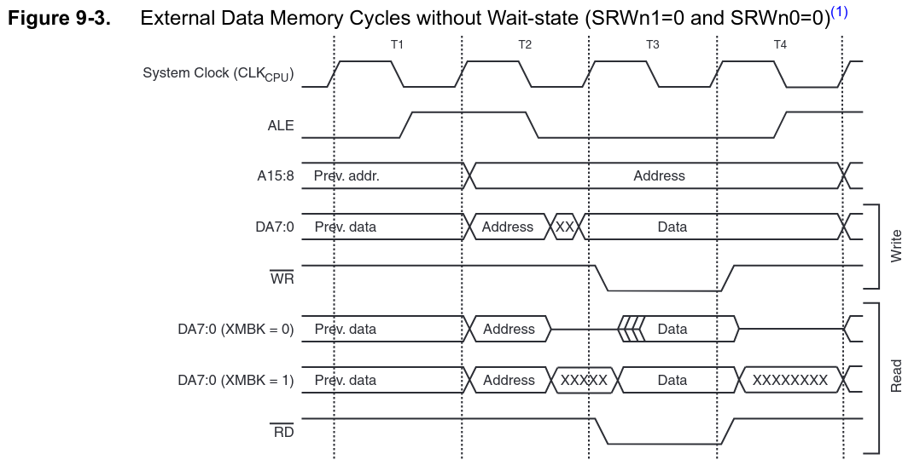

**Beispiele Paralleler Datenaustausch - Spezifische Aktoren**

Der CD4543 Baustein dient der Ansteuerung von 7-Segment-Anzeigen. Mit dem Dekodieren einer 4-Bit Zahlendarstellung auf die zugehörigen Steuerleitungen werden 3 Pins eingespart. 

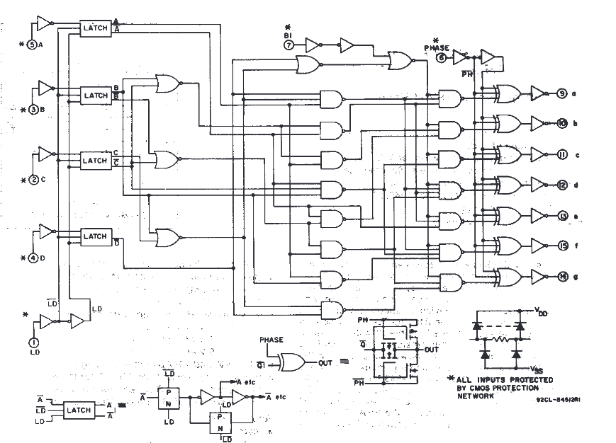


********************************************************************************

                                  {{2-3}}
********************************************************************************

Unterscheidungsmerkmale von Kommunikationsmedien:

+ Zahl der Kommunikationspartner im System (1:1; 1:n, n:m)
+ Rolle für Teilnehmer (Controller/Peripheral oder gleichberechtigt)
+ Übertragungsmodus (unidirektional, bidirektional)
+ Synchrone vs. asynchrone Kommunikation  
+ Kommunikationsgeschwindigkeit
+ Zahl der notwendigen elektrischen Verknüpfungen
+ Maximale Übertragungslänge

> **Terminologische Anmerkung — Controller/Target statt Master/Slave**
>
> Die historisch gebräuchlichen Begriffe `Master` und `Slave` werden seit einigen Jahren in den offiziellen Spezifikationen ersetzt:
>
> | Protokoll | bisher           | aktuell                  | Quelle                           |
> | --------- | ---------------- | ------------------------ | -------------------------------- |
> | I²C / I3C | Master / Slave   | Controller / Target      | NXP UM10204 Rev. 7.0 (2021)      |
> | SPI       | Master / Slave   | Controller / Peripheral  | u. a. NXP, Microchip ab ca. 2020 |
> | CAN       | (terminologisch unkritisch — alle Knoten sind gleichberechtigt; klassische Bezeichnung: _Sender/Empfänger_ bzw. _Knoten_) | | ISO 11898                        |
>
> In Datenblättern älterer Bauteile (und in den AVR-Registernamen `TWAR`, `MSTR`, `SS`) finden Sie weiterhin die alten Begriffe — wir verwenden im Text die neue Nomenklatur, übernehmen aber Originalbezeichner unverändert, wo sie sich im Code wiederfinden.

********************************************************************************

[^TexasInstruments]: Texas Instruments, CMOS BCD-to-Seven-Segment Latch/Decoder/Driver, [Link](https://www.ti.com/lit/ds/symlink/cd4543b.pdf?ts=1612176181441&ref_url=https%253A%252F%252Fwww.google.com%252F)

[^ATmega640]: Firma Microchip, ATmega640/V-1280/V-1281/V-2560/V-2561/V Data Sheet, [Link](https://ww1.microchip.com/downloads/en/DeviceDoc/ATmega640-1280-1281-2560-2561-Datasheet-DS40002211A.pdf)

## Serielle Schnittstelle

Die serielle Schnittstelle ist eine Bezeichnung für einen Übertragungsmechanismus zur Datenübertragung zwischen Geräten, bei dem einzelne Bits zeitlich nacheinander ausgetauscht werden. Die Bezeichnung bezieht sich in der umgangssprachlichen Verwendung auf:

+ das Wirkprinzip generell, das dann verschiedenste Kommunikationsprotokolle meinen kann (CAN, I2C, usw.) oder
+ die als RS-232 (bzw. EIA-232) bezeichnete Schnittstellendefinition oder
+ die auf dem Mikrocontroller zugehörigen Bauteile der UART.

> **Merke:** Die drei Begriffe operieren auf unterschiedlichen Schichten:
>
> | Begriff      | Schicht                  | Inhalt                                                                |
> | ------------ | ------------------------ | --------------------------------------------------------------------- |
> | **UART**     | Bauteil / Bit-Frame      | serialisiert Bytes in einen asynchronen Bitstrom mit TTL-Pegeln       |
> | **RS-232**   | physikalische Schicht    | Spannungspegel (±3…±15 V, invertiert), Stecker (DB-9/25), Punkt-zu-Punkt |
> | **RS-485**   | physikalische Schicht    | differentielle Pegel, Multi-Drop (bis 32 Knoten), keine Stecker-Norm  |
>
> Eine UART kann TTL-Signale liefern, die durch einen Pegelwandler (z. B. MAX232 für RS-232 oder MAX485 für RS-485) auf die jeweilige physikalische Schicht angepasst werden.

Auf der PC-Seite ist RS-232 weitgehend durch die universellere USB-Schnittstelle abgelöst worden — meist über USB-Seriell-Wandler als virtueller COM-Port. **RS-485 hingegen ist in der Industrie weiter sehr verbreitet** (Modbus RTU, Profibus DP, DMX512, M-Bus, BACnet MS/TP). Die USB-Schnittstelle arbeitet zwar ebenfalls seriell, ist aber umgangssprachlich meist nicht gemeint, wenn man von "der seriellen Schnittstelle" redet.

Serielle Schnittstellen unterscheiden sich durch:

+ den verwendeten Steckverbinder
+ die elektrischen Übertragungsparameter,
+ die Methoden zur Übertragungssteuerung und Datenflusskontrolle sowie
+ die Synchronisationstechnik.

### Implementierung

Damit zwei UART-Baugruppen kommunizieren können, müssen ihre Leitungen *gekreuzt* werden: Tx der einen Seite verbindet sich mit Rx der anderen Seite und umgekehrt. Da Sende- und Empfangsleitung physisch getrennt sind, können beide Richtungen gleichzeitig Daten übertragen (Vollduplex).

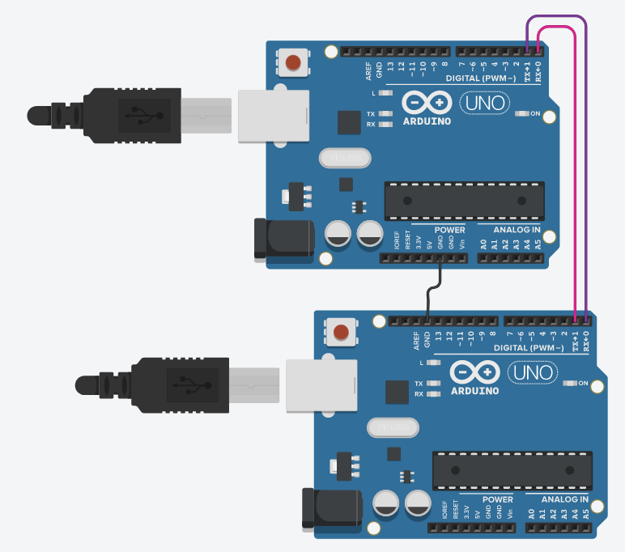

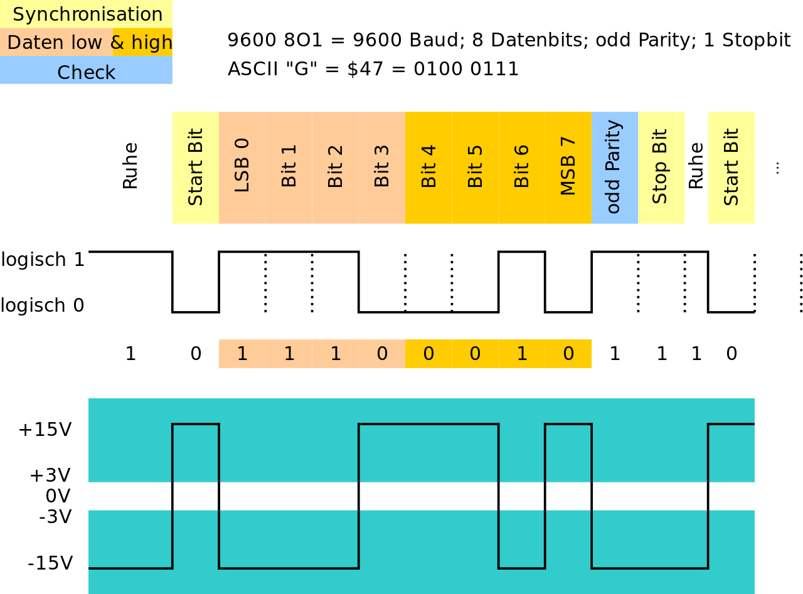<!--
style=" width: 80%;
        max-width: 600px;
        min-width: 400px;
        display: block;
        margin-left: auto;
        | 5   | `GND`            | Die Signale werden gegen diese Referenz gemessen                          |
        margin-right: auto;"
-->

> Achtung: Die Signalpegel der Abbildung beziehen sich auf eine standardkonforme RS-232-Verbindung. Beim AVR sind die Pegel hingegen TTL-konform: logische 0 = 0 V, logische 1 = 5 V. Wichtig: RS-232 verwendet **invertierte Logik** — logisch 1 entspricht einer negativen Spannung („mark", typ. −12 V), logisch 0 einer positiven Spannung („space", typ. +12 V). Ein Pegelwandler wie der MAX232 muss daher nicht nur die Spannungen anpassen, sondern auch das Signal invertieren.

Anmerkungen:

+ Aus der Telegrafie erbt UART Kommunikation den "high" Zustand im Leerlauf. Falls die Leitung unterbrochen ist, d.h. am RX-pin der Empfängerseite der Zustand dauerhaft eine logische 0 bzw. GND ist, kann der UART der Empfängerseite das detektieren und dem System melden.
+ Das Start bit und das stop bit definieren den "Data frame". Das Start bit ist immer "0", das stop bit immer "1". Der Beginn der Übertragung wird somit durch den Übergang von 1 auf 0 markiert.
+ Die Größe des Datenwortes kann zwischen 5 und 9 Bit variieren.
+ Das Paritätsbit ist eine einfache Möglichkeit, EINEN Fehler bei der Übertragung zu prüfen, ohne diesen aber korrigieren zu können.
+ Historisch kommen noch zwei Pins für die Flusskontrolle hinzu - RTS (Request to Send) und CTS (Clear to Send). Diese sollen der Synchronisation von Geräten dienen und zeigen an, ob ein Gerät bereit ist die Datenübernahme zu realisieren.

Die Datenrate wird Baud (nach dem französischen Ingenieur und Erfinder [Jean Maurice Émile Baudot](https://de.wikipedia.org/wiki/%C3%89mile_Baudot)) angegeben. Für die UART entspricht dies in _Bit pro Sekunde_ (bps). Dabei werden alle Bits (auch Start- und Stoppbit) gezählt und Lücken zwischen den Bytetransfers ignoriert. Dabei sind die spezifische Datenraten - 150, 300, 600, 1200, 2400, 4800, 9600, 19200, 38400, 57600 und 115200 Baud - üblich:

Welche Datenübertragungsraten sind damit möglich?

$$
\text{duration} = \frac{\text{bytes} \cdot  \text{bitsPerCharacter}} { \text{bitsPerSecond}}
$$

Für 32KB sind das also im `1_8_1` Format $32\cdot 1024 \cdot 10 / 9600 = 34.133 s$


Was bedeutet dies also mit Blick auf die Zeitdauer für ein Bit?

$$
9600 \text{ Baud} = 9600 \text{ Bit/s} = 960 \text{ Pakete à 1-8-1}
$$

Ein Byte wird entsprechend in 1.041ms übertragen, jeder Zustand hat eine Dauer von $0.1041 ms$. Wie können wir diese spezifische Taktung realisieren?

> Die Baudrate wird oft mit der Datenübertragungsrate verwechselt, die die Menge an übertragenen Daten je Zeitspanne in Bit je Sekunde als Bitrate angibt. Die Baudrate gibt jedoch die Anzahl der Symbole pro Zeitspanne an. Bei einer Übertragungsdauer eines Symbols von z. B. 200 Millisekunden beträgt die Baudrate 5 Baud. 

[^WikiUART]: Wikipedia, Autor Chris828, Der asynchrone serielle Datenstrom, wie ihn ein sog. CMOS-UART erzeugt (logisch 0 und 1). Das untere Diagramm zeigt die dazu invertierten Spannungspegel auf der RS-232-Schnittstelle. [Wikimedia RS232](https://de.wikipedia.org/wiki/Universal_Asynchronous_Receiver_Transmitter#/media/Datei:RS-232_timing.svg)

### UART vs RS232 vs RS485

RS232 ist ein Standard für die Umsetzung von serieller Kommunikation zwischen Geräten. Bei diesem Standard wird die elektrische Schnittstelle definiert, und es gibt Übereinkünfte über die Steckverbinder.

Der UART basiert auf TTL-Pegel mit 0V (logisch 0) und 5V (logisch 1). Im Unterschied dazu definiert die Schnittstellenspezifikation für RS-232 einen Wert von -12V bis -3V als logisch 1 und von +3 bis +12V als logisch 0. Daher muss der Signalaustausch zwischen AVR und Partnergerät invertiert werden. Für die Anpassung der Pegel und das Invertieren der Signale gibt es fertige Schnittstellenbausteine. Der bekannteste davon ist wohl der MAX232.

<!--style="width: 80%; display: block; margin-left: auto; margin-right: auto;" -->
```ascii
  ---------------+           
  Mikro-         |          +------------+
  controller     |   0-5V   | MAX232     |   -12 - 12 V     
                 |          |            |         
             Rx  +----------+            |       .---------.
             Tx  +----------+         Rx +-->     \ ••••• /    9 Poliger
             Gnd +----------+         Tx +-->      \ ••••/     D-Sub Stecker
             VCC +----------+            |          .---.
                 |          |            |         
  ---------------+          +------------+         
```

> Die digitalen Signale werden durch den UART erzeugt, müssen allerdings durch einen RS232 Transceiver-Chip auf die richtigen Pegel gebracht werden.

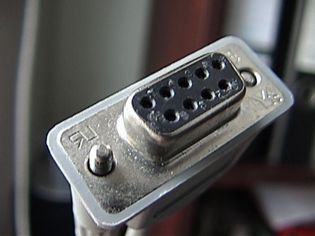

| Pin | Benennung        | Bedeutung                                                                 |
| --- | ---------------- | ------------------------------------------------------------------------- |
| 1   | `DCD`            | Data Carrier Detect                                                       |
| 2   | `RxD`  oder `Rx` | Receive Data - Empfang an Gerät 1, Sendelinie für Gerät 2, bzw. Empfänger |
| 3   | `TxD`  oder `Tx` | Transmit Data - Senden für Gerät 1, Empfang für Gerät 2 bzw. Empfänger    |
| 4   | `DTR`            | Data Terminal Ready                                                       |
| 5   | `GND`            | 0-Potential                                                               |
| 6   | `DSR`            | Data Set Ready                                                            |
| 7   | `RTS`            | Request To Send - ursprünglich: Gerät 1 möchte senden; in moderner Flow-Control oft als `RTR` (Ready To Receive) genutzt: Gerät 1 ist bereit, Daten zu empfangen |
| 8   | `CTS`            | Clear To Send - Empfänger bzw. Gerät 2 ist bereit, Daten zu empfangen     |
| 9   | `RI`             | Ring Indicator                                                            |

Die in industriellen Anwendungen am häufigsten verwendete serielle Schnittstelle ist die RS-485 (EIA-485). Gegenüber der RS-232-Schnittstelle besteht der große Vorteil darin, dass mehrere Empfänger und Sender verbunden werden können. Nativ können bis zu 32 Teilnehmer an den EIA-485-Bus angeschlossen werden.
Zudem erfolgt die Datenübertragung unter Verwendung von Differenzsignalen, was eine größere Störungssicherheit gewährleistet.

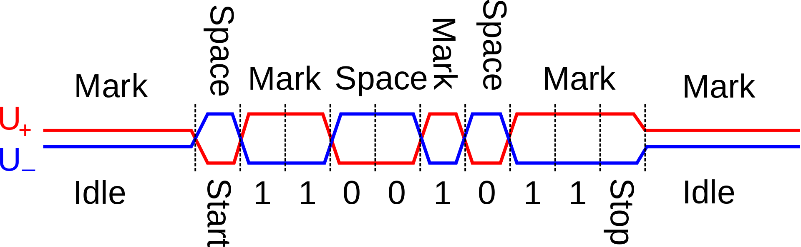

EIA-485 spezifiziert nur die elektrischen Eigenschaften des Interfaces, es definiert kein Protokoll und auch keine Steckerbelegung. Deshalb existiert keine einheitliche Pinbelegung eines EIA-485-Steckers, so dass bei Verwendung verschiedener EIA-485-Geräte immer die Dokumentation des Gerätes beachtet werden muss. Beim Profibus, der auf der EIA-485-Norm basiert, werden beispielsweise die Pins 3 und 8 von 9-poligen D-Sub-Steckern und -Dosen für die Datenleitung benutzt.

> **Für den Betrieb des 485 Busses benötigt man wiederum einen Treiberbaustein. Ein Beispielprojekt ist unter [Link](https://create.arduino.cc/projecthub/maurizfa-13216008-arthur-jogy-13216037-agha-maretha-13216095/modbus-rs-485-using-arduino-c055b5) zu finden.**

[^Wiki485]: Wikipedia, Autor Roy Vegard Ovesen, Waveform example of sending char 0xD3 by RS422/485. [Wikimedia RS232](https://commons.wikimedia.org/wiki/File:RS-485_waveform.svg)

### USART Schnittstellen des AVR

                                  {{0-1}}
********************************************************************************

> **Achtung:** Die UART Implementierung des AVR realisiert neben dem asynchronen Mode auch einen synchronen Modus, daher die Benennung U<ins>S</ins>ART.

Damit werden vier Operationskonzepte unterstützt:

+ Normal asynchronous,
+ Double Speed asynchronous,
+ Controller synchronous (im Datenblatt: _Master synchronous_) und
+ Peripheral synchronous (im Datenblatt: _Slave synchronous_) mode.

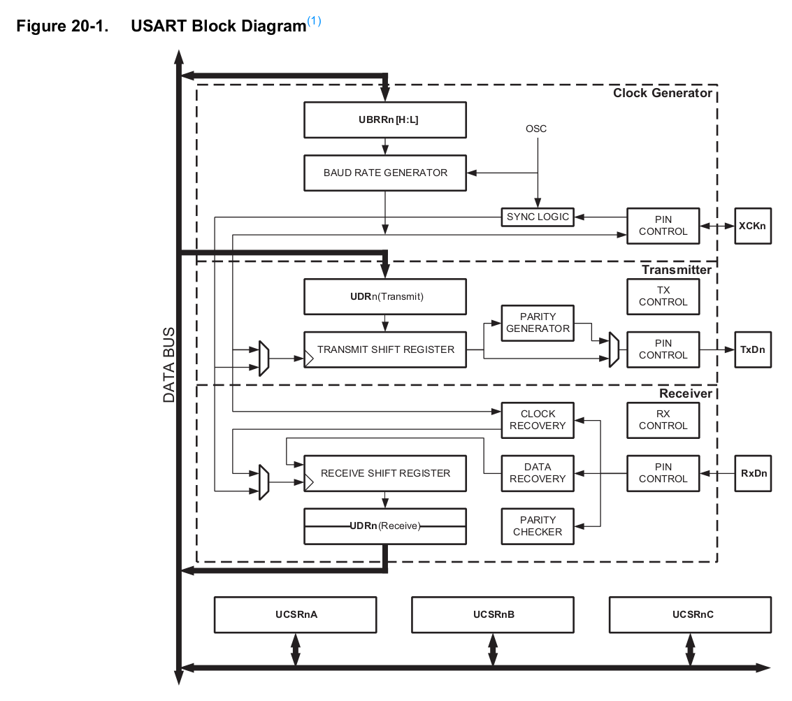

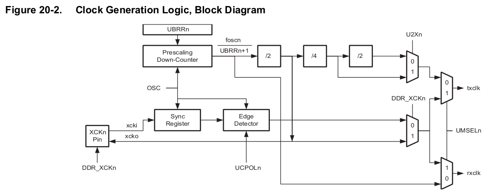

Die Zeichengröße kann als 5 bis 9 Bit gewählt werden. Die Zeichengröße kann man den Bits UCSZ01 und UCSZ00 im UCSR0C Register und dem UCSZ02 Bit im UCSR0B festlegen. Jede übertragene Einheit wird mit einem oder zwei Stoppbits abgeschlossen. Die Anzahl der Stoppbits kann mit dem Bit USBS0 im Register UCSR0C vorgegeben werden.

Optional kann jede übertragene Einheit mit einer Prüfsumme Parity versehen werden. Die Einstellungen für die Parität können mit den Bits UPM01 UPM00 im Register UCSR0C vorgenommen werden.


********************************************************************************

                                  {{1-2}}
********************************************************************************

Im Folgenden fokussieren wir die asynchrone Kommunikation. Dabei sind wir mit zwei Problemen konfrontiert:

1. Synchronisierung von Sender und Empfänger

> _The operational range of the Receiver is dependent on the mismatch between the received bit rate and the internally generated baud rate. If the Transmitter is sending frames at too fast or too slow bit rates, or the internally generated baud rate of the Receiver does not have a similar base frequency, the Receiver will not be able to synchronize the frames to the start bit._

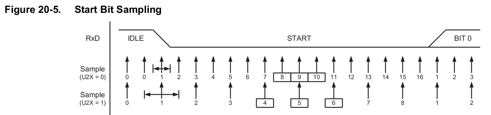

Anhand der Grafik wird die Abtastung mit 16  bzw. 8 Samples pro Bit sichtbar. Über den mittleren Werten (Kästchen) wird eine Mehrheitsentscheidung getroffen.

2. Realisierung des Taktes

Für die Darstellung des Taktes stehen wir vor einem Dilemma. Der Systemtaktgeber passt möglicherweise nicht zu Timings der vorgewählten Baudrate. Hierfür steht ein Prescaler bereit, der durch das Register `UBRRn` mit maximal 12 Bit konfiguriert wird.

$$
BAUD = \frac{f_{OSC}}{16 \cdot (UBRRn +1)}
$$

Wenn wir zum Beispiel bei einer Taktrate von 8MHz eine Übertragungsrate von 115200 Baud realisieren wollten, könnten wir zwischen den Werten 3 und 4 wählen:

$$
125000 = \frac{8.000.000}{16 \cdot (3+1)} \\
100000 = \frac{8.000.000}{16 \cdot (4+1)}
$$

Damit ergibt sich ein Fehler von +8% bzw. -13%. Eine Gesamtkalkulation findet sich zum Beispiel unter

http://ruemohr.org/~ircjunk/avr/baudcalc/avrbaudcalc-1.0.8.php?postbitrate=9600&postclock=8

********************************************************************************

[^AtMega328]: Firma Microchip, Handbuch AtMega328, http://ww1.microchip.com/downloads/en/DeviceDoc/ATmega48A-PA-88A-PA-168A-PA-328-P-DS-DS40002061A.pdf

### Verwendung des Asynchronen Modus auf dem AVR

Bei dem Versuch, zu sendende Daten zu schreiben, kann es vorkommen, dass das Datenregister noch belegt ist und nicht beschrieben werden kann. Bei dem Versuch empfangende Daten zu lesen, kann es vorkommen, dass noch keine neuen Daten verfügbar sind. In beiden Fällen muss entschieden werden, wie mit der Situation weiter zu verfahren ist.

Zwei typische Ansätze mit dem Problem umzugehen bestehen darin, den Zugriff auf die Hardware blockierend bzw. nicht-blockierend durchzuführen. Bei einer Implementierung, die den Zugriff blockierend durchführt, wird der Programmfluss so lange angehalten, bis die gewünschte Operation ausgeführt werden kann. Bei einer Implementierung, die den Zugriff nicht-blockierend durchführt, wird die gewünschte Operation verworfen und diese Tatsache im zurückgelieferten Statuscode vermerkt.

<div id="example">
<span id="simulation-time"></span>
</div>
```cpp       uart_basic.cpp
#define F_CPU 16000000UL
#include <avr/io.h>

#define MYUBBR 103 // 9600

void uart_init(void)
{
  UBRR0H = (unsigned char)(MYUBBR>>8);
  UBRR0L = (unsigned char)MYUBBR;
  UCSR0C |= (1<<UCSZ01) | (1<<UCSZ00); // Set to 8 bit
  UCSR0B |= (1<<TXEN0); // Enable transmitter
}

void uart_putchar(char c) {
   while(!(UCSR0A & (1<<UDRE0))); /* Blockierendes Schreiben, es wird gewartet, bis
                                     der Speicher frei ist */
   UDR0 = c;
}

void uart_puts (char *s)
{
    while (*s)
    {   /* so lange *s != '\0' also ungleich dem "String-Endezeichen(Terminator)" */
        uart_putchar(*s);
        s++;
    }
}

int main(void)
{
  uart_init();
  uart_puts("Hello World\n");
  while(1);
  return 0; // wird nie erreicht
}
```
@AVR8js.sketch

Das folgende Beispiel für den lesenden Zugriff nutzt die UART Schnittstelle umgekehrt, um die LED an und aus zu schalten. Leider lässt sich dieses Beispiel nicht in der Simulation ausführen, entsprechend sei auf die Umsetzung auf dem realen Controller verwiesen.

```cpp       uart_basic.cpp
#define F_CPU 16000000

#include <avr/io.h>

#define BAUD 9600
#define MYUBRR F_CPU/BAUD/16-1

volatile unsigned char sign;

ISR(USART_RX_vect)
{
  sign = UDR0;
  if (sign == 'A') PORTB |= ( 1 << PB5 );
  if (sign == 'B') PORTB &=~( 1 << PB5 );
}

void uart_init(void)
{
  UBRR0H=((MYUBRR)>>8);
  UBRR0L=MYUBRR;
  UCSR0B=(1<<RXEN0)|(1<<RXCIE0);
  UCSR0C=(1<<UCSZ00)|(1<<UCSZ01);
}

int main(void)
{
  uart_init();
  DDRB |= (1 << PB5);
  sei();
  while(1);
  return 0; // wird nie erreicht
}
```

Häufig wird eine Funktionalität benötigt, um einen String mit variablen Feldern zu senden, z. B. wenn die Anwendung ihren Status oder einen Zählerwert meldet. Die Verwendung von formatierten Strings reduziert die Anzahl der Codezeilen. Dieser Anwendungsfall folgt den folgenden Schritten:

+ Konfigurieren Sie die USART-Peripherie wie im ersten Anwendungsfall
+ Erstellen Sie einen benutzerdefinierten Stream
+ Ersetzen Sie den Standard-Ausgabestream durch den benutzerdefinierten Stream

Normalerweise werden bei der Verwendung von 'printf' die Zeichen an einen Datenstrom gesendet, der Standard-Ausgabestream genannt wird. Auf einem PC wird der Standardausgabestrom von der Funktion zur Anzeige von Zeichen auf dem Bildschirm verarbeitet. Mit dem folgenden Code wird ein benutzerdefinierter Stream erstellt, der von der USART-Sendefunktion verarbeitet wird.

vgl. Beispiel im Bereich [codeExamples](https://github.com/TUBAF-IfI-LiaScript/VL_SoftwareentwicklungEingebetteteSysteme/tree/main/codeExamples/avr) des Projektes.

## I2C

Der Inter-Integrated Circuit Bus ($I^2C$) wurde 1982 von Philips (jetzt NXP) eingeführt zur geräteinternen Kommunikation zwischen ICs in z. B. CD-Spielern und Fernsehgeräten. Die erste standardisierte Spezifikation 1.0 wurde 1992 veröffentlicht. Im April 2014 erschien V.6.

Im Unterschied zur UART-basierten Kommunikation zielt dessen Spezifikation auf den Datenaustausch zwischen multiplen Geräten.

<!--style="width: 90%; display: block; margin-left: auto; margin-right: auto;" -->
```ascii
		                 VDD
			              │
                     ┌────┴────┐
                     │         │
                  ┌──┴──┐   ┌──┴──┐         Rp: Pull-up-Widerstände
                  │ Rp  │   │ Rp  │             typ. 2,2 – 10 kΩ
                  └──┬──┘   └──┬──┘
                     │         │
       SDA  ─────────o─────────┼─────o───────────o───────────o───────
                               │     │           │           │
       SCL  ───────────────────o─────┼─────o─────┼─────o─────┼─────o─
                                     │     │     │     │     │     │
                                  ┌──┴─────┴──┐ ┌┴─────┴──┐ ┌┴─────┴──┐
                                  │ Controller│ │ Target 1│ │ Target 2│
                                  │   (µC)    │ │  (ADC)  │ │  (DAC)  │  ... weitere Targets
                                  │           │ │  0x48   │ │  0x60   │
                                  └──┬────────┘ └─┬───────┘ └─┬───────┘
                                     │            │           │
       GND ──────────────────────────o────────────o───────────o────── gemeinsame Masse
```

> Beispielhafter I²C-Bus mit einem Controller (Mikrocontroller) und zwei Targets (ADC, DAC). Beide Leitungen sind über Pull-up-Widerstände `Rp` an VDD gezogen — sämtliche Teilnehmer haben Open-Drain-Ausgänge und können die Leitungen nur aktiv nach Masse ziehen ("Wired-AND").

### Konzepte

**Elektrische Realisierung**

I2C benötigt zwei Signalleitungen, eine Takt- (SCL = Serial Clock) und eine Datenleitung (SDA = Serial Data). Beide liegen mit den Pull-up-Widerständen RP an der Versorgungsspannung VDD. Sämtliche daran angeschlossene Geräte haben Open-Collector-Ausgänge, was zusammen mit den Pull-up-Widerständen eine Wired-AND-Schaltung ergibt. Der High-Pegel soll mindestens 0,7 × VDD betragen, und der Low-Pegel soll bei höchstens 0,3 × VDD liegen. Der I2C-Bus arbeitet mit positiver Logik, d. h. ein High-Pegel auf der Datenleitung entspricht einer logischen „1“, der Low-Pegel einer „0“.

 und dem Stopp-Signal (P) werden die Datenbits $B_1$ bis $B_N$ übertragen. [^WikiI2Csignal]")

**Adressierung und Datenaustausch**

Eine Standard-I2C-Adresse ist das erste vom Controller gesendete Byte, wobei die ersten sieben Bit die eigentliche Adresse darstellen und das achte Bit (R/W-Bit) dem Target mitteilt, ob es Daten vom Controller empfangen soll (Low: Schreibzugriff) oder Daten an den Controller zu übertragen hat (High: Lesezugriff). I2C nutzt daher einen Adressraum von 7 Bit, was bis zu 112 Knoten auf einem Bus erlaubt - 16 der 128 möglichen Adressen sind für Sonderzwecke reserviert.

Jedes I²C-fähige IC hat eine (üblicherweise vom Hersteller) festgelegte Adresse, von der in der Regel eine modellabhängige Anzahl der untersten Bits (LSB) über spezielle Eingangspins des ICs individuell konfiguriert werden können.

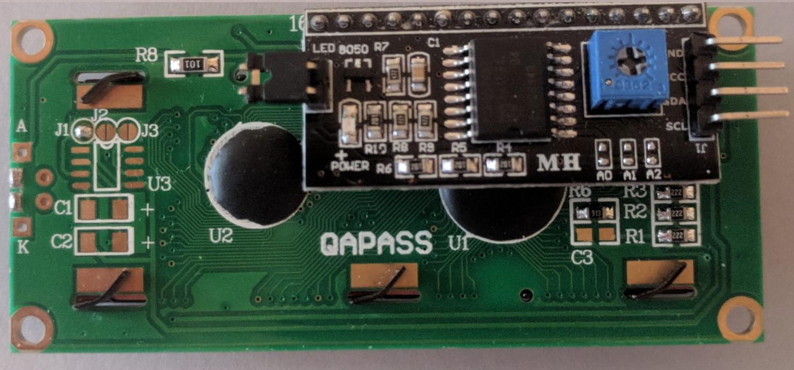

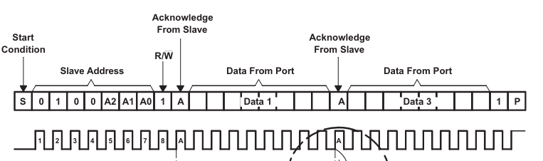

> Link auf den internen Controller des [LCD](https://www.sparkfun.com/datasheets/LCD/HD44780.pdf) / [PCF8574](https://www.ti.com/lit/ds/symlink/pcf8574.pdf)

Hierdurch wird es möglich, mehrere ICs dieses Typs am selben I2C-Bus zu betreiben, ohne dass es zu Adresskonflikten kommt. Lassen sich Adresskonflikte nicht vermeiden, so müssen die entsprechenden ICs mit getrennten I²C-Bussen angesteuert oder temporär vom Bus getrennt werden.


**Aufbau der Datenframes**

<!--style="width: 80%; display: block; margin-left: auto; margin-right: auto;" -->
```ascii

Bit                  7 / 10     1               8                    8
           +-----+------------+----+     +--------------+     +--------------+     +------+
Controller |Start| Adressframe| R/W|     | Datenframe 1 |     | Datenframe 2 |     | Stop |
           +-----+------------+----+     +--------------+     +--------------+     +------+

                                   +-----+              +-----+              +-----+
Target                             | ACK |              | ACK |              | ACK |
                                   +-----+              +-----+              +-----+
```

+ Startbedingung: Die SDA-Leitung schaltet von einem hohen Spannungspegel auf einen niedrigen Spannungspegel, bevor die SCL-Leitung von High auf Low schaltet.
+ Stop-Bedingung: Die SDA-Leitung wechselt von einem niedrigen Spannungspegel auf einen hohen Spannungspegel, nachdem die SCL-Leitung von low auf high wechselt.
+ Adressrahmen: Eine 7- oder 10-Bit-Sequenz, die für jedes Target einzigartig ist und das Target identifiziert, wenn der Controller mit ihm sprechen will.
+ Read/Write Bit: Ein einzelnes Bit, das angibt, ob der Controller Daten an das Target sendet (niedriger Spannungspegel) oder Daten von ihm anfordert (hoher Spannungspegel).
+ ACK/NACK-Bit: Auf jeden Frame einer Nachricht folgt ein Acknowledge/No-Acknowledge-Bit. Wenn ein Adressrahmen oder Datenrahmen erfolgreich empfangen wurde, wird ein ACK-Bit vom empfangenden Gerät an den Sender zurückgesendet.


Schreiben in eines der Target-Register

<!--style="width: 80%; display: block; margin-left: auto; margin-right: auto;" -->
```ascii

           +-----+------------+----+     +--------------+     +--------------+     +------+
Controller |Start| Adressframe| 0  |     | Reg. Adresse |     |    Daten     |     | Stop |
           +-----+------------+----+     +--------------+     +--------------+     +------+

                                   +-----+              +-----+              +-----+
Target                             | ACK |              | ACK |              | ACK |
                                   +-----+              +-----+              +-----+
```

Lesen aus einem der Target-Register

<!--style="width: 80%; display: block; margin-left: auto; margin-right: auto;" -->
```ascii

           +-----+------------+----+     +--------------+                    +-----+------+
Controller |Start| Adressframe| 1  |     | Reg. Adresse |                    |NACK | Stop |
           +-----+------------+----+     +--------------+                    +-----+------+

                                   +-----+              +-----+--------------+
Target                             | ACK |              | ACK |    Daten     |
                                   +-----+              +-----+--------------+
```

Die Zahl der übermittelten Daten kann beliebig erweitert werden.

**Vorteile / Nachteile **

Pros

+ verwendet nur zwei Drähte
+ unterstützt mehrere Controller und mehrere Targets (Multi-Controller-Modus)
+ ACK/NACK-Bit gibt Bestätigung, dass jeder Frame erfolgreich übertragen wurde
+ Hardware ist weniger kompliziert als bei UARTs
+ weit verbreitetes Protokoll

Cons

- Langsamere Datenübertragungsrate als SPI
- Die Größe des Datenrahmens ist auf 8 Bit begrenzt
- Kompliziertere Hardware zur Implementierung als SPI erforderlich

[^PCF8574]: Datenblatt Texas Instruments, [TI_PCF8574](https://www.ti.com/lit/ds/symlink/pcf8574.pdf?ts=1621388532534&ref_url=https%253A%252F%252Fwww.google.com%252F)

[^WikiI2Csignal]: Wikipedia, Autor Marcin Floryan,  Sample Inter-Integrated Circuit (I²C) schematic with one master (a microcontroller) and three slave nodes (an analog-to-digital converter (ADC), a digital-to-analog converter (DAC), and a microcontroller) [Wikimedia I2C](https://commons.wikimedia.org/wiki/File:I2C.svg)

### TWI Implementierung im AVR

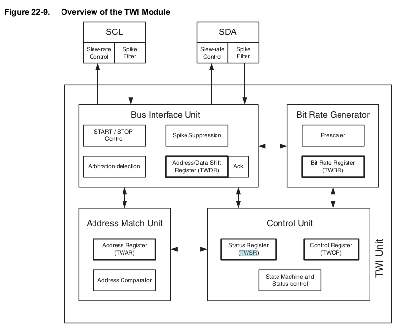


| Register | Bedeutung             | Bemerkung                  |
| -------- | --------------------- | -------------------------- |
| TWCR     | TWI Control Register  |                            |
| TWBR     | TWI Bit Rate Register |                            |
| TWSR     | TWI Status Register   |                            |
| TWDR     | TWI Data Register     |                            |
| TWAR     | TWI Address Register  | nur im Target Mode relevant (Registername stammt aus älterer AVR-Doku) |

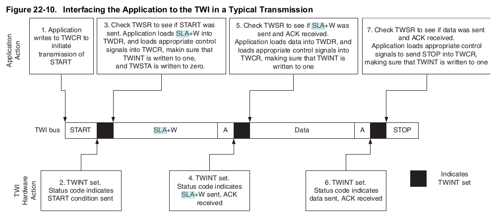

```c    I2C_basics.c

/* Define bit rate */
#define SCL_CLK 100000L
#define F_CPU 16000000UL
#define BITRATE(TWSR)	((F_CPU/SCL_CLK)-16)/(2*pow(4,(TWSR&((1<<TWPS0)|(1<<TWPS1)))))

void I2C_Init()
{
    TWBR = BITRATE(TWSR=0x00);	
}

uint8_t I2C_Start(char write_address)
{
    uint8_t status;	                     	
    TWCR=(1<<TWSTA)|(1<<TWEN)|(1<<TWINT); /* Enable TWI, generate START */
    while(!(TWCR&(1<<TWINT)));          	/* Wait until TWI finish its current job */
    status=TWSR & 0xF8;		                /* Read TWI status register */
    if(status!=0x08)		                  /* Check whether START transmitted or not? */
       return 0;		                     	/* Return 0 to indicate start condition fail */
    TWDR=write_address;	                	/* Write SLA+W in TWI data register */
    TWCR=(1<<TWEN)|(1<<TWINT);           	/* Enable TWI & clear interrupt flag */
    while(!(TWCR&(1<<TWINT)));	          /* Wait until TWI finish its current job */
    status=TWSR & 0xF8;	                 	/* Read TWI status register */
    if(status==0x18)		                  /* Check for SLA+W transmitted &ack received */
       return 1;		                      /* Return 1 to indicate ack received */
    if(status==0x20)	                  	/* Check for SLA+W transmitted &nack received */
       return 2;		                      /* Return 2 to indicate nack received */
    else
       return 3;			                    /* Else return 3 to indicate SLA+W failed */
}

uint8_t I2C_Write(char data)
{
	uint8_t status;										     	
	TWDR = data;										      	/* Copy data in TWI data register */
	TWCR = (1<<TWEN)|(1<<TWINT);				  	/* Enable TWI and clear interrupt flag */
	while (!(TWCR & (1<<TWINT)));					  /* Wait until TWI finish its current job (Write operation) */
	status = TWSR & 0xF8;									  /* Read TWI status register with masking lower three bits */
	if (status == 0x28)										  /* Check whether data transmitted & ack received or not? */
	  return 0;											       	/* If yes then return 0 to indicate ack received */
	if (status == 0x30)										  /* Check whether data transmitted & nack received or not? */
	  return 1;												      /* If yes then return 1 to indicate nack received */
	else
	  return 2;											        /* Else return 2 to indicate data transmission failed */
}
```

**Warum gerade `0x28` und `0x30`? — Die TWI-Statuscode-Tabelle**

Die im Code geprüften "magischen" Werte sind keine willkürliche Wahl, sondern stammen aus einer **fest verdrahteten Zustandsmaschine** im TWI-Modul des AVR. Nach jeder abgeschlossenen Aktion auf dem Bus (Start gesendet, Adresse gesendet, Datenbyte gesendet, …) schreibt die Hardware einen 5-Bit-Statuscode in die oberen Bits von `TWSR`. Die unteren drei Bits sind Prescaler-Konfigurationsbits und werden daher mit `& 0xF8` ausmaskiert.

Die Statuscodes sind im ATmega328-Datenblatt (Abschnitt _Two-Wire Serial Interface_, Tabellen 22-2 bis 22-4) tabelliert — der Code vergleicht also gegen **Tabellenwerte aus dem Datenblatt**, nicht gegen ein berechnetes ACK-Bit.

Die für den Controller-Transmit-Modus wichtigsten Codes:

| `TWSR & 0xF8` | Ereignis                                                       |
| ------------- | -------------------------------------------------------------- |
| `0x08`        | START gesendet                                                 |
| `0x10`        | Repeated START gesendet                                        |
| `0x18`        | SLA+W gesendet, **ACK** empfangen                              |
| `0x20`        | SLA+W gesendet, **NACK** empfangen                             |
| **`0x28`**    | **Datenbyte gesendet, ACK empfangen** ← Erfolgsfall in `I2C_Write` |
| **`0x30`**    | **Datenbyte gesendet, NACK empfangen**                         |
| `0x38`        | Arbitrierung verloren (Multi-Controller-Konflikt)              |

Damit erklärt sich die Verzweigung in `I2C_Write`:

+ `0x28` → Target hat das Byte bestätigt — alles in Ordnung.
+ `0x30` → Target hat **nicht** bestätigt — typische Ursachen: Pufferüberlauf, Adresse stimmt zwar, das Target verweigert aber den konkreten Wert, oder Verdrahtungsproblem.
+ alles andere → echter Fehler (z. B. Arbitrierungsverlust `0x38`, Bus-Fehler `0x00`).

> **Merke:** Ein NACK ist nicht automatisch ein Fehler. Beim **Lesen** vom Target sendet der Controller das _letzte_ erwartete Byte sogar **absichtlich mit NACK** — das ist das vereinbarte Signal an das Target, dass keine weiteren Bytes mehr angefordert werden.

!?[alt-text](https://www.youtube.com/watch?v=PjsK6uxUZeA)

[^AtMega328]: Firma Microchip, Handbuch AtMega328, http://ww1.microchip.com/downloads/en/DeviceDoc/ATmega48A-PA-88A-PA-168A-PA-328-P-DS-DS40002061A.pdf

### Anwendung

In unserer Bastelbox befinden sich 3 Komponenten mit einem I2C Interface:

+ Inertiale Messeinheit MPU 6050
+ Echtzeituhr
+ LCD Display

## SPI

Das Serial Peripheral Interface (SPI) ist ein im Jahr 1987 von Susan C. Hill und anderen beim Halbleiterhersteller Motorola (heute NXP Semiconductors) entwickeltes synchron arbeitendes Bus-System, das ähnlich einem umlaufenden Schieberegister arbeitet.

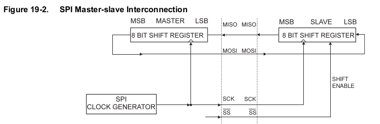

| Implementierung                                                                                         | Bedeutung                                                |
| ------------------------------------------------------------------------------------------------------- | -------------------------------------------------------- |
| 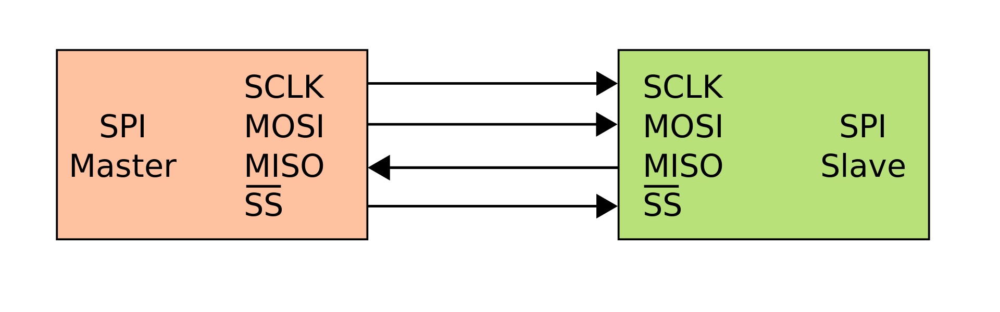                      | Einfacher SPI-Bus mit einem SPI-Controller und Peripheral |
| 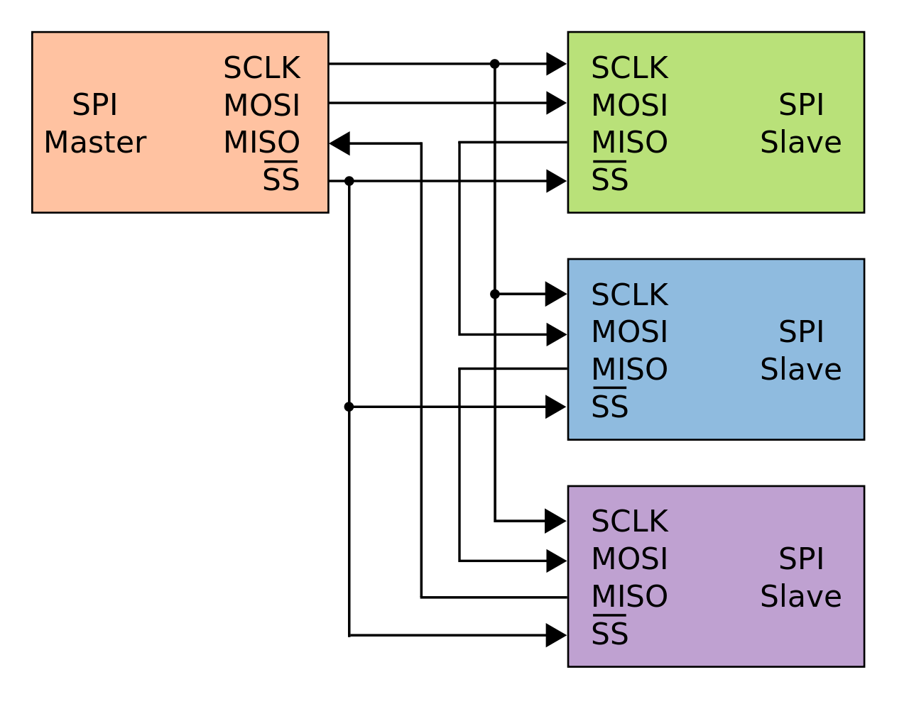 | SPI-Verbindung durch Kaskadierung der Peripherals (Daisy Chain) |
| 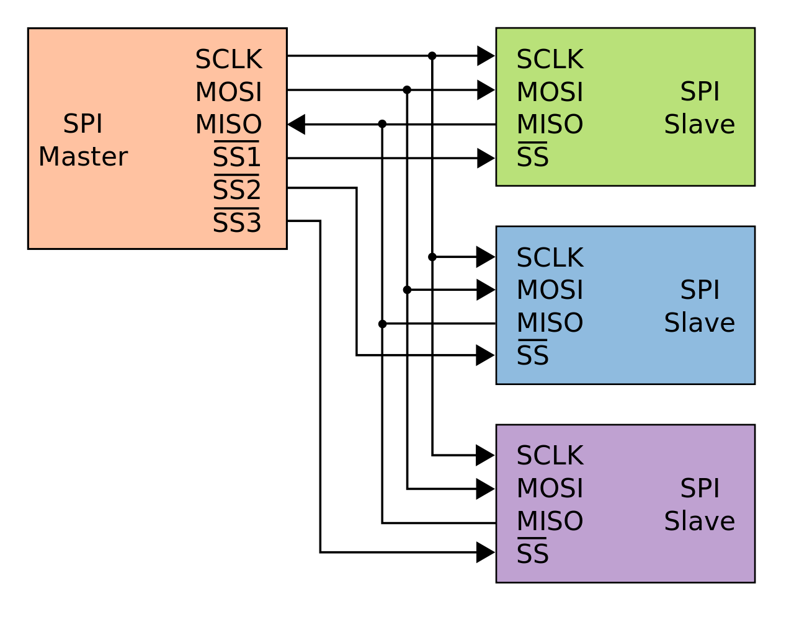               | SPI-Sternverbindung                                      |

> **Anmerkung zur Signalbenennung:** Die ursprünglichen Bezeichner `MOSI` (Master Out / Slave In), `MISO` (Master In / Slave Out) und `SS` (Slave Select) werden in aktueller Literatur zunehmend durch `SDO`/`SDI` bzw. `COPI`/`CIPO` (_Controller Out Peripheral In_ / _Controller In Peripheral Out_) und `CS` (Chip Select) ersetzt. Da der ATmega328 in seinem Datenblatt und in den Registernamen (`MSTR` im `SPCR`) weiterhin die alten Begriffe verwendet, mischen wir die Notation an Stellen, an denen wir direkt auf das Datenblatt verweisen.

An den Bus können so viele Teilnehmer angeschlossen werden, wie Chip-Select-Leitungen vorhanden sind, zuzüglich des genau einen Controllers, der seinerseits das Clock-Signal an SCK erzeugt. Der Controller legt mit der Leitung „Chip Select" fest, mit welchem Peripheral er kommunizieren will. Wird sie gegen Masse gezogen, ist das jeweilige Peripheral aktiv und „lauscht" an MOSI/COPI, bzw. legt seine Daten im Takt von SCK an MISO/CIPO. In jedem Taktzyklus wird gleichzeitig ein Bit vom Controller zum Peripheral und ein anderes Bit vom Peripheral zum Controller transportiert — SPI ist damit nativ Full-Duplex.

### Taktphase und Taktpolarität — die vier SPI-Modi

Im Unterschied zu I²C besitzt SPI kein protokollarisch festgelegtes Taktverhalten. Stattdessen muss man zwischen Controller und Peripheral abstimmen, **(1) in welchem Ruhezustand SCK liegt** und **(2) auf welcher Flanke die Daten gültig sind**. Dafür gibt es zwei Parameter:

+ **CPOL** (Clock Polarity) — Ruhezustand der Taktleitung
  - `CPOL = 0`: SCK ist im Leerlauf **Low**
  - `CPOL = 1`: SCK ist im Leerlauf **High**
+ **CPHA** (Clock Phase) — auf welcher Flanke gesampelt wird
  - `CPHA = 0`: Daten werden auf der **ersten** (führenden) Flanke übernommen
  - `CPHA = 1`: Daten werden auf der **zweiten** (nachlaufenden) Flanke übernommen

Daraus ergeben sich vier Kombinationen, die als _SPI-Modus 0…3_ bezeichnet werden:

| Modus | CPOL | CPHA | SCK-Ruhezustand | Daten gültig auf       | Verwendung (typisch)                                       |
| ----- | ---- | ---- | --------------- | ---------------------- | ---------------------------------------------------------- |
| 0     | 0    | 0    | Low             | steigender Flanke      | **De-facto-Standard** — SD-Karten, viele EEPROMs, Sensoren |
| 1     | 0    | 1    | Low             | fallender Flanke       | seltener, z. B. bestimmte ADCs                             |
| 2     | 1    | 0    | High            | fallender Flanke       | seltener                                                   |
| 3     | 1    | 1    | High            | steigender Flanke      | u. a. einige TI-DSPs, manche RF-Module                     |

> **Praxisnotiz:** Eine falsche Modus-Wahl ist die häufigste Ursache stummer SPI-Fehler: der Bus läuft, die Bitfolge passt formal — aber Sender und Empfänger einigen sich nicht auf den Sample-Zeitpunkt, und es kommen scheinbar zufällige Werte an. **Immer im Datenblatt des Peripherals nachsehen** und mit den Bits `CPOL` und `CPHA` im Register `SPCR` (ATmega328: Seite 173) entsprechend setzen.

[^AtMega328]: Firma Microchip, Handbuch AtMega328, http://ww1.microchip.com/downloads/en/DeviceDoc/ATmega48A-PA-88A-PA-168A-PA-328-P-DS-DS40002061A.pdf

[^WikipdeiaSPI]: Wikipedia, Autor en:User:Cburnett, [Link](https://de.wikipedia.org/wiki/Serial_Peripheral_Interface)

### Umsetzung im AVR

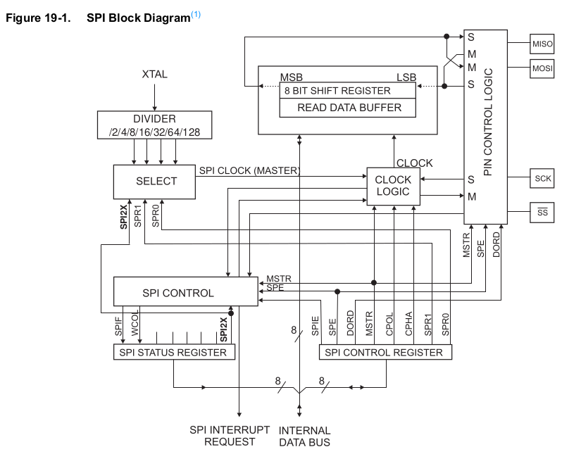

[^AtMega328]: Firma Microchip, Handbuch AtMega328, http://ww1.microchip.com/downloads/en/DeviceDoc/ATmega48A-PA-88A-PA-168A-PA-328-P-DS-DS40002061A.pdf

Einen Überblick zur Verwendung der SPI Kommunikation liefert das Tutorial [AVR151: Setup and Use of the SPI](https://ww1.microchip.com/downloads/en/AppNotes/Atmel-2585-Setup-and-Use-of-the-SPI_ApplicationNote_AVR151.pdf)

## CAN Bus

Geschichte
---------------------

* Entwicklung begann 1981 (Fertigungstechnik), 1983 begann die Weiterentwicklung für Kraftfahrzeuge
* Daimler nutzt erste Serienanwendung 1991
* 1987 stellt Bosch das Controller-Area-Network vor
* Jahrtausendwende bringt Weiterentwicklungen: Subsystem LIN (Local Interconnect Network)
* Weiterentwicklung 2012 mit vergrößertem Datenfeld auf 64 Byte (urspr. 8) - CAN FD

### Konzept 

Das "Can-Bus-Kabel" besteht aus zwei ineinander verdrehten Drähten. Eine gute Abschirmung ist nicht zwingend notwendig. Die Impedanz des Kabels muss laut ISO im Bereich zwischen 100–130 Ohm liegen.

Zusätzlich müssen an den Enden Abschlusswiderstände von 120 Ohm angebracht sein. Solche "line terminations" sind keine Besonderheit des CAN-Bus und lassen sich über elektrotechnische Phänomene erklären.

 - Autor Stefan-Xp, available at: https://commons.wikimedia.org/wiki/File:CAN-Bus_Elektrische_Zweidrahtleitung.svg")

Bei der CAN-Übertragung heißt die logische 1 "rezessiv", die logische 0 "dominant", wobei der rezessive Zustand der Ruhezustand ist. Wird eine logische 0 gesendet, wechselt CANH auf ein höheres Spannungsniveau, CANL auf ein niedrigeres. 


Verbreitete CAN-Bus-Geschwindigkeiten sind 125kbit/s (Lowspeed), 250kbit/s, 500kbit/s und 1Mbit/s (Highspeed). Dabei wird eine Kabellänge von bis zu 40m betrachtet.

### Nachrichtenpakete

Es gibt vier verschiedene Arten von Frames:

+ Daten-Frame, dient dem Transport von Daten
+ Remote-Frame, dient der Anforderung eines Daten-Frames von einem anderen Teilnehmer
+ Error-Frame, signalisiert allen Teilnehmern eine erkannte Fehlerbedingung in der Übertragung
+ Overload-Frame, dient als Zwangspause zwischen Daten- und Remote-Frames

Wir fokussieren uns an dieser Stelle auf den Datenframe:


<!-- data-type="none" -->
| Feld            | Größe        | Bedeutung                             |
| --------------- | ------------ | ------------------------------------- |
| Start           | 1 bit        | dominant, zur Synchronisation         |
| Identifier      | 11 bits      | Prioritätenübermittlung               |
| RTR             | 1 bit        | Anforderung (dominant) / Senden       |
| IDE             | 1 bit        | Identifier Extension (CAN2.0 A / B)   |
| r0              | 1 bit        | "reserviert", in KFZ ungenutzt        |            
| DLC             | 4 bits       | data length code                      |
| DATA            | 64 bit (max) | 1 - 8 Byte                            |
| CRC             | 15 bits      | 14 Fehlererkennungsbits, 1 Delimiter  |
| ACK             | 2 bits       | 1 Acknowledge, 1 Delimiter            |
| EOF             | 7 bits       | end of field, rezessiv                |
| IFS             | 3 / 7 bits   | rezessiv, Puffer-Feld!                | 

### Fehlererkennung

Das CAN-Protokoll beinhaltet **fünf** kombinierte Fehlerüberprüfungsmethoden — **drei** auf "Nachrichten-Level" und **zwei** auf "Bit-Level". Sobald **irgendein** Teilnehmer einen Fehler erkennt, sendet er sofort einen ***Error-Frame*** (6 dominante Bits — eine bewusste Verletzung des Bit-Stuffings), wodurch **alle anderen Knoten** den Fehler ebenfalls erkennen. Die laufende Nachricht wird ungültig und der Sender wiederholt sie automatisch.

**1. Bit-Monitoring (Bit-Level, vom Sender)**

Jeder sendende Knoten liest **gleichzeitig die Leitung mit, die er gerade selbst treibt**. Stimmt der gelesene Pegel nicht mit dem gesendeten überein, liegt ein Bitfehler vor. Ausnahme: Während der Arbitrierungsphase ist "dominant gewinnt rezessiv" normales Verhalten und kein Fehler.

> Erkennt vor allem lokale Treiberdefekte und Leitungsfehler in unmittelbarer Sender-Nähe.

**2. Bit-Stuffing-Verletzung (Bit-Level, vom Empfänger)**

CAN nutzt **NRZ-Codierung** — bei langen Folgen gleicher Bits fehlen die Pegelwechsel, die die Empfänger zur Bit-Takt-Synchronisation brauchen. Lösung: Nach **fünf gleichen Bits in Folge** schiebt der Sender automatisch ein **invertiertes Stopf-Bit** ein. Der Empfänger entfernt es beim Lesen wieder.

**3. Cyclic Redundancy Check (Nachrichten-Level, vom Empfänger)**

Vor dem CRC-Delimiter überträgt der Sender eine **15-Bit-Prüfsumme** über alle vorhergehenden Bits (ohne Stopf-Bits), berechnet mit dem Polynom $x^{15} + x^{14} + x^{10} + x^8 + x^7 + x^4 + x^3 + 1$. Jeder Empfänger berechnet die CRC selbst nach und vergleicht.

> Erkennt: bis zu 5 zufällig verteilte Einzelbitfehler sicher, alle Bitfehler mit ungerader Anzahl, alle Burst-Fehler ≤ 15 Bit Länge.

**4. Frame-Check (Nachrichten-Level, vom Empfänger)**

Bestimmte Bits an festen Positionen im Frame **müssen** vordefinierte Werte haben:

+ CRC-Delimiter — muss rezessiv sein
+ ACK-Delimiter — muss rezessiv sein
+ End-of-Frame — muss aus 7 rezessiven Bits bestehen

Findet ein Empfänger an einer dieser Stellen den falschen Pegel, ist der Frame strukturell defekt.

**5. ACK-Fehler (Nachrichten-Level, vom Sender)**

Der ACK-Mechanismus von CAN ist konzeptionell anders als bei I²C — er ist **kollektiv und broadcast-artig**:

> CAN kennt **keine Empfänger-Adressen** — Nachrichten sind broadcast und werden über den Identifier _inhaltlich_ adressiert (also nicht "an Knoten X", sondern "es ist die Motordrehzahl"). Der ACK sagt daher nur "irgendwer hat zugehört", nicht "der gewünschte Empfänger hat empfangen". Bleibt der ACK-Slot rezessiv, weiß der Sender: niemand am Bus ist empfangsbereit.

**Wer erkennt was?**

| Mechanismus       | Ebene       | Wer erkennt?     | Erkennt vor allem …                  |
| ----------------- | ----------- | ---------------- | ------------------------------------ |
| Bit-Monitoring    | Bit         | **Sender**       | Treiberfehler, lokale Leitungsfehler |
| Bit-Stuffing      | Bit         | **Empfänger**    | einzelne Bit-Verfälschungen          |
| CRC               | Nachricht   | **Empfänger**    | Mehrbit-Fehler, Burst-Fehler         |
| Frame-Check       | Nachricht   | **Empfänger**    | Format-/Struktur-Fehler              |
| ACK-Fehler        | Nachricht   | **Sender**       | "Niemand am Bus hört zu"             |

Nach Spezifikation erkennt CAN:

+ **alle** Einzelbitfehler
+ **alle** zwei nicht-benachbarten Bitfehler
+ **alle** Burst-Fehler ≤ 15 Bit
+ Restfehlerwahrscheinlichkeit insgesamt $< 4{,}7 \cdot 10^{-11}$ pro Frame

Bei 1 Mbit/s Dauerbetrieb entspricht das einem statistisch unerkannten Fehler etwa **alle 1000 Jahre**.

## Ausblick und Vergleich

<!-- data-type="none" -->
|                       | UART        | I2C            | SPI                       | CAN                  |
| --------------------- | ----------- | -------------- | ------------------------- | -------------------- |
| Pins                  | RxD, TxD    | SDA, SCL       | SCLK, MOSI, MISO, CS      | CANH, CANL           |
| max. Datenrate        | ~1 Mbit/s   | 3,4 Mbit/s (High-Speed Mode); 5 Mbit/s (Ultra-Fast) | typ. 10–50 Mbit/s, MCU-abhängig | 1 Mbit/s (Classic) / 8 Mbit/s (FD-Daten) |
| Kommunikationsmodus   | asynchron   | synchron       | synchron                  | asynchron (NRZ + Bit-Stuffing) |
| Kommunikationspartner | $=2$        | $2<=x<=112$*   | $>=2$                     | $2<=x<=\sim110$      |
| Controller            | -           | $>=1$          | $>=1$                     | -                    |
| Duplex                | Full Duplex | Half Duplex    | Full Duplex               | Half Duplex          |
| Reichweite (typ.)     | wenige m    | < 1 m (on-board) | < 1 m (on-board)        | bis 40 m bei 1 Mbit/s |
| Fehlererkennung       | optional Parität | ACK/NACK pro Frame | keine (anwendungsabhängig) | CRC + 5-fache Prüfung |

*I2C hat mittlerweile eine 10-Bit-Adressversion, wobei 7-Bit- und 10-Bit-Targets „mischbar" sind: [I2C-Adressbit-Versionen](https://www.thebackshed.com/forum/uploads/BobD/2015-04-23_130513_I2C_Slave_Addressing.pdf)

### Weiterentwicklungen und benachbarte Bussysteme

Die in dieser Vorlesung behandelten Protokolle decken den Kernbestand klassischer Mikrocontroller-Kommunikation ab. In aktueller Hardware finden sich zunehmend Erweiterungen, die Sie beim Blick in moderne Datenblätter (z. B. STM32H7, ESP32-S3, NXP i.MX RT) antreffen werden:

+ **CAN FD** (_Flexible Data Rate_, ISO 11898-1:2015) — Erweiterung des klassischen CAN-Frames auf bis zu **64 Byte Nutzdaten** (statt 8) und höhere Bitraten in der Datenphase (typ. 2–8 Mbit/s). Arbitrierung bleibt bei 1 Mbit/s. Heute in nahezu allen neuen Fahrzeug-Steuergeräten Standard.

+ **CAN XL** (CiA 610, 2024) — nächste Stufe: bis zu **2048 Byte Nutzdaten**, bis zu 20 Mbit/s, mit Service-Data-Unit-Typ für IP-/Ethernet-Tunneling. Adressraum auf 11 Bit Prioritäts-ID + 32 Bit „Acceptance Field" erweitert. Ziel: zonale Architekturen im Automobil, Übergang zu Automotive Ethernet.

+ **I3C** (MIPI Alliance, seit 2017) — Rückwärtskompatibler Nachfolger von I²C auf denselben zwei Leitungen, aber mit:
  - bis zu **12,5 Mbit/s** im SDR-Modus (HDR-Modi entsprechend mehr),
  - dynamischer Adresszuweisung statt fester 7-Bit-Adressen,
  - In-Band-Interrupts (kein zusätzlicher INT-Pin mehr nötig),
  - Hot-Join für später hinzukommende Teilnehmer.
  
  Treibend ist die Smartphone-Sensorik; zunehmend auch in MCUs (z. B. STM32U5, NXP i.MX 95) verfügbar.

+ **LIN** (Local Interconnect Network, ISO 17987) — kostengünstiger Single-Wire-Subbus für unkritische KFZ-Komfortfunktionen (Fensterheber, Spiegel), typisch unter einem CAN-Gateway aufgehängt. 20 kbit/s, ein Controller, bis zu 16 Responder.

+ **Automotive Ethernet** (100BASE-T1 / 1000BASE-T1) — paarweise differentielle Single-Pair-Verkabelung; ersetzt zunehmend Hochlast-Domänen, in denen klassischer CAN nicht mehr ausreicht (Kamera, Fahrerassistenz).

Drahtlose Sensornetze (BLE, Zigbee, Thread, LoRa, ESP-NOW) bleiben in der Veranstaltung unberücksichtigt, sind aber für moderne IoT-Anwendungen mindestens ebenso relevant — wir streifen sie ggf. im Zusammenhang mit dem ESP32-S3 in [14_ESP32S3.md](14_ESP32S3.md).
