<!--
author:   Sebastian Zug, Karl Fessel & Andrè Dietrich
email:    sebastian.zug@informatik.tu-freiberg.de

version:  1.0.0
language: de
narrator: Deutsch Female

import:  https://raw.githubusercontent.com/liascript-templates/plantUML/master/README.md
         https://github.com/LiaTemplates/AVR8js/main/README.md
         https://github.com/LiaTemplates/Pyodide

icon: https://upload.wikimedia.org/wikipedia/commons/d/de/Logo_TU_Bergakademie_Freiberg.svg
-->


[](https://liascript.github.io/course/?https://github.com/TUBAF-IfI-LiaScript/VL_DigitaleSysteme/main/lectures/06_Kommunikation.md#1)


# Kommunkation

| Parameter                | Kursinformationen                                                                                                                                                                    |
| ------------------------ | ------------------------------------------------------------------------------------------------------------------------------------------------------------------------------------ |
| **Veranstaltung:**       | `Vorlesung Digitale Systeme`                                                                                                                                                      |
| **Semester**             | `Sommersemester 2021`                                                                                                                                                                |
| **Hochschule:**          | `Technische Universität Freiberg`                                                                                                                                                    |
| **Inhalte:**             | `Grundlegende Kommunkationskonzepte`                                                                                            |
| **Link auf den GitHub:** | [https://github.com/TUBAF-IfI-LiaScript/VL_DigitaleSysteme/blob/main/lectures/06_Kommunikation.md](https://github.com/TUBAF-IfI-LiaScript/VL_DigitaleSysteme/blob/main/lectures/06_Kommunikation.md) |
| **Autoren**              | @author                                                                                                                                                                              |


---

## Ausgangspunkt

                    {{0-1}}
********************************************************************************

Für die Organisation von Multiprocessor-Anwendungen aber auch das Debugging und die Nutzerinteraktion benötigen wir Kommunkationskonzepte, die den Datenaustausch ermöglichen.

```cpp       uart.cpp
int thisByte = 33;

void setup() {
  Serial.begin(9600);
  Serial.print("[Debug] Wert von thisByte: ");
  Serial.println(thisByte);
}

void loop() {
}
```
@AVR8js.sketch

Im Rahmen der Veranstaltung wollen wir drei Kommunikationsprotokolle, die durch den AVR unterstützt werden, näher betrachten:

* UART - Universal Asynchronous Receiver Transmitter
* I2C - Inter-Integrated Circuit (in der "Atmel Welt" als _Two Wire Interface_ (TWI) bezeichnet)
* SPI - Serial Perepherial Interface

> **Merke** `UART` beschreibt eine Schnittstelle während `I2C` und `SPI` konkrete Protokolldefinitionen darstellen.

Alle drei Schnittstellen/Protokolle sind auf die serielle Kommunikation von Daten ausgerichtet!

********************************************************************************

                                  {{1-2}}
********************************************************************************

**Beispiele Paralleler Datenaustausch - Zugriff Externen SRAM**

Ein paralleler Austausch von 8Bit breiten Daten ist für die AVRs zum Beispiel im Zusammenhang mit der Adressierung von externem Arbeitsspeicher vorgesehen.

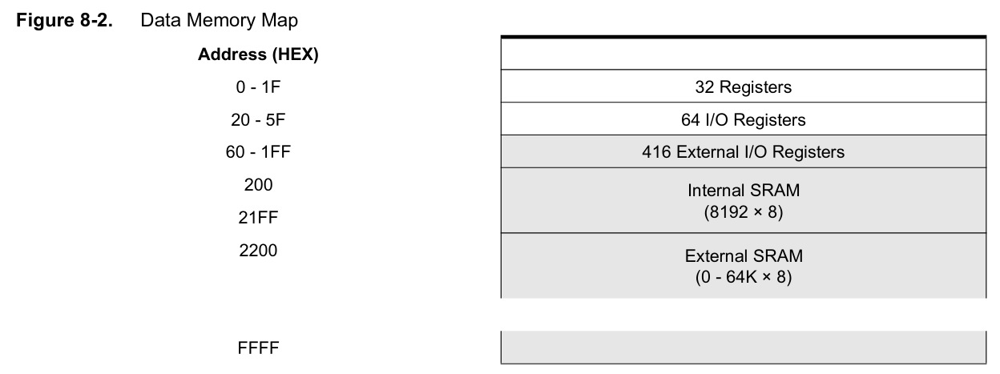

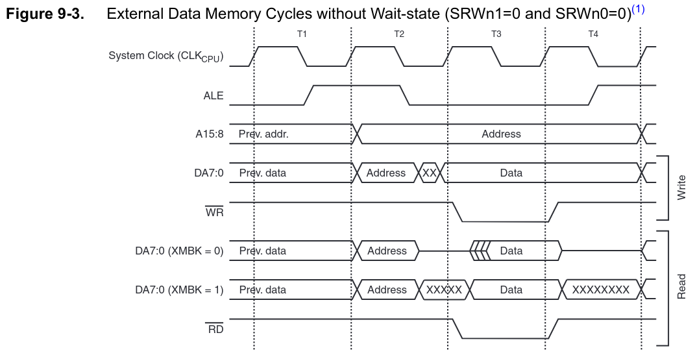

**Beispiele Paralleler Datenaustausch - Spezifische Aktoren**

Der CD4543 Baustein dient der Ansteuerung von 7-Segment-Anzeigen. Mit dem Dekodieren einer 4-Bit Zahlendarstellung auf die zugehörigen Steuerleitungen werden 3 Pins eingespart. Vergleichen Sie die Schaltung mit der in Vorlesung 4 hergeleiteten Lösung.


********************************************************************************

                                  {{2-3}}
********************************************************************************

Unterscheidungsmerkmale:

+ Zahl der Kommunikationspartner im System (1:1; 1:n, n:m)
+ Rolle für Teilnehmer (Master/Slave)
+ Übertragungsmodus (unidirektional, bidirektional)
+ Synchrone vs. asynchrone Kommunikation  
+ Kommunikationsgeschwindigkeit
+ Zahl der notwendigen elektrischen Verknüpfungen
+ Maximale Übertragungslänge

********************************************************************************

[^TexasInstruments]: Texas Instruments, CMOS BCD-to-Seven-Segement Latch/Decoder/Driver, [Link](https://www.ti.com/lit/ds/symlink/cd4543b.pdf?ts=1612176181441&ref_url=https%253A%252F%252Fwww.google.com%252F)

[^ATmega640]: Firma Microchip, ATmega640/V-1280/V-1281/V-2560/V-2561/V Data Sheet, [Link](https://ww1.microchip.com/downloads/en/DeviceDoc/ATmega640-1280-1281-2560-2561-Datasheet-DS40002211A.pdf)

## Serielle Schnittstelle

Die serielle Schnittstelle ist eine Bezeichnung für eine Übertragungsmechanismus zur Datenübertragung zwischen zwei Geräten, bei denen einzelne Bits zeitlich nacheinander ausgetauscht werden. Die Bezeichnung bezieht sich in der umgangsprachlichen Verwendung:

+ das Wirkprinzip generell, das dann verschiedenste Kommunikationsprotokoll meinen kann (CAN, I2C, usw.) oder
+ die als EIA-RS-232 bezeichnete Schnittstellendefinition oder
+ die auf dem Mikrocontroller zugehörigen Bauteile der UART.

Auf der PC Seite sind RS-232 oder RS-485 jedoch durch die universellere USB-Schnittstelle ersetzt worden. Die USB-Schnittstelle arbeitet zwar ebenfalls seriell, ist aber umgangssprachlich meist nicht gemeint, wenn man von "der seriellen Schnittstelle" redet.

Serielle Schnittstellen unterscheiden durch:

+ den verwendeten Steckverbinder
+ die elektrischen Übertragungsparameter,
+ die Methoden zur Übertragungssteuerung und Datenflusskontrolle sowie
+ die Synchronisationstechnik.

### Implementierung

Damit UART-Baugruppen kommunizieren können, müssen die Empfangsleitung (Rx) der einen und die Sendungsleitung (Tx) der anderen Baugruppe am Stecker gegenüberstehen. Damit können parallel in beiden Richtungen Informationen ausgetauscht werden.

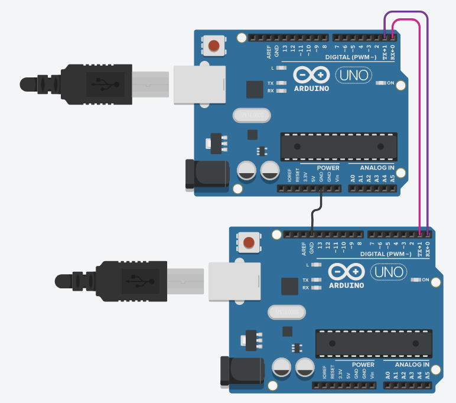

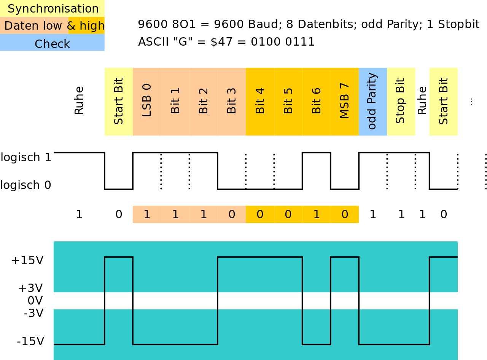<!--
style=" width: 80%;
        max-width: 600px;
        min-width: 400px;
        display: block;
        margin-left: auto;
        margin-right: auto;"
-->

Anmerkungen:

+ Aus der Telegrafie erbt UART Kommunikation den "high" Zustand im Leerlauf. Falls die Leitung unterbrochen ist, d.h. am RX-pin der Empfängerseite der Zustand dauerhaft eine logische 0 bzw. GND ist, kann der UART der Empfängerseite das detektieren und dem System melden.
+ Das Start bit und das stop bit definieren den "Data frame". Das Start bit ist immer "0", das stop bit immer "1". Der Beginn der Übertragung wird somit durch den Übergang von 1 auf 0 markiert.
+ Die Größe des Datenwortes kann zwischen 5 und 9 Bit variieren.
+ Das Paritätsbit ist eine einfache Möglichkeit, EINEN Fehler bei der Übertragung zu prüfen ohne diesen aber korrigieren zu können.
+ Historisch kommen noch zwei Pins für die Flusskontrolle hinzu - RTS (Ready to send) und CTS (Clear to send). Diese sollen der Synchronisation von Geräten dienen und zeigen an, ob ein Gerät bereit ist die Datenübernahme zu realsieren.

Die Datenrate wird in _Bit pro Sekunde_ (bps) bzw. Baud (nach dem französischen Ingenieur und Erfinder [Jean Maurice Émile Baudot](https://de.wikipedia.org/wiki/%C3%89mile_Baudot)) angegeben. Dabei werden alle Bits (auch Start- und Stoppbit) gezählt und Lücken zwischen den Bytetransfers ignoriert. Dabei sind die spezifische Datenraten - 150, 300, 1200, 2400, 4800, 9600, 19200, 38400, 57600 und 115200 Baud - üblich:

Der Abstand zwischen den Geräten wirkt sich direkt auf die Kommunikationsgeschwindigkeit aus! Welche Datenübertragungsraten sind damit möglich?

$$
\text{duration} = \frac{\text{bytes} \cdot  \text{bitsPerCharacter}} { \text{bitsPerSecond}}
$$

Für 32KB sind das also im `1_8_1` Format $32\cdot 1024 \cdot 10 / 9600 = 34.133 s$


Was bedeutet dies also mit Blick auf die Zeitdauer für ein Bit?

$$
9600 Baud = 9600 Bit/s = 960 \text{Pakete a la 1-8-1}
$$

Ein Byte wird entsprechend in 1.041ms übertragen, jeder Zustand hat eine Dauer von $0.1041 ms$. Wie können wir diese spezifische Taktung realisieren?

[^WikiUART]: Wikipedia, Autor Chris828, Der asynchrone serielle Datenstrom, wie ihn ein sog. CMOS-UART erzeugt (logisch 0 und 1). Das untere Diagramm zeigt die dazu invertierten Spannungspegel auf der RS-232-Schnittstelle. [Wikimedia RS232](https://de.wikipedia.org/wiki/Universal_Asynchronous_Receiver_Transmitter#/media/Datei:RS-232_timing.svg)

### UART vs RS232 vs RS485

RS232 ist ein Standard für die Umsetzung von serieller Kommunikation zwischen Geräten. Bei diesem Standard wird die elektrische Schnittstelle definiert, und es gibt Übereinkünfte über die Steckverbinder.

Der UART basiert auf TTL-Pegel mit 0V (logisch 0) und 5V (logisch 1). Im Unterschied dazu definiert die Schnittstellenspezifikation für RS-232 einen Wert von -12V bis -3V als logisch 1 und von +3 bis +12V als logisch. Daher muss der Signalaustausch zwischen AVR und Partnergerät invertiert werden. Für die Anpassung der Pegel und das Invertieren der Signale gibt es fertige Schnittstellenbausteine. Der bekannteste davon ist wohl der MAX232.

<!--style="width: 80%; display: block; margin-left: auto; margin-right: auto;" -->
```ascii
  ---------------+           
  Mikro-         |          +------------+
  controller     |   0-5V   | MAX232     |   -12 - 12 V     
                 |          |            |         
             Rx  +----------+            |       .---------.
             Tx  +----------+         Rx +-->     \ ••••• /    9 Poliger
             Gnd +----------+         Tx +-->      \ ••••/     D-Sub Stecker
             VCC +----------+            |          .---.
                 |          |            |         
  ---------------+          +------------+         
```

> Die digitalen Signale werden durch den UART erzeugt, müssen allerdings durch einen RS232 Transceiver-Chip auf die richtigen Pegel gebracht werden.


| Pin | Benennung        | Bedeutung                                                                 |
| --- | ---------------- | ------------------------------------------------------------------------- |
| 1   | `DCD`            | Data Carrier Detect                                                       |
| 2   | `RxD`  oder `Rx` | Receive Data - Empfang an Gerät 1, Sendelinie für Gerät 2, bzw. Empfänger |
| 3   | `TxD`  oder `Tx` | Transmit Data - Senden für Gerät 1, Empfang für Gerät 2 bzw. Empfänger    |
| 4   | `DTR`            | Data Terminal Ready                                                       |
| 5   | `GND`            | Die Signale werden gegen diese Referenz gemessen                          |
| 6   | `DSR`            | Data Set Ready                                                            |
| 7   | `RTS` oder `RTR` | Gerät 1 ist bereit Daten zu empfangen                                     |
| 8   | `CTS`            | Clear To Send - Empfänger bzw. Gerät 2 ist bereit Daten zu empfangen      |
| 9   | `RI`             | Ring Indicator                                                            |

Die in industriellen Anwendungen am häufigsten verwendete serielle Schnittstelle ist die RS-485 (EIA-485). Gegenüber der RS-232-Schnittstelle besteht der große Vorteil darin, das mehrere Empfänger und Sender verbunden werden können. Nativ können bis zu 32 Teilnehmer an den EIA-485-Bus angeschlossen werden.
Zudem erfolgt die Datenübertragung unter Verwendung von Differenzsignalen, was eine größere Störungssicherheit gewährleistet.

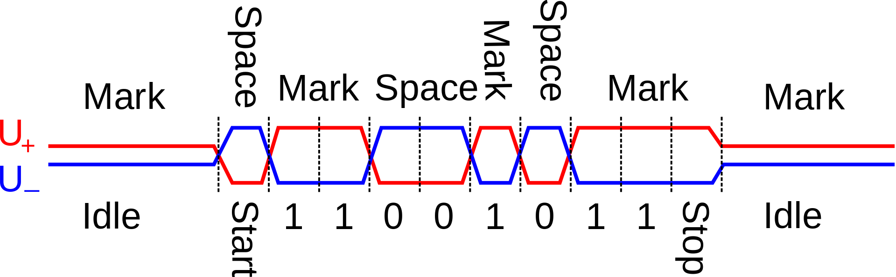

EIA-485 spezifiziert nur die elektrischen Eigenschaften des Interfaces, es definiert kein Protokoll und auch keine Steckerbelegung. Deshalb existiert keine einheitliche Pinbelegung eines EIA-485-Steckers, so dass bei Verwendung verschiedener EIA-485-Geräte immer die Dokumentation des Gerätes beachtet werden muss. Beim Profibus, der auf der EIA-485-Norm basiert, werden beispielsweise die Pins 3 und 8 von 9-poligen D-Sub-Steckern und -Dosen für die Datenleitung benutzt.

> **Für den Betrieb des 485 Busses benötigt man wiederum einen Treiberbaustein. Ein Beispielprojekt ist unter [Link](https://create.arduino.cc/projecthub/maurizfa-13216008-arthur-jogy-13216037-agha-maretha-13216095/modbus-rs-485-using-arduino-c055b5) zu finden.**

[^Wiki485]: Wikipedia, Autor Roy Vegard Ovesen, Waveform example of sending char 0xD3 by RS422/485. [Wikimedia RS232](https://commons.wikimedia.org/wiki/File:RS-485_waveform.svg)

### USART Schnittstellen des AVR

                                  {{0-1}}
********************************************************************************

> **Achtung:** Die UART Implementierung des AVR realisiert neben dem asynchronen Mode auch einen synchronen Modus, daher die Benennung U<ins>S</ins>ART.

Damit werden vier Operationskonzepte unterstützt:

+ Normal asynchronous,
+ Double Speed asynchronous,
+ Master synchronous und
+ Slave synchronous mode.

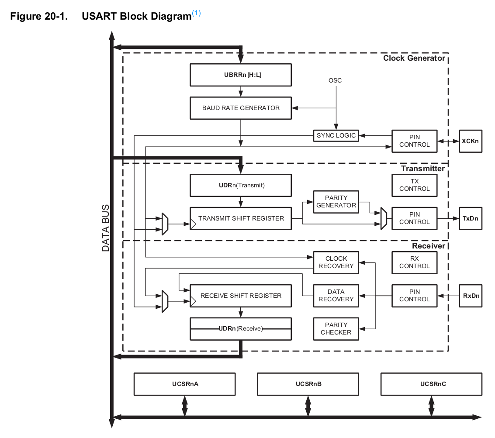

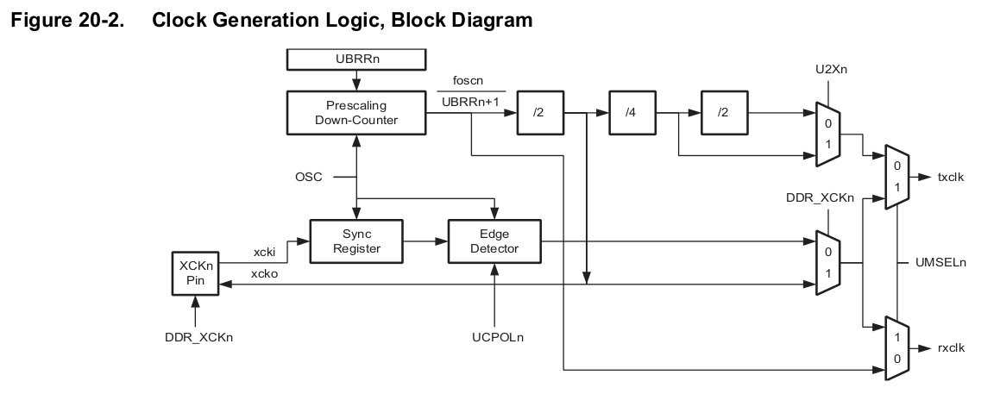

Die Zeichengröße kann als 5 bis 9 Bit gewählt werden. Die Zeichengröße kann man den Bits UCSZ01 und UCSZ00 im UCSR0C Register und dem UCSZ02 Bit im UCSR0B festlegen. Jede übertragene Einheit wird mit einem oder zwei Stoppbits abgeschlossen. Die Anzahl der Stoppbits kann mit dem Bit USBS0 im Register UCSR0C vorgegeben werden.

Optional kann jede übertragene Einheit mit einer Prüfsumme Parity versehen werden. Die Einstellungen für die Parität können mit den Bits UPM01 UPM00 im Register UCSR0C vorgenommen werden.


********************************************************************************

                                  {{1-2}}
********************************************************************************

Im folgenden fokussieren wir die asynchrone Kommunikation. Dabei sind wir mit zwei Problemen konfrontiert:

1. Synchronisierung von Sender und Empfänger

> _The operational range of the Receiver is dependent on the mismatch between the received bit rate and the internally generated baud rate. If the Transmitter is sending frames at too fast or too slow bit rates, or the internally generated baud rate of the Receiver does not have a similar base frequency, the Receiver will not be able to synchronize the frames to the start bit._

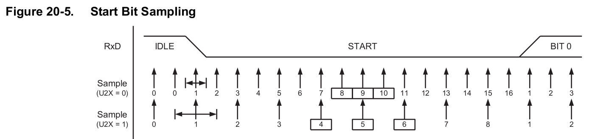

Anhand der Grafik wird die Abtastung mit 16  bzw. 8 Samples pro Bit sichtbar. Über den mittleren Werten (Kästchen) wird eine Mehrheitsentscheidung getroffen.

2. Realisierung des Taktes

Für die Darstellung des Taktes stehen wir vor einem Dilemma. Der Systemtaktgeber passt möglicherweise nicht zu Timings der vorgewählten Baudrate. Hierfür steht ein Prescaler bereit, der durch das Register `UBRRn` mit maximal 12 Bit konfiguriert wird.

$$
BAUD = \frac{f_{OSC}}{16 \cdot (UBRRn +1)}
$$

Wenn wir zum Beispiel bei einer Taktrate von 8MHz eine Übertragungsrate von 115200 Baud realisieren wollten, könnten wir zwischen den Werten 3 und 4 wählen:

$$
125000 = \frac{8.000.000}{16 \cdot (3+1)} \\
100000 = \frac{8.000.000}{16 \cdot (4+1)}
$$

Damit ergibt sich ein Fehler von +8% bzw. -13%. Eine Gesamtkalkulation findet sich zum Beispiel unter

http://ruemohr.org/~ircjunk/avr/baudcalc/avrbaudcalc-1.0.8.php?postbitrate=9600&postclock=8

********************************************************************************

[^AtMega328]: Firma Microchip, Handbuch AtMega328, http://ww1.microchip.com/downloads/en/DeviceDoc/ATmega48A-PA-88A-PA-168A-PA-328-P-DS-DS40002061A.pdf

### Verwendung des Asynchronen Modus auf dem AVR

Bei dem Versuch, zu sendende Daten zu schreiben, kann es vorkommen, dass das Datenregister noch belegt ist und nicht beschrieben werden kann. Bei dem Versuch empfangende Daten zu lesen, kann es vorkommen, dass noch keine neuen Daten verfügbar sind. In beiden Fällen muss entschieden werden, wie mit der Situation weiter zu verfahren ist.

Zwei typische Ansätze mit dem Problem umzugehen bestehen darin, den Zugriff auf die Hardware blockierend bzw. nicht-blockierend durchzuführen. Bei einer Implementierung, die den Zugriff blockierend durchführt, wird der Programmfluss so lange angehalten, bis die gewünschte Operation ausgeführt werden kann. Bei einer Implementierung, die den Zugriff nicht-blockierend durchführt, wird die gewünschte Operation verworfen und diese Tatsache im zurückgelieferten Statuscode vermerkt.

<div id="example">
<span id="simulation-time"></span>
</div>
```cpp       uart_basic.cpp
#define F_CPU 16000000UL
#include <avr/io.h>

#define MYUBBR 103 // 9600

void uart_init(void)
{
  UBRR0H = (unsigned char)(MYUBBR>>8);
  UBRR0L = (unsigned char)MYUBBR;
  UCSR0C |= (1<<UCSZ01) | (1<<UCSZ00); // Set to 8 bit
  UCSR0B |= (1<<TXEN0); // Enable transmitter
}

void uart_putchar(char c) {
   while(!(UCSR0A & (1<<UDRE0))); /* Blockierendes Schreiben, es wird gewartet, bit
                                     der Speicher frei ist */
   UDR0 = c;
}

void uart_puts (char *s)
{
    while (*s)
    {   /* so lange *s != '\0' also ungleich dem "String-Endezeichen(Terminator)" */
        uart_putchar(*s);
        s++;
    }
}

int main(void)
{
  uart_init();
  uart_puts("Hello World\n");
  while(1);
  return 0; // wird nie erreicht
}
```
@AVR8js.sketch

Das folgende Beispiel für den lesenden Zugriff nutzt die UART Schnittstelle umgekehrt, um die Led an und aus zu schalten. Leider lässt sich dieses Beispiel nicht in der Simulation ausführen, entsprechend sei auf die Umsetzung auf dem realen Controller verwiesen.

```cpp       uart_basic.cpp
#define F_CPU 16000000

#include <avr/io.h>

#define BAUD 9600
#define MYUBRR F_CPU/BAUD/16-1

volatile unsigned char sign;

ISR(USART_RX_vect)
{
  sign = UDR0;
  if (sign == 'A') PORTB |= ( 1 << PB5 );
  if (sign == 'B') PORTB &=~( 1 << PB5 );
}

void uart_init(void)
{
  UBRR0H=((MYUBRR)>>8);
  UBRR0L=MYUBRR;
  UCSR0B=(1<<RXEN0)|(1<<RXCIE0);
  UCSR0C=(1<<UCSZ00)|(1<<UCSZ01);
}

int main(void)
{
  uart_init();
  DDRB |= (1 << PB5);
  sei();
  while(1);
  return 0; // wird nie erreicht
}
```

Häufig wird eine Funktionalität benötigt, um einen String mit variablen Feldern zu senden, z. B. wenn die Anwendung ihren Status oder einen Zählerwert meldet. Die Verwendung von formatierten Strings reduziert die Anzahl der Codezeilen. Dieser Anwendungsfall folgt den folgenden Schritten:

+ Konfigurieren Sie die USART-Peripherie wie im ersten Anwendungsfall
+ Erstellen Sie einen benutzerdefinierten Stream
+ Ersetzen Sie den Standard-Ausgabestream durch den benutzerdefinierten Stream

Normalerweise werden bei der Verwendung von 'printf' die Zeichen an einen Datenstrom gesendet, der Standard-Ausgabestream genannt wird. Auf einem PC wird der Standardausgabestrom von der Funktion zur Anzeige von Zeichen auf dem Bildschirm verarbeitet. Mit dem folgenden Code wird ein benutzerdefinierter Stream erstellt, der von der USART-Sendefunktion verarbeitet wird.

vgl. Beispiel im Bereich [codeExamples](https://github.com/TUBAF-IfI-LiaScript/VL_DigitaleSysteme/tree/main/codeExamples/avr) des projektes.

## I2C

Der Inter-Integrated Circuit Bus ($I^2C$) wurde 1982 von Philips (jetzt NXP) eingeführt zur geräteinternen Kommunikation zwischen ICs in z. B. CD-Spielern und Fernsehgeräten. Die erste standardisierte Spezifikation 1.0 wurde 1992 veröffentlicht. Im April 2014 erschien V.6.

Im Unterschied zur UART basierten Kommunikation zielt dessen Spezifikation auf den Datenaustausch zwischen multiplen Geräten.


[^WikiI2Cnetwork]: Wikipedia, Autor Cburnett,  Sample Inter-Integrated Circuit (I²C) schematic with one master (a microcontroller) and three slave nodes (an analog-to-digital converter (ADC), a digital-to-analog converter (DAC), and a microcontroller) [Wikimedia I2C](https://commons.wikimedia.org/wiki/File:I2C.svg)

### Konzepte

**Elektrische Realisierung**

I2C benötigt zwei Signalleitungen, eine Takt- (SCL = Serial Clock) und eine Datenleitung (SDA = Serial Data). Beide liegen mit den Pull-up-Widerständen RP an der Versorgungsspannung VDD. Sämtliche daran angeschlossene Geräte haben Open-Collector-Ausgänge, was zusammen mit den Pull-up-Widerständen eine Wired-AND-Schaltung ergibt. Der High-Pegel soll mindestens 0,7 × VDD betragen, und der Low-Pegel soll bei höchstens 0,3 × VDD liegen. Der I2C-Bus arbeitet mit positiver Logik, d. h. ein High-Pegel auf der Datenleitung entspricht einer logischen „1“, der Low-Pegel einer „0“.

 und dem Stopp-Signal (P) werden die Datenbits $B_1$ bis $B_N$ übertragen. [^WikiI2Csignal]")

**Adressierung und Datenaustausch**

Eine Standard-I2C-Adresse ist das erste vom Master gesendete Byte, wobei die ersten sieben Bit die eigentliche Adresse darstellen und das achte Bit (R/W-Bit) dem Slave mitteilt, ob er Daten vom Master empfangen soll (Low: Schreibzugriff) oder Daten an den Master zu übertragen hat (High: Lesezugriff). I2C nutzt daher einen Adressraum von 7 Bit, was bis zu 112 Knoten auf einem Bus erlaubt - 16 der 128 möglichen Adressen sind für Sonderzwecke reserviert.

Jedes I²C-fähige IC hat eine (üblicherweise vom Hersteller) festgelegte Adresse, von der in der Regel eine modellabhängige Anzahl der untersten Bits (LSB) über spezielle Eingangspins des ICs individuell konfiguriert werden können.

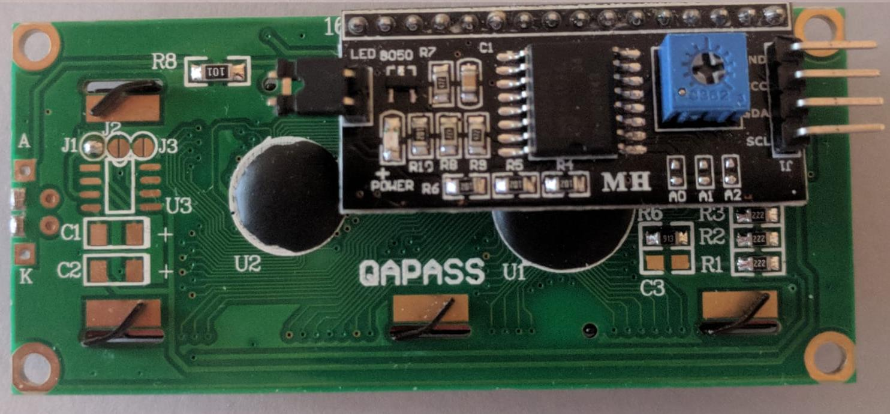

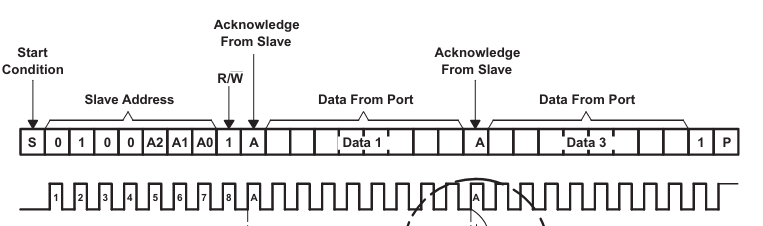

Hierdurch wird es möglich, mehrere ICs dieses Typs am selben I2C-Bus zu betreiben, ohne dass es zu Adresskonflikten kommt. Lassen sich Adresskonflikte nicht vermeiden, so müssen die entsprechenden ICs mit getrennten I²C-Bussen angesteuert oder temporär vom Bus getrennt werden.

**Aufbau der Datenframes**

<!--style="width: 80%; display: block; margin-left: auto; margin-right: auto;" -->
```ascii

Bit              7 / 10     1               8                    8
       +-----+------------+----+     +--------------+     +--------------+     +------+
Master |Start| Adressframe| R/W|     | Datenframe 1 |     | Datenframe 2 |     | Stop |
       +-----+------------+----+     +--------------+     +--------------+     +------+

                               +-----+              +-----+              +-----+
Slave                          | AKN |              | AKN |              | AKN |
                               +-----+              +-----+              +-----+
```

+ Startbedingung: Die SDA-Leitung schaltet von einem hohen Spannungspegel auf einen niedrigen Spannungspegel, bevor die SCL-Leitung von High auf Low schaltet.
+ Stop-Bedingung: Die SDA-Leitung wechselt von einem niedrigen Spannungspegel auf einen hohen Spannungspegel, nachdem die SCL-Leitung von low auf high wechselt.
+ Adressrahmen: Eine 7- oder 10-Bit-Sequenz, die für jeden Slave einzigartig ist und den Slave identifiziert, wenn der Master mit ihm sprechen will.
+ Read/Write Bit: Ein einzelnes Bit, das angibt, ob der Master Daten an den Slave sendet (niedriger Spannungspegel) oder Daten von ihm anfordert (hoher Spannungspegel).
+ ACK/NACK-Bit: Auf jeden Frame einer Nachricht folgt ein Acknowledge/No-Acknowledge-Bit. Wenn ein Adressrahmen oder Datenrahmen erfolgreich empfangen wurde, wird ein ACK-Bit vom empfangenden Gerät an den Sender zurückgesendet.


Schreiben in eines der Slave-Register
<!--style="width: 80%; display: block; margin-left: auto; margin-right: auto;" -->
```ascii

       +-----+------------+----+     +--------------+     +--------------+     +------+
Master |Start| Adressframe| 1  |     | Reg. Adresse |     |    Daten     |     | Stop |
       +-----+------------+----+     +--------------+     +--------------+     +------+

                               +-----+              +-----+              +-----+
Slave                          | AKN |              | AKN |              | AKN |
                               +-----+              +-----+              +-----+
```

Lesen aus einem der Slave-Register
<!--style="width: 80%; display: block; margin-left: auto; margin-right: auto;" -->
```ascii

       +-----+------------+----+     +--------------+                    +-----+------+
Master |Start| Adressframe| 0  |     | Reg. Adresse |                    |NAKN | Stop |
       +-----+------------+----+     +--------------+                    +-----+------+

                               +-----+              +-----+--------------+
Slave                          | AKN |              | AKN |    Daten     |
                               +-----+              +-----+--------------+
```

Die Zahl der übermittelten Daten kann beliebig erweitert werden.

**Vorteile / Nachteile **

Pros

+ verwendet nur zwei Drähte
+ unterstützt mehrere Master und mehrere Slaves
+ ACK/NACK-Bit gibt Bestätigung, dass jeder Frame erfolgreich übertragen wurde
+ Hardware ist weniger kompliziert als bei UARTs
+ weit verbreitetes Protokoll

Cons

- Langsamere Datenübertragungsrate als SPI
- Die Größe des Datenrahmens ist auf 8 Bit begrenzt
-Kompliziertere Hardware zur Implementierung als SPI erforderlich

[^PCF8574]: Datenblatt Texas Instruments, [TI_PCF8574](https://www.ti.com/lit/ds/symlink/pcf8574.pdf?ts=1621388532534&ref_url=https%253A%252F%252Fwww.google.com%252F)

[^WikiI2Csignal]: Wikipedia, Autor Marcin Floryan,  Sample Inter-Integrated Circuit (I²C) schematic with one master (a microcontroller) and three slave nodes (an analog-to-digital converter (ADC), a digital-to-analog converter (DAC), and a microcontroller) [Wikimedia I2C](https://commons.wikimedia.org/wiki/File:I2C.svg)

### TWI Implementierung im AVR

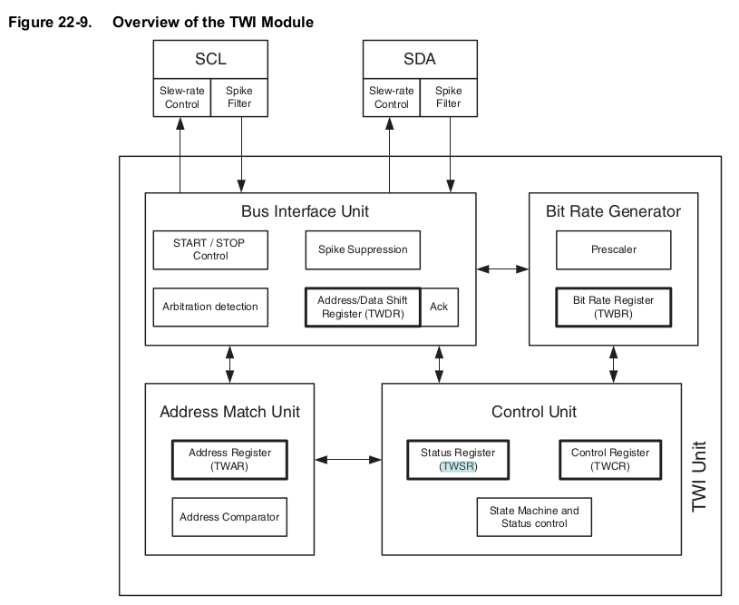


| Register | Bedeutung             | Bemerkung                  |
| -------- | --------------------- | -------------------------- |
| TWCR     | TWI Control Register  |                            |
| TWBR     | TWI Bit Rate Register |                            |
| TWSR     | TWI Status Register   |                            |
| TWDR     | TWI Data Register     |                            |
| TWAR     | TWI Address Register  | nur im Slave Mode relevant |

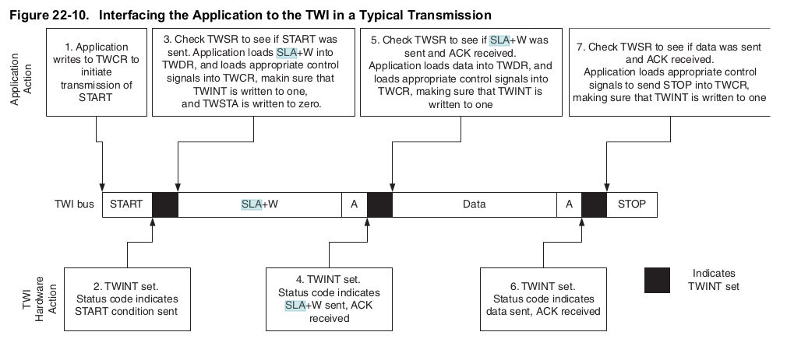

```c    I2C_basics.c

/* Define bit rate */
#define SCL_CLK 100000L
#define F_CPU 16000000UL
#define BITRATE(TWSR)	((F_CPU/SCL_CLK)-16)/(2*pow(4,(TWSR&((1<<TWPS0)|(1<<TWPS1)))))

void I2C_Init()			/* I2C initialize function */
{
    TWBR = BITRATE(TWSR=0x00);	/* Get bit rate register value by formula */
}

uint8_t I2C_Start(charwrite_address)/* I2C start function */
{
    uint8_t status;	                     	/* Declare variable */
    TWCR=(1<<TWSTA)|(1<<TWEN)|(1<<TWINT); /* Enable TWI, generate START */
    while(!(TWCR&(1<<TWINT)));          	/* Wait until TWI finish its current job */
    status=TWSR & 0xF8;		                /* Read TWI status register */
    if(status!=0x08)		                  /* Check weather START transmitted or not? */
       return 0;		                     	/* Return 0 to indicate start condition fail */
    TWDR=write_address;	                	/* Write SLA+W in TWI data register */
    TWCR=(1<<TWEN)|(1<<TWINT);           	/* Enable TWI & clear interrupt flag */
    while(!(TWCR&(1<<TWINT)));	          /* Wait until TWI finish its current job */
    status=TWSR & 0xF8;	                 	/* Read TWI status register */
    if(status==0x18)		                  /* Check for SLA+W transmitted &ack received */
       return 1;		                      /* Return 1 to indicate ack received */
    if(status==0x20)	                  	/* Check for SLA+W transmitted &nack received */
       return 2;		                      /* Return 2 to indicate nack received */
    else
       return3;			                      /* Else return 3 to indicate SLA+W failed */
}

uint8_t I2C_Write(char data)							/* I2C write function */
{
	uint8_t status;										     	/* Declare variable */
	TWDR = data;										      	/* Copy data in TWI data register */
	TWCR = (1<<TWEN)|(1<<TWINT);				  	/* Enable TWI and clear interrupt flag */
	while (!(TWCR & (1<<TWINT)));					  /* Wait until TWI finish its current job (Write operation) */
	status = TWSR & 0xF8;									  /* Read TWI status register with masking lower three bits */
	if (status == 0x28)										  /* Check weather data transmitted & ack received or not? */
	  return 0;											       	/* If yes then return 0 to indicate ack received */
	if (status == 0x30)										  /* Check weather data transmitted & nack received or not? */
	  return 1;												      /* If yes then return 1 to indicate nack received */
	else
	  return 2;											        /* Else return 2 to indicate data transmission failed */
}

```

!?[alt-text](https://www.youtube.com/watch?v=PjsK6uxUZeA)

[^AtMega328]: Firma Microchip, Handbuch AtMega328, http://ww1.microchip.com/downloads/en/DeviceDoc/ATmega48A-PA-88A-PA-168A-PA-328-P-DS-DS40002061A.pdf

### Anwendung

In unserer Bastelbox befinden sich 3 Komponenten mit einem I2C Interface:

+ Inertiale Messeinheit MPU 6050
+ Echtzeituhr
+ LCD Display

## SPI

Das Serial Peripheral Interface (SPI) ist ein im Jahr 1987 von Susan C. Hill und anderen beim Halbleiterhersteller Motorola (heute NXP Semiconductors), entwickeltes synchron arbeitendes Bus-System, das ähnlich umlaufenden Schieberegister arbeitet.

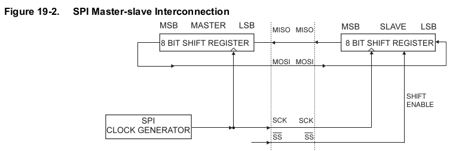

| Implmentierung                                                                                          | Bedeutung                                        |
| ------------------------------------------------------------------------------------------------------- | ------------------------------------------------ |
|                       | Einfacher SPI-Bus mit einem SPI-Master und Slave |
| 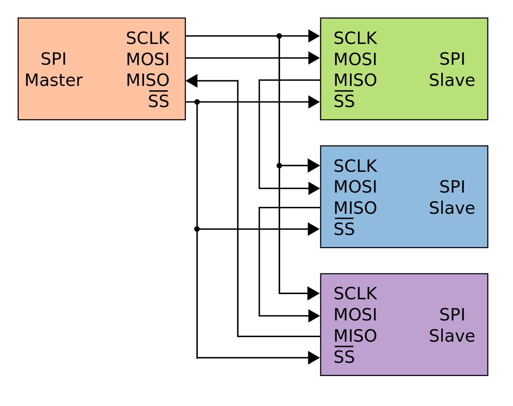 | SPI-Verbindung durch Kaskadierung der Slaves     |
|                | SPI-Sternverbindung                              |

An den Bus können so viele Teilnehmer angeschlossen werden, wie Slave-Select-Leitungen vorhanden sind, zuzüglich des genau einen Masters, der seinerseits das Clock-Signal an SCK erzeugt. Der Master legt mit der Leitung „Slave Select“ fest, mit welchem Slave er kommunizieren will. Wird sie gegen Masse gezogen, ist der jeweilige Slave aktiv und „lauscht“ an MOSI, bzw. legt er seine Daten im Takt von SCK an MISO. Es wird ein Wort vom Master zum Slave und ein anderes Wort vom Slave zum Master transportiert.

[^AtMega328]: Firma Microchip, Handbuch AtMega328, http://ww1.microchip.com/downloads/en/DeviceDoc/ATmega48A-PA-88A-PA-168A-PA-328-P-DS-DS40002061A.pdf

[^WikipdeiaSPI]: Wikipedia, Autor en:User:Cburnett, [Link](https://de.wikipedia.org/wiki/Serial_Peripheral_Interface)


### Umsetzung im AVR


[^AtMega328]: Firma Microchip, Handbuch AtMega328, http://ww1.microchip.com/downloads/en/DeviceDoc/ATmega48A-PA-88A-PA-168A-PA-328-P-DS-DS40002061A.pdf

Einen Überblick zur Verwendung der SPI Kommunikation liefert das Tutorial [AVR151: Setup and Use of the SPI](https://ww1.microchip.com/downloads/en/AppNotes/Atmel-2585-Setup-and-Use-of-the-SPI_ApplicationNote_AVR151.pdf)

## Ausblick und Vergleich

|                       | UART        | I2C         | SPI                  |
| --------------------- | ----------- | ----------- | -------------------- |
| Pins                  | RxD, TxD    | SDA, SCL    | SCLK, MOSI, MISO, SS |
| Datenrate             | 20KBps      | 1MBps       | 20MBps               |
| Kommunikationsmodus   | asynchron   | synchron    | synchron             |
| Kommunikationspartner | $=2$        | $2<=x<=127$ | $>=2$                |
| Master                | -           | $>=1$       | $>=1$                |
| Duplex                | Full Duplex | Half Duplex | Full Duplex          |

Die Betrachtung lässt andere Bussysteme (CAN, LIN, FlexRay), die eine erweiterte Hardware benötigen außer Acht. Analog bleiben die aus Sicht der Eingebetteten Systeme interessanten Sensornetze, die drahtlos Daten austauschen unberücksichtigt.

## Aufgaben

- [ ] Testen Sie das Tiny RTC Modul entsprechend der Vorgaben des Herstellers in einem kleinen Arduino Programm
- [ ] Machen Sie sich mit den Protokollvorgaben vertraut und reimplementieren Sie die Lösung unter Nutzung der I2C Bibliothek von [Peter Fleury](http://www.peterfleury.epizy.com/doxygen/avr-gcc-libraries/index.html)
