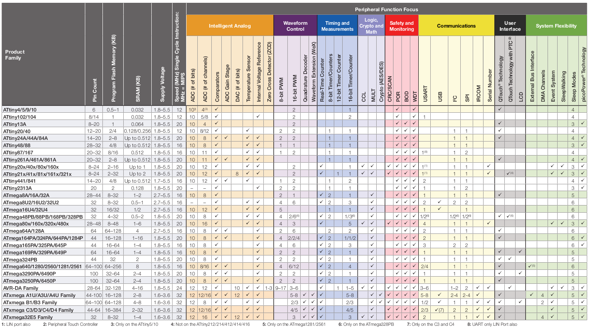
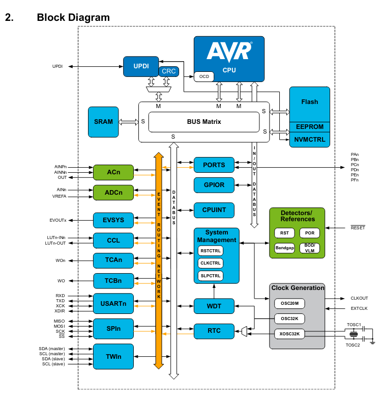
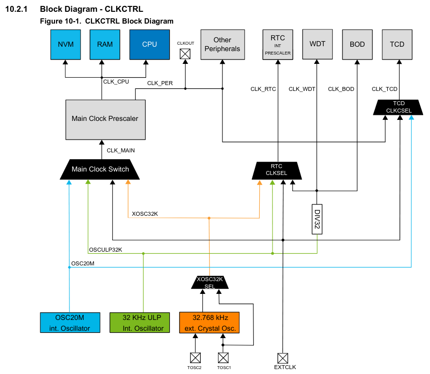
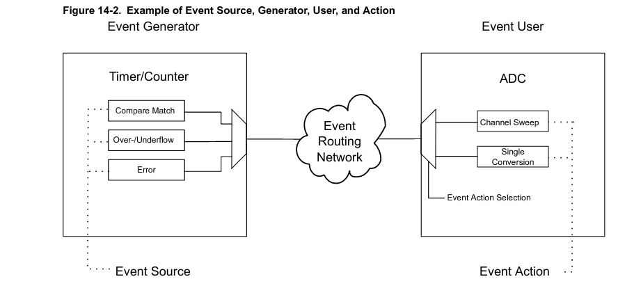
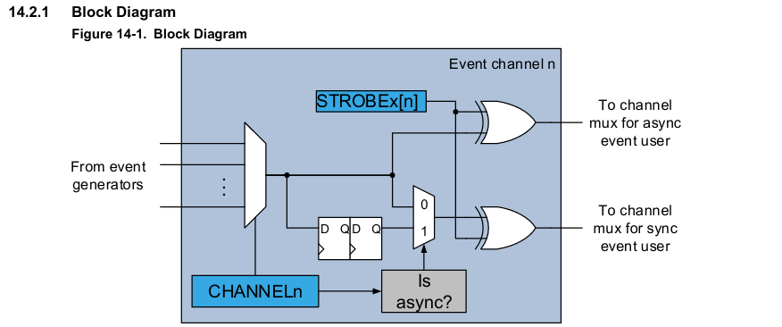
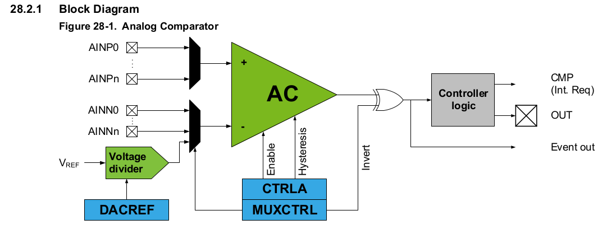
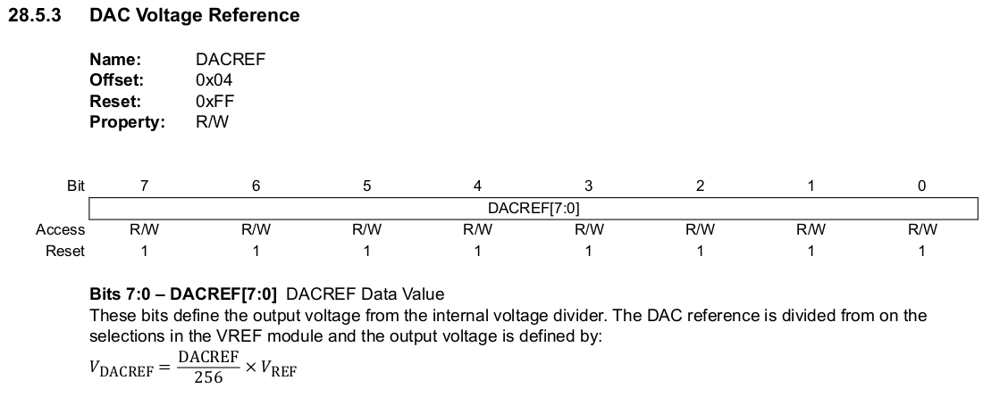
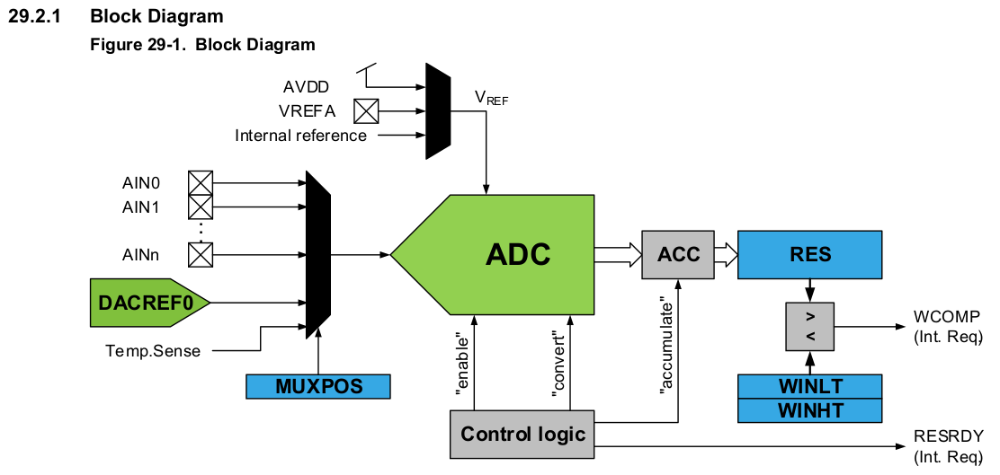
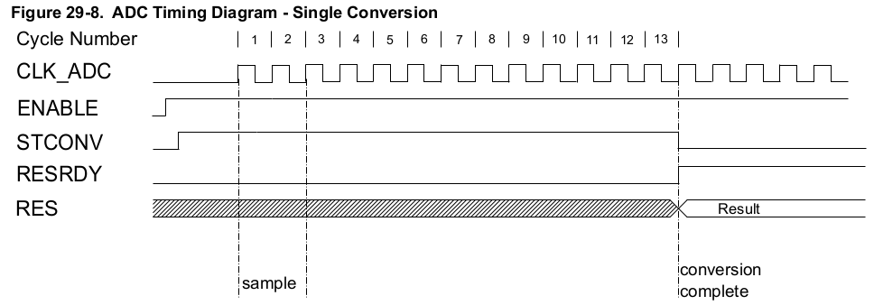
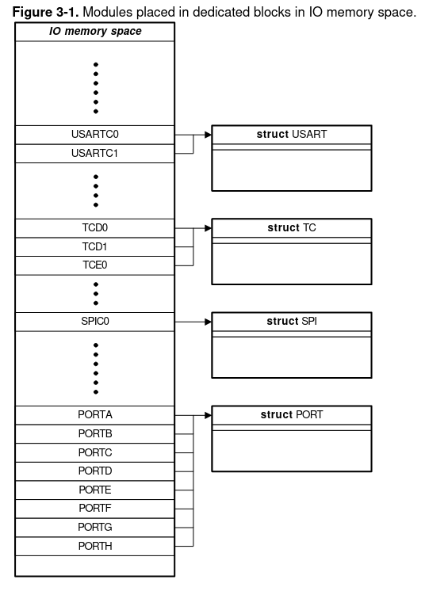

<!--
author:   Sebastian Zug, Karl Fessel & Andrè Dietrich
email:    sebastian.zug@informatik.tu-freiberg.de

version:  1.0.4
language: de
narrator: Deutsch Female

import:  https://raw.githubusercontent.com/liascript-templates/plantUML/master/README.md
         https://github.com/LiaTemplates/AVR8js/main/README.md
         https://github.com/LiaTemplates/Pyodide

icon: https://upload.wikimedia.org/wikipedia/commons/d/de/Logo_TU_Bergakademie_Freiberg.svg

mark: <span style="background-color: @0;
                                  display: flex;
                                  width: calc(100% + 32px);
                                  margin: -16px;
                                  padding: 6px 16px 6px 16px;
                                  ">@1</span>
red:  @mark(#FF888888,@0)
blue: @mark(lightblue,@0)
gray: @mark(gray,@0)

-->


[](https://liascript.github.io/course/?https://github.com/TUBAF-IfI-LiaScript/VL_DigitaleSysteme/main/lectures/06_XMEGA.md#1)


# Erweiterte AVR Architekturen

| Parameter                | Kursinformationen                                                                                                                                                                    |
| ------------------------ | ------------------------------------------------------------------------------------------------------------------------------------------------------------------------------------ |
| **Veranstaltung:**       | `Vorlesung Digitale Systeme`                                                                                                                                                      |
| **Semester**             | `Sommersemester 2025`                                                                                                                                                                |
| **Hochschule:**          | `Technische Universität Freiberg`                                                                                                                                                    |
| **Inhalte:**             | `Erweiternde Architekturkonzepte der XMEGA Architektur`                                                                                            |
| **Link auf den GitHub:** | [https://github.com/TUBAF-IfI-LiaScript/VL_DigitaleSysteme/blob/main/lectures/09_XMEGA.md](https://github.com/TUBAF-IfI-LiaScript/VL_DigitaleSysteme/blob/main/lectures/09_XMEGA.md) |
| **Autoren**              | @author                                                                                                                                                                              |


---

## Ausgangspunkt



Welche Erweiterungen ergeben sich dabei:

+ alle GPIOs können als externe Interrupts genutzt werden
+ die Interruptvektortabelle ist nicht mehr fest vordefiniert sondern kann an die Anwendung angepasst werden.
+ ein Eventsystem erlaubt die Verknüpfung von peripheren Elementen untereinander, ohne dass die CPU eingreifen muss
+ die Taktgeber werden nicht mehr über Fuse-Bits gesetzt sondern können über entsprechende Register konfiguriert werden.
+ eine konfigurierbare Logik (CCL) verbindet Eingänge, Perepheriebauteile und Ausgänge mit sequenziellen Schaltwerken
+ für den Analog-Digitalwandler stehen 5 interne Referenzspannungen bereit.
+ der Controller integriert einen internen Real-Time Oszillator mit 32.768 Hz
+ Softwareresets sind über ein eigenes Register möglich.
+ UPDI ersetzt die bisherige OneWire Debug Schnittstelle




[^Microchip4809]: Firma Microchip, ATmega4808/4809 Data Sheet, [Link](http://ww1.microchip.com/downloads/en/DeviceDoc/ATmega4808-4809-Data-Sheet-DS40002173A.pdf)

## Hardware



Der Haupttakt versorgt die CPU, den RAM, den Flash, den I/O-Bus und allen am I/O-Bus angeschlossenen Peripheriegeräten und wird vom Taktcontroller vorskaliert und verteilt.
Dem asynchronen Takt folgen die Realtime-Clock (RTC), der Watchdog-Timer (WDT), die Brown-out-Detection (BOD) und asynchrone Timer Counter (TCD). Die asynchronen Taktquellen werden über Register in der jeweiligen Peripherie konfiguriert.

Als Taktquellen sind vorgesehen:

+ Interne Oszillatoren (16/20 MHz Oszillator, 32KHz Oszillator)
+ Externe Ozillatoren (via External Clock Pin, 32.768 kHz Quarz Oszillator)

Die Konfiguration wird über zwei Register `MCLKCTRLA` (Taktressource) und `MCLKCTRLB` (Prescaler) vorgenommen.

[^Microchip4809]: Firma Microchip, ATmega4808/4809 Data Sheet, [Link](http://ww1.microchip.com/downloads/en/DeviceDoc/ATmega4808-4809-Data-Sheet-DS40002173A.pdf)

### Variable Konfiguration von Pin-Belegungen

Ein zentraler Unterschied des bisherig ATmega328 zum ATmega4809 ist die Möglichkeit der variablen Zuordnung bestimmter Funktionalitäten zu einzelnen Pins. Der Port-Multiplexer (`PORTMUX`) kann entweder die Funktionalität von Pins aktivieren oder deaktivieren, oder zwischen Standard- und alternativen Pin-Positionen schalten.


Die Grafik zeigt, das zum Beispiel das der USART3 standardmäßig mit PB0 und PB1 verknüpft ist. Durch die Rekonfiguration im `PORTMUX` Register kann diese Zuordnung nach PB4 und PB5 verschoben werden.

> Recherchieren Sie die Beschaltung der Seriellen Schnittstelle des aktuellen Boards. Werden hier die alternativen Pins benutzt? Welche Konfigurationen sind entsprechend zu treffen?


| Bezeichnung | Bedeutung                        |
| ----------- | -------------------------------- |
| `EVOUTx`    | Event Output Pin                 |
| `LUTn`      | Look-Up Tables Output Pins       |
| `USARTn`    |                                  |
| `TWIn`      | I2C Schnittstellen Pins          |
| `SPIn`      | Serial Peripheral Interface Pins |
| `TCAn`      | Timer Counter A Output           |
| `TCBn`      | Timer Counter B Output           |

> **Frage:** Warum brauchen wir 6 Ausgabekanäle für lediglich 3 Compare-Einheiten?


Die 16 Bit Counter des 4809 können in einen 8bit Modus umgeschalten werden.


[^Microchip4809]: Firma Microchip, ATmega4808/4809 Data Sheet, [Link](http://ww1.microchip.com/downloads/en/DeviceDoc/ATmega4808-4809-Data-Sheet-DS40002173A.pdf)

### Interrupts

> **Achtung:** Das Interruptsystem des 4809 unterscheidet sich deutlich von dem des ATmega328. Bisher waren wir dort auf eine statisch konfigurierte Priorisierung angewiesen.


Die Interrupt-Erzeugung muss global aktiviert werden, indem eine '1' in das Global Interrupt Enable Bit (I) im CPU-Statusregister `CPU.SREG` geschrieben wird. Dieses Bit wird nicht gelöscht, wenn ein Interrupt quittiert wird.


Wenn ein Interrupt aktiviert ist und die Interrupt-Bedingung eintritt, empfängt die CPUINT die Interrupt-Anforderung. Wenn eine Interrupt-Anforderung von der CPUINT bestätigt wird, wird der Programmzähler so gesetzt, dass er auf den Interrupt-Vektor zeigt. Der Interrupt-Vektor ist ein Sprung zum Interrupt-Handler. Nach der Rückkehr vom Interrupt-Handler wird die Programmausführung an der Stelle fortgesetzt, an der sie vor dem Auftreten der Unterbrechung war.

Standardmäßig haben alle Peripheriegeräte die Prioritätsstufe 0. Es ist möglich, eine Interrupt-Anforderung der Stufe 1 (hohe Priorität) zuzuordnen, indem Sie ihre Interrupt-Vektornummer in das `CPUINT.LVL1VEC`-Register schreibt. Diese Interrupt-Anforderung hat dann eine höhere Priorität als die anderen (normal priorisierten) Interrupt-Anforderungen.

| Priorität | Level                          | Quelle                 |
| --------- | ------------------------------ | ---------------------- |
| Höchste   | _Non Maskable Interrupt_ (NMI) | für 4809 nur CRC check |
| Hohe      | Level 1                        |                        |
| Niedrige  | Level 0                        |                        |   

Interrupts werden entsprechend ihrer Prioritätsstufe UND ihrer Interruptvektoradresse (vgl. Datenblatt Seite 66) priorisiert. Interrupts der Prioritätsstufe 1 unterbrechen Interrupthandler der Prioritätsstufe 0. Bei Interrupts der Prioritätsstufe 0 wird die Priorität anhand der Interruptvektoradresse ermittelt, wobei die niedrigste Interruptvektoradresse die höchste Interruptpriorität hat.


Optional kann für Interrupts der Prioritätsstufe 0 ein Round-Robin-Schema aktiviert werden. Dadurch wird sichergestellt, dass alle Interrupts innerhalb einer bestimmten Zeitspanne bearbeitet werden.

### Konfigurierbare Logik

Die konfigurierbare benutzerdefinierte Logik (CCL) ist eine programmierbare Logik-Peripherie, die mit den Geräte Pins an Ereignisse oder an andere interne Peripherie angeschlossen werden kann. Die CCL kann als "Klebelogik" zwischen der Geräteperipherie und externen Geräten dienen.

#### Exkurs - Schaltwerke

Sequentieller Binärzahlenvergleicher - zwei Zahlenwerte werden sequenziell entsprechend ihren Stellen durch den Vergleicher bewegt und verglichen. Das Schaltwerk speichert das Resultat sobald ein Wert größer als der andere .

<!--
style="width: 80%; min-width: 420px; max-width: 720px;"
-->
```ascii

           <------ Linksshift
         +---+---+---+---+---+---+---+
  +----- | 1 | 1 | 0 | 0 | 1 | 0 | 1 |   Shiftregister A
  |      +---+---+---+---+---+---+---+
  |
  |
  |      +---+---+---+---+---+---+---+
  |  +-- | 1 | 1 | 0 | 1 | 1 | 1 | 0 |   Shiftregister B
  |  |   +---+---+---+---+---+---+---+
  |  |
  |  |   +-------------+               +--------------------+----+----+
  |  |   |             |               |                    | R1 | R2 |
  |  +-> | Vergleicher | --> R1        +--------------------+----+----+
  |      |             |               | Equal   E: A==B    | 0  | 0  |
  |      |             |               | Greater G: A"$>$"B | 1  | 0  |
  +----> |             | --> R2        | Less    L: A"$<$"B | 0  | 1  |
         |             |               +--------------------+----+----+
         +-------------+                                                       .
```

**1. Schritt: Aufgabenspezifikation, Erstellen eines Zustandsdiagramms**

Für die Aufgabe ergibt sich folgender Graph:

```text @plantUML.png
@startuml
digraph finite_state_machine {
    rankdir=LR;

    node [shape = point ]; qi
    node[shape=circle]
    E[label="E"];
    G[label="G"];
    L[label="L"];


    qi -> E;
    E  -> E  [ label = "AB={00, 11}" ];
    E  -> G  [ label = "AB=10" ];
    G  -> G  [ label = "AB={00, 01, \n10, 11}"];
    E  -> L  [ label = "AB=01" ];
    L  -> L  [ label = "AB={00, 01, \n10, 11}"];
}
@enduml
```


Im Beispiel liegt ein Medwedew-Automat vor. Die Zustände werden direkt auf den Ausgang abgebildet.

**2. Schritt: Erstellen der Zustandstabelle**

Hier wäre eine Zustandstabelle denkbar, die alle Eingangskombinationen mit allen Zuständen zeilenweise verknüpft.

<!-- data-type="none" style="width: 200px"-->
| Zustand | A   | B   | Folgezustand |
| ------- | --- | --- | ------------ |
| E       | 0   | 0   | E            |
| E       | 0   | 1   | L            |
| E       | 1   | 0   | G            |
| ...     |     |     |              |

Eine kompaktere Darstellung fasst die Kombinationen der Eingänge zusammen und ordnet sie den Folgezuständen zu.

<!-- data-type="none" -->
| aktueller Zustand | AB==00 | AB==01 | AB==10 | AB==11 |
| ----------------- | ------ | ------ | ------ | ------ |
| E                 | E      | L      | G      | E      |
| G                 | G      | G      | G      | G      |
| L                 | L      | L      | L      | L      |

**Schritt 3: Auswahl einer binären Zustandskodierung und Generierung einer binären Zustandstabelle**

Insgesamt sind 3 Zustände zu kodieren, entsprechend werden wiederum 2 Flip-Flops benötigt. Dabei wird die Kodierung wie folgt vorgenommen:

<!-- data-type="none" -->
| Zustand | X   | Y   |
| ------- | --- | --- |
| E       | 0   | 0   |
| G       | 0   | 1   |
| L       | 1   | 0   |

Damit ergibt sich folgende Binäre Zustandstabelle

<!-- data-type="none" -->
| aktueller Zustand | AB==00 | AB==01 | AB==10 | AB==11 |
| ----------------- | ------ | ------ | ------ | ------ |
| 00                | 00     | 10     | 01     | 00     |
| 01                | 01     | 01     | 01     | 01     |
| 10                | 10     | 10     | 10     | 10     |

In der traditionellen Darstellung zeigt sich diese wie folgt:

<!-- data-type="none" -->
| $X_{t}$ | $Y_{t}$ | $A_{t}$ | $B_{t}$ | @gray($X_{t+1}$) | @gray($Y_{t+1}$) |
| ------- | ------- | ------- | ------- | ---------------- | ---------------- |
| 0       | 0       | 0       | 0       | @gray(0)         | @gray(0)         |
| 0       | 0       | 0       | 1       | @gray(1)         | @gray(0)         |
| 0       | 0       | 1       | 0       | @gray(0)         | @gray(1)         |
| 0       | 0       | 1       | 1       | @gray(0)         | @gray(0)         |
| 0       | 1       | 0       | 0       | @gray(0)         | @gray(1)         |
| 0       | 1       | 0       | 1       | @gray(0)         | @gray(1)         |
| 0       | 1       | 1       | 0       | @gray(0)         | @gray(1)         |
| 0       | 1       | 1       | 1       | @gray(0)         | @gray(1)         |
| 1       | 0       | 0       | 0       | @gray(1)         | @gray(0)         |
| 1       | 0       | 0       | 1       | @gray(1)         | @gray(0)         |
| 1       | 0       | 1       | 0       | @gray(1)         | @gray(0)         |
| 1       | 0       | 1       | 1       | @gray(1)         | @gray(0)         |
| 1       | 1       | 0       | 0       | @gray(D)         | @gray(D)         |
| 1       | 1       | 0       | 1       | @gray(D)         | @gray(D)         |
| 1       | 1       | 1       | 0       | @gray(D)         | @gray(D)         |
| 1       | 1       | 1       | 1       | @gray(D)         | @gray(D)         |

**Schritt 4: Auswahl eines Flip-Flop Typs und Ermittlung der für jeden Zustandsübergang benötigten Flip-Flop Ansteuerungen**

Wir entscheiden uns für einen D Flip-Flop für die Realisierung. Die entsprechende invertierte Wahrheitstafel haben Sie zwischenzeitlich im Kopf:

<!-- data-type="none" -->
| $Q(t)$ | $Q(t+1)$ | $D$ |
| ------ | -------- | --- |
| $0$    | $0$      | $0$ |
| $0$    | $1$      | $1$ |
| $1$    | $0$      | $0$ |
| $1$    | $1$      | $1$ |

Damit lässt sich die Zustandsübergangstabelle entsprechend einfach um die zugehörige Eingangsbelegung ergänzen. Für die D-Flip-Flops ist dies einfach eine Kopie der Zustandsspalten.

<!-- data-type="none" -->
| $X_{t}$ | $Y_{t}$ | $A_{t}$ | $B_{t}$ | @gray($X_{t+1}$) | @gray($Y_{t+1}$) | $DX$    | $DY$     |
| ------- | ------- | ------- | ------- | ---------------- | ---------------- | ------- | -------- |
| 0       | 0       | 0       | 0       | @gray(0)         | @gray(0)         | 0       | 0        |
| 0       | 0       | 0       | 1       | @gray(1)         | @gray(0)         | @red(1) | 0        |
| 0       | 0       | 1       | 0       | @gray(0)         | @gray(1)         | 0       | @blue(1) |
| 0       | 0       | 1       | 1       | @gray(0)         | @gray(0)         | 0       | 0        |
| 0       | 1       | 0       | 0       | @gray(0)         | @gray(1)         | 0       | @blue(1) |
| 0       | 1       | 0       | 1       | @gray(0)         | @gray(1)         | 0       | @blue(1) |
| 0       | 1       | 1       | 0       | @gray(0)         | @gray(1)         | 0       | @blue(1) |
| 0       | 1       | 1       | 1       | @gray(0)         | @gray(1)         | 0       | @blue(1) |
| 1       | 0       | 0       | 0       | @gray(1)         | @gray(0)         | @red(1) | 0        |
| 1       | 0       | 0       | 1       | @gray(1)         | @gray(0)         | @red(1) | 0        |
| 1       | 0       | 1       | 0       | @gray(1)         | @gray(0)         | @red(1) | 0        |
| 1       | 0       | 1       | 1       | @gray(1)         | @gray(0)         | @red(1) | 0        |
| 1       | 1       | 0       | 0       | @gray(D)         | @gray(D)         | D       | D        |
| 1       | 1       | 0       | 1       | @gray(D)         | @gray(D)         | D       | D        |
| 1       | 1       | 1       | 0       | @gray(D)         | @gray(D)         | D       | D        |
| 1       | 1       | 1       | 1       | @gray(D)         | @gray(D)         | D       | D        |

> **Aufgabe:** Lesen Sie die minimale Funktion für `DF` und `DG` ab!

$$
\begin{aligned}
DX &= X +\overline{Y}\,\overline{A}\,B\\
DY &= Y +\overline{X}\,A\,\overline{B}
\end{aligned}
$$

Ein weiteres Einführungsbeispiel finden Sie unter [Link](https://liascript.github.io/course/?https://raw.githubusercontent.com/SebastianZug/StateMachines/master/README.md#1)

#### Realisierung

Eine Umsetzungsmöglichkeit für Schaltnetze sind die sogenannten PALs (Programmable Array Logic) die bereits aus der Vorlesung [Eingebettete Systeme](https://liascript.github.io/course/?https://raw.githubusercontent.com/TUBAF-IfI-LiaScript/VL_EingebetteteSysteme/master/04_Schaltnetze.md#13) bekannt sind und dort nocheinmal nachgelesen werden können.

Auf der verlinkten Folie wurden die 2 stufigen Schaltfunktionen mit einem programmierbaren `AND` Array vorgestellt.


Diese erweitern wir nun um die Speicherglieder und deren Rückkopplung. Beachten Sie die Ergänzung auf der Ausgangsseite und die zusätzliche Clock-Leitung.


[^AMD]: Datenblatt PAL16R8 Family, Advanced Micro Devices, [link](http://www.applelogic.org/files/PAL16R8.pdf), 1996

#### Integration im 4809


Die CCL-Peripherie bietet eine Reihe von Look-up Tables (LUTs). Jede LUT besteht aus

+ drei Eingängen, 
+ einer Wahrheitstabelle, 
+ einem Synchronisator/Filter und 
+ einem Flankendetektor. 

> Jede LUT kann einen Ausgang als anwenderprogrammierbaren logischen Ausdruck erzeugen mit drei Eingängen. 

Der Ausgang wird aus den Eingängen mit Hilfe der kombinatorischen Logik generiert und kann gefiltert werden, um Spikes zu entfernen. Der CCL kann so konfiguriert werden, dass er bei Änderungen der LUT-Ausgänge eine Interrupt-Anforderung erzeugt.
Benachbarte LUTs können kombiniert werden, um bestimmte Operationen durchzuführen.

!?[alt-text](https://www.youtube.com/watch?v=beZXfAUR-PE)

### Eventsystem

Das Eventsystem erlaubt eine direkte Peripherie-zu-Peripherie-Signalisierung, Peripheriegeräte können direkt Peripherieereignisse erzeugen, verwenden und darauf reagieren. Dabei werden entsprechen kurze Reaktionszeit garantiert. Auf dem 4809 sind 8 parallele Ereigniskanäle verfügbar, wobei jeder Kanal wird von einem Ereignisgenerator gesteuert wird und mehrere Ereignisbenutzer haben kann. Ereignisse sind dabei die Zustände der meisten Peripheriegeräten oder manuelle, aus der Software gesendet Signale. Das Ereignissystem funktioniert in den Modi "Aktiv", "Leerlauf" und "Ruhezustand".



Abfolge der Konfiguration:

1. ... Konfiguration eines Peripheriegerät als Quelle: Wenn es sich bei der erzeugenden Peripherie z. B. um einen Timer handelt, wird die Vorskalierung, das Vergleichsregister usw. so eingestellt, dass das gewünschte Ereignis erzeugt wird.
2. ... Konfiguration eines Peripheriegerät als ereignisverarbeitende(n) Senke(m): Wenn z. B. der ADC der Ereignisbenutzer ist, wird der ADC Prescaler, die Auflösung, die Wandlungszeit usw. wie gewünscht eingestellt und die ADC-Wandlung so konfiguriert, dass sie beim Empfang eines Ereignisses startet eines Ereignisses startet.
3. ... Konfiguration des Ereignissystems: Im genannten Fall leitet der Timer/Compare seine Events  z. B. über Kanal 0, was durch Schreiben in `EVSYS.CHANNEL0` erreicht wird. Der ADC wird so konfiguriert, dass er auf diesen Kanal hört.



| Konfigurationsregister | Bedeutung                                        |
| ---------------------- | ------------------------------------------------ |
| `CHANNELn`             | Definition des singulären Triggers auf dem Kanal |
| `STROBEx`              | Vektor der Zieldevices                           |

Welche Inhalte können mit welchen Ausgaben verknüpft werden finden Sie im Handbuch ab Seite 125.

!?[alt-text](https://www.youtube.com/watch?v=WosagCSKdng&t=106s)

Events könnnen auch in Software ausgelöst werden.

### Analog Comparator



**Erweiterung gegenüber dem ATmega328**

1. Erweiterte Konfigurierbarkeit der Vergleichsspannung.

    mehrere wählbare Eingänge unabhängig vom ADC, einstellbare interne Referenz



2. Integration in das Eventsystem

    Der digitale Ausgang der AC steht als Quelle für das Ereignissystem zur Verfügung. Die Ereignisse von der AC sind unabhängig vom allen Takten im Gerät.

3. Definition eines Hysterese-Fensters

    Das Anlegen einer Eingangshysterese hilft, ein ständiges Umschalten des Ausgangs zu verhindern, wenn die verrauschten Eingangssignale nahe beieinander liegen.
    Die Eingangshysterese kann entweder deaktiviert werden oder eine von drei Stufen haben. Die Hysterese wird durch Beschreiben des Hysteresis Mode Select-Bitfeld (HYSMODE) im Register Control A (ACn.CTRLA).

<!-- data-type="none" -->
| lowpower mode | disabled             | enabled              |
| ------------- | -------------------- | -------------------- |
| off           | 0 - **0** - 10 mV    | 0 - **0** - 10 mV    |
| small         | 0 - **10** - 30 mV   | 0 - **10** - 30 mV   |
| medium        | 10 - **30** - 90 mV  | 5 - **25** - 50 mV   |
| large         | 20 - **60** - 150 mV | 12 - **50** - 190 mV |

    Die Festlegung des Ausgabesignal kann durch das `INVERT` Bit invertiert werden.

```ascii
              ^
              |
              ┤                  ╭─╮
              ┤~~~~~~~~~~~~~~~~~~│~│~~~~~~~~~~~~~~~~~~╭─╮~~~~
              ┤                  │ │  ╭╮ ╭╮ ╭╮   ╭╮  ╭╯ ╰─╮
              ┤  ╭╮          ╭─╮ │ │ ╭╯╰╮│╰─╯╰╮╭╮│╰──╯    │╭
Vergleichs-  v┼╭╮││╭╮ ╭╮╭╮   │ ╰─╯ ╰─╯  ││    ││││        ╰╯   Analoges Eingangs-
wert          ┤│││││╰╮│╰╯│   │          ╰╯    ╰╯╰╯             signal
              ┤╯╰╯╰╯ ╰╯  ╰─╮ │
              ┤~~~~~~~~~~~~│~│~~~~~~~~~~~~~~~~~~~~~~~~~~~~~~
              ┤            ╰─╯
              ┤------------+ +---+ +------------------+ +---
              ┤            | |   | |                  | |
              ┤            +-+   +-+                  +-+
              ┼───┴──────────┴──────────┴───────────┴────> t

```

[^Microchip4809]: Firma Microchip, ATmega4808/4809 Data Sheet, [Link](http://ww1.microchip.com/downloads/en/DeviceDoc/ATmega4808-4809-Data-Sheet-DS40002173A.pdf)

### Analog Converter

Die Analog-Digital-Wandler (ADC)-Peripherie des 4809 liefert 10-Bit-Ergebnisse. Als Eingang dienen:

+ analoge Eingangspins, 
+ eine interne Spannungsreferenz,
+ die Ausgabe eines Temperatursensors 

die mit mit entsprechenden Referenzspannungen `AVDD`, `VREFA` oder einer intern erzeugten Spannung verglichen werden. 

> Der ADC unterstützt die Abtastung in Bursts, wobei eine konfigurierbare Anzahl von Wandlungsergebnissen zu einem einzigen ADC-Ergebnis akkumuliert wird (Sample Accumulation).

Zur Überwachung des Eingangssignals steht eine Fenstervergleichsfunktion mit benutzerdefinierten Schwellenwerten zur Verfügung, die so konfiguriert werden kann, dass sie Interrupts für Messwerte unter, über, innerhalb oder außerhalb des Fensters auslöst, wobei nur minimaler Software-Eingriff erforderlich ist.



Der ADC kann zwei Interrupttypen auslösen `WCOMP`  Window Comparator Interrupt und `RESRDY` Result Ready Interrupt. Letztgenannter steht als Quelle im Event-System zur Verfühgung.

Der ADC benötigt für eine maximale Auflösung eine Eingangstaktfrequenz zwischen 50 kHz und 1,5 MHz. Wenn eine niedrigere Auflösung als 10 Bit genutzt wird (z.B durch kürzen des Ergebnisses auf 8 Bit), kann die Eingangstaktfrequenz zum ADC höher als 1,5 MHz sein, um eine höhere Abtastrate zu erhalten.

Die Initialisierung erfolgt in folgenden Schritten:

1. Konfigurieren Sie die Auflösung durch Beschreiben des Bits "Resolution Selection" (RESSEL) im Register "Control A (ADCn.CTRLA).
2. _Optional: Aktivieren Sie den Free-Running-Modus, indem Sie eine '1' in das Free-Running-Bit (FREERUN) in ADCn.CTRLA._
3. _Optional: Konfigurieren Sie die Anzahl der Samples, die pro Wandlung akkumuliert werden sollen, indem Sie die Sample Accumulation Number Select-Bits (SAMPNUM) im Register Control B (ADCn.CTRLB)._
4. Konfigurieren Sie eine Spannungsreferenz, indem Sie das Referenzauswahl-Bit (`REFSEL`) im Register Control C (ADCn.CTRLC). Die Voreinstellung ist die interne Spannungsreferenz des Geräts (VREF, wie dort konfiguriert).
5. Konfigurieren Sie den `CLK_ADC` durch Beschreiben des Bitfeldes Prescaler (`PRESC`) im Register Control C (ADCn.CTRLC).
6. Konfigurieren Sie einen Eingang durch Beschreiben des Bitfeldes MUXPOS im MUXPOS-Register (ADCn.MUXPOS).
7. _Optional: Aktivieren Sie den Start-Event-Eingang, indem Sie eine '1' in das Start-Event-Input-Bit (STARTEI) im Event Control Register (ADCn.EVCTRL) schreiben. Konfigurieren Sie das Ereignissystem entsprechend._
8. Aktivieren Sie den ADC, indem Sie eine '1' in das enable-Bit in ADCn.CTRLA schreiben.



Was sind die Änderungen gegenüber dem ATmega328?

* Die größere Zahl von internen Referenzspannungen bietet eine deutliche bessere Anpassungsfähigkeit an verschiedene Ausgabespannungshorizonte
* Die Definition von Wertefenstern ermöglicht eine spezifischere Auswertung in Hardware (siehe `CTRLE` [^Microchip4809] Seite 409). Interrupts können ausgelöst werden, wenn das Wandlungsergebnis innerhalb, außerhalb der beiden Schranken `WINLT` oder `WINHT` liegt.
* Mit der Möglichkeit der Akkumulation von Samples kann ohne zusätzliche Implementierung eine Glättung der Werte vorgenommen werden ([^Microchip4809] Seite 406).

Eine gute Dokumentation der Verwendung der ADC Konfiguration liefert [Tutorial](https://onlinedocs.microchip.com/pr/GUID-E551BCD6-7E40-4DB9-BF2D-5E7E95B90AB3-en-US-3/index.html?GUID-590AA50F-CE8E-45E8-B96A-8B491F7FCCE1).

[^Microchip4809]: Firma Microchip, ATmega4808/4809 Data Sheet, [Link](http://ww1.microchip.com/downloads/en/DeviceDoc/ATmega4808-4809-Data-Sheet-DS40002173A.pdf)

## Zugriff auf die Register und Speicherelemente

Die Adressierungen der Register und Konfigurationsbits für den ATmega erfolgte bisher individuell durch Nutzung der einzelnen Adressen und Positionen.

```c
#include <avr/io.h>

int main()
{
    /* Setzt das Richtungsregister des Ports A auf 0xff
       (alle Pins als Ausgang, vgl. Abschnitt Zugriff auf Ports): */
    DDRA = 0xff;

    /* Setzt PortA auf 0x03, Bit 0 und 1 "high", restliche "low": */
    PORTA = 0x03;

    // Setzen der Bits 0,1,2,3 und 4
    // Binär 00011111 = Hexadezimal 1F
    DDRB = 0x1F;    /* direkte Zuweisung - unübersichtlich */

    /* Ausführliche Schreibweise: identische Funktionalität, mehr Tipparbeit
       aber übersichtlicher und selbsterklärend: */
    DDRB = (1 << DDB0) | (1 << DDB1) | (1 << DDB2) | (1 << DDB3) | (1 << DDB4);

    while (1);
}
```

Dahinter stehen folgende Macros der `avrlibc`.

```c iom328p.h
#define PINC _SFR_IO8(0x06)
#define PINC0 0
```

```c  sfr_defs.h
#define __SFR_OFFSET 0x20
#define _SFR_IO8(io_addr) _MMIO_BYTE((io_addr) + __SFR_OFFSET)
#define _MMIO_BYTE(mem_addr) (*(volatile uint8_t *)(mem_addr))
```

In der Umsetzung für den 4809 geht man einen anderen Weg. Hier definieren wir
ein Set von `structs`, die auf den Speicher gemapt werden.



```c  sfr_defs.h
typedef struct ADC_struct {
   unsigned char CH0MUXCTRL;     // Channel 0 MUX Control
   unsigned char CH1MUXCTRL;     // Channel 1 MUX Control
   unsigned char CH2MUXCTRL;     // Channel 2 MUX Control
   unsigned char CH3MUXCTRL;     // Channel 3 MUX Control
   unsigned char CTRLA;          // Control Register A
   unsigned char CTRLB;          // Control Register B
   unsigned char REFCTRL;        // Reference Control
   unsigned char EVCTRL;         // Event Control
   WORDREGISTER(CH0RES);         // Channel 0 Result
   ....
} ADC_t;

#define WORDREGISTER(regname)  \
  union { \
    unsigned short regname; \
    struct { \
      unsigned char regname ## L; \
      unsigned char regname ## H; \
    };    \
}
```

| Postfix | Meaning               | Example           |
| ------- | --------------------- | ----------------- |
| `_gm`   | Group - Mask          | TC_CLKSEL_gm      |
| `_gc`   | Group - Configuration | TC_CLKSEL_DIV1_gc |
| `_bm`   | Bit   - Mask          | TC_CCAEN_bm       |
| `_bp`   | Bit   - Position      | TC_CCAEN_bp       |

[^AR1000]: Firma Microchip, AVR1000: Getting Started Writing C-code for XMEGA, [Link](http://ww1.microchip.com/downloads/en/AppNotes/doc8075.pdf)

## Anwendungsfall

> Auslesen eines Potentiometers am Analog Pin des Controllers unter Ausnutzung des Akkumulators

https://github.com/TUBAF-IfI-LiaScript/VL_SoftwareentwicklungEingebetteteSysteme/tree/main/codeExamples/xmega/xMegaADC
