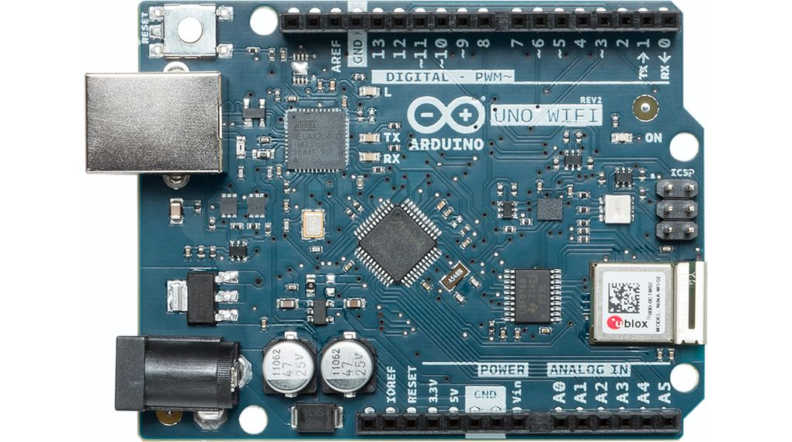
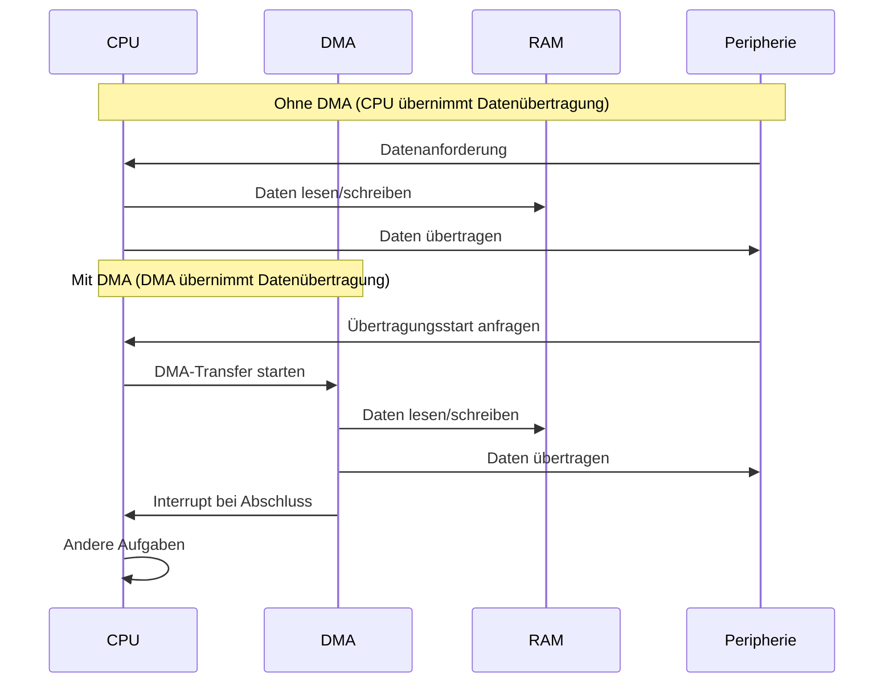
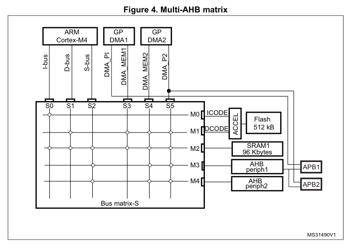
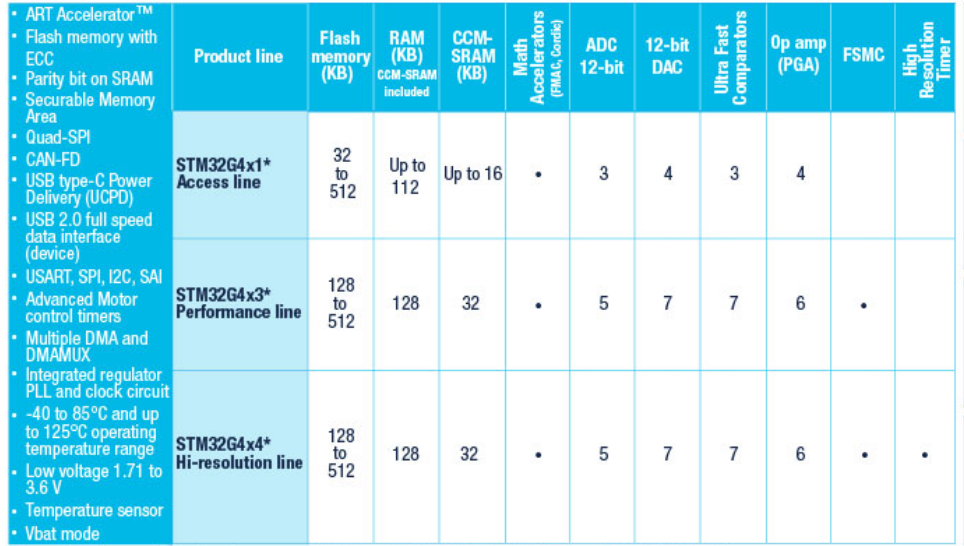
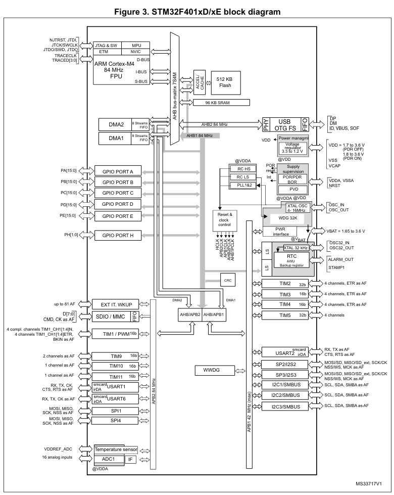
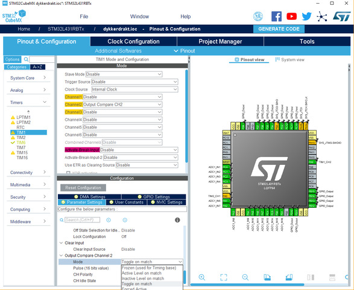

<!--
author:   Sebastian Zug, Karl Fessel & Andrè Dietrich
email:    sebastian.zug@informatik.tu-freiberg.de

version:  1.0.6
language: de
narrator: Deutsch Female

import:  https://raw.githubusercontent.com/liaScript/mermaid_template/master/README.md

icon: https://upload.wikimedia.org/wikipedia/commons/d/de/Logo_TU_Bergakademie_Freiberg.svg

-->


[](https://liascript.github.io/course/?https://github.com/TUBAF-IfI-LiaScript/VL_DigitaleSysteme/main/lectures/11_CortexMController.md#1)


# ARM Cortex M Controller

| Parameter                | Kursinformationen                                                                                                                                                                    |
| ------------------------ | ------------------------------------------------------------------------------------------------------------------------------------------------------------------------------------ |
| **Veranstaltung:**       | `Vorlesung Softwareentwicklung für eingebettete Systeme`                                                                                                                                                      |
| **Semester**             | `Sommersemester 2024`                                                                                                                                                                |
| **Hochschule:**          | `Technische Universität Freiberg`                                                                                                                                                    |
| **Inhalte:**             | `Cortex M Controller Features`                                                                                            |
| **Link auf den GitHub:** | [https://github.com/TUBAF-IfI-LiaScript/VL_DigitaleSysteme/blob/main/lectures/11_CortexMController.md](https://github.com/TUBAF-IfI-LiaScript/VL_DigitaleSysteme/blob/main/lectures/11_CortexMController.md) |
| **Autoren**              | @author                                                                                                                                                                              |


---

## Rückblick

<!--data-type="none"-->
| Arduino Uno Board                                                                                                 | Arduino Uno Wifi Rev. 2                                                                                              | Nucleo 64                                                                                      |
| ----------------------------------------------------------------------------------------------------------------- | -------------------------------------------------------------------------------------------------------------------- | ---------------------------------------------------------------------------------------------- |
| <!-- style="width: 100%; auto; max-width: 415px;" --> |  <!-- style="width: 100%; auto; max-width: 415px;" --> | <!-- style="width: 100%; max-width=315px;" --> |
| Microchip ATmega 328p                                                                                             | Microchip ATmega 4809                                                                                                | STM32F401                                                                                      |
| 8-Bit AVR Familie                                                                                                 | 8-Bit AVR Familie                                                                                                    | 32-Bit Cortex M4 Prozessor                                                                     |
| Assembler, C, C++                                                                                                 | Assembler, C, C++                                                                                                    | Assembler, C, C++, MicroPython, ...                                                            |
| avrlibc, FreeRTOS                                                                                                 | avrlibc, FreeRTOS                                                                                                    | CMSIS, mbedOS, FreeRTOS                                                                        |
| 10 Bit Analog-Digital-Wandler, 16 Bit Timer,                                                                      | 10 Bit Analog-Digital-Wandler, 16 Bit Timer, Eventsystem, programmierbare Logik, priorisierbare Interrupts           | 10 timers, 16- and 32-bit (84 MHz), 12-bit ADC                                                 |


## Was ist eigentlich ein ARM Prozessor?

> ARM-Prozessoren sind Mikroprozessoren, die nach der **ARM-Architektur** arbeiten.  Der Begriff ARM steht ursprünglich für "**Acorn RISC Machine**", später "**Advanced RISC Machines**".

--{{1}}--
Die Architektur von ARM-Prozessoren erfuhr seit 1985 zahlreiche Veränderungen, zum Beispiel bei der Zahl der Register, der Größe des Adressraumes und dem Umfang des Befehlsatzes. Sie wird daher in Versionen unterteilt, abgekürzt mit ARMv[Versionsnummer]. Beginnend mit ARMv2, wurden die Architekturversionen in mehr als nur einem Prozessordesign implementiert.

| Jahr        | Architektur | Familie                                      | Neuerungen / Features                                                                 |
|-------------|-------------|----------------------------------------------|----------------------------------------------------------------------------------------|
| 1985        | ARMv1       | ARM1                                         | Erste ARM-Architektur, 32-Bit RISC, einfacher Befehlssatz                            |
| 1986        | ARMv2       | ARM2, ARM3                                   | Multiplikationsbefehl, Unterstützung für Co-Prozessoren                              |
| 1995        | ARMv4       | ARM7TDMI, ARM8, StrongARM, ARM9TDMI          | Unterstützung für Thumb (16-Bit Kompaktmodus), Debugging (JTAG)                      |
| 2002        | ARMv5       | ARM7EJ, ARM9E, ARM10E                        | DSP-Erweiterungen, Jazelle für Java-Hardware-Beschleunigung                          |
| 2002        | ARMv6       | ARM11, Cortex-M0/M0+/M1                      | SIMD (Media Processing Engine), verbessertes Cache-System, TrustZone-Sicherheit      |
| ab 2004     | ARMv7       | Cortex-A, Cortex-R, Cortex-M                 | NEON SIMD, Virtualisierung, Thumb-2, FPU, Low-Power-Cores (Cortex-M)                 |
| ab 2012     | ARMv8       | Cortex-A, Cortex-R, Cortex-M7                | 64-Bit Unterstützung (AArch64), verbesserte Sicherheit (TrustZone), SVE (optional)   |
| ab 2021     | ARMv9       | Cortex-A, Neoverse, Cortex-X                 | Verbesserte SVE2 (SIMD für Vektorberechnungen), Confidential Computing, Scalable ML  |
| ab 2024     | ARMv9.2+    | Cortex-X4, Cortex-A720, Neoverse V2/V3       | Performance-per-Watt optimiert, neue Sicherheits-Features, besseres Branch Prediction|

> In Bezug auf das Instruktionsset werden verschiedene Befehlssätze implementiert - Thumb, Thumb-2, ARM32 und ARM64.

{{2}}
Ab der Armv7-Architektur werden die sie implementierenden Prozessorkerne drei Anwendungsfeldern zugeteilt:

+ Cortex-A (Application Profile)

  - Für komplexe, betriebssystembasierte Anwendungen (z. B. Linux, Android)
  - Mehrstufige Pipeline, Out-of-Order Execution, L1/L2-Caches
  - Unterstützt Memory Management Unit (MMU)
  - Einsatz in: Smartphones, Tablets, Embedded-Linux-Systemen

+ Cortex-M (Microcontroller Profile)

  - Für deterministische, energieeffiziente Steuer- und Regelprozesse
  - Vereinfachte Pipeline, kein MMU, stattdessen Memory Protection Unit (MPU)
  - Hohe Peripherieintegration, z. B. ADC, GPIO, Timer
  - Einsatz in: IoT, Sensorik, Industrieautomation

+ Cortex-R (Realtime Profile)

  - Für harte Echtzeitanforderungen mit deterministischem Verhalten
  - Dual-Core-Optionen mit lock-step Execution, ECC-Speicherunterstützung
  - Predictable Interrupt Latency & Tightly Coupled Memory (TCM)
  - Einsatz in: Automotive (ABS, Airbags), Medizintechnik, Speichercontroller

> Aufgabe: Recherchieren Sie die Unterschiede zwischen MMU und MPU - worin unterschieden sich die beiden Konzepte?

ARM entwickelt das Design von RISC-Prozessoren, deren Fertigung von den Lizenznehmern durchgeführt wird, zu denen die Firmen AMD, Apple, Microchip, Freescale, HiSilicon, IBM, Infineon, Intel, MediaTek, Nvidia, NXP, Qualcomm, Renesas, Samsung, Texas Instruments, ... gehören.

## Cortex M Prozessoren

> Die "Unübersichtlichkeit" geht weiter :-)

| Prozessor      | Architektur   |
|----------------|---------------|
| Cortex-M0/M1   | ARMv6-M       |
| Cortex-M3      | ARMv7-M       |
| Cortex-M4/M7   | ARMv7E-M      |

Die Unterschiede betreffen primär den Befehlssatz und die zur Verfügung stehenden Maschinenbefehle. Die Linien sind so festgelegt, dass die binären Maschinenbefehle aufwärts kompatibel sind - ein Maschinenprogramm von einem Cortex-M0 oder M1 ist ohne Veränderung auch auf einem Cortex-M3, M4 oder M7 lauffähig.

    --{{1}}--
Alle Prozessoren aus der Cortex-M-Familie unterstützen die Basisbefehle aus dem so genannten Thumb-Befehlssatz, dem Thumb-2-Befehlssatz, und bieten zusätzlich eine Multipliziereinheit in Hardware. M0 und M1 fehlen allerdings im Thumb-Befehlssatz neuere Erweiterungen. Die Einschränkungen bei M0 und M1 sind Folge der Vorgabe, die Chipfläche möglichst klein zu halten.

    --{{1}}--
Cortex-M3, mit größerer Chipfläche, umfasst den vollständigen Thumb- und Thumb-2-Befehlssatz, bietet darüber hinaus einige spezielle Instruktionen, eine eigene Divisionseinheit in Hardware und kann mathematische Befehle wie Addition statt mit Überlauf auch mit Sättigung behandeln, was insbesondere im Bereich der Signalverarbeitung von Bedeutung ist. Cortex-M4 erweitert diese Möglichkeiten um einige spezielle Befehle, wie sie bei digitalen Signalprozessoren (DSP) üblich sind, und bietet optional eine Gleitkommaeinheit für die Bearbeitung von Gleitkommazahlen nach der Norm IEEE 754 für einfache Genauigkeit.Der Cortex-M7 erweitert die Gleitkommaeinheit für die Bearbeitung von Gleitkommazahlen für doppelte Genauigkeit.

     {{1}}
<!-- data-type="none" -->
| ARM        | Thumb        | Thumb-2     | Hardware Multiplizierer | Hardwaredividierer | DSP--Erweiterung | Sättigungsarithmetik | Gleitkommaeinheit | TrustZone | ARM-Architektur      |
| ---------- | ------------ | ----------- | ----------------------- | ------------------ | ---------------- | -------------------- | ----------------- | --------- | -------------------- |
| Cortex-M0  | Größtenteils | Teilmenge   | 1 oder 32 Zyklen        | nein               | nein             | nein                 | nein              | nein      | ARMv6-M[9]           |
| Cortex-M1  | Größtenteils | Teilmenge   | 3 oder 32 Zyklen        | nein               | nein             | nein                 | nein              | nein      | ARMv6-M[9]           |
| Cortex-M3  | Vollständig  | Vollständig | 1 Zyklus                | ja                 | nein             | teilweise            | nein              | nein      | Armv7-M[10]          |
| Cortex-M4  | Vollständig  | Vollständig | 1 Zyklus                | ja                 | ja               | ja                   | Optional          | nein      | Armv7E-M[10]         |
| Cortex-M7  | Vollständig  | Vollständig | 1 Zyklus                | ja                 | ja               | ja                   | Optional          | nein      | Armv7E-M[10]         |
| Cortex-M23 | Vollständig  | Vollständig | 1 oder 32 Zyklen        | ja                 | nein             | nein                 | nein              | ja        | Armv8-M Baseline[12] |
| Cortex-M33 | Vollständig  | Vollständig | 1 Zyklus                | ja                 | ja               | ja                   | Optional          | ja        | Armv8-M[12]          |

    {{2}}
```ascii
+-----------------------------------------+
|+---------------------------------------+|                                  
|| +------------------------------------+||                               
|| | +---------------------+            |||                 
|| | | Cortex M0, M0+, M1  |            |||                 
|| | | ARMv6               |            |||                 
|| | +---------------------+            |||                 
|| |   Cortex M3                        |||       
|| |   ARMv7                            |||                            
|| |   Erweiterte Datenverarbeitung     |||                                                      
|| |   Bit Operationen                  |||                                          
|| |   Multiplikations/Addtionseinheit  |||                                                         
|| +------------------------------------+||                                                              
||     Cortex-M4                         ||              
||     Digitaler Signal Prozessor        ||          
||     optionale FPU Einheit             ||                                             
|+---------------------------------------+|                                                               
|      Cortex-M7F                         |  
|      Erweiterter Signalprozessor        |      
|      optionale FPU Einheit              |                                            
+-----------------------------------------+                                    .
```

### Memory Protection Unit (MPU)

Die **Memory Protection Unit (MPU)** ist eine optionale Hardware-Komponente in ARM-Prozessoren, die zur **Speicherverwaltung und zum Schutz** dient. Sie ermöglicht es dem System, bestimmte Bereiche des Speichers mit **Zugriffsrechten und Attributen** zu versehen.

Warum ist die MPU notwendig?

- **Sicherheit:** Verhindert, dass bösartiger oder fehlerhafter Code auf kritische Speicherbereiche zugreift (z.B. durch Stack-Überlauf, unerlaubter Zugriff auf Konfigurationsregister). Dies ist besonders wichtig in Multi-Tasking-Umgebungen.
- **Robustheit:** Schützt das System vor Abstürzen, die durch unbeabsichtigte Speicherzugriffe verursacht werden könnten.
- **Betriebssysteme (RTOS):** Ermöglicht die Trennung von Speichern für verschiedene Aufgaben/Threads (z.B. strikte Trennung von User-Space und Kernel-Space).
- **Fehlererkennung:** Hilft, Programmierfehler, die zu Speicherverletzungen führen, frühzeitig zu erkennen und das System in einen definierten Fehlerzustand zu überführen.

Die MPU arbeitet, indem sie den gesamten adressierbaren Speicher in diskrete **Regionen** unterteilt. Jede dieser Regionen kann unabhängig konfiguriert werden.

Jede MPU-Region wird durch folgende Parameter definiert:

- **Basisadresse:** Die Startadresse der Region im Speicher.
- **Größe:** Die Größe der Region. Diese muss immer eine Zweierpotenz sein (z.B. 32 Bytes, 64 Bytes, ..., 4GB) und darf die Adressbreite des Systems nicht überschreiten.- - **Zugriffsberechtigungen (Access Permissions - AP):** Legen fest, wer (privilegiert oder unprivilegiert) auf die Region zugreifen darf und wie (lesen, schreiben, ausführen).
- **Speicherattribute (Memory Attributes - TEX, S, C, B):** Steuern, wie der Speicher von Caches und Puffern behandelt werden soll (z.B. Cacheable, Non-Cacheable, Write-Through, Write-Back, Shareable). Dies ist entscheidend für die Performance und Datenkonsistenz.
- **Execute Never (XN):** Ein Bit, das die Ausführung von Code aus dieser Region verbietet. Sehr wichtig für Datensegmente, um Code-Injektionen zu verhindern.


```c
// Im TCB (Task Control Block) für jeden Task
typedef struct {
    // ... andere Task-spezifische Daten ...
    MPU_Region_Config_t mpu_regions[MAX_TASK_MPU_REGIONS]; // Array von MPU-Regionen für diesen Task
    uint32_t num_mpu_regions;
} Task_TCB_t;

// Im Context-Switcher des RTOS (Ausschnitt)
void context_switch_to_task(Task_TCB_t *next_task) {
    // 1. MPU deaktivieren (vor dem Laden neuer Konfigurationen)
    SCB->MPU_CTRL = 0;
    __DSB(); // Data Synchronization Barrier
    __ISB(); // Instruction Synchronization Barrier

    // 2. MPU-Regionen des nächsten Tasks laden
    for (int i = 0; i < next_task->num_mpu_regions; i++) {
        SCB->MPU_RNR = next_task->mpu_regions[i].region_number;
        SCB->MPU_RBAR = next_task->mpu_regions[i].base_address;
        SCB->MPU_RASR = next_task->mpu_regions[i].attributes_and_size;
    }

    // Optional: Alle nicht verwendeten Regionen deaktivieren, um Lecks zu verhindern
    for (int i = next_task->num_mpu_regions; i < MAX_MPU_REGIONS_SUPPORTED; i++) {
        SCB->MPU_RNR = i;
        SCB->MPU_RASR = 0; // Region deaktivieren
    }


    // 3. MPU reaktivieren und PRIVDEFENA (falls benötigt)
    SCB->MPU_CTRL = MPU_CTRL_ENABLE_Msk | MPU_CTRL_PRIVDEFENA_Msk; // MPU aktivieren + Default Map für Privilegiertes

    __DSB(); // Data Synchronization Barrier
    __ISB(); // Instruction Synchronization Barrier

    // 4. Den Prozessor in den unprivilegierten Modus versetzen (wird oft automatisch vom Exception-Return-Mechanismus des Kernels übernommen)
    // Beispiel: CONTROL_nPRIV Bit setzen, bevor zum Task zurückgekehrt wird.
    // __set_CONTROL( __get_CONTROL() | CONTROL_nPRIV_Msk );
}
```

### Floating Point Unit (FPU) 

Eine Fließkommaeinheit ist ein Teil eines Computersystems, der speziell für die Durchführung von Operationen mit Fließkommazahlen ausgelegt ist. Typische Operationen sind Addition, Subtraktion, Multiplikation, Division und Quadratwurzel.


- Cortex-M4: optionale Single-Precision FPU (IEEE 754)
- Cortex-M7: erweiterte FPU, optional auch Double-Precision (64-bit)
- Cortex-M0/M1/M3: keine FPU, Gleitkommaoperationen laufen in Software

| Quelle / Studie              | Beschleunigungsfaktor (ca.) | Kontext                             |
| ---------------------------- | --------------------------- | ----------------------------------- |
| ARM Cortex-M4 vs. Soft-Float | 10x – 30x                   | DSP-typische Fließkommaoperationen  |
| Embedded DSP-Anwendungen     | 20x – 40x                   | Signalverarbeitung (z.B. Filterung) |
| Wissenschaftliche Benchmarks | bis zu 50x                  | Matrixmultiplikation, FFT etc.      |


### Digital Signal Processing (DSP) 

- **SIMD-Instruktionen (Single Instruction Multiple Data):**  
  Erlauben parallele Verarbeitung von mehreren Datenpunkten in einem einzigen Befehl (z.B. 16-Bit oder 8-Bit Samples).

- **Sättigungsarithmetik:**  
  Verhindert Überläufe durch Begrenzung von Rechenergebnissen, wichtig bei Audio- und Bildverarbeitung.

- **Hardware-Multiplizierer und MAC (Multiply-Accumulate):**  
  Ermöglicht schnelle Ausführung von Filteroperationen und Fourier-Transformationen.

- **Barrel Shifter:**  
  Beschleunigt Bitverschiebungen, häufig benötigt in Signalmanipulationen.


```c
#include <arm_acle.h> // Für ARM Intrinsics
#include <stdint.h>   // Für int16_t und uint32_t

void add_arrays_simd_safe(const int16_t *a, const int16_t *b, int16_t *result, int length) {
    int i;
    // Check einfügen, dass die Länge gerade ist
    // ...
    for (i = 0; i < length; i += 2) {
        // Explizites Packen der 16-Bit-Werte in 32-Bit unsigned int
        // a[i] geht in die unteren 16 Bits, a[i+1] in die oberen 16 Bits.
        uint32_t val_a_packed = ((uint32_t)a[i+1] << 16) | (uint16_t)a[i];
        uint32_t val_b_packed = ((uint32_t)b[i+1] << 16) | (uint16_t)b[i];

        // SIMD Add mit Sättigung
        uint32_t val_r_packed = __qadd16(val_a_packed, val_b_packed);

        // Explizites Entpacken der 32-Bit-Ergebnisse zurück in 16-Bit-Werte
        result[i] = (int16_t)(val_r_packed & 0xFFFF);       // Untere 16 Bit
        result[i+1] = (int16_t)(val_r_packed >> 16);        // Obere 16 Bit
    }
}
```

https://arm-software.github.io/CMSIS_5/Core/html/group__intrinsic__SIMD__gr.html

### Direct memory access (DMA)

Direkter Speicherzugriff (DMA) ist eine Funktion von Computersystemen, die es bestimmten Hardware-Subsystemen ermöglicht, unabhängig von der Zentraleinheit (CPU) auf den Hauptsystemspeicher (Random-Access Memory) zuzugreifen. 



> Vorteil: Effizientere CPU-Auslastung und schnellere Datenverarbeitung

### SysTick Timer

Was ist der SysTick?

- Ein **24-bit Zähler**, integriert in jeden **ARM Cortex-M-Kern**
- Teil der **Cortex-M Systemsteuerungseinheit** (System Control Block)
- Läuft mit dem **Prozessortakt** oder einem separaten Takt
- Wird meist im **periodischen Modus** betrieben

Anwendungsfälle

- **Zeitgeber für Echtzeitanwendungen**  
- **Trigger für Taskwechsel in RTOS** (z. B. FreeRTOS, Zephyr)  
- **Systemheartbeat / zyklischer Interrupt**  
- **Benchmarking / Profiling von Codeabschnitten**

Daraus ergeben sich folgende Abläufe

1. SysTick wird mit gewünschtem Intervall (z. B. 1 ms) konfiguriert  
2. Er erzeugt periodisch einen **SysTick-Interrupt**  
3. Der RTOS-Kernel nutzt diesen Interrupt für:
   - Zeitverwaltung (`xTaskIncrementTick`)
   - Taskwechsel (`vTaskSwitchContext`)

### Bussysteme

Zudem werden die erweiterten Componenten durch ein mehrteiliges Bussystem verknüpft:

| Bus                  | Bedeutung       |
| -------------------- | --------------- |
| I-Bus                | Instruction Bus |
| D-Bus                | Datenbus        |
| S-Bus                | System Bus      |
| DMA Bus Verbindungen |                 |
| USB On-the-go        |                 |

Diese Bus Ausgänge des Core werden auf unterschiedliche Busse im Controller abgebildet.



[^STM32]: Firma ST, STM32F401xx Controller Data Sheet, [Link](https://www.st.com/resource/en/reference_manual/dm00096844-stm32f401xbc-and-stm32f401xde-advanced-armbased-32bit-mcus-stmicroelectronics.pdf)

## Hersteller

Unter anderem bieten folgende Halbleiterhersteller Cortex-M4 basierende Mikrocontroller an:

+ Atmel: SAM4-Familie (Cortex-M4)
+ Freescale: Kinetis-Familie (Cortex-M4 und Cortex-M4F)
+ Infineon: XMC4000-Familie (Cortex-M4F)
+ NXP: LPC40xx- und LPC43xx-Familien (Cortex-M4)
+ STMicroelectronics: STM32-F4, L4-, F3-, G4-Familien (Cortex-M4F)
+ Texas Instruments: Stellaris-LM4F- und Tiva-TM4C-Familie (Cortex-M4F)
+ Toshiba: TX04-Familie (Cortex-M4F)
+ ...

Um das Bezeichnungsgewirr komplett zu machen, führen die Hersteller, hier STMicroelectronics (STM), dann noch eigene Bezeichnungen ein:

| STM32 Series           | ARM CPU Core |
| ---------------------- | ------------ |
| L5                     | Cortex-M33F  |
| F7, H7                 | Cortex-M7F   |
| F3, F4, G4, L4, L4+, J | Cortex-M4F   |
| F1, F2, L1, W, J       | Cortex-M3    |
| G0, L0, J              | Cortex-M0+   |
| F0, J                  | Cortex-M0    |


## Microchip STM32F

Die STM32 F4-Serie ist die erste Gruppe von STM32-Mikrocontrollern, die auf dem ARM Cortex-M4F-Kern basieren und über DSP- und Fließkomma-Befehle verfügt. Die F4-Serie ist Pin-zu-Pin-kompatibel mit der STM32 F2-Serie und bietet zusätzlich eine höhere Taktrate, 512 KB Flash Memory, bis zu 96 Kbytes SRAM, Full-Duplex I2S, eine Echtzeituhr und schnellere ADCs. Die Betriebsspannungsbereich beträgt 1,8 bis 3,6 Volt.





[^STM32]: Firma ST, STM32F401xx Controller Data Sheet, [Link](https://www.st.com/resource/en/reference_manual/dm00096844-stm32f401xbc-and-stm32f401xde-advanced-armbased-32bit-mcus-stmicroelectronics.pdf)

[^STM32]: Firma ST, STM32F401xx Controller Data Sheet, [Link](https://www.st.com/resource/en/reference_manual/dm00096844-stm32f401xbc-and-stm32f401xde-advanced-armbased-32bit-mcus-stmicroelectronics.pdf)

## Programmierung

**ARM Cortex Microcontroller Software Interface Standard **

Die CMSIS  ist eine Library von ARM für den Zugriff auf die herstellerübergreifenden Funktionen des ARM-Cores. Hierzu gehört bei den Cortex-M4F-Cores auch die DSP und Floating-Point Funktionalität.

```ascii

      +--------------------------------------------------------------------+       
      |                        Application Code                            |                  
      +--------------------------------------------------------------------+        
            |           |      |             |                    |                
            |           | +--------+  +------------+              |               
            |           | |  RTOS  |  | Middleware |              |               
            |           | | Kernel |  | Components |              |               
            |           | +--------+  +------------+              |               
            |           |      |             |                    |
            |           v      v             v                    v            
      +-----|---+--------------------------------------+--------------------+                           
CMSIS |     |   | Core Peripheral | Middleware Access  |  Device Peripheral |
      |     |   |    Functions    |    Functions       |       Functions    |                     
      |     v   +-----------------+--------------------+--------------------+       
      |   Peripheral Register & Interrupt Vector Definitions                |                  
      +---------------------------------------------------------------------+                    
            |             |           |            |               |
            v             v           v            v               v
      +---------+  +------------+  +------+  +-------------+  +-------------+                        
MCU   | Cortex  |  | SysTick    |  | NVIC |  | Debug/Trace |  | other       |                      
      |  CPU    |  | RTOS Timer |  |      |  |  Interface  |  | Peripherals |                    
      +---------+  +------------+  +------+  +-------------+  +-------------+                       
```

Im Rahmen der CMSIS-Implementierung wurden die Headerdateien standardisiert, der Zugriff auf die Register erfolgt per Peripheral->Register. Die CMSIS C-Dateien bzw. Header enthalten auch Anpassungen für die verschiedenen Compiler. Die Portierung eines Real-Time-Betriebsystems sollte unter Verwendung der CMSIS, für Chips der verschiedenen Hersteller, stark vereinfacht möglich sein (z.B. einheitliche Adressen für Core-Hardware/Sys-Tick-Counter).

```c
#include "cmsis_os.h"                           // CMSIS RTOS header file

osThreadId thread1_id;

void job1 (void const *argument)  {             // thread function 'job1'
  while (1)  {
    //...                                       // execute some code
    osDelay (10);                               // delay execution for 10ms
  }
}
// define job1 as thread function
osThreadDef(job1, osPriorityAboveNormal, 1, 0);
int main (void)
{
  // ...
  thread1_id = osThreadCreate(osThread(job1), NULL);
  //...
}
```

> Die Dokumentation der aktuellen CMSIS findet sich unter anderem unter [Link](https://www.keil.com/pack/doc/cmsis/RTOS/html/group__CMSIS__RTOS__ThreadMgmt.html)

!?[alt-text](https://www.youtube.com/watch?v=ttXW58-drYw)

**HAL**

Der STM32CubeMX, ein grafisches Software-Konfigurationswerkzeug, das die Generierung von C-Initialisierungscode mithilfe grafischer Assistenten ermöglicht. Der STM32Cube Hardware Abstraction Layer (HAL), eine STM32 Abstraktionsschicht für eingebettete Software, die maximale Portabilität über den STM32 Mikrocontroller hinweg gewährleistet. Der HAL ist für die gesamte Hardware-Peripherie verfügbar.

")



Die Low-Layer-APIs (LL) bieten eine expertenorientierte Schicht, die näher an der Hardware ist als der HAL. Die LL-APIs sind nur für eine Reihe von Peripheriegeräten verfügbar.

HAL und LL sind komplementär und decken ein breites Spektrum von Anwendungsanforderungen ab:

+ Die HAL bietet High-Level- und funktionsorientierte APIs mit einem hohen Portabilitätsniveau. Sie verbergen die Komplexität der MCU und der Peripherie für den Endanwender.
+ Die LL bietet Low-Level-APIs auf Registerebene, mit besserer Optimierung, aber weniger Portabilität. Sie erfordern tiefe Kenntnisse der MCU- und Peripheriespezifikationen.

Der Quellcode der HAL- und LL-Treiber ist in ANSI-C entwickelt, was ihn unabhängig von den Entwicklungswerkzeugen macht.

**Alternative Framesworks**

+ Standard-Peripherie-Bibliothek (veraltet) - Die ST Standard Peripheral Library bietet eine Reihe von Funktionen für den Umgang mit der Peripherie auf den Mikrocontrollern der STM32 Familie.

+ libopencm3 - Das libOpenCM3-Framework zielt darauf ab, eine freie und quelloffene Firmware-Bibliothek für verschiedene ARM Cortex-M0(+)/M3/M4-Mikrocontroller zu erstellen.

+ Zephyr RTOS - Das Zephyr-Projekt ist ein skalierbares Echtzeit-Betriebssystem (RTOS), das mehrere Hardware-Architekturen unterstützt, für ressourcenbeschränkte Geräte optimiert ist und mit Blick auf Sicherheit und Schutz entwickelt wurde.

+ Mbed OS - Arm Mbed OS ist ein Open-Source-Embedded-Betriebssystem, es enthält alle Funktionen, die Sie für die Entwicklung eines vernetzten Produkts auf Basis eines Arm Cortex-M-Mikrocontrollers benötigen, einschließlich Sicherheit, Konnektivität, einem RTOS und Treibern für Sensoren und E/A-Geräte.

## Beispiele


[Usermanual des Boards](https://usermanual.wiki/Pdf/UM1724UserManualSTM32Nucleo64boards.913537569/view)

| Index | Basis der Umsetzung | Weiterführende Links                                                                       |
| ----- | ------------------- | ------------------------------------------------------------------------------------------ |
| 1     | CMSIS               | [ARM CMSIS](https://developer.arm.com/tools-and-software/embedded/cmsis)                   |
| 2     | HAL                 | [STM HAL Tutorials](http://stm32f4-discovery.net/2014/09/stm32f4-tutorials-one-place/)     |
| 3     | HAL mit STM32CubeMX |                                                                                            |
| 4     | mbed                | [mbedOS Einführung](https://os.mbed.com/docs/mbed-os/v6.12/introduction/architecture.html) |

!?[](https://www.youtube.com/watch?v=eumKLXNlM0U)

")

## Grundsätzliche Fragen

Warum sollte ich umsteigen?
================================

| Merkmal                             | AVR (z. B. ATmega328)     | ARM Cortex-M (z. B. STM32, RP2040, Teensy) |
| ----------------------------------- | ------------------------- | ------------------------------------------ |
| **Taktfrequenz**                    | typ. 16 MHz               | typ. 48–600 MHz                            |
| **Flash**                           | 32 KB                     | 256 KB – mehrere MB                        |
| **RAM**                             | 2 KB                      | 32 KB – mehrere MB                         |
| **ADC-Auflösung**                   | 10 Bit                    | 12–16 Bit                                  |
| **DMA-Unterstützung**               | Nein                      | Ja (bei vielen ARM-Chips)                  |
| **USB nativ**                       | Nur über externen Wandler | USB nativ (CDC, HID, MSC, MIDI…)           |
| **Mehrere Serielle Schnittstellen** | Meist 1–2                 | Viele (UART, I²C, SPI, CAN etc.)           |
| **Energieeffizienz**                | Gut                       | Oft besser durch Sleep-Modi                |
| **FPU (Floating Point Unit)**       | Nein                      | Ja (bei Cortex-M4/M7/F7 etc.)              |

Brauche ich den ganzeen Embedded-Kram denn?
================================

| Aspekt                          | **C / C++**                        | **MicroPython**                          |
| ------------------------------- | ---------------------------------- | ---------------------------------------- |
| **Performance**                 | Sehr hoch – direkter Maschinencode | Deutlich langsamer – Interpreter         |
| **Echtzeitverhalten**           | Deterministisch, präzise Timing    | Schlechtere Latenz, keine harte Echtzeit |
| **Speicherauslastung**          | Minimal, volle Kontrolle           | Höherer RAM- und Flash-Bedarf            |
| **Peripheriezugriff**           | Direkt (Register, HAL, LL)         | Eingeschränkt, oft über Wrapper          |
| **Toolchain**                   | Komplexer (Compiler, Debugger)     | Sehr einfach (REPL, USB-DragDrop)        |
| **Entwicklungsgeschwindigkeit** | Langsamer (kompilieren, flashen)   | Sehr schnell (live testen, REPL)         |
| **Debugging**                   | Leistungsstark (SWD, Breakpoints)  | Eingeschränkt (print, rudimentär)        |
| **Lernkurve**                   | Steil                              | Flach                                    |
| **Community-Beispiele**         | Viele (STM32 + C)                  | Weniger, aber wachsend                   |


