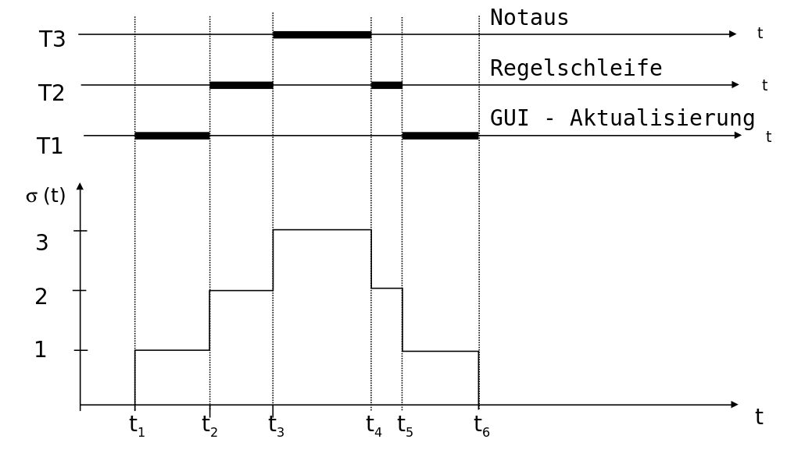

<!--
author:   Sebastian Zug, Karl Fessel & Andrè Dietrich
email:    sebastian.zug@informatik.tu-freiberg.de

version:  1.2.0
language: de
narrator: Deutsch Female

import:  https://raw.githubusercontent.com/liascript-templates/plantUML/master/README.md
         https://github.com/LiaTemplates/AVR8js/main/README.md
         https://github.com/LiaTemplates/Pyodide

icon: https://upload.wikimedia.org/wikipedia/commons/d/de/Logo_TU_Bergakademie_Freiberg.svg
-->


[](https://liascript.github.io/course/?https://github.com/TUBAF-IfI-LiaScript/VL_SoftwareentwicklungEingebetteteSysteme/main/lectures/07_RTOS_Konzepte.md#1)


# RTOS-Konzepte & Task-Modell

| Parameter                | Kursinformationen                                                                                                                                                                                    |
| ------------------------ | ---------------------------------------------------------------------------------------------------------------------------------------------------------------------------------------------------- |
| **Veranstaltung:**       | `Vorlesung Softwareentwicklung für eingebettete Systeme`                                                                                                                                             |
| **Semester**             | `Sommersemester 2026`                                                                                                                                                                                |
| **Hochschule:**          | `Technische Universität Freiberg`                                                                                                                                                                    |
| **Inhalte:**             | `RTOS-Konzepte: Task-Modell, Zustände, WCET/BCET-Analyse, Schedulability`                                                                                                                           |
| **Link auf den GitHub:** | [https://github.com/TUBAF-IfI-LiaScript/VL_SoftwareentwicklungEingebetteteSysteme/blob/main/lectures/07_RTOS_Konzepte.md](https://github.com/TUBAF-IfI-LiaScript/VL_SoftwareentwicklungEingebetteteSysteme/blob/main/lectures/07_RTOS_Konzepte.md) |
| **Autoren**              | @author                                                                                                                                                                                              |


---

## Ausgangspunkt und Begriffe

> **Wo stehen wir?** In den Vorlesungen 02–06 lag der Fokus auf *einer* Aufgabe auf *einer* Hardware: Wir haben Register über MMIO angesprochen, Interrupts konfiguriert und mit dem Cortex-M eine 32-bit-Plattform kennengelernt. Ab jetzt drehen wir die Perspektive um: Wie bringt man *viele* Aufgaben mit *unterschiedlichen Zeitanforderungen* auf einem (oder wenigen) Prozessor(en) unter? Das ist der Sprung von der Maschine zum **Betriebssystem-Konzept** – und damit zur Frage, was ein *Echtzeit*-Betriebssystem (RTOS) leisten muss.

Nehmen wir an, dass wir ein autonom fahrendes Fahrzeug allein mit einem zentralen Rechner betreiben wollen. Welche Aufgaben müssen dabei abgedeckt werden und welche zeitlichen Eigenschaften sind dabei zu berücksichtigen?

<!--
style="width: 80%; min-width: 420px; max-width: 720px;"
-->
```ascii
                                          zeitliche Toleranz
                        gering                                            hoch
                        "$\mu s$                                           $s$"
                        ^
aperiodische Aufgaben   |         x                x                   x     
                        |       Not-             Automatisches       Klima-  
                        |       bremsassistent   Fernlicht           anlage  
                        |                                                    
periodische Aufgaben    |    x                  x                      X     
                        |  Motorsteuerung     Abstands-              GNSS    
                        |                     regelung               messung 
                        +----------------------------------------------------->   .
```

Entsprechend gilt es eine beschränkte Zahl von Ressourcen auf eine Vielzahl von Aufgaben unterschiedlicher Priorität abzubilden.

> [!IMPORTANT]
> **Merke:**  Echtzeitbetrieb nach DIN 44300 … Ein Betrieb eines Rechensystems, bei dem Programme zur Verarbeitung anfallender Daten ständig betriebsbereit sind, derart, dass die Verarbeitungsergebnisse innerhalb einer vorgegebenen Zeitspanne verfügbar sind. Die Daten können je nach Anwendungsfall nach einer zeitlich zufälligen Verteilung oder zu vorherbestimmten Zeitpunkten anfallen.


$$
r + \Delta e \leq d
$$


Die Endzeit $d$ wird durch die Bereitzeit $r$ und die Zeitdauer der Ausführung $\Delta e$ unterschritten.

+ _Harte Echtzeit_ (Rechtzeitigkeit - timeliness) 	= die Abarbeitung einer Anwendung wird innerhalb eines bestimmten Zeithorizontes umgesetzt

+ _Weiche Echtzeit_ = es genügt, die Zeitbedingungen für den überwiegenden Teil der Fälle zu erfüllen, geringfügige Überschreitungen der Zeitbedingungen sind erlaubt

## Intuitive Lösung - Nanokernel

Echtzeitimplementierung als „nanokernel“

+ Ausrichtung an einer minimalen festen Periode $p$
+ Evaluation des Laufzeitverhaltens aller Tasks zwingend notwendig
+ keine Schutzfunktionen des Speichers
+ Polling als einzige Zugriffsfunktion auf die Hardware

```c
switch off interrupts
setup timer
c = 0;
while (1) {
   suspend until timer expires
   c++;
   Task0();    //do tasks due every cycle
   if (((c+0) % 2) == 0)
      Task1(); //do tasks due every 2nd cycle
   if (((c+1) % 3) == 0)
      Task2(); //do tasks due every 3rd cycle, with phase 1
...
}
```

Die zugrunde liegende (oft unausgesprochene) Annahme lautet, dass die Summe aller in *einem* Tick fälligen Tasks – jeweils mit ihrer **WCET** – in eine Periode passt:

$$\sum_{i \text{ fällig in Tick } c} \Delta e_i^{\text{WCET}} \;\leq\; p$$

Welche Tasks fällig sind, hängt vom Zählerstand `c` ab. Spielt man das Muster über eine **Superperiode** $\text{kgV}(2,3)=6$ durch, zeigt sich, in welchem Tick der **Lastgipfel** liegt:

| `c` | Task0 | Task1 (`c%2==0`)  | Task2 (`(c+1)%3==0`) | fällig in diesem Tick                |
| :-: | :---: | :---------------: | :------------------: | ------------------------------------ |
|  0  |   ✓   |   ✓ (0 gerade)    |   – ((0+1)%3=1)      | Task0 + Task1                        |
|  1  |   ✓   |        –          |   – ((1+1)%3=2)      | Task0                                |
|  2  |   ✓   |        ✓          |   ✓ ((2+1)%3=0)      | **Task0 + Task1 + Task2 ← Maximum**  |
|  3  |   ✓   |        –          |   –                  | Task0                                |
|  4  |   ✓   |        ✓          |   –                  | Task0 + Task1                        |
|  5  |   ✓   |        –          |   ✓ ((5+1)%3=0)      | Task0 + Task2                        |
|  6  |   ✓   |        ✓          |   –                  | Task0 + Task1 (= wie `c=0`, Muster wiederholt sich) |

Der dimensionierende Tick ist hier `c=2`: Dort fallen **alle drei** Tasks zusammen – an *diesem* Lastgipfel (nicht am Durchschnitt!) muss sich die Periode $p$ messen lassen.

Wird das verletzt, ist `suspend until timer expires` wirkungslos (der Timer ist bereits abgelaufen), und der Takt reißt – *ohne* dass das System es bemerkt. Die kritischen Szenarien:

> [!IMPORTANT]
> Der Worst Case ist hier **deterministisch konstruierbar** – das ist die Stärke. Aber er bietet *keine* Reserve und *keine* Fehlererkennung: Bei korrekter Auslegung volle Vorhersagbarkeit, bei Fehlauslegung totales Versagen. Genau weil ein einziger zu langer Task *alles* blockiert und Prioritäten unmöglich sind, brauchen wir ein echtes Scheduling.

| Vorteile                                     | Nachteile                                    |
| -------------------------------------------- | -------------------------------------------- |
| + Einfache Umsetzbarkeit auf Mikrocontroller | - keine expliziten Prioritäten               |
| + Vereinfachter Hardwarezugriff              | - keine Adaption zur Laufzeit                |
|                                              | - keine Interrupts / Unterbrechung           |
|                                              | - beschränkte Wiederverwendbarkeit des Codes |
|                                              | - implizite Zeitannahmen                     |

> **Wir benötigen ein systematisches Scheduling, dass eine variable Komposition der Tasks zulässt!**

## Scheduling Grundlagen


### Taskmodel

                                         {{0-1}}
*********************************************************************

> [!IMPORTANT]
> Eine Task ist die Ausführung eines sequentiellen Programms auf einem Prozessor in seiner spezifischen Umgebung (Kontext). Eine Task...
> 
> + erfüllt eine von Programm spezifizierte Aufgabe
> + ist Träger der Aktivität = Abstraktion der Rechenzeit die kleinste planbare Einheit

<div style="display: flex; flex-wrap: wrap; gap: 1.5rem; align-items: flex-start;">

<div style="flex: 1 1 260px; min-width: 240px;">

```text @plantUML.png
@startuml
hide empty description
[*] -[#0000FF]-> ready : generate
waiting --> ready : release
ready --> running : start
running --> ready  : preempt
running --> waiting  : wait
running --> suspended  : terminate
suspended --> ready  : activate
suspended --> [*]  : deleted
@enduml
```

</div>

<div style="flex: 2 1 380px; min-width: 320px;">

| Zustand     | Bedeutung                                                                                                                                                                                            |
| ----------- | ---------------------------------------------------------------------------------------------------------------------------------------------------------------------------------------------------- |
| _waiting_   | Der Task ist *blockiert*: Er wartet auf ein Ereignis oder ein Betriebsmittel (z.B. Ablauf eines Timers, Ende eines I/O-Zugriffs, Freigabe eines Semaphors) und ist deshalb *nicht* einplanbar. Sobald die Bedingung erfüllt ist (_release_), wechselt er nach _ready_. Im Unterschied zu _suspended_ ist diese Wartesituation **task-intern** und ergibt sich aus dem Programmablauf selbst. |
| _ready_     | Der Scheduler wählt aus der Liste der Tasks denjenigen lauffähigen Prozess als nächstes zur Bearbeitung aus, der die höchste Priorität hat. Mehrere Tasks können sich im Zustand _ready_ befinden. |
| _running_   |    In einem Ein-Prozessorsystem kann immer nur ein Task aktiv sein. Er bekommt die CPU zugeteilt und wird ausgeführt, bis er entweder (1) terminiert (Zustand _suspended_), (2) auf ein Betriebsmittel warten muss und nach _waiting_ wechselt (z.B. auf das Ende eines I/O-Aufrufes), oder (3) durch einen höherprioren, bereit gewordenen Task verdrängt wird (_preempt_) und zurück nach _ready_ geht.                                                                                                                                                                                                 |
| _suspended_ |         Ein Task wird in den Zustand _suspended_ versetzt, wenn er **von außen** (durch das System oder einen anderen Task) angehalten bzw. beendet wurde und nicht von sich aus wieder lauffähig wird. Erst eine explizite Aktivierung (_activate_) bringt ihn zurück nach _ready_; andernfalls wird er gelöscht. In manchen RTOS heißt dieser Zustand auch _dormant_ – die Task existiert, nimmt aber nicht am Scheduling teil.                                                                                                                                                                                               |

</div>

</div>

< [!IMPORTANT]
> Das Modell hier beschreibt eine Scheduling-Einheit auf einem Core ohne Speicherschutz — also bewusst die Welt eines MCU-RTOS. Linux/Windows fügen drei orthogonale Dimensionen hinzu: Prozess/Thread-Trennung, virtueller Speicher (Page-Faults als versteckte Zustände) und Multicore, plus eine Zoo von Wartezuständen und Fairness-Mechanismen — alles Dinge, die man für harte Echtzeit vermeidet, nicht anstrebt.

*********************************************************************

                                         {{1-2}}
*********************************************************************

> **Aufgabe:** Grenzen Sie den Taskbegriff von Prozessen und Threads ab.

<details>
<summary>Lösungsvorschlag</summary>

Die drei Begriffe beschreiben *Ausführungseinheiten*, unterscheiden sich aber in Schutz, Speicher und typischem Einsatzkontext:

| Begriff     | Eigener Adressraum?            | Kontext (was wird gesichert)        | Typischer Kontext                         |
| ----------- | ----------------------------- | ----------------------------------- | ----------------------------------------- |
| **Prozess** | ja (durch MMU getrennt)       | vollständig: Speicher, Register, …  | "großes" OS (Linux), Speicherschutz       |
| **Thread**  | nein – teilt sich den des Prozesses | nur Register + eigener Stack   | Nebenläufigkeit *innerhalb* eines Prozesses |
| **Task**    | meist nein (gemeinsamer RAM)  | Register + Stack (Task-Kontext)     | RTOS auf MCU – die kleinste planbare Einheit |

Kernpunkte für eingebettete Systeme:

- Auf einem **Cortex-M ohne MMU** (siehe L06) gibt es *keinen* harten Adressraum-Schutz zwischen Tasks – eine MPU kann höchstens Bereiche grob abschotten. Eine RTOS-„Task" entspricht damit technisch eher einem **Thread** als einem Linux-Prozess.
- „Task" ist der **scheduling-zentrierte** Begriff: Es ist die Einheit, der der Scheduler Rechenzeit zuteilt – mit eigenen Zeitparametern ($r_i$, $\Delta e_i$, $d_i$, $p_i$).
- Der **Kontextwechsel** ist bei Tasks/Threads billig (nur Registersatz + Stackpointer), bei Prozessen teuer (zusätzlich MMU/TLB umladen – nicht-deterministisch, vgl. die Determinismus-Diskussion in L06).

</details>

*********************************************************************

### Charakterisierung von Tasks

1. **Zeitverhalten**

_Periodische Tasks_ ... werden mit einer bestimmten Frequenz $f$ regelmäßig aktiviert.

- Durchlaufen einer Regelschleife
- Pollendes Abfragen eines Sensors

_Aperiodische Tasks_ ... lassen sich  nicht auf ein zeitlich wiederkehrendes Muster abbilden.

- Tastendruck auf einem Bedienfeld
- Freefall-Detektion

_Sporadische Tasks_ ... treten nicht regulär auf. Man nimmt aber eine obere Schranke bzgl. der Häufigkeit ihres Aufrufs an.

- Fahrradtacho (obere Schranke = Geschwindigkeit)
- Anfragen auf einer Kommunikationsschnittstelle

{{1-3}}
*****************************************************************************

2. **Abhängigkeiten**

_unabhängige Tasks_  ... können in jeder beliebigen Reihenfolge ausgeführt werden
_abhängige Tasks_ ... werden durch Vorgänger-Relationen beschrieben und in einem Precedencegraphen dargestellt

Am Beispiel einer Sensor-Aufbereitung: Die Filterschritte bilden eine **erzwungene Reihenfolge** (Pipeline) – Ausreißer/Spikes müssen *zuerst* entfernt werden, da sie sonst die Offset-Schätzung und die Rauschglättung verfälschen. Erst nach der Linearisierung darf der Graph *verzweigen*: Aus demselben aufbereiteten Signal lassen sich **Messwert** und **Validitätskennzahl** unabhängig (also potenziell parallel) berechnen, bevor sie zum gemeinsamen Datenset zusammengeführt werden. Der Graph zeigt damit beides – wo Reihenfolge zwingend ist und wo Parallelität zulässig bleibt.

<!--
style="width: 80%; min-width: 420px; max-width: 720px;"
-->
```ascii
                            Auslesen des
                              Sensors
                                 |
                                 v
                            Ausreißer
                            entfernen
                                 |        
                                 v         
                              Offset
                            korrigieren
                                 |
                                 v
                             Rauschen
                              filtern
                                 |
                                 v
                            Messungen
                          linearisieren
                                 |
              +------------------+------------------+
              |                                     |
              v                                     v
          Messwert                             Validität /
         aufbereiten                          Plausibilität
              |                                 bewerten
              |                                     |
              +------------------+------------------+
                                 |
                                 v
                             Datenset
                           kommunizieren                                       .
```

*****************************************************************************

          {{2-3}}
*****************************************************************************

3. **Unterbrechbarkeit**



*****************************************************************************

###  Taskparameter

**Singuläre Tasks**

| Parameter    | Bedeutung                                |
| ------------ | ---------------------------------------- |
| $T$          | Tasktyp (Abfragen des Temperaturfühlers) |
| $T_i$        | i-te Instanz des Tasktyp (Taskobjekt)    |
| $r_i$        | Bereitzeit (ready time)                  |
| $\Delta e_i$ | Ausführungszeit (execution time)         |
| $s_i$        | Startzeit (starting time)                |
| $c_i$        | Abschlusszeit (completion time)          |
| $d_i$        | Frist (deadline)                         |


  <!--
  style="width: 80%; min-width: 420px; max-width: 720px;"
  -->
```ascii

   "$r_i$"    "$s_i$"      "$c_i$"   "$d_i$"
               +-------------+
  ----|--------|             |---------|------>
               +-------------+                       
                    "$\Delta e_i$"      

      |<--------------------->|
            "$\Delta t_i$"                                                     .
```

**Periodische Tasks**

| Parameter      | Bedeutung                                                  |
| -------------- | ---------------------------------------------------------- |
| $T_{ij}$       | j-te Ausführung der i-ten Instanz des Tasktyp (Taskobjekt) |
| $r^j_i$        | Bereitzeit (ready time)                                    |
| $\Delta e_i$   | Ausführungszeit (execution time)                           |
| $s^j_i$        | Startzeit (starting time)                                  |
| $c^j_i$        | Abschlusszeit (completion time)                            |
| $d^j_i$        | Frist (deadline)                                           |
| $\Delta p^j_i$ | Zeitspanne zwischen den Startzeiten (Jitter)               |

<!--
style="width: 80%; min-width: 420px; max-width: 720px;"
-->
```ascii
                      "$p^j_i$"                            "$p^{j+1}_i$"
    |<------------------------------------------>|<-----------------------

 "$r^j_i$" "$s^j_i$"      "$c^j_i$" "$d^j_i$"    "$r^{j+1}_i$" "$s^{j+1}_i$"
             +-------------+                                     +------        
----|--------|             |---------|-----------|---------------|
             +-------------+                                     +------      
                  "$\Delta e_i$"             
                                "$\Delta p^j_i$"                 
             <-------------------------------------------------->              .
```

###  Herausforderung Ausführungsdauer  $\Delta e_i$

Die Ausführungsdauer einer Programmsequenz wird durch

- die Programmlogik (Kontrollflussgraph),
- die Eingabedaten (Auswirkungen auf Schleifendurchlaufzahlen etc.),
- den Compiler (Optimierungsstufe) und
- die Architektur und Taktfrequenz des Ausführungsrechners (Cache- und Pipelining-Effekte)

bestimmt. Entscheidend ist dabei, **zwei Wirkungen auseinanderzuhalten**: Manche Faktoren legen das *absolute Niveau* der Ausführungsdauer fest (wie lange dauert es typischerweise?), andere ihre *Variabilität von Durchlauf zu Durchlauf* (wie stark schwankt es?). Für die Echtzeitanalyse ist nicht die Größe das Problem – eine konstante, bekannte Dauer wäre ideal, egal wie groß –, sondern die **Streuung**.

| Faktor                       | bestimmt das **Niveau** | bestimmt die **Variabilität** | Art                          |
| ---------------------------- | :---------------------: | :---------------------------: | ---------------------------- |
| Compiler / Optimierungsstufe |           ✓             |              –                | **statisch** (einmalig, fix für ein Binary) |
| Programmlogik (Pfade)        |           ✓             |              ✓                | statisch festgelegt, pfadabhängig durchlaufen |
| Eingabedaten                 |          (✓)            |              ✓                | **laufzeitabhängig**         |
| Architektur (Cache/Pipeline) |           ✓             |              ✓                | **laufzeit-/historienabhängig** |

#### Exkurs: Warum ist deterministisches Zeitverhalten so schwer? (Rückgriff auf L06)

Die Einplanbarkeitsanalyse weiter unten setzt voraus, dass wir $\Delta e_i$ – insbesondere die **WCET** – kennen. Genau hier rächen sich ausgerechnet jene Architektur-Features, die einen Prozessor *im Mittel* schnell machen. In L06 hatten wir die ARM-Welt in drei Profile unterteilt; dieselbe Tabelle erklärt jetzt, *warum* nicht jeder schnelle Kern auch echtzeitfähig ist:

| Profil          | Beispielkerne (L06)      | Beschleuniger                              | Konsequenz für die WCET                                                   |
| --------------- | ------------------------ | ------------------------------------------ | ------------------------------------------------------------------------ |
| **Cortex-A**    | A720, Neoverse           | MMU/TLB, L1/L2-Cache, Out-of-Order, Branch Prediction | WCET ≫ BCET – jeder Cache-/TLB-Miss, jede Fehlspekulation kostet *viele* Takte; die Streuung wird riesig und schwer vorhersagbar |
| **Cortex-R/M7** | M7, R-Serie              | Pipeline + Cache, aber **TCM** (Tightly Coupled Memory) | TCM liefert *cache-ähnliche* Geschwindigkeit mit **deterministischer** Zugriffszeit – Kompromiss |
| **Cortex-M0–M4**| M0+, M3, M4              | kurze In-Order-Pipeline, **kein** Cache, **kein** MMU | Befehlsdauer praktisch konstant → BCET ≈ WCET, *enge* und damit *brauchbare* obere Schranke |

Die Mechanismen, die das Timing verschmieren, sind alle **historienabhängig** – die Ausführungsdauer eines Befehls hängt davon ab, was *vorher* passiert ist:

- **Caches:** Ob ein Speicherzugriff 1 oder 100+ Takte dauert, entscheidet der Cache-Zustand – der wiederum von früheren Zugriffen *anderer* Tasks abhängt. Ein Kontextwechsel kann den Cache „kalt" hinterlassen → **Cache-Related Preemption Delay**.
- **Pipeline & Branch Prediction:** Eine falsch vorhergesagte Verzweigung leert die Pipeline (Flush) und kostet Strafzyklen. Bei langen, spekulativen Pipelines (Cortex-A) ist das massiv.
- **MMU/TLB:** Ein TLB-Miss löst einen Page-Table-Walk aus – versteckte, datenabhängige Latenz (vgl. die Determinismus-Zeile in der MMU/MPU-Tabelle aus L06).
- **DMA, Bus-Arbitrierung, Shared Memory:** Konkurrierende Zugriffe verzögern den Kern nicht-deterministisch.

> **Merke:** Determinismus und Spitzenleistung stehen im Zielkonflikt. Die WCET eines Cortex-A ist *prinzipiell* berechenbar, aber die obere Schranke liegt so weit über dem Mittelwert, dass sie kaum noch nützlich ist. Deshalb wählt man für **harte Echtzeit** bewusst einfachere Kerne (Cortex-M/R, TCM statt Cache) – man tauscht Durchsatz gegen *Vorhersagbarkeit*. Das ist exakt der Grund, warum ein 16-MHz-AVR oder ein 80-MHz-Cortex-M0+ in einem Bremssteuergerät einem GHz-Cortex-A vorgezogen wird.

Genau dieser Zusammenhang motiviert die nachfolgende Schätzung mit **Puffer** (BCET/WCET-Band) statt einer exakten Zahl:

<!--
style="width: 80%; min-width: 420px; max-width: 720px;"
-->
```ascii
                        beobachtete Schwankung
  "$s_i$"                der Ausführungszeit
     +---------------------+-------------+
-----|                     |XXXXXXXXXXXXX|------------>
     +---------------------+-------------+                              

                  BCET   |<--------------------->|   WCET
                               tatsächliche
                            Ausführungsbandbreite                              .   
```

Der Lösungsansatz besteht darin mit Hilfe eines entsprechenden Puffers eine untere und obere Schranke zu definieren, die das maximal mögliche Laufverhalten erfasst.

> _BCET_ ... Best Case Execution Time
>
> _WCET_ ... Worst Case Execution Time


Mögliche Messverfahren sind:

- die Erfassung von oszillierenden Pins
- das automatische Abzählen im Assembler Code  
- die Schätzung auf höherabstrakter Codeebene (grafische Modellierungstools)

")

Ergebnis im Vergleich der Periodendauer von unterschiedlichen Modellen auf einem [PPC750GL](http://datasheets.chipdb.org/IBM/PowerPC/7xx/PowerPC-740-750.pdf)

| Modellgröße | Schätzung | Laufzeitmessung | Differenz |
| ----------- | --------- | --------------- | --------- |
| 160         | 10818     | 9816            | 10,2%     |
| 366         | 1762      | 1583            | 11,4%     |
| 756         | 13721     | 14946           | -8,2%     |

In der Praxis kombiniert man heute mehrere Ansätze:

- **Statische WCET-Analyse** auf Basis eines Mikroarchitektur-Modells des Zielkerns – Werkzeuge wie [aiT](https://www.absint.com/ait/) (AbsInt) oder das Forschungswerkzeug [OTAWA](http://www.otawa.fr/) berechnen aus dem Binärcode eine *garantierte* obere Schranke. Das ist nur möglich, weil sie das Cache-/Pipeline-Verhalten des konkreten Kerns nachbilden – siehe den Exkurs oben.
- **Messbasierte Verfahren** (Tracing über ETM/SWO beim Cortex-M, Oszilloskop auf einem Debug-Pin) liefern *beobachtete* Maxima, aber keine Garantie, dass der wahre Worst Case getroffen wurde.
- **Hybride Ansätze** kombinieren beides: Messung der Basisblöcke, statische Komposition entlang des Kontrollflussgraphen.

> **Merke:** Je deterministischer der Kern (Cortex-M ohne Cache), desto enger und vertrauenswürdiger die statische WCET-Schranke. Auf einem Cortex-A mit Cache/MMU ist eine *garantierte* WCET praktisch nicht mehr mit vertretbarem Pessimismus berechenbar.


### Scheduling als NP Vollständiges Problem

Allgemeine Formulierung des Schedulingproblems:

Gegeben seien:

- eine Menge von Tasks 		$T= {T_1, T_2, ..., T_n }$
- eine Menge von Prozessoren 	$P= {P_1, P_2, ..., P_m }$
- eine Menge von Ressourcen	$R= {R_1, R_2, ..., R_s }$

Scheduling bedeutet die Zuordnung von Prozessoren und Ressourcen zu Tasks, so dass alle  für individuelle Tasks definierten Beschränkungen eingehalten werden.

> **Merke:** In seiner allgemeinen Form ist das Scheduling-Problem NP-vollständig. Dabei gelten folgende Annahmen:
>
> - gleiche Bereitzeiten aller Tasks,
> - keine Abhängigkeiten,
> - nur feste Prioritäten, ...

Dafür lassen sich unterschiedliche Optimierungskriterien definieren:

- Mittlere Antwortzeit $t_r = 1/n \sum_{(i=1, ..., n)} (c_i -r_i )$
- Maximale Zeit bis zum Abschluss $t_c =max(c_i - r_i)$
- Maximale Auslastung des Systems $r = \sum_{(i=1, ..., n)} \Delta e_i / t$
- ...

Diese Metriken sind auf Nicht-Echtzeitscheduling ausgerichtet und können nicht übernommen werden weil:

- keine Deadlines und
- keine unterschiedlichen Prioritäten der Tasks (Fairness) berücksichtigt werden
- Kurze Reaktionszeiten genügen nicht, Zeiten müssen garantiert sein
- keine weiteren Parameter wie Periodizität oder Abhängigkeiten abgebildet werden

> **Merke:** Echtzeit braucht die Evaluation der Deadlines. Entsprechend muss für die Latency gelten $L_{max} = 0$

Weiche Echtzeitkriterien lassen eine Abweichung von dieser Vorgabe zu:

> Maximale Zahl von verspäteten Tasks

> Maximale Verspätung $L_{max} = max(c_i-d_i)$

Bereitzeit für alle Tasks $T_1 - T_5$ = 0

**Optimierung hinsichtlich der maximalen Verzögerung**

<!--
style="width: 80%; min-width: 420px; max-width: 720px;"
-->
```ascii
Task 5                                                  ####~~~~~~~
     4                                   ########~~~~~~~
     3                           ####~~~~
     2                   ####~~~~              ## Ausführung innerhalb Deadline
     1   ########~~~~~~~~                      ~~ Ausführung nach Deadline

        |---|---|---|---|---|---|---|---|---|---|---|---|---|---|---|>         .
        0   1   2   3   4   5   6   7   8   9  10  11  12  13  14  15  
               "$d_1$"     "$d_2$" "$d_3$"    "$d_4$"      "$d_5$"
```

$L_{max} = L_1 = L_4 = L_5 = 2$, $N_{late} = 5$

**Optimierung hinsichtlich der Zahl der verzögerten Tasks**

<!--
style="width: 80%; min-width: 420px; max-width: 720px;"
-->
```ascii
Task 5                                  ############
     4                   ###############
     3           ########
     2   ########
     1                                              ~~~~~~~~~~~~~~~~

        |---|---|---|---|---|---|---|---|---|---|---|---|---|---|---|>
        0   1   2   3   4   5   6   7   8   9  10  11  12  13  14  15  
               "$d_1$"     "$d_2$" "$d_3$"    "$d_4$"      "$d_5$"

                <------------------ "$N_{late}$" ------------------>           .
```

$L_{max} = L_1 = 13$, $N_{late} = 1$

### Einplanbarkeitsanalyse

1. **Korrekte Konfiguration der Tasks**

Überlegung: Die Deadline muss hinreichend weit von der Startzeit entfernt sein

$\Delta e_i \leq (d_i - r_i) \leq p_i$

<!--
style="width: 80%; min-width: 420px; max-width: 720px;"
-->
```ascii

 "$r_2$"         "$r_1$" "$d_1$"                         "$d_2$"
  |---|---|---|---|---|---|---|---|---|---|---|---|---|---|-->                

  |-------------------|
         "$\Delta e_2$"
                   |--------------|
                        "$\Delta e_1$"                                         .
```


2. **Verfügbare (Prozessor-) Zeit**

Überlegung: Wir können nicht mehr Performance abfordern, als überhaupt vorhanden ist.

$\sum \Delta e_i \cdot f_i \leq P_{CPU}$

<!--
style="width: 80%; min-width: 420px; max-width: 720px;"
-->
```ascii

   <------------------------- "$t$"---------------------->

  |---|---|---|---|---|---|---|---|---|---|---|---|---|---|-->                

  |---------------|-----------|    .....    |-------------|     
       "$\Delta e_2$" "$\Delta e_1$"             "$\Delta e_3$"      
```

3. **Überlappende Tasks**

Überlegung: Die letztmögliche Ausführungszeit zweier Tasks überlappt nicht.

$d_i \leq d_j - \Delta e_j$

<!--
style="width: 80%; min-width: 420px; max-width: 720px;"
-->
```ascii


           "$\Delta e_m$"   "$\Delta e_l$"             "$\Delta e_k$"     

                      |---------------|               
      |-------------------|                           |-------|
"$r_m$"              "$r_l$"             "$r_k$"
  |---|---|---|---|---|---|---|---|---|---|---|---|---|---|---|-->        
                         "$d_m$"     "$d_l$"                 "$d_k$"
```

> Achtung: Das Scheitern des Tests schließt die Existenz eines gültigen Schedules nicht aus! In beiden nachfolgenden Fällen scheitert das Kriterium!

<!--
style="width: 80%; min-width: 420px; max-width: 720px;"
-->
```ascii
"$e_1=4, r_1=0, d_1= 6$"                                                      |-------|   
"$e_2=6, r_2=4, d_2=10$"                  |-----------------------|  
"$e_3=2, r_3=13, d_3=15$" |---------------|  

                          |---|---|---|---|---|---|---|---|---|---|---|---|---|---|---|-->      
                          0   1   2   3   4   5   6   7   8   9  10  11  12  13  14  15      
                                                 "$d_1$"        "$d_2$"             "$d_3$"
```

<!--
style="width: 80%; min-width: 420px; max-width: 720px;"
-->
```ascii
"$e_1=5, r_1=0, d_1= 6$"                                                      |-------|
"$e_2=6, r_2=4, d_2=10$"                  |-----------------------|  
"$e_3=2, r_3=13, d_3=15$" |-------------------|

                          |---|---|---|---|---|---|---|---|---|---|---|---|---|---|---|-->      
                          0   1   2   3   4   5   6   7   8   9  10  11  12  13  14  15      
                                                 "$d_1$"        "$d_2$"             "$d_3$"
```


| Kriterium                                | Bedeutung                   | Aussage     |
| ---------------------------------------- | --------------------------- | ----------- |
| $e_i \leq (d_i - r_i) \leq p_i$          | notwendige Ausführungsdauer | notwendig   |
| $\sum \Delta e_i \cdot f_i \leq P_{CPU}$ | verfügbare Rechenzeit       | notwendig   |
| $d_i \leq d_j - e_j$                     | Überlappung                 | hinreichend |

<details>
<summary>Was bedeutet "notwendig" vs. "hinreichend" hier – und warum scheitert der Überlappungstest oben?</summary>

- **Notwendig:** Ist das Kriterium *verletzt*, gibt es *garantiert keinen* gültigen Schedule. Bestanden heißt aber noch nicht, dass ein Schedule existiert.
- **Hinreichend:** Ist das Kriterium *erfüllt*, gibt es *garantiert einen* gültigen Schedule. Scheitert es, ist *keine Aussage* möglich – ein gültiger Schedule kann trotzdem existieren.

Der Überlappungstest $d_i \leq d_j - \Delta e_j$ prüft den *pessimistischen* Fall, dass sich die spätestmöglichen Ausführungsfenster zweier Tasks nicht überschneiden dürfen. Er ist hinreichend, aber **nicht notwendig**: In beiden ASCII-Beispielen oben scheitert dieser Test, weil sich die Fenster rechnerisch überlappen – **dennoch existiert ein gültiger Schedule**, weil die tatsächliche Bereitzeit-/Deadline-Anordnung genügend Spielraum lässt, die Tasks nacheinander einzuplanen. Genau das meint der Achtung-Hinweis: ein gescheiterter *hinreichender* Test ist kein Beweis für Unplanbarkeit. Erst wenn ein *notwendiges* Kriterium scheitert, ist das System sicher nicht einplanbar.

</details>

**Wann – und durch wen – findet die Prüfung statt?** Das hängt davon ab, ob die Taskmenge *statisch* oder *dynamisch* ist:

- **Statisches System (Regelfall im Embedded-Bereich):** Die Tasks stehen bereits zur Entwicklungszeit fest. Dann ist die Einplanbarkeit eine **Bringschuld des Entwicklers** – sie wird *offline*, vor der Inbetriebnahme, nachgewiesen. Zur Laufzeit prüft das System *nichts*; es verlässt sich darauf, dass die Parameter (insbesondere die Prioritäten) korrekt gewählt wurden.
- **Dynamisches/offenes System:** Können Tasks erst zur Laufzeit hinzukommen, muss *das System* bei jeder Erzeugung prüfen, ob der Neuankömmling noch einplanbar ist – und ihn andernfalls **ablehnen**. Diese Zulassungsprüfung (*Admission Control*) ist es, die der nachstehende Übergang `generate → Evaluation` im Zustandsdiagramm abbildet.

```text @plantUML.png
@startuml
hide empty description
[*] -[#0000FF]-> ready : generate -> Evaluation
waiting --> ready : release
ready --> running : start
running --> ready  : preempt
running --> waiting  : wait
running --> suspended  : terminate
suspended --> ready  : activate
suspended --> [*]  : deleted
@enduml
```

### Klassifikation Scheduling Verfahren

Bevor wir uns in der nächsten Vorlesung konkreten Algorithmen widmen, ordnen wir das Feld noch *abstrakt*: Scheduling-Verfahren unterscheiden sich vor allem darin, **wie viel Entscheidung von der Entwicklungszeit in die Laufzeit verlagert wird**. Genau entlang dieser einen Frage staffeln sich drei „Betriebsmodi" eines RTOS – von vollständig vorausgeplant bis vollständig zur Laufzeit entschieden:

<!-- data-type="none" -->
| Modus                | Plan/Reihenfolge entsteht … | Entscheidungsregel zur Laufzeit | Aufwand zur Laufzeit | Flexibilität bei Änderungen | Garantie                         |
| -------------------- | --------------------------- | ------------------------------- | -------------------- | --------------------------- | -------------------------------- |
| **statisch** (offline) | komplett vorab (Entwicklungszeit) | entfällt (Plan wird nur abgespielt) | minimal              | keine                       | maximal – Auslastung beweisbar erreichbar |
| **nicht-adaptiv**    | zur Laufzeit               | **fest** – unveränderliche Regel | gering               | begrenzt                    | hoch – Verhalten vorhersagbar    |
| **adaptiv**          | zur Laufzeit               | **variabel** – Regel wird laufend angepasst | hoch                 | hoch                        | keine harte Garantie möglich     |

Was bedeutet jede Stufe konkret?

**1. Statische Verfahren (offline-scheduling)**

Der gesamte Ablaufplan wird *vor* dem Start berechnet und als feste Liste hinterlegt – wann welche Task startet, ist bereits zur Entwicklungszeit bekannt. Zur Laufzeit wird dieser Plan nur noch „abgespielt".

- Analyse der Durchführbarkeit zur Entwicklungszeit
- Fester Plan, wann welche Task beginnt (Task-Beschreibungs-Liste, TDL)
- Planung für periodische Tasks basierend auf der Superperiode (kleinstes gemeinsames Vielfaches der Perioden)
- unflexibel gegenüber Änderungen, aber maximale Auslastung sicher erreichbar und kaum Aufwand zur Laufzeit

Eine solche Task-Beschreibungs-Liste (TDL) sieht z.B. so aus – eine reine Tabelle „Zeitpunkt → Aktion", die der Kernel stur abarbeitet:

<!-- data-type="none" -->
| Zeit | Aktion    | WCET |
| ---- | --------- | ---- |
| 10   | starte T1 | 16   |
| 15   | sende M5  |      |
| 26   | stoppe T1 |      |
| 33   | starte T2 | 37   |
| ...  |           |      |

**2. Nicht-adaptive Verfahren**

Die Reihenfolge wird erst zur Laufzeit ermittelt, folgt aber einer **fest vorgegebenen, zur Laufzeit unveränderlichen Entscheidungsregel**. Der Kernel entscheidet online *wer als nächstes läuft*, ohne seine **Bewertungsgrundlage** anzupassen – nur deren *Eingaben* (welche Tasks gerade bereit sind, welche Kennwerte sie tragen) ändern sich.

Wichtig: „fest" bezieht sich auf die *Regel*, nicht auf eine bestimmte Größe. Die Regel kann nach **fester Priorität** ordnen, ebenso aber nach **Deadline** oder **Ankunftsreihenfolge** – entscheidend ist allein, dass sie sich nicht selbst verändert. Die resultierende Reihung darf dabei durchaus von Tick zu Tick variieren (eine Deadline-Regel reiht ständig um), solange die Regel selbst konstant bleibt.

- Offline-Analyse der Durchführbarkeit (Schedulability wird vorab nachgewiesen)
- Online-Auswahl des nächsten Tasks nach einer **festen Regel** – z.B. höchste Priorität, früheste Deadline oder Ankunftsreihenfolge

> Die meisten klassischen Echtzeit-Kernel arbeiten in diesem Modus: feste Regel, hohe Vorhersagbarkeit, minimaler Laufzeitaufwand.

**3. Adaptive Verfahren**

Hier ändert sich zur Laufzeit die **Bewertungsgrundlage selbst**: Das System schätzt Ausführungszeiten, gewichtet Prioritäten um oder verfolgt Fairness-Ziele und passt seine Entscheidungsregel daraufhin an. Nicht nur die Eingaben, auch die *Funktion* darüber wandert.

- Online-Analyse bzw. Schätzung der Ausführungszeiten
- Online-Anpassung der Priorisierung/Bewertung (z.B. Alterung gegen Verhungern, Fairness-Ausgleich)
- Fehlertoleranz notwendig, da keine harte Garantie mehr gegeben werden kann

> **Abgrenzung:** Dass zur Laufzeit *neue Tasks hinzukommen* können, macht ein Verfahren noch **nicht** adaptiv. Eine reine Zulassungsprüfung (*Admission Control*) wendet bei jeder Ankunft dieselbe feste Regel an – sie ändert ihre Bewertungsgrundlage nicht und bleibt damit *nicht-adaptiv*. Adaptiv wird es erst, wenn das System die Regel selbst nachführt.

**Wo ordnen sich reale Systeme ein?** Die Modi sind keine reine Theorie – konkrete Systeme wählen bewusst eine Stufe:

- **statisch:** zeitgesteuerte Systeme mit fest hinterlegtem Ablaufplan (z.B. zeitgetriggerte Architekturen, statisch konfigurierte Steuergeräte) – dort, wo *jede* Mikrosekunde vorab bewiesen sein muss.
- **nicht-adaptiv:** der typische **Echtzeit-Kernel** auf einem Mikrocontroller – feste Regel, hohe Vorhersagbarkeit. (FreeRTOS)
- **adaptiv:** das **General-Purpose-Betriebssystem** (Desktop/Server) – es bedient unbekannte, wechselnde Tasklasten mit Fairness-Heuristiken und gibt dafür die harte Echtzeitgarantie auf. (Linux)

> **Merke:** Die Achse läuft von *„alles offline entschieden"* zu *„alles online entschieden"*. Mit jeder Stufe gewinnt man **Flexibilität** und verliert **Vorhersagbarkeit/Garantie** – ein durchgängiger Zielkonflikt der Echtzeitverarbeitung. Streng genommen mischen sich darin zwei Fragen: *Wann* wird geplant (offline ↔ online) und *ob die Entscheidungsregel zur Laufzeit fest oder veränderlich* ist. Die drei Modi sind die praktisch relevanten Punkte auf diesem Spektrum.

## Zusammenfassung

<!--
style="width: 80%; min-width: 420px; max-width: 720px;"
-->
```ascii

                      +---------------------------------------------+
Anforderungen der     |   harte Echtzeit   |    weiche Echtzeit     |
Anwendungen           +---------------------------------------------+

                      +---------------------------------------------+
                      |  synchron bereit   |   asynchron bereit     |
                      +---------------------------------------------+
                      | periodisch | aperiodisch  |   sporadisch    |
                      +---------------------------------------------+
Taskmodell            |   präemptiv        |   nicht-präemptiv      |
                      +---------------------------------------------+
                      |   unabhängig       |   abhängig             |
                      +---------------------------------------------+

                      +---------------------------------------------+
Scheduler             |  statisch  | nicht-adaptiv  |  adaptiv      |
                      +---------------------------------------------+
```

> **Ausblick auf Vorlesung 08:** Wir haben das *Vokabular* (Taskmodell, Zeitparameter, WCET) und die *Prüfkriterien* (Einplanbarkeit) etabliert – aber noch keinen konkreten Algorithmus, der *entscheidet*, welche Task wann läuft. In L08 füllen wir diese Lücke mit den klassischen Scheduling-Verfahren (**Rate Monotonic**, **Earliest Deadline First**) und sehen, was passiert, wenn Tasks sich Betriebsmittel teilen.

## Warum ist das alles so wichtig?

Man könnte meinen, mit dem Werkzeugkasten dieser Vorlesung sei harte Echtzeit erledigt: WCET bestimmen, Schedulability nachweisen, Prioritäten vergeben – fertig. Dass das **notwendig, aber nicht hinreichend** ist, zeigt eindrücklich ein realer Fall aus dem Weltraum.

Die NASA-Mission **Mars Pathfinder** setzte am 4. Juli 1997 erfolgreich auf dem Mars auf und entließ mit **Sojourner** den ersten Rover, der je über eine fremde Planetenoberfläche fuhr. Die Landung gelang, die ersten Bilder kamen – doch nach wenigen Tagen begann der Bordrechner der Basisstation, sich immer wieder selbst zurückzusetzen und in den Sicherheitsmodus zu gehen, mitten im laufenden Missionsbetrieb. Jeder Reset unterbrach die Datenübertragung von Sojourner und der Station zur Erde.

. Bild: NASA/JPL, gemeinfrei (PD-USGov-NASA).")

### Das Problem

Die Ursache war ein Effekt, den unser bisheriges Taskmodell **gar nicht erfassen kann**, weil es Tasks als *unabhängig* betrachtet:

- Eine **niederpriore** Task (Wetterdaten sammeln) belegte ein gemeinsames Betriebsmittel (einen geschützten Datenbus / Mutex).
- Eine **hochpriore** Task (Bus-Management) wollte dasselbe Betriebsmittel und musste warten – so weit erwartbar.
- Fatal wurde es durch eine **mittelpriore**, *langlaufende* Task (Kommunikation), die die niederpriore verdrängte. Damit konnte die niederpriore das Betriebsmittel *nicht freigeben* – und die **hochpriore blieb indirekt hinter der mittelprioren hängen**.

> [!IMPORTANT]
> Komplex wurde der Ablauf dadurch, dass sich die Tasks eine gemeinsame Ressource teilten, dies sollte aber durch einen Semaphor (Mutex) geschützt werden. Dieser räumt einen individuellen Zugriff auf die Ressource ein und blockiert den Taskswechsel.

```text @plantUML.png
@startuml
skinparam shadowing false
skinparam sequenceMessageAlign center

participant "Low-Priority\nTask (N)"    as N #Plum
participant "Medium-Priority\nTask (M)" as M #MediumAquamarine
participant "High-Priority\nTask (H)"   as H #SandyBrown
participant "Shared Resource\n(Mutex)"  as R #LightSkyBlue
participant "System\n(Watchdog)"        as S #LightGreen

N -> R : xSemaphoreTake()
note over N : startet und sperrt den Mutex
activate N

H -> R : xSemaphoreTake()
note over H : wird aktiv,\nbenötigt denselben Mutex
R --> H : blockiert (von N gehalten)
note over H #FFE0B2 : H wartet – blockiert\ndurch niederpriore Task

M -> M : wird aktiv und läuft durchgehend
activate M
note over M : verdrängt N\n(höhere Priorität als N)
note over N #FFCDD2 : kommt nicht mehr zum Zug,\nkann Mutex nicht freigeben

note over H #FFCDD2 : Mutex bleibt unerreichbar\n→ H blockiert dauerhaft
H -> S : verpasst Deadline
note over S #FFCDD2 : Watchdog löst Reset aus
deactivate M
deactivate N
@enduml
```

Dieses Phänomen heißt **Prioritätsinversion**: Eine Task hoher Priorität wird effektiv von einer Task *niedrigerer* Priorität blockiert, mit der sie nicht einmal direkt um das Betriebsmittel konkurriert. Die Prioritätsordnung, auf die sich die ganze Schedulability-Analyse stützt, ist damit *verletzt* – obwohl jede einzelne Task „richtig" eingeplant war.

### Die Lösung: Priority Inheritance

Der Bordrechner (VxWorks) besaß bereits einen Mechanismus dagegen – er war nur deaktiviert. Aus der Ferne wurde er per Software-Update eingeschaltet: die **Prioritätsvererbung** (*Priority Inheritance*).

> **Idee:** Belegt eine niederpriore Task ein Betriebsmittel, auf das eine höherpriore Task wartet, so **erbt** die niederpriore *vorübergehend* deren hohe Priorität. Dadurch kann sie nicht mehr von mittelprioren Tasks verdrängt werden, gibt das Betriebsmittel schnell frei – und die hochpriore Task läuft weiter. Nach der Freigabe fällt sie auf ihre ursprüngliche Priorität zurück.

Im selben Ablauf wie oben – nur **mit** Prioritätsvererbung – kann **M** die niederpriore Task **N** nun nicht mehr verdrängen, weil **N** die hohe Priorität von **H** geerbt hat. **N** gibt den Mutex zügig frei, und **H** hält seine Deadline:

```text @plantUML.png
@startuml
skinparam shadowing false
skinparam sequenceMessageAlign center

participant "Low-Priority\nTask (N)"    as N #Plum
participant "Medium-Priority\nTask (M)" as M #MediumAquamarine
participant "High-Priority\nTask (H)"   as H #SandyBrown
participant "Shared Resource\n(Mutex)"  as R #LightSkyBlue

N -> R : xSemaphoreTake()
note over N : sperrt den Mutex (Priorität: niedrig)
activate N

H -> R : xSemaphoreTake()
note over H : wird aktiv,\nbenötigt denselben Mutex
R --> H : blockiert (von N gehalten)

== Prioritätsvererbung greift ==
note over N #C8E6C9 : N **erbt** die hohe Priorität von H\n→ läuft jetzt mit hoher Priorität

M -> M : wird aktiv
note over M #FFE0B2 : kann N **nicht** verdrängen\n(N läuft mit geerbter hoher Priorität)\n→ M wartet

N -> R : xSemaphoreGive()
note over N : Mutex freigegeben,\nfällt zurück auf niedrige Priorität
deactivate N
R --> H : Mutex erhalten
note over H #C8E6C9 : H läuft rechtzeitig\n→ Deadline gehalten

note over M : M läuft erst danach\n(korrekte Prioritätsordnung)
@enduml
```

Genau diese **Kopplung von Scheduling und Betriebsmittel-Synchronisation** ist das Thema der nächsten Vorlesung. Der Pathfinder-Fall macht die Kernbotschaft greifbar:

> [!IMPORTANT]
> Eine bewiesene Schedulability garantiert die Rechtzeitigkeit **nur, solange die Tasks unabhängig sind**. Sobald sie sich Betriebsmittel teilen, braucht es zusätzliche Protokolle (Priority Inheritance, Priority Ceiling), damit die Prioritätsordnung – und damit die Garantie – erhalten bleibt. Das ist der Schritt von *„Tasks einplanen"* zu *„Tasks sicher zusammenarbeiten lassen"*.

Einordnung in unsere Klassifikation: VxWorks ist – wie FreeRTOS – ein **nicht-adaptiver** Scheduler mit festen Prioritäten; die Prioritätsvererbung ist dabei *kein* Wechsel in einen adaptiven Modus, sondern ein **Synchronisationsprotokoll**, das die feste Prioritätsordnung punktuell und deterministisch korrigiert, gerade damit sie *erhalten* bleibt.


### Wie wahrscheinlich war der Fehler? – Eine Race Condition

Eine naheliegende Frage: Mit welcher *Wahrscheinlichkeit* trat der Reset auf? Die überraschende Antwort: Eine feste Eintrittsrate **gibt es nicht** – und genau das macht diese Fehlerklasse so gefährlich.

Die Prioritätsinversion ist **kein Zufallsfehler** im stochastischen Sinn, sondern eine **Race Condition**: Sie tritt *deterministisch* ein, sobald sich drei Zeitfenster überlappen –

1. **N** hält gerade den Mutex,
2. **H** fordert ihn *in genau diesem Fenster* an, und
3. **M** wird *gerade dann* bereit und verdrängt **N**.

Fällt diese Reihenfolge zusammen → Fehler, **immer**. Fällt sie nicht zusammen → kein Fehler, **nie**. Es gibt also keine „Wahrscheinlichkeit pro Zyklus", sondern nur die Wahrscheinlichkeit, dass sich diese Fenster *zufällig überlappen* – und die hängt vollständig von der **Last** ab: Je höher die Buslast, desto größer und häufiger das kritische Fenster, in dem **N** den Mutex hält.

Das erklärt das beobachtete Verhalten:

- **Auf dem Mars:** trat der Reset nur **selten** auf – in Phasen hoher Datenlast auf dem geteilten Bus.
- **Im Labor (JPL):** war er zunächst **nicht auf Kommando reproduzierbar**; er tauchte erst nach rund **18 Stunden Dauerbetrieb** wieder auf – als die kritische Konstellation einmal zufällig eintrat.

> [!IMPORTANT]
> **„Selten" ist nicht „ausgeschlossen".** Weil solche Koinzidenzen bei genügend Laufzeit *garantiert irgendwann* eintreten, verlässt man sich bei harter Echtzeit **nicht** auf geringe Wahrscheinlichkeit. Man behebt Race Conditions durch ein **Protokoll, das sie strukturell unmöglich macht** – nicht durch Hoffen auf günstiges Timing. Hinzu kommt: In der Schedulability-Analyse aus L07 taucht dieser Fehler überhaupt nicht auf, weil das unabhängige Taskmodell geteilte Betriebsmittel gar nicht kennt. Die Analyse sagt „einplanbar" – und die Deadline reißt trotzdem.
