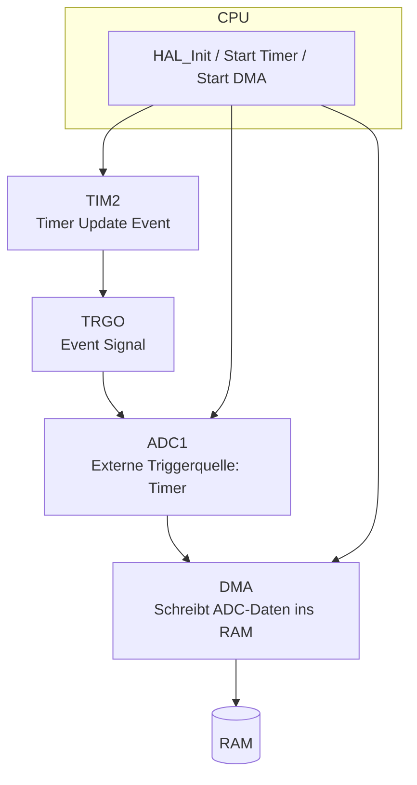

<!--
author:   Sebastian Zug, Karl Fessel & Andrè Dietrich
email:    sebastian.zug@informatik.tu-freiberg.de

version:  1.0.5
language: de
narrator: Deutsch Female

import:  https://raw.githubusercontent.com/liaScript/mermaid_template/master/README.md
         https://raw.githubusercontent.com/liascript-templates/plantUML/master/README.md

icon: https://upload.wikimedia.org/wikipedia/commons/d/de/Logo_TU_Bergakademie_Freiberg.svg

-->S


[](https://liascript.github.io/course/?https://github.com/TUBAF-IfI-LiaScript/VL_DigitaleSysteme/main/lectures/12_CortexMFeatures.md#1)


# Features STM32F4

| Parameter                | Kursinformationen                                                                                                                                                                    |
| ------------------------ | ------------------------------------------------------------------------------------------------------------------------------------------------------------------------------------ |
| **Veranstaltung:**       | `Vorlesung Softwareentwicklung für eingebettete Systeme`                                                                                                                                                           |
| **Semester**             | `Sommersemester 2025`                                                                                                                                                                                              |
| **Hochschule:**          | `Technische Universität Freiberg`                                                                                                                                                    |
| **Inhalte:**             | `Spezifische Besonderheiten des STM32`                                                                                            |
| **Link auf den GitHub:** | [https://github.com/TUBAF-IfI-LiaScript/VL_DigitaleSysteme/blob/main/lectures/12_CortexMFeatures.md](https://github.com/TUBAF-IfI-LiaScript/VL_DigitaleSysteme/blob/main/lectures/12_CortexMFeatures.md) |
| **Autoren**              | @author                                                                                                                                                                              |


---

## SysTick (Wiederholung)

Der SysTick-Timer ist ein 24-Bit-Zähler, der in jedem Cortex-M-Prozessor vorhanden ist. Er wird verwendet, um regelmäßige Zeitintervalle zu erzeugen, die für die Implementierung von Echtzeitsystemen und Betriebssystemen nützlich sind. Der SysTick-Timer kann so konfiguriert werden, dass er Interrupts generiert, wenn der Zähler einen bestimmten Wert erreicht.


```c
volatile uint32_t tickCount = 0;

void SysTick_Handler(void) {
  tickCount++;
  if (tickCount >= 1000) {           // 1000 ms erreicht?
    GPIOA->ODR ^= GPIO_ODR_OD5;      // LED toggeln
    tickCount = 0;                   // zurücksetzen
  }
}

int main(void) {
  // LED Setup (z. B. PA5)
  RCC->AHB1ENR |= RCC_AHB1ENR_GPIOAEN;
  GPIOA->MODER |= GPIO_MODER_MODE5_0;

  // SysTick: 1ms-Takt bei 16 MHz == 16.000 Ticks pro Sekunde
  SysTick_Config(SystemCoreClock / 1000);

  while (1) {
    __WFI();  // "Wait for Interrupt" – Stromsparmodus
  }
}
```

> Recherchieren Sie die maximale Zykluszeit des SysTick Timers und die maximale Anzahl an Interrupts pro Sekunde, die damit realisiert werden können.
> 
> Was hat es mit dem Macro `__WFI` auf sich? Schlagen Sie die Stromsparmodi des Prozessors nach.
>
> Was stört Sie an diesem Code?


## Interrupts / Events
Interrupts können in zwei Gruppen kategorisiert werden, nämlich in asynchrone Interrupts (aka Interrupt, Hardware-Interrupt) und synchrone Interrupts (aka Exception). Erstere können jederzeit eintreffen, typischerweise IO-Interrupts, letztere können nur nach der Ausführung eines Befehls eintreffen, z.B. wenn die CPU versucht, eine Zahl durch 0 zu dividieren oder ein Page Fault. Das ist also der Unterschied zwischen Interrupts und Exceptions.

Die Intel-Dokumentation klassifiziert Interrupts und Exceptions wie folgt:

| Kategorie  | Subkategorie                 | Bedeutung                                                                                                                                                                    |
| ---------- | ---------------------------- | ---------------------------------------------------------------------------------------------------------------------------------------------------------------------------- |
| Interrupts | Maskierbare Interrupts       | Alle Interrupt Requests (IRQs), die von I/O-Geräten ausgegeben werden, führen zu maskierbaren Interrupts. Ein maskierbarer Interrupt wird ignoriert, sofern er maskiert ist. |
|            | Nicht-maskierbare Interrupts | Nur wenige kritische Ereignisse (z. B. Hardwarefehler) führen zu nichtmaskierbaren Interrupts . Nichtmaskierbare Interrupts werden von der CPU immer erkannt.                |
| Exceptions | Fehler                       | Können im Allgemeinen behoben werden; nach der Behebung kann das Programm ohne Verlust der Kontinuität neu gestartet werden.                                                 |
|            | Traps                        | Traps werden vom Anwenderprogramm ausgelöst, um eine Funktionalität des Betriebssystems aufzurufen.                                                                          |
|            | Programmierte Ausnahmen      |        Programmierte Ausnahmen werden von der Steuereinheit als Traps behandelt; sie werden oft als Software-Interrupts bezeichnet.                                                                                                                                                                       |

Die Intel-Dokumentation kennt keine "Events" im Sinne von STM32, weil x86-Prozessoren keine hardwareseitige Peripherie-Verkettung wie Mikrocontroller bieten. Stattdessen läuft alles zentral über Interrupts und Polling, gesteuert durch das Betriebssystem.

| Merkmal        | Interrupt          | Event                     |
| -------------- | ------------------ | ------------------------- |
| CPU beteiligt  | ja                 | nein                      |
| Stromverbrauch | höher              | niedriger                 |
| Latenz         | mittel             | sehr gering               |
| Anwendung      | Reaktion mit Logik | Hardware-Modul-Verkettung |


### Eventsystem

Ein Event im STM32 ist eine direkte Verbindung zwischen Peripherieeinheiten auf Chip-Ebene, z. B.:

+ Timer → ADC (startet Wandlung)
+ Timer → DMA (startet Speichertransfer)
+ GPIO → EXTI-Event → Wakeup

Diese Verbindungen passieren ohne CPU-Beteiligung – es ist ein reines Hardware-Signalnetz.




> _"Events sind neben Interrupts etwas, das dem Cortex Core seinen Schlaf  rauben kann."_ (mikrocontroller.net Forenbeitrag)

### NVIC

> Was steht im Werbetext zum Nested Vector Interrupt Controller (NVIC) und was bedeuten diese Aussagen?

_The devices embed a nested vectored interrupt controller able to manage 16 priority levels, and handle up to 62 maskable interrupt channels plus the 16 interrupt lines of the Cortex®-M4 with FPU:_

+ _Closely coupled NVIC gives low-latency interrupt processing_
+ _Interrupt entry vector table address passed directly to the core_
+ _Allows early processing of interrupts_
+ _Processing of late arriving, higher-priority interrupts_
+ _Support tail chaining_
+ _Processor state automatically saved_


Der NVIC verwaltet:

+ Welche Interrupts überhaupt aktiv sind
+ Welche gerade verarbeitet werden
+ Welche verschachtelt werden dürfen (Preemption)
+ Welche Warteschlange haben (Pending)

1. Preemption Priority - Bestimmt, ob ein Interrupt einen anderen unterbrechen darf, höhere Priorität = kleinere Zahl (z. B. 0 > 2)
2. Subpriority - Wird nur verwendet, wenn zwei Interrupts die gleiche Preemption Priority haben. Sie wird in der NVIC-Registerbank gespeichert und kann von der Software geändert werden.

### Trigger für die ISR

Cortex-M Controller implementieren mindestens die folgenden Exceptions/Interrupts:

| Exception     | Beschreibung                                                                               |
| ------------- | ------------------------------------------------------------------------------------------ |
| **Reset**     | Wird ausgelöst, wenn der Controller startet oder zurückgesetzt wird.                       |
| **NMI**       | Nicht maskierbarer Interrupt mit sehr hoher Priorität, kann nicht deaktiviert werden.      |
| **HardFault** | Wird bei schwerwiegenden Fehlern wie Speicherverletzungen oder Division durch 0 ausgelöst. |
| **SVCall**    | Wird durch den Befehl `svc` ausgelöst. Dient zur Ausführung privilegierter Funktionen.     |
| **PendSV**    | Softwareausgelöste Exception für Dienste, z. B. für Kontextwechsel im RTOS.                             |
| **SysTick**   | Zeitgeber-Interrupt, häufig genutzt als System-Tick (z. B. alle 1 ms).                     |


> HardFault

- Tritt auf bei:
  - Zugriff auf ungültige Speicheradressen
  - Illegalen Befehlen
  - Division durch Null
- **ARMv6-M**: ein einziger Fault-Handler
- **ARMv7-M/v8-M**: kann durch spezialisierte Fault-Handler ergänzt werden:
  - `MemManage`
  - `BusFault`
  - `UsageFault`

> PendSV & SysTick

- `SysTick` liefert den Takt, z. B. für Zeitscheiben (Time Slices)
- `PendSV` wird genutzt, um Aufgabenwechsel (Kontextwechsel) durchzuführen


### Umsetzung


> _The devices embed a nested vectored interrupt controller able to manage 16 priority levels._

[^STM32]: Firma ST, STM32F401xx Controller Data Sheet, [Link](https://www.st.com/resource/en/reference_manual/dm00096844-stm32f401xbc-and-stm32f401xde-advanced-armbased-32bit-mcus-stmicroelectronics.pdf)


### Beschleunigung der Abarbeitung

| Ansatz                       | Erklärung |
|-----------------------------|-----------|
| **Tail-Chaining**            | Beim Beenden einer Interrupt-Service-Routine (ISR) muss die CPU normalerweise mindestens acht "caller-saved" Register vom Stack laden und beim nächsten Interrupt wieder speichern. Wenn jedoch direkt eine neue Exception ansteht, kann das erneute Sichern und Wiederherstellen übersprungen werden – die Register bleiben erhalten. Dadurch wird wertvolle Zeit gespart. |
| **Late-Arriving Preemption** | Während der Prozessor noch mit dem Eintritt in eine ISR (Exception Entry) beschäftigt ist, kann eine höher priorisierte Exception eintreffen. In diesem Fall wird die ursprünglich vorgesehene ISR verworfen, und stattdessen direkt die ISR mit höherer Priorität geladen. Der gesicherte Registerzustand bleibt dabei gültig. Dies reduziert die Latenz für dringende Interrupts erheblich. Nach deren Abarbeitung kann die zuerst erkannte ISR direkt im Anschluss ausgeführt werden. |
| **Lazy State Preservation**  | ARMv7- und ARMv8-Prozessoren mit FPU verfügen über zusätzliche Register (z. B. `s0–s31` und `fpscr`). Da viele ISRs keine Gleitkommaoperationen nutzen, kann das Betriebssystem die Sicherung dieser Register verzögern, bis tatsächlich eine FP-Instruktion ausgeführt wird. Erst dann werden die FP-Register gesichert – das spart Speicherzugriffe und Zeit bei Interrupts, die keine FPU benötigen. |


```text @plantUML
@startuml
participant A as "Thread A"
participant B as "Thread B"
participant OS
participant CPU
participant FPU

== Thread A läuft und nutzt FPU ==
A -> FPU: FP-Befehl
FPU --> A: Ergebnis

== Interrupt tritt auf ==
CPU -> OS: Exception Entry
OS -> CPU: Save CPU-Register von A (FPU unberührt)

== Kontextwechsel zu Thread B ==
OS -> CPU: Restore CPU-Register von B
OS --> B: Kontrolle an Thread B

== Thread B läuft (noch ohne FPU) ==
B -> CPU: Ausführung normaler Instruktionen
CPU --> B: Kein FPU-Zugriff → kein Problem

== Erste FP-Instruktion von Thread B ==
B -> FPU: FP-Befehl
FPU --> CPU: Exception (FPU nicht aktiviert)

== Lazy FPU-Handling ==
CPU -> OS: FPU Exception Handling
OS -> CPU: Save FPU-Kontext von Thread A
OS -> CPU: Load/Init FPU-Kontext für Thread B
OS -> FPU: FPU aktivieren
OS --> B: Rückkehr zur FP-Instruktion

== FP-Instruktion wird wiederholt ==
B -> FPU: FP-Befehl erneut
FPU --> B: Ergebnis
@enduml
```


### Programmierbeispiel

Nutzung Externer Interrupts in Form der Buttons auf dem STM32F401RE Board.


## DMA

Wenn wir der CPU (Hauptprozessor) die ganze Arbeit des Abholens von Anweisungen (Code) aus dem Flash, der Ausführung der dekodierten Anweisungen und des Verschiebens von Daten zu und von Peripheriegeräten und Speicher erledigen lassen, führt mit steigender Zahl von Komponenten zu einer steigenden Auslastung des Systems. Die Zahl der Interrupts, die ein UART1-Datenempfänger generiert, der einen Datenstrom erhält, den die CPU sofort in einen lokalen Puffer im Speicher übertragen muss, um kein Datenpaket zu verlieren, führt dies mit

$(1 Start + 8 data + 0 Parity + 1 stop)$ = $10 Bit$ bei $115200Baud$

zu 11520 Interrupts pro Sekunde. Diese konkurrieren dann noch mit den anderer Peripheriegeräten wie UART, SPI, ADC. Dabei passiert bei dieser konkreten Aufgabe nichts anderes als das "hin- und herschaufeln" von Daten. Eine Rechenpower wird gar nicht abgefragt.

Noch schlimmer wird die Situation, wenn neben der eigentlichen Kopieroperation auch noch der Overhead für das Umschalten des Kontexts zu und von Interrupt-Handlern berücksichtigt wird. Die CPU ist nicht in der Lage die volle Arbeitsleistung zu entfalten, da sie mit Datentransaktionen beschäftigt ist.

## Programmierbeispiel 

Blink LED mit SysTick Timer und STM CubeIDE 

1. in der CubeIDE 
2. in PlatformIO mit vorgelagertem STM32CubeMX-Generator

https://github.com/TUBAF-IfI-LiaScript/VL_SoftwareentwicklungEingebetteteSysteme/blob/main/codeExamples/STM32/HelloWorld/

### Umsetzung

Der Speicherdirektzugriff oder englisch Direct Memory Access (DMA) erlaubt den Datenaustausch über das Bussystem ohne den Umweg über die CPU auf den Speicher zugreift.
Diese Technik erlaubt angeschlossenen Peripheriegeräten untereinander und mit dem Arbeitsspeicher zu kommunizieren. Der Vorteil des Speicherdirektzugriffs ist die schnellere Datenübertragung bei gleichzeitiger Entlastung des Prozessors.


Der DMA-Controller führt den direkten Speichertransfer durch: als AHB-Master kann er die Kontrolle über die AHB-Busmatrix übernehmen, um AHB-Transaktionen zu initiieren. er kann folgende Transaktionen durchführen:

- Peripherie-zu-Speicher
- Speicher-zu-Peripherie
- Speicher-zu-Speicher


| Modus                  | DMA1 | DMA2 |
| ---------------------- | ---- | ---- |
| Peripherie-zu-Speicher | X    | X    |
| Speicher-zu-Peripherie | X    | X    |
| Speicher-zu-Speicher   |      | X    |


Jeder Kanal kann einen DMA-Transfer zwischen einem Peripherieregister, das sich an einer festen Adresse befindet, und einer Speicheradresse durchführen. Die Menge der zu übertragenden Daten (bis zu 65535) ist programmierbar. Das Register, das die Menge der zu übertragenden Datenelemente enthält, wird nach jeder Transaktion dekrementiert.


Die Übertragungsdatengrößen der Peripherie und des Speichers sind über die Bits PSIZE und MSIZE im Register DMA_CCRx voll programmierbar.

Eine DMA-Transaktion besteht aus einer Folge von einer konfigurierbaren Anzahl von Datenübertragungen. Dabei besteht jede DMA-Übertragung besteht aus drei Operationen:

- Laden aus dem Peripherie-Datenregister oder einer Speicherstelle, die über das DMA_SxPAR- oder DMA_SxM0AR-Register adressiert wird
- Speichern der geladenen Daten im Peripherie-Datenregister oder einer Speicherstelle, die über das DMA_SxPAR- oder DMA_SxM0AR-Register adressiert wird -
- Nachdekrementieren des DMA_SxNDTR-Registers, das die Anzahl der noch auszuführenden Transaktionen enthält

Effizient wird das DMA-Verfahren allerdings erst, wenn nicht nur ein einzelnes Datenwort zu übertragen ist, sondern größere zusammenhängende Speicherbereiche, z. B. ganze Datensektoren oder -spuren von einer Festplatte. Dann lohnt sich auch der gewisse Overhead, der dadurch entsteht, dass zuallererst der DMA-Controller durch Setzen diverser Registerinhalte für die bevorstehende Aufgabe aufgesetzt werden muss. Peripherie- und Speicherzeiger können optional nach jeder Transaktion automatisch nachinkrementiert werden. Wenn der inkrementierte Modus aktiviert ist, ist die Adresse der nächsten Übertragung die Adresse der vorherigen Übertragung, die je nach gewählter Datengröße um 1, 2 oder 4 inkrementiert wird.

[^STM32]: Firma ST, STM32F401xx Controller Data Sheet, [Link](https://www.st.com/resource/en/reference_manual/dm00096844-stm32f401xbc-and-stm32f401xde-advanced-armbased-32bit-mcus-stmicroelectronics.pdf)

### Programmierung

Lassen Sie uns das Ganze anhand eines Beispiels evaluieren. Nehmen wir an, dass Sie den Analog-Digital-Wandler auf Ihrem Controller maximal nutzen wollen. Dazu werden die gelesenen Daten in den Speicher geschrieben, um dort beispielsweise gefiltert und analysiert zu werden.

Welche Schritte sind entsprechend notwendig?

+ Konfiguration des ADC in einem Continous-Mode
+ Aktivierung des DMA Channels für den zugehörigen PIN
+ Visualisierung des Speicherinhaltes im Debug Modus

!?[Weiterführendes Beispiel](https://www.youtube.com/watch?v=EsZLgqhqfO0&t=92s)

### Herausforderungen

| Problem                                      | Erklärung                                                                                | Lösung                                                                                  |
| -------------------------------------------- | ---------------------------------------------------------------------------------------- | --------------------------------------------------------------------------------------- |
| **Race Conditions**                       | CPU liest oder schreibt, während DMA den Speicher verändert.                             | Verwende **Buffer-Schutz**, z. B. Double-Buffering oder Zugriff nur bei DMA-Idle.       |
| **Cache-Inkonsistenz**                    | DMA schreibt Daten in RAM, aber die CPU sieht sie nicht, weil sie im **D-Cache** liegen. | Verwende **Cache-Flush** oder DMA-Zugriff auf **non-cacheable Memory** (z. B. CCM RAM). |
| **Verlust von Daten durch Überschreiben** | CPU ist zu langsam, liest z. B. Daten nicht rechtzeitig weg.                             | **Interrupts oder DMA-Komplett-Flag** nutzen, um Verarbeitung zu koordinieren.          |
| 🕳️ **DMA wird blockiert**                   | Wenn CPU zu viel Bandbreite braucht, kann DMA verzögert werden.                          | **Priorisierung im AHB-Bus** (DMA1/2 kann auf bestimmte Kanäle priorisiert werden).     |

