<!--
author:   Sebastian Zug, Karl Fessel & André Dietrich
email:    sebastian.zug@informatik.tu-freiberg.de

version:  1.0.1
language: de
narrator: Deutsch Female

import:  https://raw.githubusercontent.com/liascript-templates/plantUML/master/README.md
         https://github.com/LiaTemplates/AVR8js/main/README.md
         https://raw.githubusercontent.com/liaScript/mermaid_template/master/README.md

icon: https://upload.wikimedia.org/wikipedia/commons/d/de/Logo_TU_Bergakademie_Freiberg.svg
-->


[](https://liascript.github.io/course/?https://github.com/TUBAF-IfI-LiaScript/VL_SoftwareentwicklungEingebetteteSysteme/main/lectures/08_SchedulingAlgorithmen.md#1)


# Scheduling-Algorithmen


| Parameter                | Kursinformationen                                                                                                                                                                                    |
| ------------------------ | ---------------------------------------------------------------------------------------------------------------------------------------------------------------------------------------------------- |
| **Veranstaltung:**       | `Vorlesung Softwareentwicklung für eingebettete Systeme`                                                                                                                                                           |
| **Semester**             | `Sommersemester 2026`                                                                                                                                                                                              |
| **Hochschule:**          | `Technische Universität Freiberg`                                                                                                                                                                    |
| **Inhalte:**             | `EDD, EDF, Least Laxity, LDF, EDF*, Rate Monotonic`                                                                                                                                             |
| **Link auf den GitHub:** | [https://github.com/TUBAF-IfI-LiaScript/VL_SoftwareentwicklungEingebetteteSysteme/blob/main/lectures/08_SchedulingAlgorithmen.md](https://github.com/TUBAF-IfI-LiaScript/VL_SoftwareentwicklungEingebetteteSysteme/blob/main/lectures/08_SchedulingAlgorithmen.md) |
| **Autoren**              | @author                                                                                                                                                                                              |


---

## Ausgangspunkt

<!--
style="width: 80%; min-width: 420px; max-width: 720px;"
-->
```ascii

                      +---------------------------------------+
Anforderungen der     | harte Echtzeit   | weiche Echtzeit    |
Anwendungen           +---------------------------------------+

                      +---------------------------------------+
                      | synchron bereit  | asynchron bereit   |
                      +---------------------------------------+
                      | periodisch | aperiodisch | sporadisch |
Taskmodell            +---------------------------------------+
                      | präemptiv        | nicht-präemtiv     |
                      +---------------------------------------+
                      | unabhängig       | abhängig           |
                      +---------------------------------------+

                      +---------------------------------------+
Scheduler             |statisch          | dynamisch          |
                      +---------------------------------------+
```

Wie können wir

- eine Menge von Tasks 		$T= {T_1, T_2, ..., T_n }$
- eine Menge von Prozessoren 	$P= {P_1, P_2, ..., P_m }$
- eine Menge von Ressourcen	$R= {R_1, R_2, ..., R_s }$

entsprechend den Anforderungen systematisch einplanen?

## Aperiodisches Scheduling  


### Durchsuchen des Lösungsraumes

Gegeben sei eine Menge ${T_i}$ nicht unterbrechbarer Tasks mit einer

+ Bereitzeit $r_i$
+ Ausführungszeit $\Delta e_i$
+ Deadline $c_i$

Ein statisches Planungsverfahren soll untersuchen, ob ein Plan existiert. Das Verfahren soll einen Plan in Form einer Folge von Tupeln $(i, s_i)$ generieren. $i$ bezeichnet dabei die Tasknummer und $s_i$ die bestimmte Startzeit.

Das Durchsuchen lässt sich anhand einer Baumstruktur darstellen

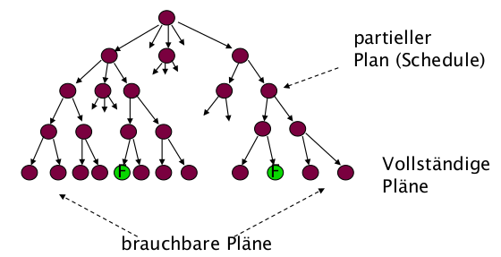

Beispiel: Gegeben sei unten stehend folge von 3 Tasks mit unterschiedlichen Ausführungsdauern, Bereitzeiten und Deadlines.

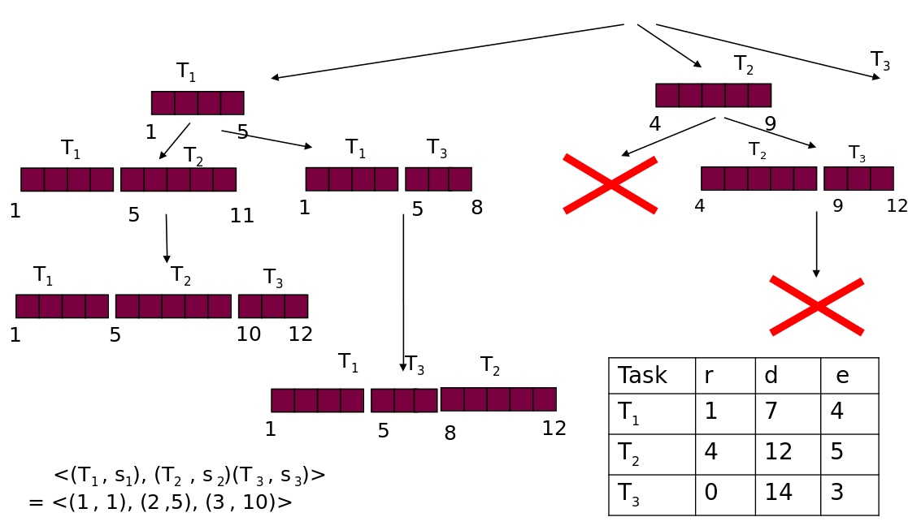

Die Suche unterscheidet zunächst nur **gültige** Pläne (jeder Task hält seine Deadline) von **ungültigen** (mindestens eine Deadline verletzt - dieser Ast wird abgeschnitten). Gibt es *mehrere* gültige Pläne, braucht es ein **übergeordnetes Auswahlkriterium**, denn „gültig" heißt noch nicht „gut". Gebräuchlich sind etwa:

+ **erster gültiger Plan** - wenn nur die Existenzfrage interessiert,
+ **minimale maximale Verspätung** $L_{max} = \max_i (c_i - d_i)$ - das übliche Ziel im Echtzeitkontext,
+ minimale *mittlere* Verspätung, frühester Gesamtabschluss (*makespan*) oder wenigste Kontextwechsel - je nach Anwendungsziel.

> **Motivation für die nächsten Abschnitte:** Die vollständige Baumsuche ist die teure, allgemeine Methode - sie probiert alle Reihenfolgen durch ($O(n!)$) und kann jedes dieser Kriterien optimieren. Die folgenden Algorithmen (EDD, EDF, ...) sind dagegen *Abkürzungen*: Für das spezielle Ziel „$L_{max}$ minimieren" finden sie beweisbar denselben optimalen Plan - aber durch einfaches Sortieren, ohne den ganzen Baum aufzuspannen.

### Earliest Due Date

EDD zielt auf das Scheduling für einen Prozessor. Alle $n$ Tasks sind unabhängig
voneinander und <ins>können zur gleichen Zeit begonnen werden (zum
Zeitpunkt 0).</ins>

> EDD: Earliest Due Date (Jackson, 1955) Jeder Algorithmus, der die Tasks in der Reihenfolge nicht abnehmender Deadlines ausführt, ist optimal bzgl. der Minimierung der maximalen Verspätung.

Am Beispiel des EDD soll das Wesen der Entwicklung von Scheduling-Algorithmen verdeutlicht werden - der notwendige Beweis der Optimalität hinsichtlich der Verspätung.

Die Darstellung entstammt der Darstellung von (Buttazzo, 2002) die von (Marwedel 2003) aufgegriffen wurde: Sei A ein beliebiger Algorithmus, der verschieden von EDD ist. Dann gibt es zwei Tasks $T_a$ und $T_b$ in dem von $A$ erzeugten Schedule $\sigma$, so dass in $\sigma$ der Task $T_b$ unmittelbar vor $T_a$ steht, aber $d_a \leq d_b$ ist:

<!--
style="width: 80%; min-width: 420px; max-width: 720px;"
-->
```ascii
                                           "$d_a$"   "$d_b$"   
----------------------------------------------|-------|------------>
                        "$c_b$"       "$c_a$"
. . . . .+----------------+-------------+. . . . . . .
         |   "$T_b$"      |   "$T_a$"   |               
. . . . .+----------------+-------------+. . . . . . .                        .
```

Die zu erwartende Lateness $L_{max(a,b)}$ ergibt sich damit zu $c_a - d_a$.

EDD würde der Idee nach die Reihung umkehren. Damit ergibt sich die Frage, ob der
Algorithmus einen im Sinne von $L_{max}$ günstigere Variante identifiziert.

<!--
style="width: 80%; min-width: 420px; max-width: 720px;"
-->
```ascii
                                          "$d_a$"   "$d_b$"   
----------------------------------------------|-------|------------>

                        "$c_b$"       "$c_a$"
. . . . .+----------------+-------------+. . . . . . . 
         |   "$T_b$"      |   "$T_a$"   |               
. . . . .+----------------+-------------+. . . . . . .      

                     "$c'_a$"          "$c'_b=c_a$"
. . . . .+-------------+----------------+. . . . . . . 
         |   "$T_a$"   |     "$T_b$"    |     "$L'_{max(a,b)} = max(L'_a, L'_b)$"       
. . . . .+-------------+----------------+. . . . . . .                         
                               "$L'_a$"
                        <-------------------->
                                         <---------->
                                           "$L'_b$"                            .
```

Für die EDD Variante muss die $L_{max}$ anhand einer Fallunterscheidung bestimmt werden, da  "$L'_{max(a,b)} = max(L'_a, L'_b)$". Das Ergebnis hängt von der Dauer der beiden Tasks sowie der Relation zwischen der Bereitzeit und den Deadlines ab.

1. Variante ($L'_a \geq L'_b$)

Entsprechend ist $L'_{max(a,b)} = L'_a = c'_a - d_a$ gegeben. Dabei gilt $L'_a < L_{max(a,b)}$ da $c'_a - d_a < c_a - d_a$ mit $c'_a < c_a$.

2. Variante ($L'_a \leq L'_b$)

Hier gilt $L'_{max(a,b)} = L'_b = c'_b - d_b$. Unter Berücksichtigung von $c'_b=c_a$ folgt $c_a - d_b < c_a - d_a$. Da $d_a < d_b$ ergibt sich $L'_b \leq L_{max(a,b)} $

In beiden Fällen ist $L'_{max(a,b)}\leq L_{max(a,b)}$. Jeder Schedule kann mit endlich vielen Vertauschungen in einen EDD Schedule verwandelt werden, der die maximale Verspätung verkleinert.

> EDD generiert bei nicht unterbrechbaren Tasks einen Schedule der optimal im Hinblick auf maximale Verspätung ist. Für die Brauchbarkeit eines Plans gilt: falls EDD keinen gültigen Plan liefert, gibt es keinen !

### Earliest Deadline First

> [Horn, 1974]: Wenn eine Menge von n Tasks mit beliebigen Ankunftszeiten gegeben ist, so ist ein Algorithmus, der zu jedem Zeitpunkt diejenige ausführungsbereite Task mit der frühesten absoluten Deadline ausführt, optimal in Bezug auf die Minimierung der maximalen Verspätung.

Für die Umsetzung bedeutet dies, dass für jede ankommende ausführbare Task wird entsprechend ihrer absoluten Deadline in die Warteschleife der ausführbaren Tasks eingereiht. Wird eine neu ankommende Task als erstes Element in die Warteschlange eingefügt, muss gerade ausgeführte Task **unterbrochen** werden

<!--
style="width: 80%; min-width: 420px; max-width: 720px;"
-->
```ascii

Sortierte Liste der Tasks mit ihren Deadlines
+-------------------------------------------+-------+
| T1(52) T9(46) T2(32) T3(32) T5(17) T6(12) | T8(6) | Aktuell in Ausführung
+-------------------------------------------+-------+ befindlicher Task        .
```


Der Scheduling-Algorithmus wird mit dem Bereitwerden eines Tasks erneut
ausgeführt, dass heißt an den Punkten ${r_0, r_1, r_2}$ erfolgt die Prüfung der Deadlines.

Beispiel:

<!-- data-type="none" -->
| Task  | Bereitzeit $r_i$ | Ausführungsdauer $\Delta e_i$ | Deadline $d_i$ |
| ----- | ---------------- | --------------------------- | ------------ |
| $T_1$ | 0                | 10                          | 33           |
| $T_2$ | 4                | 3                           | 28           |
| $T_3$ | 5                | 10                          | 29           |

<!--
style="width: 80%; min-width: 420px; max-width: 720px;"
-->
```ascii
                     4                                             6
            T1  |XXXXXXXXXX   3                            XXXXXXXXXXXXXXX
            T2  |          XXXXXXX           10
            T3  |                 XXXXXXXXXXXXXXXXXXXXXXXXX
                +----|----|----|----|----|----|----|----|----|----|----|----|->
                0    2    4  : 6  : 8   10   12   14   16  :18   20   22   24   
                :         :  :    :                        :
Bereite Tasks   T1        T1 T1   T1                       T1             
                :         T2 T2                            :       
                :            T3   T3                       :         
Kürz. Deadline  T1        T2 T2   T3                       T1         
```

Argumente für EDF:

+ EDF ist dabei sehr flexibel, denn es kann sowohl für präemptives, wie auch für kooperatives Multitasking verwendet werden.
+ Es können Pläne für aperiodischen sowie periodischen Task entwickelt werden.
+ EDF kann den Prozessor bis zur maximalen Prozessorauslastung einplanen.
+ EDF ist ein optimaler Algorithmus.

### Least Laxity

Das Least Laxity (LL) oder Least-Slack-Time-Scheduling (LST) Scheduling weist die Priorität auf der Grundlage des verbleibenden Spielraums zu. Dieser Begriff beschreibt das bis zur Deadline bestehende Zeitintervall bezogen auf den noch nicht realisierten Anteil der Ausführungsdauer.

Entsprechend wird der Spielraum jedes Tasks (Deadline minus noch benötigte Rechenzeit) mit
jedem Schritt neu bestimmt. LL ist ebenfalls optimal im Hinblick auf die Minimierung der Maximalen
Verspätung.

> **Merke:** Least Laxity berücksichtigt im Unterschied zu EDF die Ausführungsdauer. Damit ist das Verfahren in der Lage vor der Kollision mit der Deadline eine Notifizierung durchzuführen.

Beispiel:

<!-- data-type="none" -->
| Task  | Bereitzeit $r_i$ | Ausführungsdauer $\Delta e_i$ | Deadline $d_i$ |
| ----- | ---------------- | --------------------------- | ------------ |
| $T_1$ | 0                | 10                          | 33           |
| $T_2$ | 4                | 3                           | 28           |
| $T_3$ | 5                | 10                          | 29           |

Zu den Zeitpunkten $t_4$ und $t_{13}$ stellt sich die _Laxity_ entsprechend wie folgt dar:

<!-- data-type="none" -->
| Zeitpunkt | Laxity $T_1$       | Laxity $T_2$       | Laxity $T_3$      |
| --------- | ------------------ | ------------------ | ----------------- |
| $t_4$     | (33 - 4) - 6 = 23  | (28 -4) - 3 = 21   | -                 |
| $t_{13}$  | (33 - 13) - 6 = 14 | (28 - 13) - 2 = 13 | (29 -13) - 2 = 14 |


<!--
style="width: 80%; min-width: 420px; max-width: 720px;"
-->
```ascii

            T1  |XXXXXXXXXX                              XXXXX  XXXXXXXXXX
            T2  |          XX                    XXXXX
            T3  |            XXXXXXXXXXXXXXXXXXXX     XXX     XX
                +----|----|----|----|----|----|----|----|----|----|----|----|->
                0    2    4    6    8   10   12  :14   16   18   20   22   24   
                          :                      :     
                         "$t_4$"                "$t_{13}$"
```

| Kriterium                  | **EDF (Earliest Deadline First)**                 | **LLF (Least Laxity First)**                                               |
| -------------------------- | ------------------------------------------------- | -------------------------------------------------------------------------- |
| **Priorität basiert auf**  | Nächstliegender **Deadline**                      | **Laxity (Slack Time)** = Zeit bis Deadline – verbleibende Ausführungszeit |
| **Dynamische Prioritäten** | Ja                                                | Ja                                                                         |
| **Umschaltverhalten**      | Relativ **stabil**, weil Deadline konstant bleibt | Kann **häufig umschalten**, weil Laxity sich mit Zeit ändert               |
| **Präzision**              | Gut für regelmäßige Perioden                      | Besser bei **hoher Last** oder **unregelmäßiger Ausführungszeit**          |


### Latest Deadline First

Abhängigkeiten zwischen Tasks lassen sich in den bisher besprochenen Algorithmen noch nicht abbilden. Der Graph der Abhängigkeiten zwischen Tasks ist ein azyklischer gerichteter Graph (DAG). Die Knoten des Graphen sind die Tasks, die Kanten beschreiben die Abhängigkeiten. 

> Der Task $T_4$ kann nur dann ausgeführt werden, wenn Task $T_2$ bereits ausgeführt wurde.

Entsprechend würde ein EDF für folgendes Bespiel auch ein ungültiges Resultat liefern:

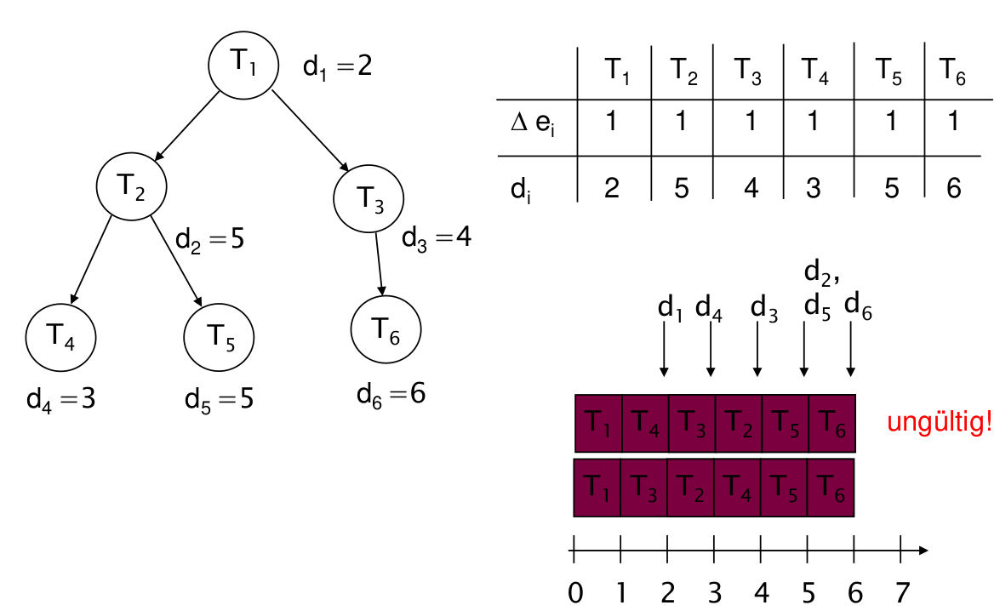

Gegeben: Taskmenge abhängiger Tasks $T = {T_1 , .., T_n}$ und ein azyklischer gerichteter
Graph, der die Vorrangrelation beschreibt.

Aus der Menge der Tasks deren Nachfolger bereits alle ausgewählt wurden oder die keinen Nachfolger besitzen, wählt LDF die Task mit der spätesten Deadline aus. __Die Warteschlange der Tasks wird also in der Reihenfolge der zuletzt auszuführenden Tasks aufgebaut.__ LDF ist ein optimaler Scheduler (Lawler 1973).

Beispiel

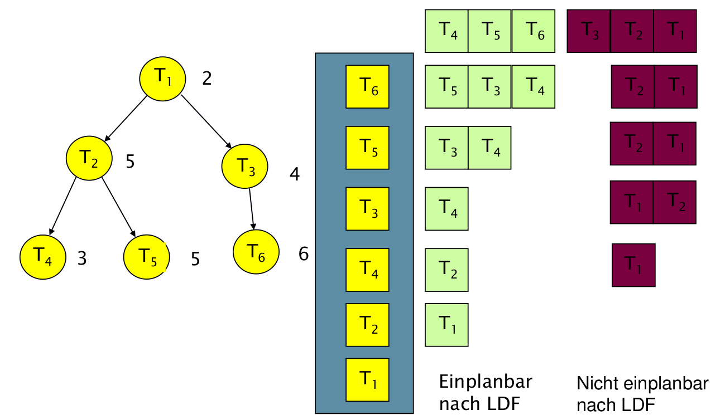

Damit ergibt sich ein gültiger Plan mit: $T_1, T_2, T_4, T_3, T_5, T_6$.


### EDF\*

EDF\* bezeichnet einen angepassten EDF Algorithmus unter Berücksichtigung der Vorrangrelation. Die Idee besteht darin, dass die Menge abhängiger Tasks in eine Menge unabhängiger Tasks durch Modifikation der Bereitzeiten und der Deadlines umgewandelt wird.

Entsprechend implementiert der EDF\* folgende drei Schritte:

1. Modifikation der Bereitzeiten
2. Modifikation der Deadlines
3. Schedule nach EDF erstellen

Bedingungen:

+ Ein Task kann nicht vor ihrer Bereitzeit ausgeführt werden.
+ Ein abhängiger Task kann keine Bereitzeit besitzen die kleiner ist als die Bereitzeit der Task von der sie abhängt.
+ Ein Task $T_b$, die von einer anderen Task $T_a$ abhängt, kann keine Deadline $d_b \leq d_a$ besitzen.

**Schritt 1: Modifikation der Bereitzeiten**

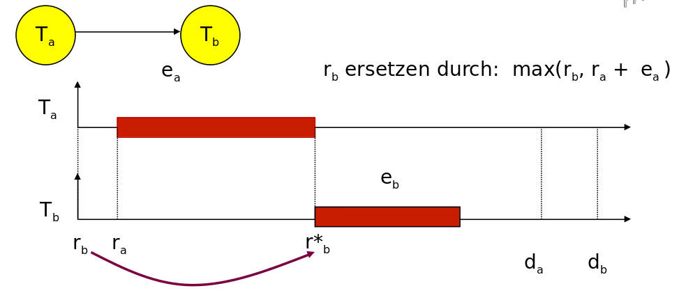

1. Für einen beliebige Anfangsknoten des Vorrang-Graphen setze $r^*_i = r_i$.
2. Wähle eine Task $T_i$, deren Bereitzeit (noch) nicht modifiziert wurde, aber deren Vorgänger $T_v$ alle modifizierte Bereitzeiten besitzen. Wenn es keine solche Task gibt: EXIT.
3. Setze $r^*_i = max [r_i  , max(r^*_v  + \Delta e_v ): T_v]$. Damit wird die maximale _Completion-Time_ der Vorgänger bestimmt $max(r^*_v  + \Delta e_v :  T_v)$
4. Gehe nach Schritt 2.

**Schritt 2: Modifikation der Deadlines**

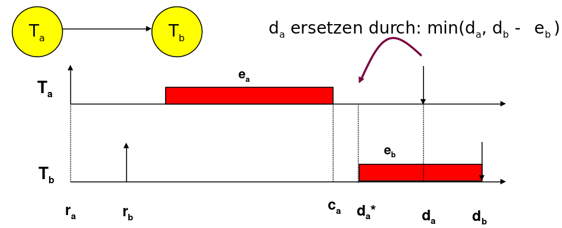

1. Für einen beliebige Endknoten des Vorrang-Graphen setze $d^*_i = d_i$ .
2. Wähle eine Task $T_i$ , deren Deadline (noch) nicht modifiziert wurde, aber deren unmittelbare Nachfolger alle modifizierte Deadlines besitzen.  Wenn es keine solche Task gibt: EXIT.
3. Setze $d^*_i = min [d_i, min(d^*_n - \Delta e_n : T_n )]$.
4. Gehe nach Schritt 2

**Beispiel**

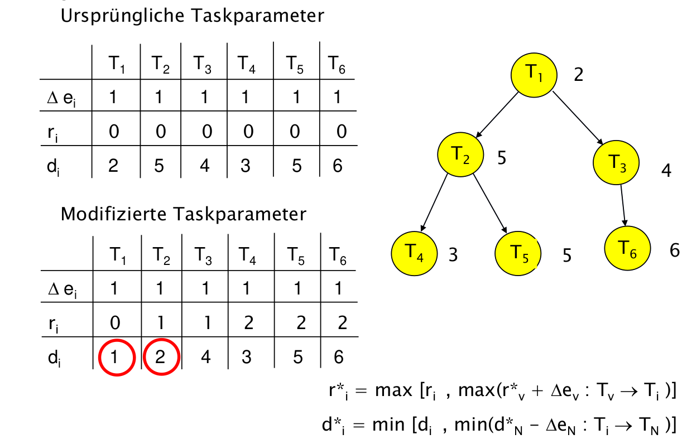

Erläuterung: Die angepassten Bereitzeiten spiegeln die Abhängigkeiten wieder. Mit Blick auf die Deadlines wurden T6 bis T3 ohne Änderungen durchgeplant. Die Deadline von T4 ist 3, entsprechend muss die Deadline von T2 auf 2 modifiziert werden, um sicherzustellen , dass T2 mit einer Laufzeit von 1 ausgeführt werden kann. Entsprechend muss T1 auch zur Deadline 1 abgeschlossen werden.

Jetzt kann ein EDF Plan erstellt werden, der die modifizierten Bereitzeiten und Deadlines berücksichtigt.

### Zusammenfassung

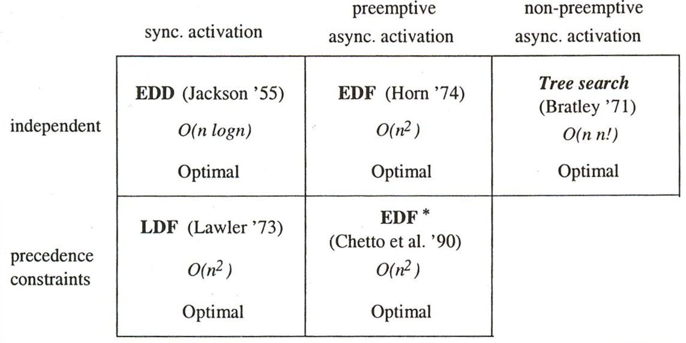

## Periodisches Scheduling  

Annahmen:

1. Alle Tasks mit harter Deadline sind periodisch.
2. Die Tasks sind unterbrechbar.
3. Die Deadlines entsprechend den Perioden.
4. Alle Tasks sind voneinander unabhängig.
5. Die Zeit für einen Kontextwechsel ist vernachlässigbar.
6. Für einen Prozessor und n Tasks gilt die folgende Gleichung bzgl. der durchschnittlichen Auslastung :
$$
U = \sum_{(i=1,...,n)} (\Delta e_i / \Delta p_i )
$$

Idee des Rate Monotonic Scheduling - Es wird kein expliziter Plan aufgestellt, der (zeitbasiert) auf Fristen oder Spielräumen beruht, sondern es existiert ein impliziter Plan, der durch eine Prioritätszuordnung zu allen Tasks repräsentiert wird.

Planungswerkzeug ist damit die Rate einer periodischen Task - die Anzahl der Perioden im Beobachtungszeitraum. Die Prioritätszuordnung erfolgt dann gemäß:

$rms(i) < rms(j)$ für $\frac{1}{\Delta p_i} < \frac{1} {\Delta p_j}$

Anwendung:

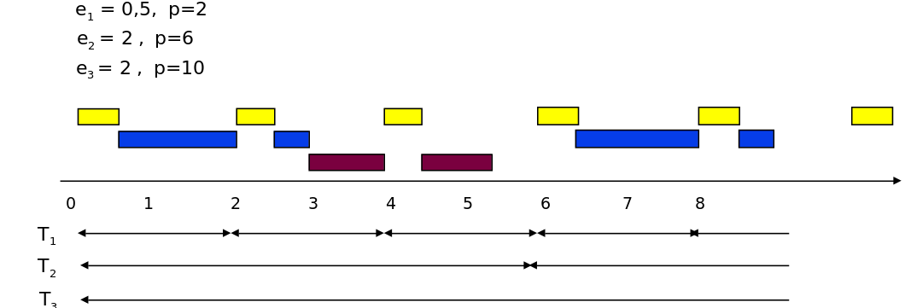

Grenzen des Verfahrens:

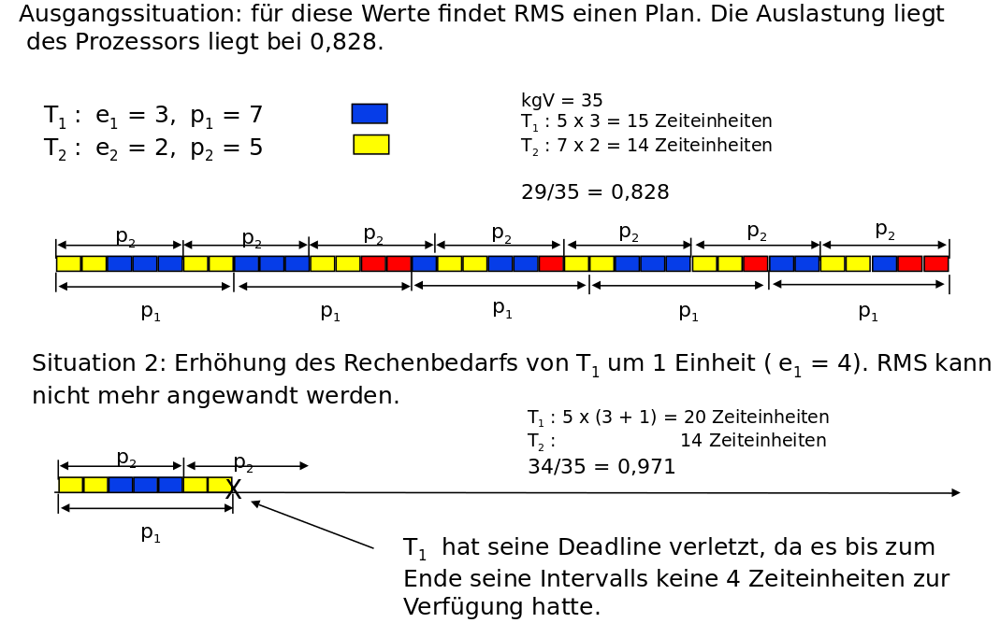

Frage: Gibt es eine obere Schranke $U_{lub}$  der Prozessorauslastung, für die immer ein Plan nach RMS garantiert werden kann (d.h. ein hinreichendes Kriterium für die Einplanbarkeit) ?

 $U_{lub}$  ist die Auslastung, für die RMS optimal ist, d.h. einen Plan findet, wenn überhaupt einer existiert.  Es kann natürlich Verfahren geben, die eine bessere Auslastung realisieren.

Nach (Liu, Layland, 1973) gilt für $n$ Tasks:     $U_{lub} =  n  (2^{1/n} - 1 )$.

| n                    | Obere Schranke           |
| -------------------- | ------------------------ |
| $1$                  | $U_{lub} = 1$            |
| $2$                  | $U_{lub} = 0.828$        |
| $n\rightarrow\infty$ | $U_{lub} =ln(2) = 0.693$ |

> **Achtung:** EDF ist sehr wohl in der Lage eine Auslastung von 100 Prozent zu realsieren.


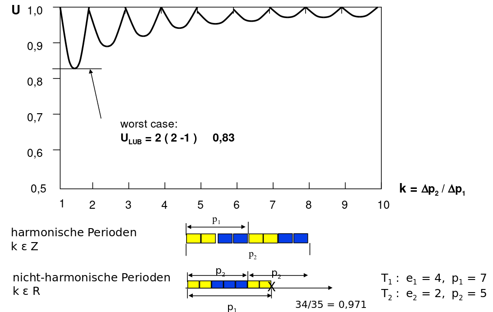

**Zusammenfassung RMS**

Für alle Ausführungszeiten und Periodenverhältnisse von n Tasks wird unter RMS ein gültiger Plan gefunden, wenn die Auslastung die Schranke $U_{lub} = n\,(2^{1/n} - 1)$ nicht übersteigt.

RMS ist einfacher zu realisieren als EDF, die Prioritäten anhand der Perioden werden einmal zu Beginn festgelegt.

Aber RMS ist nicht immer in der Lage eine Lösung zu finden, obwohl eine existiert. Entsprechend ist RMS kein optimaler Scheduler!

## Von der Theorie zur Praxis

Wir haben mit EDF und Least Laxity zwei Verfahren kennengelernt, die **optimal** sind - sie finden einen gültigen Plan, wann immer einer existiert, und EDF kann den Prozessor bis zu einer Auslastung von 100 % einplanen. RMS dagegen ist nachweislich *nicht* optimal und garantiert nur bis zur Schranke $U_{lub}$.

Man würde also erwarten, dass reale Echtzeitbetriebssysteme EDF oder LL implementieren. Tatsächlich ist das Gegenteil der Fall:

> **Beobachtung:** Die überwiegende Mehrheit der eingesetzten RTOS - darunter FreeRTOS, Zephyr, VxWorks, RTEMS und µC/OS - verwendet im Kern **Fixed-Priority Preemptive Scheduling (FPP)**, also feste, zur Entwicklungszeit vergebene Prioritäten. Genau das Verfahren, das RMS implizit beschreibt - nur ohne die automatische Ableitung der Prioritäten aus den Perioden.

Warum entscheidet sich die Praxis gegen das theoretisch überlegene Verfahren?

### Warum feste Prioritäten?

Die Optimalität von EDF/LL gilt nur unter den idealisierten Annahmen des Modells (vernachlässigbarer Kontextwechsel, exakt bekannte Ausführungszeiten, unabhängige Tasks). Sobald wir auf reale Hardware gehen, kehren sich mehrere Vorteile in Nachteile um:

| Kriterium                     | **EDF / Least Laxity** (dynamisch)                                  | **Fixed-Priority** (statisch, RTOS-Praxis)                          |
| ----------------------------- | ------------------------------------------------------------------ | ------------------------------------------------------------------ |
| **Prioritätsberechnung**      | Zur *Laufzeit*, bei jedem Ereignis neu (Deadline/Laxity vergleichen) | *Einmalig* zur Entwicklungszeit - zur Laufzeit nur Tabellenzugriff |
| **Laufzeit-Overhead**         | Hoch: Scheduler muss bei jedem Tick Restzeiten/Deadlines pflegen   | Minimal: höchstpriorer *ready*-Task steht sofort fest              |
| **Datenstrukturen**           | Sortierte Warteschlange nach Deadline                              | Eine *ready*-Liste pro Prioritätsstufe (O(1)-Auswahl)             |
| **Determinismus / Debugging** | Reihenfolge hängt von absoluten Zeiten ab - schwer vorherzusagen   | Verhalten ist statisch ablesbar und reproduzierbar                |
| **Verhalten bei Überlast**    | *Domino-Effekt*: bei Überlast kann das ganze System kippen, auch unkritische Deadlines reißen unvorhersehbar | *Graceful degradation*: niederpriore Tasks fallen zuerst aus, kritische laufen weiter |
| **Auslastungsgrenze**         | bis 100 % planbar                                                  | nur bis $U_{lub}$ *garantiert* (exakter Test erlaubt aber mehr)    |

Der entscheidende Punkt ist das **Verhalten bei Überlast**. EDF ist optimal, *solange* das System einplanbar ist - aber sobald die Last die Kapazität übersteigt (z. B. durch einen Messwert-Burst oder eine unterschätzte WCET), bricht EDF unkontrolliert zusammen: Es bevorzugt den Task mit der nächsten Deadline, die in der Überlast aber gerade die *bereits verlorene* sein kann. Bei festen Prioritäten ist dagegen vorab klar, welche Tasks im Zweifel geopfert werden - der sicherheitskritische Regler behält immer Vorrang.

### Fixed-Priority Preemptive in Aktion

Bei FPP gilt eine einfache Regel: **Es läuft immer der ausführungsbereite Task mit der höchsten Priorität.** Wird ein höherpriorer Task bereit, verdrängt (*preemptet*) er den laufenden sofort.

Beispiel mit drei Tasks, Priorität $T_1 > T_2 > T_3$:

<!--
style="width: 80%; min-width: 420px; max-width: 720px;"
-->
```ascii
         r3        r2        r1
         |         |         |
   T1    |         |         XXXXX             (höchste Priorität)
   T2    |         XXX             XXX
   T3    XXX          ...             XXXXXXX  (niedrigste Priorität)
         +----|----|----|----|----|----|----|->
         0    2    4    6    8   10   12   14

   T3 startet, wird von T2 verdrängt, T2 wird von T1 verdrängt.
   Erst wenn die höherprioren Tasks fertig sind, läuft T3 weiter.
```

Genau dieses Verhalten zeigt der Tick-Interrupt eines RTOS: Bei jedem Timer-Tick (oder bei jedem Ereignis, das einen Task aufweckt) prüft der Kernel, ob nun ein höherpriorer Task *ready* ist, und schaltet gegebenenfalls um.

> **Merke:** „Optimal im Modell" ist nicht „am besten in der Praxis". Die Praxis tauscht einen Teil der theoretischen Auslastung gegen **Vorhersagbarkeit, geringen Overhead und kontrolliertes Überlastverhalten** - und das sind in sicherheitskritischen eingebetteten Systemen die teureren Güter.

### Gleichstand: mehrere Tasks gleicher Priorität

Die FPP-Regel „der höchstpriore *ready*-Task läuft" ist nicht eindeutig, sobald **mehrere bereite Tasks dieselbe Priorität** besitzen. Es braucht eine zusätzliche Regel, wer von ihnen den Prozessor erhält. Zwei Varianten sind gebräuchlich:

**1. Round-Robin / Time-Slicing** (der Normalfall)

Die Tasks gleicher Priorität teilen sich die CPU *zeitscheibengesteuert*: Bei jedem Tick wechselt der Scheduler zyklisch zum nächsten bereiten Task derselben Stufe. So erhält jeder einen fairen Anteil und keiner verhungert.

<!--
style="width: 80%; min-width: 420px; max-width: 720px;"
-->
```ascii
   Drei Tasks gleicher Priorität, alle bereit:

   Tick:   1    2    3    4    5    6    7    8
          +----+----+----+----+----+----+----+----+
          | Ta | Tb | Tc | Ta | Tb | Tc | Ta | Tb |  ... reihum
          +----+----+----+----+----+----+----+----+

   Höherpriore Tasks würden diese Runde jederzeit unterbrechen.
```

**2. Ohne Time-Slicing** (FIFO-artig)

Der einmal ausgewählte Task läuft, bis er sich *selbst* blockiert (z. B. `vTaskDelay()`, Warten auf einen Semaphor) oder beendet - erst dann kommt der nächste gleichpriore Task an die Reihe. Das spart Kontextwechsel (geringerer Overhead), bietet aber keine Fairness innerhalb der Stufe.

> **Echtzeit-Hinweis:** Round-Robin macht das Timing *innerhalb* einer Prioritätsstufe schwerer vorhersagbar. In hart-echtzeitkritischen Systemen vergibt man deshalb häufig jedem Task eine **eindeutige Priorität** - dann tritt der Gleichstandsfall gar nicht erst auf, und das Verhalten bleibt vollständig deterministisch.

Welche Variante greift, ist beim RTOS konfigurierbar (in FreeRTOS z. B. über `configUSE_TIME_SLICING`) - die konkrete Umsetzung sehen wir in der nächsten Vorlesung.

### Was bedeutet das für RMS?

RMS ist damit *kein* Nischenverfahren, sondern die **theoretische Grundlage der gängigen Praxis**: Es beantwortet die Frage, *wie* man die festen Prioritäten sinnvoll vergibt (kürzere Periode → höhere Priorität) und *ob* die resultierende Menge einplanbar ist (Auslastungstest gegen $U_{lub}$). Der eigentliche Scheduler im RTOS muss dann nur noch die einfache FPP-Regel umsetzen.

> Reicht der einfache Auslastungstest gegen $U_{lub}$ nicht aus (z. B. weil $U > U_{lub}$, aber $U \leq 1$), gibt es mit der **Response Time Analysis** einen *exakten* Einplanbarkeitstest für feste Prioritäten - dieser kann Mengen als einplanbar nachweisen, die der grobe Auslastungstest verwirft.

## Wenn Tasks Ressourcen teilen

Alle bisherigen Optimalitäts- und Einplanbarkeitsaussagen - von EDD über EDF bis zur RMS-Schranke - beruhen auf einer Annahme, die wir beim periodischen Scheduling explizit getroffen haben:

> *Annahme 4: Alle Tasks sind voneinander unabhängig.*

Sobald sich Tasks eine Ressource **exklusiv** teilen (eine globale Variable, einen Bus, ein Display - geschützt durch einen Mutex), ist diese Annahme verletzt. Ein Task kann dann nicht mehr jederzeit laufen, sobald er der höchstpriore bereite ist: Er muss möglicherweise **warten**, bis ein *anderer* Task die Ressource freigibt. Damit gilt die saubere Theorie nicht mehr unmittelbar - und das wirkt sich direkt auf die Einplanbarkeit aus.

### Blockierung als neuer Term in der Analyse

Im unabhängigen Fall konnte ein Task nur durch *höherpriore* Tasks verzögert werden (*Präemption*). Mit gemeinsamen Ressourcen kommt eine zweite, neue Verzögerungsart hinzu:

> **Blockierung (*blocking*):** Ein Task wird von einem *nieder*prioren Task aufgehalten, weil dieser eine gemeinsam genutzte Ressource hält und sie noch nicht freigegeben hat.

Diese Blockierungszeit muss in den Einplanbarkeitstest aufgenommen werden. Für RMS erweitert sich die Bedingung pro Task $T_i$ um einen **Blocking-Term $B_i$** - die maximale Zeit, die $T_i$ durch niederpriore Tasks blockiert werden kann:

$$
\sum_{k : \text{prio}(k) \geq \text{prio}(i)} \frac{\Delta e_k}{\Delta p_k} \; + \; \frac{B_i}{\Delta p_i} \; \leq \; U_{lub}(i)
$$

Der Term $B_i$ ist also kein Detail, sondern geht *unmittelbar* in die Garantie ein: Je länger ein Task blockiert werden kann, desto weniger Auslastung bleibt für die nutzbare Rechenarbeit.

### Was die Protokolle für die Analyse leisten

| Protokoll                                  | Schranke für $B_i$                                              | Deadlock-frei? | Verkettete Blockierung? |
| ------------------------------------------ | -------------------------------------------------------------- | -------------- | ----------------------- |
| **kein Protokoll**                         | *unbeschränkt*                                                  | nein           | ja                      |
| **PIP** (Priority Inheritance, → VL 07)    | endliche Summe über die kritischen Sektionen niederpriorer Tasks | **nein**       | ja (*chained blocking*) |
| **PCP** (Priority Ceiling)                 | höchstens *eine* einzige kritische Sektion                     | **ja**         | nein                    |

- **PIP**: Der ressourcenhaltende Task *erbt* die Priorität des wartenden. Das macht $B_i$ endlich, verhindert aber **keine Deadlocks** und erlaubt **verkettete Blockierung** - ein Task kann nacheinander an mehreren Ressourcen blockiert werden.
- **PCP** (*Priority Ceiling Protocol*): Jeder Ressource wird eine *Prioritätsobergrenze* (das *ceiling*) zugewiesen - die höchste Priorität aller Tasks, die sie je anfordern. Ein Task darf eine Ressource nur belegen, wenn seine Priorität echt über allen aktuell gehaltenen *ceilings* liegt. Ergebnis: $B_i$ ist auf **die Länge einer einzigen kritischen Sektion** beschränkt **und** Deadlocks sind ausgeschlossen - der eigentliche theoretische Gewinn gegenüber PIP.

> **Merke:** PIP behandelt die Prioritätsinversion *nachträglich* (Vererbung, wenn sie auftritt), PCP *verhindert* die problematischen Situationen *vorab* durch die Vergaberegel. Für harte Echtzeit ist die garantierte, kleine Blockierungsschranke von PCP der entscheidende Vorteil.

### Ausblick

Damit schließt sich der Bogen dieser Vorlesung: Vom *optimalen* Scheduling unabhängiger Tasks (EDF, LL) über die *praktische* Prioritätsvergabe (RMS, Fixed-Priority) bis zur Erkenntnis, dass gemeinsam genutzte Ressourcen die Analyse erneut verändern und nach Synchronisationsprotokollen verlangen.

Die beiden offenen Enden greifen die folgenden Vorlesungen auf:

- *Warum* Prioritätsinversion gefährlich ist und wie **Priority Inheritance** sie entschärft, haben wir am Mars-Pathfinder-Fall bereits in **VL 07** gesehen.
- Wie ein RTOS die festen Prioritäten konkret verwaltet, wie der Tick-Interrupt den Kontextwechsel auslöst und wie Tasks über **Semaphoren, Mutexe und Queues** zusammenarbeiten, sehen wir in der nächsten Vorlesung am Beispiel von **FreeRTOS**.
