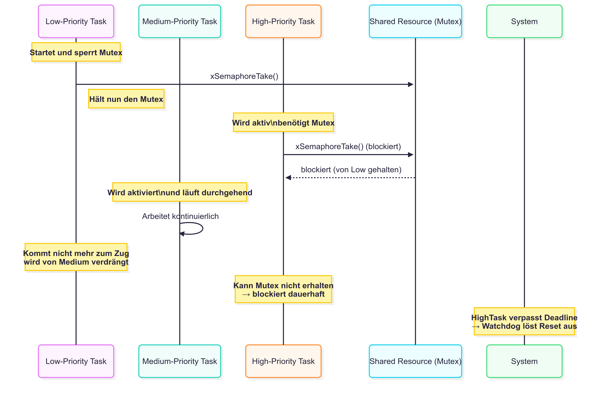
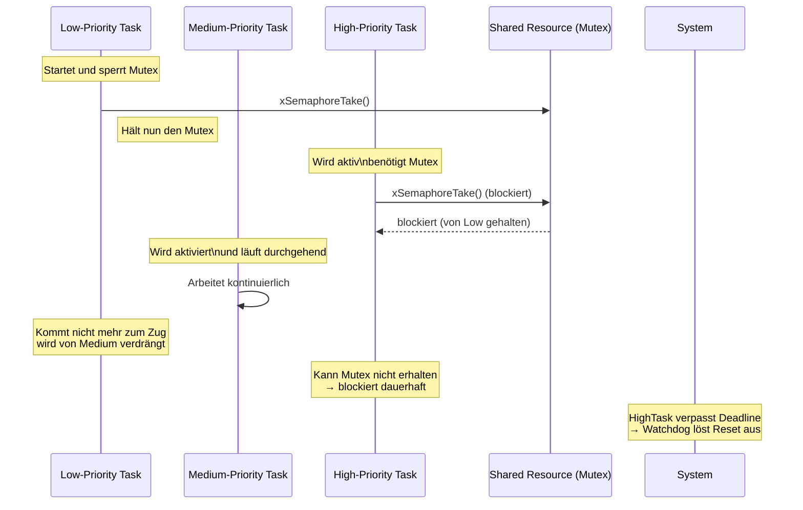

<!--
author:   Sebastian Zug, Karl Fessel & Andrè Dietrich
email:    sebastian.zug@informatik.tu-freiberg.de

version:  1.0.0
language: de
narrator: Deutsch Female

import:  https://raw.githubusercontent.com/liascript-templates/plantUML/master/README.md
         https://github.com/LiaTemplates/AVR8js/main/README.md
         https://raw.githubusercontent.com/liaScript/mermaid_template/master/README.md

icon: https://upload.wikimedia.org/wikipedia/commons/d/de/Logo_TU_Bergakademie_Freiberg.svg
-->


[](https://liascript.github.io/course/?https://github.com/TUBAF-IfI-LiaScript/VL_SoftwareentwicklungEingebetteteSysteme/main/lectures/09_FreeRTOS.md#1)


# FreeRTOS in der Praxis


| Parameter                | Kursinformationen                                                                                                                                                                                    |
| ------------------------ | ---------------------------------------------------------------------------------------------------------------------------------------------------------------------------------------------------- |
| **Veranstaltung:**       | `Vorlesung Softwareentwicklung für eingebettete Systeme`                                                                                                                                                           |
| **Semester**             | `Sommersemester 2026`                                                                                                                                                                                              |
| **Hochschule:**          | `Technische Universität Freiberg`                                                                                                                                                                    |
| **Inhalte:**             | `FreeRTOS: Tasks, Semaphoren, Mutexe, Queues, praktische Beispiele`                                                                                                                                             |
| **Link auf den GitHub:** | [https://github.com/TUBAF-IfI-LiaScript/VL_SoftwareentwicklungEingebetteteSysteme/blob/main/lectures/09_FreeRTOS.md](https://github.com/TUBAF-IfI-LiaScript/VL_SoftwareentwicklungEingebetteteSysteme/blob/main/lectures/09_FreeRTOS.md) |
| **Autoren**              | @author                                                                                                                                                                                              |


---

## Verwendung von Echtzeitbetriebssystemen

Ein Echtzeitbetriebssystem (RTOS) ist ein Betriebssystem (OS), das für Echtzeitanwendungen vorgesehen ist.  Ereignisgesteuerte Systeme schalten zwischen Tasks auf der Grundlage ihrer Prioritäten um, während Time-Sharing-Systeme die Tasks auf der Grundlage von Taktinterrupts umschalten. Die meisten RTOSs verwenden einen präemptiven Scheduling-Algorithmus.

Vorteile des RTOS vs. Super Loop Design

- Trennung von Funktionalität und Timing - RTOS entlastet den Nutzer und behandelt Timing, Signale und Kommunikation
- explizite Definition von Prioritäten - deutliche bessere Skalierbarkeit als im SLD
- Mischung von Hard- und Softrealtime Komponenten
- Verbesserte Wiederverwendbarkeit des Codes insbesondere bei Hardwarewechseln

")

> FreeRTOS ist kein vollständiges Betriebssystem, sondern ein hochoptimierter, portabler Echtzeit-Kernel – ideal für bare-metal Systeme, bei denen Timing und Ressourcenverbrauch kritisch sind.

FreeRTOS ist für leistungsschwache eingebettete Systeme konzipiert. Der Kernel selbst besteht aus nur drei C-Dateien. Um den Code lesbar, einfach zu portieren und wartbar zu machen, ist er größtenteils in C geschrieben, aber es sind einige Assembler-Funktionen (meist in architekturspezifischen Scheduler-Routinen) enthalten. FreeRTOS kann eher als "Thread-Bibliothek" denn als "Betriebssystem" betrachtet werden, obwohl eine Kommandozeilenschnittstelle und POSIX-ähnliche E/A-Abstraktionserweiterungen verfügbar sind.


FreeRTOS implementiert mehrere Threads, indem es das Host-Programm in regelmäßigen kurzen Abständen eine Thread-Tick-Methode aufrufen lässt. Die Thread-Tick-Methode schaltet Tasks abhängig von der Priorität und einem Round-Robin-Schema um. Das übliche Intervall beträgt 1 bis 10 Millisekunden (1/1000 bis 1/100 einer Sekunde), über einen Interrupt von einem Hardware-Timer, aber dieses Intervall wird oft geändert, um einer bestimmten Anwendung zu entsprechen.

### FreeRTOS Grundlagen

Das Task Modell unterscheidet 4 Zustände: Running, Blocked, Suspended, Ready, die mit entsprechenden API Funktionen manipuliert werden können, bzw. durch den Scheduler gesetzt werden. FreeRTOS implmentiert dafür einen präemptiven und einen kooperativen Multitasking Mode.

<!--
style="width: 80%;"
-->
```ascii
                        präemptiv                              kooperativ
Höchste         ^                                        ^                                 
Priorität   T1  |          XXXXXXXXXX                T1  |                    XXXXXXXXXX            
            T2  |XXXXXXXXXX         XXXXXXXXXX       T2  |XXXXXXXXXXXXXXXXXXXX     
                +----|----|----|----|----|----|->        +----|----|----|----|----|----|->
                0    2    4    6    8   10   12          0    2    4    6    8   10   12   
```

Der FreeRTOS-Echtzeit-Kernel misst die Zeit mit einer Tick-Count-Variable. Ein Timer-Interrupt (der RTOS-Tick-Interrupt) inkrementiert den Tick-Count - so kann der Echtzeit-Kernel die Zeit mit einer Auflösung der gewählten Timer-Interrupt-Frequenz messen.

Jedes Mal, wenn der Tick-Count inkrementiert wird, muss der Echtzeit-Kernel prüfen, ob es nun an der Zeit ist, einen Task zu entsperren oder aufzuwecken. Es ist möglich, dass ein Task, die während des Tick-ISRs geweckt oder entsperrt wird, eine höhere Priorität hat als der unterbrochene Task. Wenn dies der Fall ist, sollte der Tick-ISR zum neu geweckten/entblockten Task zurückkehren - effektiv unterbricht er einen Task, kehrt aber zu einer anderen zurück.

> **Merke:** Das präemptive Scheduling erfordert sowohl auf de Planungsebene, als auch auf der Verwaltungsebene einen größeren Overhead.

FreeRTOS unterstützt 2 Strategien für die Speicherbereitstellung, eine statische und eine dynamische Allokation. Während die erste Variante es der Anwendung überlässt die notwendigen Speicherareale zu aquirieren, über nimmt das RTOS diese Aufgabe im zweiten Modus. Der angeforderte Speicher wird auf dem Heap abgelegt. Mit dem Aufruf von `xTaskCreate()` wird ein Speicherblock alloziert, so dass der Stack und der _task control block_ (TCB) dort abgelegt werden können. Queues, Mutexe und Semaphoren werden ebenfalls dort eingebunden.  

<!--
style="width: 80%;"
-->
```ascii
        Arbeitsspeicher AVR
Ende    +------------------+
        | Stack für main   |
        | und IRQs         |
        |                  |
        |                  |
        +------------------+
        | freier Speicher  |
        |                  |      +---------------+
        |                  |   /  | TCB Tasks A   |
        +------------------+  /   +---------------+
        | HEAP             |      | Stack Tasks A |
        | verwaltet von    |      +---------------+
        | FreeRTOS         |      | Queue X       |        
        +------------------+  \   +---------------+
        | HEAP für main    |   \  |               | free Space
        |                  |      +---------------+                  
Start   +------------------+                                                   .

```

Beim Kontextwechsel sind auf dem AVR folgende Elemente auf dem Taskzugehörigen Stack zu speichern:

+ 32 general purpose processor Register
+ Status register
+ Program counter
+ 2 stack pointer registers.

```asm
#define portSAVE_CONTEXT()           
asm volatile (	                     
  "push  r0                    nt"
  ; Das Prozessorregister R0 wird zuerst gespeichert, da es beim Speichern des
  ; Statusregisters verwendet wird und mit seinem ursprünglichen Wert gespeichert
  ; werden muss.
  "in    r0, __SREG__          nt"
  "cli                         nt"
  "push  r0                    nt"
  ; Das Statusregister wird in R0 verschoben, damit es auf dem Stack gespeichert
  ; werden kann.
  "push  r1                    nt"
  "clr   r1                    nt"
  ; Der vom Compiler aus dem ISR-C-Quellcode generierte Code geht davon aus, dass
  ; R1 auf Null gesetzt ist. Der ursprüngliche Wert von R1 wird gespeichert,
  ; bevor R1 gelöscht wird.
  "push  r2                    nt"
  ...
  "push  r31                   nt"
  ; Sichern aller verbliebenen Register auf dem Stack
  "lds   r26, pxCurrentTCB     nt"
  "lds   r27, pxCurrentTCB + 1 nt"
  "in    r0, __SP_L__          nt"
  "st    x+, r0                nt"
  "in    r0, __SP_H__          nt"
  "st    x+, r0                nt"
  ; Sichern des Stackpointers auf dem Stack
);
```

Die TCB enthält unter anderem:

+ die Informationen zur Speicherverwaltung - Adresse der Stack-Startadresse in `pxStack` und den aktuellen Stackanfang in `pxTopOfStack`. FreeRTOS speichert auch einen Zeiger auf das Ende des Stacks in `pxEndOfStack`.
+ die anfängliche Priorität und die aktuelle Priorität des Tasks in `uxBasePriority` und `uxPriority`
+ den Namen des Tasks

Man könnte erwarten, dass jeder Task eine Variable hat, die FreeRTOS mitteilt, in welchem Zustand er sich befindet, aber das tut sie nicht. Stattdessen verfolgt FreeRTOS den Zustand des Tasks implizit, indem es den Task in die entsprechende Liste einträgt: ready list, suspended list, etc. Das Vorhandensein einer Aufgabe in einer bestimmten Liste zeigt den Zustand der Aufgabe an. Wenn ein Task von einem Zustand in einen anderen wechselt, verschiebt FreeRTOS ihn einfach von einer Liste in eine andere.

```c
typedef struct tskTaskControlBlock
{
  volatile portSTACK_TYPE *pxTopOfStack;                  /* Points to the location of
                                                             the last item placed on
                                                             the tasks stack.  THIS
                                                             MUST BE THE FIRST MEMBER
                                                             OF THE STRUCT. */
  unsigned portBASE_TYPE uxPriority;                      /* The priority of the task
                                                             where 0 is the lowest
                                                             priority. */
  portSTACK_TYPE *pxStack;                                /* Points to the start of
                                                             the stack. */
  signed char pcTaskName[ configMAX_TASK_NAME_LEN ];      /* Descriptive name given
                                                             to the task when created.
                                                             Facilitates debugging
                                                             only. */
  // ...

} tskTCB;
```

Zusammenfassung der FreeRTOS Komponenten:

| Komponente               | Aufgabe                                 |
| ------------------------ | --------------------------------------- |
| TCB                      | Speichert Task-Informationen            |
| Task-Listen              | Organisieren Tasks nach Status          |
| Scheduler                | Wählt aus, welcher Task ausgeführt wird |
| Kontextwechsel           | Speichert und lädt Task-Kontext         |
| Synchronisations-Objekte | Koordination und Kommunikation          |


### Implementierung Grundlagen

Die generellen Parameter einer FreeRTOS-Anwendung finden sich in der Datei [FreeRTOSConfig.h](https://github.com/Infineon/freertos/blob/master/Source/portable/COMPONENT_CM33/FreeRTOSConfig.h).

| FreeRTOS Parameter         | Bedeutung                                                                                                                             |
| -------------------------- | ------------------------------------------------------------------------------------------------------------------------------------- |
| `configTOTAL_HEAP_SIZE`    | Größe des maximal verwendeten Gesamtspeichers aller Tasks usw.                                                                        |
| `configMINIMAL_STACK_SIZE` | Angabe der Minimalen Stackgröße                                                                                                       |
| `configMAX_PRIORITIES`     | Definition der Zahl der Prioritäten. Daraus folgt die Zahl der notwendigerweise zu etablierenden Listen für die Verwaltung der Tasks. |
| `configCPU_CLOCK_HZ`       | Taktfrequenz des Prozessors                                                                                                           |
| `configTICK_RATE_HZ`       |                                                                                                                                       |

> **Achtung!** Die verwendete Implementierung für den AVR lässt einzelne Einstellungsmöglichkeiten außer Acht und realisiert diese fest im Code oder implementiert eigene Konfigurationsmethoden.

```c   TaskBasicStructure.c
xTaskCreate( TaskBlink
 ,  "Blink"   // A name just for humans
 ,  128       // This stack size can be checked & adjusted by reading the Stack Highwater
 ,  NULL      //Parameters passed to the task function
 ,  2         // Priority, with 2 (configMAX_PRIORITIES - 1) being the highest, and 0 being the lowest.
 ,  &TaskBlink_Handler ); //Task handle


static void TaskBlinkRedLED(void *pvParameters) // Main LED Flash
{
   while(1)
   {
       PINB = ( 1 << PB5 );
       vTaskDelay(1000/portTick_PERIOD_MS); // wait for one second
   }
}

vTaskStartScheduler();
```

> **Merke:** Die bisherigen Zeitfunktionen `_delay_ms()` und `_delay_us()` werden durch RTOS spezifische Funktionen ersetzt. Damit wird die Kontrolle an den Scheduler zurückgegeben.

Eine Vorgehen, um auch die Laufzeit der eigentlichen Anwendung zu berücksichtigen, ist die Überwachung anhand von `vTaskDelayUntil()`:


```c   TaskBasicStructure.c
// Perform an action every 10 ticks.
void vTaskFunction( void * pvParameters )
{
TickType_t xLastWakeTime;
const TickType_t xFrequency = 10;

    // Initialise the xLastWakeTime variable with the current time.
    xLastWakeTime = xTaskGetTickCount();

    for( ;; )
    {
        // Wait for the next cycle.
        vTaskDelayUntil( &xLastWakeTime, xFrequency );

        // Perform action here.
    }
}
```

### Schedulingvarianten

```c cooperativeScheduling.c
static void TaskBlinkRedLED(void *pvParameters) // Main LED Flash
{
    TickType_t xLastWakeTime;
    xLastWakeTime = xTaskGetTickCount();
    while(1)
    {
        PORTB |= ( 1 << PB5 );
        vTaskDelayUntil( &xLastWakeTime, ( 100 / portTICK_PERIOD_MS ) );
        PORTB &= ~( 1 << PB5 );
        vTaskDelayUntil( &xLastWakeTime, ( 400 / portTICK_PERIOD_MS ) );
    }
}
```

Entsprechend muss aber in `FreeRTOSConfig.h` eine Makrovariable angepasst werden `#define configUSE_PREEMPTION 0`.


```c preemtiveScheduling.c
static void WorkerTask(void *pvParameters)
{
  static uint32_t idelay;
  static uint32_t Delay;
  Delay = 10000000;
  /* Worker task Loop. */
  for(;;)
  {
    // Simulating some work here
	  for (idelay = 0; idelay < Delay; ++idelay);
  }
  /* Should never go there */
  vTaskDelete(worker_id);
}
```

Das ist die Standardimplementierung, eine Rekonfiguration ist nicht notwendig.

### Kommunikation / Synchronisation zwischen Tasks

         {{0-1}}
*****************************************************************************

Bisher haben wir allein über isolierte Tasks gesprochen, die ohne Relation zu einander bestehen. FreeRTOS bietet fünf primäre Mechanismen für die Kommunikation zwischen Tasks: _queues_, _semaphores_, _mutexes_, _stream buffers_ und _message buffers_. Allen gemeinsam ist, dass sie dazu führen können, dass Tasks blockieren, wenn die Ressource oder die Daten eines anderen Tasks nicht verfügbar sind.

Beispiele:

+ Ein Semaphore sperrt bzw. gibt den Zugriff auf ein Display frei.
+ Ein Task wartet auf das Eintreffen des Ergebnisses eines anderen Tasks, das über eine Queue übermittelt wurde.

| Konzept                            | Kategorie                       | Zweck / Typischer Anwendungsfall                                                 |
| ---------------------------------- | ------------------------------- | -------------------------------------------------------------------------------- |
| **Queue**                          | Kommunikation                   | Daten zwischen Tasks übertragen (z. B. Producer–Consumer)                        |
| **Semaphore**                      | Synchronisation                 | Ereignissignalisierung oder Ressourcenzugriff koordinieren (z. B. ISR → Task)    |
| **Mutex**                          | Schutz                          | Kritische Abschnitte schützen (z. B. Zugriff auf globale Variablen)              |
| **Counting Semaphore**             | Synchronisation                 | Zugriff auf begrenzte Anzahl an Ressourcen (z. B. Pool mit 3 Geräten)            |
| **Binary Semaphore**               | Synchronisation                 | Ereignissignal (wie ein Flag zwischen ISR ↔ Task oder Task ↔ Task)               |
| **Recursive Mutex**                | Schutz                          | Reentrant-sichere Mutexes (für Funktionen, die sich selbst rekursiv aufrufen)    |
| **Task Notification**              | Synchronisation / Kommunikation | Sehr schnelle 1:1-Kommunikation und Ereignissignalisierung zwischen Tasks        |
| **Event Groups**                   | Synchronisation                 | Bitweise Ereigniskombination (z. B. mehrere Flags zusammen auswerten)            |
| **Stream Buffer / Message Buffer** | Kommunikation                   | Byteweise oder blockweise Datenübertragung, ideal für z. B. UART oder Protokolle |


*****************************************************************************

         {{1-2}}
*****************************************************************************

__Queues__

Queues bieten eine Inter-Task-Kommunikation mit einer vom Benutzer definierbaren festen Länge. Der Entwickler gibt die Nachrichtenlänge bei der Erstellung der Warteschlange an. Dies geschieht durch den Aufruf

```c
QueueHandle_t queueName =xQueueCreate(queueLength, elementSize)
```

Der Eingabeparameter `queueLength` gibt die Anzahl der Elemente an, die die Warteschlange aufnehmen kann. `elementSize` gibt die Größe der einzelnen Elemente in Bytes an. Alle Elemente in der Warteschlange müssen die gleiche Größe haben. Die Warteschlange hat eine FIFO-Struktur (first in/first out), so dass der Empfänger immer das Element erhält, das als erstes eingefügt wurde.

```c
#include "FreeRTOS.h"
#include "task.h"
#include "queue.h"
#include <stdio.h>  // Für printf (je nach Plattform anpassen)

// Globale Queue-Handle
QueueHandle_t xQueue;

// Sender-Task: Sendet alle 1000 ms einen Wert in die Queue
void vSenderTask(void *pvParameters)
{
    int32_t valueToSend = 0;
    while(1)
    {
        if (xQueueSend(xQueue, &valueToSend, portMAX_DELAY) == pdPASS)
        {
            printf("Gesendet: %ld\n", valueToSend);
            valueToSend++;
        }
        vTaskDelay(pdMS_TO_TICKS(1000)); // 1000 ms warten
    }
}

// Empfänger-Task: Empfängt Werte aus der Queue und gibt sie aus
void vReceiverTask(void *pvParameters)
{
    int32_t receivedValue;
    while(1)
    {
        if (xQueueReceive(xQueue, &receivedValue, portMAX_DELAY) == pdPASS)
        {
            printf("Empfangen: %ld\n", receivedValue);
        }
    }
}

int main(void)
{
    // Queue für 5 Integer-Elemente anlegen
    xQueue = xQueueCreate(5, sizeof(int32_t));
    if (xQueue == NULL)
    {
        // Fehlerbehandlung: Queue konnte nicht erstellt werden
        while(1);
    }

    // Tasks erstellen
    xTaskCreate(vSenderTask, "Sender", configMINIMAL_STACK_SIZE, NULL, 2, NULL);
    xTaskCreate(vReceiverTask, "Receiver", configMINIMAL_STACK_SIZE, NULL, 1, NULL);

    // Scheduler starten
    vTaskStartScheduler();

    // Sollte nie erreicht werden
    for(;;);
}
```

Verhalten beim Warten auf eine Queue

+ Task blockiert ...  Der Empfänger-Task wird in den Blocked-Zustand versetzt, solange keine Daten in der Queue sind.
+ Scheduler wählt anderen Task ... Da der Empfänger-Task blockiert ist, kann er keine CPU-Zeit bekommen. Der Scheduler sucht sich einen anderen bereitstehenden Task mit der höchsten Priorität aus.
+ CPU wird anderen Tasks zugewiesen ... Der Sender-Task Priorität 2 und der Empfänger Priorität 1. Wenn der Empfänger wartet, läuft der Sender.
+ Task wird wieder bereit ... Sobald der Sender eine Nachricht in die Queue schreibt, wird der Empfänger-Task automatisch wieder aus dem Blocked-Zustand in die Ready-Liste versetzt.
+ Preemptives Scheduling ... Falls der Empfänger eine niedrigere Priorität hat als den Sender, kann er erst wieder laufen, wenn der Sender sich blockiert oder fertig ist. Wenn Prioritäten gleich oder der Empfänger höher ist, erfolgt ein sofortiger Kontextwechsel.


| Szenario                                            | Warum?                             |
| --------------------------------------------------- | ---------------------------------- |
| Ein Task erzeugt Daten, ein anderer verarbeitet sie | Entkopplung, Synchronisation       |
| Interrupt soll Daten an Task weitergeben            | ISR bleibt schnell, Task übernimmt |
| Kommunikation ohne Busy-Waiting                     | Task schläft, bis Daten ankommen   |
| Unterschiedliche Ausführungsgeschwindigkeit         | Queue puffert Zwischenstände       |
| Gemeinsame Datenverwaltung zwischen Tasks           | Thread-safe über Queue             |


*****************************************************************************

          {{2-3}}
*****************************************************************************

__Semaphoren__

Semaphore werden zur Synchronisation und zur Steuerung des Zugriffs auf gemeinsame Ressourcen zwischen Tasks verwendet. Ein Semaphor kann entweder binär oder zählend sein und ist im Wesentlichen nur ein nicht-negativer Integer-Zähler.

Ein binäres Semaphor wird auf 1 initialisiert und kann verwendet werden, um eine Ressource zu bewachen, die nur von einem Task zu einem Zeitpunkt gehandhabt werden kann. Wenn eine Task die Ressource übernimmt, wird der Semaphor auf 0 dekrementiert. Wenn ein anderer Task die Ressource verwenden möchte und sieht, dass der Semaphor 0 ist, blockiert sie. Wenn der erste Task mit der Nutzung der Ressource fertig ist, wird das Semaphor inkrementiert und steht damit anderen Tasks zur Verfügung.

Ein binärer Semaphor kann mit

```
SemaphoreHandle_t semaphoreName = xSemaphoreCreateBinary(void)
```

erstellt werden. Ein zählender Semaphor funktioniert auf die gleiche Weise, jedoch für Ressourcen, die von mehreren Tasks gleichzeitig verwendet werden können. Ein Zählsemaphor sollte auf die Anzahl der Tasks initialisiert werden, die gleichzeitig Zugriff auf die Ressource haben können, und wird mit

```
SemaphoreHandle_t semaphoreName =xSemaphoreCreateCounting(maxCount, initialCount)
```

erstellt. Wenn eine Task eine durch einen Semaphor geschützte Ressource wünscht, ruft sie die Funktion `xSemaphoreTake(semaphoreName,ticksToWait)` auf. Wenn der Semaphor zu 0 ausgewertet wird, blockiert die Task für die in ticksToWait angegebene Zeit. Wenn die Task mit der Verwendung des Semaphors fertig ist, wird die Funktion `xSemaphoreGive(semaphoreName)` aufgerufen.

*****************************************************************************

          {{3-4}}
*****************************************************************************

__Mutex__

Ein Mutex ist einem binären Semaphor sehr ähnlich, bietet aber zusätzlich einen Mechanismus zur Prioritätsvererbung. Wenn ein hochpriorer Task beim Zugriff auf eine Ressource blockiert wird, die bereits von einem niederprioren Task belegt ist, erbt der niederpriore Task die Priorität des hochprioren Tasks, bis er den Mutex freigegeben hat.

Dies stellt sicher, dass die Blockierzeit des hochprioren Tasks minimiert wird, da der niedrigpriore Task nun nicht mehr von anderen Tasks mit mittlerer Priorität präemptiert werden kann.

Eine Mutex wird mit der Funktion

```
semaphoreHandle_t mutexName = xSemaphoreCreateMutex(void)
```

erstellt. Mutexe sollten nicht von einem Interrupt aus verwendet werden, da der Mechanismus der Prioritätsvererbung nur für einen Task sinnvoll ist, nicht aber für ein Interrupt.

*****************************************************************************

          {{4-5}}
*****************************************************************************

__Beispiel__

Im Beispiel wird auf die Ressource Serielle Schnittstelle durch zwei Tasks zugegriffen. Um ein Überschreiben der Inhalte zu verhindern ist eine Synchronisation erforderlich.

[Codesammlung](https://github.com/TUBAF-IfI-LiaScript/VL_SoftwareentwicklungEingebetteteSysteme/blob/main/codeExamples/avr/FreeRTOS_taskHandling/src/main.cpp)

```c 
#include <Arduino.h>
#include <Arduino_FreeRTOS.h>
#include <semphr.h>  // add the FreeRTOS functions for Semaphores (or Flags).

SemaphoreHandle_t xSerialSemaphore;

void TaskA( void *pvParameters );
void TaskB( void *pvParameters );

void setup() {

  Serial.begin(9600);
  
  if ( xSerialSemaphore == NULL )  
  {
    xSerialSemaphore = xSemaphoreCreateMutex();  
    if ( ( xSerialSemaphore ) != NULL )
      xSemaphoreGive( ( xSerialSemaphore ) );  
  }

  xTaskCreate(
    TaskA
    ,  "A"  
    ,  128  
    ,  NULL
    ,  2  // Priority, with 3 (configMAX_PRIORITIES - 1) being the highest, and 0 being the lowest.
    ,  NULL );

  xTaskCreate(
    TaskB
    ,  "B"
    ,  128 
    ,  NULL
    ,  1  
    ,  NULL );

}

void loop()
{
  // Empty. Things are done in Tasks.
}

/*--------------------------------------------------*/
/*---------------------- Tasks ---------------------*/
/*--------------------------------------------------*/

void TaskA( void *pvParameters __attribute__((unused)) )  // This is a Task.
{
  for (;;) 
  {
    //Serial.println("AAAAAAAAAAAAAAAAAAAAAAAAAAAAAAAAAAAAAAAAAAAAAAAAAAAAAAAAAAAAAAAAAAAAAAAAAAAA");
    // If the semaphore is not available, wait 5 ticks of the Scheduler to see if it becomes free.
    if ( xSemaphoreTake( xSerialSemaphore, ( TickType_t ) 5 ) == pdTRUE )
    {
      Serial.println("AAAAAAAAAAAAAAAAAAAAAAAAAAAAAAAAAAAAAAAAAAAAAAAAAAAAAAAAAAAAAAAAAAAAAAAAAAAA");
      xSemaphoreGive( xSerialSemaphore );
    }

    vTaskDelay(1);  // one tick delay (15ms) in between reads for stability
  }
}

void TaskB( void *pvParameters __attribute__((unused)) )  // This is a Task.
{
  for (;;)
  {
    //Serial.println("BBBBBBBBBBBBBBBBBBBBBBBBBBBBBBBBBBBBBBBBBBBBBBBBBBBBBBBBBBBBBBBBBBBBBBBBBB");
    if ( xSemaphoreTake( xSerialSemaphore, ( TickType_t ) 5 ) == pdTRUE )
    {
      Serial.println("BBBBBBBBBBBBBBBBBBBBBBBBBBBBBBBBBBBBBBBBBBBBBBBBBBBBBBBBBBBBBBBBBBBBBBBBBB");
      xSemaphoreGive( xSerialSemaphore ); 
    }

    vTaskDelay(1);
  }
}
```

*****************************************************************************

          {{6-7}}
*****************************************************************************

__Event Groups__

Event Groups in FreeRTOS sind ein Mechanismus zur Synchronisation von Tasks über Bitmuster. Sie ermöglichen es dir, mit einer Gruppe von Bits (Events) komplexe Abhängigkeiten zwischen Tasks auszudrücken.

Eine Event Group besteht intern aus einem 32-Bit-Wert. Jedes Bit steht für ein bestimmtes Ereignis (Event).

Tasks können:

* Bits setzen (xEventGroupSetBits)
* auf Bits warten (xEventGroupWaitBits)
* Bits löschen (xEventGroupClearBits)

Event Groups können auf mehrere Bits gleichzeitig warten, und entsprechende UND/ODER-Logik anwenden.

```c 
#include "FreeRTOS.h"
#include "task.h"
#include "event_groups.h"
#include <stdio.h>

// Bitdefinitionen
#define BIT_0  (1 << 0)
#define BIT_1  (1 << 1)

// Globale EventGroup
EventGroupHandle_t xEventGroup;

void vTaskA(void *pvParameters)
{
    // Warten auf beide Bits (BIT_0 und BIT_1)
    EventBits_t bits = xEventGroupWaitBits(
        xEventGroup,
        BIT_0 | BIT_1,
        pdTRUE,      // Bits nach Empfang löschen
        pdTRUE,      // Warte auf ALLE gesetzten Bits (AND)
        portMAX_DELAY
    );

    printf("Task A: Beide Events empfangen! Bits: %02X\n", bits);

    vTaskDelete(NULL);
}

void vTaskB(void *pvParameters)
{
    vTaskDelay(pdMS_TO_TICKS(1000));
    printf("Task B: setzt BIT_0\n");
    xEventGroupSetBits(xEventGroup, BIT_0);
    vTaskDelete(NULL);
}

void vTaskC(void *pvParameters)
{
    vTaskDelay(pdMS_TO_TICKS(2000));
    printf("Task C: setzt BIT_1\n");
    xEventGroupSetBits(xEventGroup, BIT_1);
    vTaskDelete(NULL);
}

int main(void)
{
    xEventGroup = xEventGroupCreate();

    xTaskCreate(vTaskA, "TaskA", configMINIMAL_STACK_SIZE, NULL, 2, NULL);
    xTaskCreate(vTaskB, "TaskB", configMINIMAL_STACK_SIZE, NULL, 1, NULL);
    xTaskCreate(vTaskC, "TaskC", configMINIMAL_STACK_SIZE, NULL, 1, NULL);

    vTaskStartScheduler();

    for(;;);
}

```


*****************************************************************************

### Denken wie ein RTOS Entwickler

```c
#define configUSE_TRACE_FACILITY    1    // ermöglicht, dass man Trace-Makros wie traceTASK_SWITCHED_IN nutzen kann.
#define INCLUDE_pcTaskGetName       1    // erlaubt Zugriff auf pcTaskGetName() für lesbare Tasknamen.

#define traceTASK_SWITCHED_IN()    TaskSwitchedIn(pxCurrentTCB)
#define traceTASK_SWITCHED_OUT()   TaskSwitchedOut(pxCurrentTCB)
```


```c
#include <Arduino.h>
#include <FreeRTOS.h>
#include <task.h>

// Prototypen der Trace-Funktionen (müssen "C" sein, damit der Linker passt)
extern "C" void TaskSwitchedIn(TaskHandle_t tcb);
extern "C" void TaskSwitchedOut(TaskHandle_t tcb);

// Implementierung der Trace-Funktionen
extern "C" void TaskSwitchedIn(TaskHandle_t tcb) {
  const char* name = pcTaskGetName(tcb);
  Serial.print("[IN ]  ");
  Serial.print(name);
  Serial.print("  Tick: ");
  Serial.println(xTaskGetTickCount());
}

extern "C" void TaskSwitchedOut(TaskHandle_t tcb) {
  const char* name = pcTaskGetName(tcb);
  Serial.print("[OUT]  ");
  Serial.print(name);
  Serial.print("  Tick: ");
  Serial.println(xTaskGetTickCount());
}

// Beispiel-Task 1
void Task1(void *pvParameters) {
  (void) pvParameters;
  while (1) {
    Serial.println("Task1 läuft...");
    vTaskDelay(pdMS_TO_TICKS(1000));
  }
}

// Beispiel-Task 2
void Task2(void *pvParameters) {
  (void) pvParameters;
  while (1) {
    Serial.println("Task2 läuft...");
    vTaskDelay(pdMS_TO_TICKS(1500));
  }
}

void setup() {
  Serial.begin(115200);
  delay(1000);  // Warte auf Serial Monitor

  Serial.println("FreeRTOS Task Switch Logging startet");

  xTaskCreate(Task1, "Task1", 128, NULL, 1, NULL);
  xTaskCreate(Task2, "Task2", 128, NULL, 1, NULL);
}

void loop() {
  // FreeRTOS Tasks übernehmen die Kontrolle
}
```


```
FreeRTOS Task Switch Logging startet
[OUT]  IDLE  Tick: 0
[IN ]  Task1  Tick: 1
Task1 läuft...
[OUT]  Task1  Tick: 1001
[IN ]  Task2  Tick: 1001
Task2 läuft...
...
```

+ Die Anpassung der `FreeRTOSConfig.h` sollte lokal erfolgen!
+ Das Logging per Serial ist langsam und kann das Timing beeinflussen, daher nur für Debug-Zwecke geeignet.


")

!?[alt-text](https://www.youtube.com/watch?v=9UqIZW1PDUI)

## FreeRTOS auf verschiedenen Architekturen

Die FreeRTOS-API ist plattformübergreifend identisch — `xTaskCreate()`, `xSemaphoreTake()` etc. funktionieren auf allen Architekturen gleich. Die Unterschiede liegen in den Ressourcen und Hardwaremechanismen, die dem RTOS-Kernel zur Verfügung stehen.

### Architekturvergleich

<!--data-type="none"-->
| Aspekt | AVR ATmega328 (8-Bit) | STM32F401 Cortex-M4 (32-Bit) | ESP32-S3 Xtensa LX7 (32-Bit) |
|--------|----------------------|------------------------------|-------------------------------|
| RAM | 2 KB | 96 KB | 512 KB |
| Max. sinnvolle Tasks | 3–4 | Dutzende | Dutzende |
| Kontextwechsel | Software (~80 Taktzyklen, 32×8-Bit Register sichern) | Hardware-unterstützt (automatisches Stacking durch NVIC) | Hardware-unterstützt |
| Tick-Timer | 16-Bit Timer, ~1 ms Auflösung bei 16 MHz | 32-Bit SysTick, 84 MHz | 64-Bit Timer, 240 MHz |
| MPU-Support | Nein | Ja (Task-Isolation) | Teilweise |
| Multi-Core (SMP) | Nein | Nein (Single-Core) | Ja (Dual-Core) |
| Tickless Idle (Low Power) | Eingeschränkt | Ja | Ja |

### Stack-Verbrauch als limitierender Faktor

Auf dem AVR mit 2 KB RAM ist der Stack-Verbrauch der entscheidende Engpass. Jeder Task benötigt seinen eigenen Stack — typisch 128–256 Bytes minimal. Dazu kommen der Idle-Task und der Timer-Task von FreeRTOS selbst.

```
  AVR ATmega328 (2048 Bytes RAM)         STM32F401 (96 KB RAM)
  ┌─────────────────────┐                ┌─────────────────────┐
  │ FreeRTOS Kernel ~300│                │ FreeRTOS Kernel ~2K │
  │ Idle Task      ~128 │                │ Idle Task      ~256 │
  │ Task 1         ~200 │                │ Task 1        ~1024 │
  │ Task 2         ~200 │                │ Task 2        ~1024 │
  │ Task 3         ~200 │                │ Task 3        ~1024 │
  │ Heap/Globals   ~500 │                │ ... weitere Tasks   │
  │ ─ ─ ─ ─ ─ ─ ─ ─ ─ ─│                │ Heap          ~80K  │
  │ Frei:       ~320    │                │ Frei:         ~60K+ │
  └─────────────────────┘                └─────────────────────┘
```

### FreeRTOS SMP auf dem ESP32-S3

Der ESP32-S3 erweitert FreeRTOS um Symmetric Multi-Processing. Tasks können an einen bestimmten Core gebunden oder frei verteilt werden:

```c
// Task an Core 1 binden (z.B. Echtzeit-Regelung)
xTaskCreatePinnedToCore(controlTask, "Control", 4096, NULL, 5, NULL, 1);

// Task an Core 0 binden (z.B. Wi-Fi/BLE Kommunikation)
xTaskCreatePinnedToCore(commsTask, "Comms", 4096, NULL, 3, NULL, 0);

// Scheduler entscheidet frei über Core-Zuordnung
xTaskCreate(flexTask, "Flex", 4096, NULL, 2, NULL);
```

Typisches Muster:

- **Core 0**: Wi-Fi/BLE-Stack, MQTT, OTA-Updates
- **Core 1**: Sensorauswertung, Regelung, zeitkritische Aufgaben

<!-- TODO: Praktisches Codebeispiel AVR vs. STM32 vs. ESP32-S3 ergänzen -->

## Warum das Ganze?

> Das Mars Pathfinder Problem ist ein berühmtes realweltliches Beispiel für Priority Inversion, das 1997 während der Mars-Mission der NASA auftrat. Es hat großen Einfluss auf die Entwicklung von Betriebssystemen wie VxWorks und FreeRTOS gehabt – und zeigt eindrucksvoll, warum Priority Inheritance wichtig ist.
>
> vgl. "What really happened to the software on the Mars Pathfinder spacecraft?"

Symptome:

+ Rover stürzte sporadisch ab (rebootete sich).
+ Analyse: Ein „Watchdog Timer" wurde nicht rechtzeitig zurückgesetzt → Das System hielt sich für eingefroren.

Situation:

| Taskname (vereinfacht)              | Priorität | Aufgabe                                                                                    |
| ----------------------------------- | --------- | ------------------------------------------------------------------------------------------ |
| **1. Meteorological Task** (Sensor) | niedrig   | Sammelte Umweltdaten (z. B. Temperatur, Druck) und speicherte sie in eine Shared Resource. |
| **2. Communication Task**           | hoch      | Sendete Telemetriedaten zur Erde (zeitkritisch).                                           |
| **3. System Management Task**       | mittel    | Führte allgemeine Verwaltungs- und Logging-Aufgaben aus.                                   |

Die beiden Tasks – der Low-Priority-Meteorologie-Task und der High-Priority-Kommunikations-Task – verwendeten dieselbe Speicherstruktur, um auf Sensordaten zuzugreifen.





Nach mehreren ungeklärten Neustarts auf dem Mars fand man in den Logs Hinweise auf genau dieses Timing-Problem. Die NASA aktivierte daraufhin zur Laufzeit die bereits im RTOS (VxWorks) enthaltene Priority Inheritance, wodurch das Problem komplett verschwand.
