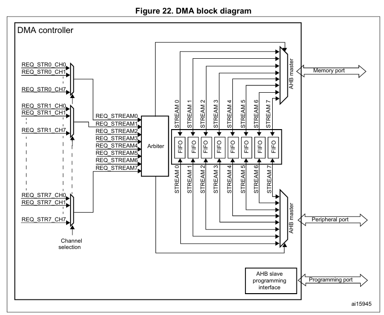
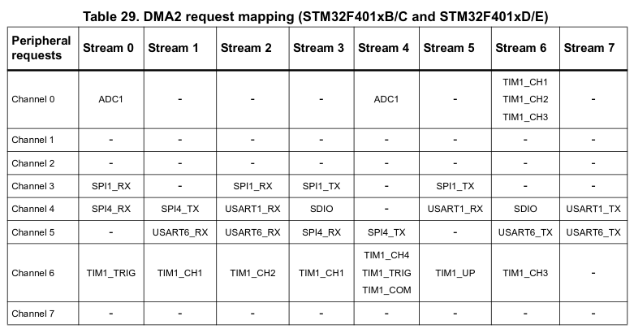
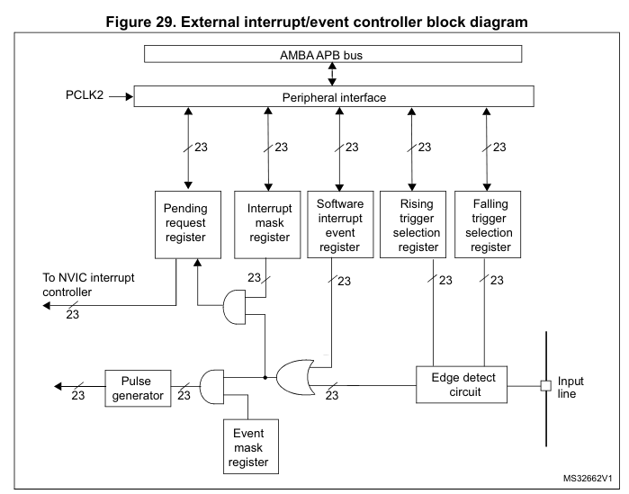

<!--
author:   Sebastian Zug, Karl Fessel & Andrè Dietrich
email:    sebastian.zug@informatik.tu-freiberg.de

version:  1.0.3
language: de
narrator: Deutsch Female

import:  https://raw.githubusercontent.com/liascript-templates/plantUML/master/README.md
         https://github.com/LiaTemplates/AVR8js/main/README.md
         https://github.com/LiaTemplates/Pyodide

icon: https://upload.wikimedia.org/wikipedia/commons/d/de/Logo_TU_Bergakademie_Freiberg.svg

-->

# Features STM32F4

| Parameter                | Kursinformationen                                                                                                                                                                    |
| ------------------------ | ------------------------------------------------------------------------------------------------------------------------------------------------------------------------------------ |
| **Veranstaltung:**       | `Vorlesung Digitale Systeme`                                                                                                                                                      |
| **Semester**             | `Sommersemester 2022`                                                                                                                                                                |
| **Hochschule:**          | `Technische Universität Freiberg`                                                                                                                                                    |
| **Inhalte:**             | `Spezifische Besonderheiten des STM32`                                                                                            |
| **Link auf den GitHub:** | [https://github.com/TUBAF-IfI-LiaScript/VL_DigitaleSysteme/blob/main/lectures/12_CortexMFeatures.md](https://github.com/TUBAF-IfI-LiaScript/VL_DigitaleSysteme/blob/main/lectures/12_CortexMFeatures.md) |
| **Autoren**              | @author                                                                                                                                                                              |

---

## DMA

Wenn wir der CPU (Hauptprozessor) die ganze Arbeit des Abholens von Anweisungen (Code) aus dem Flash, der Ausführung der dekodierten Anweisungen und des Verschiebens von Daten zu und von Peripheriegeräten und Speicher erledigen lassen, führt mit steigender Zahl von Komponenten zu einer steigenden Auslastung des Systems. Die Zahl der Interrupts, die ein UART1-Datenempfänger generiert, der einen Datenstrom erhält, den die CPU sofort in einen lokalen Puffer im Speicher übertragen muss, um kein Datenpaket zu verlieren, führt dies mit

$(1 Start + 8 data + 0 Parity + 1 stop)$ = $10 Bit$ bei $115200Baud$

zu 11520 Interrupts pro Sekunde. Diese konkurrieren dann noch mit den anderer Peripheriegeräten wie UART, SPI, ADC. Dabei passiert bei dieser konkreten Aufgabe nichts anderes als das "hin- und herschaufeln" von Daten. Eine Rechenpower wird gar nicht abgefragt.

Noch schlimmer wird die Situation, wenn neben der eigentlichen Kopieroperation auch noch der Overhead für das Umschalten des Kontexts zu und von Interrupt-Handlern berücksichtigt wird. Die CPU ist nicht in der Lage die volle Arbeitsleistung zu entfalten, da sie mit Datentransaktionen beschäftigt ist.

### Umsetzung

Der Begriff Speicherdirektzugriff oder englisch Direct Memory Access (DMA) erlaubt den Datenaustausch über das Bussystem ohne den Umweg über die CPU auf den Speicher zugreift.
Diese Technik erlaubt angeschlossenen Peripheriegeräten untereinander und mit dem Arbeitsspeicher zu kommunizieren. Der Vorteil des Speicherdirektzugriffs ist die schnellere Datenübertragung bei gleichzeitiger Entlastung des Prozessors.

Der DMA-Controller führt den direkten Speichertransfer durch: als AHB-Master kann er die Kontrolle über die AHB-Busmatrix übernehmen, um AHB-Transaktionen zu initiieren. er kann folgende Transaktionen durchführen:

- Peripherie-zu-Speicher
- Speicher-zu-Peripherie
- Speicher-zu-Speicher

| Modus                  | DMA1 | DMA2 |
| ---------------------- | ---- | ---- |
| Peripherie-zu-Speicher | X    | X    |
| Speicher-zu-Peripherie | X    | X    |
| Speicher-zu-Speicher   |      | X    |

Jeder Kanal kann einen DMA-Transfer zwischen einem Peripherieregister, das sich an einer festen Adresse befindet, und einer Speicheradresse durchführen. Die Menge der zu übertragenden Daten (bis zu 65535) ist programmierbar. Das Register, das die Menge der zu übertragenden Datenelemente enthält, wird nach jeder Transaktion dekrementiert.

Die Übertragungsdatengrößen der Peripherie und des Speichers sind über die Bits PSIZE und MSIZE im Register DMA_CCRx voll programmierbar.

Eine DMA-Transaktion besteht aus einer Folge von einer konfigurierbaren Anzahl von Datenübertragungen. Dabei besteht jede DMA-Übertragung besteht aus drei Operationen:

- Laden aus dem Peripherie-Datenregister oder einer Speicherstelle, die über das DMA_SxPAR- oder DMA_SxM0AR-Register adressiert wird
- Speichern der geladenen Daten im Peripherie-Datenregister oder einer Speicherstelle, die über das DMA_SxPAR- oder DMA_SxM0AR-Register adressiert wird -
- Nachdekrementieren des DMA_SxNDTR-Registers, das die Anzahl der noch auszuführenden Transaktionen enthält

Effizient wird das DMA-Verfahren allerdings erst, wenn nicht nur ein einzelnes Datenwort zu übertragen ist, sondern größere zusammenhängende Speicherbereiche, z. B. ganze Datensektoren oder -spuren von einer Festplatte. Dann lohnt sich auch der gewisse Overhead, der dadurch entsteht, dass zuallererst der DMA-Controller durch Setzen diverser Registerinhalte für die bevorstehende Aufgabe aufgesetzt werden muss. Peripherie- und Speicherzeiger können optional nach jeder Transaktion automatisch nachinkrementiert werden. Wenn der inkrementierte Modus aktiviert ist, ist die Adresse der nächsten Übertragung die Adresse der vorherigen Übertragung, die je nach gewählter Datengröße um 1, 2 oder 4 inkrementiert wird.

[^STM32]: Firma ST, STM32F401xx Controller Data Sheet, [Link](https://www.st.com/resource/en/reference_manual/dm00096844-stm32f401xbc-and-stm32f401xde-advanced-armbased-32bit-mcus-stmicroelectronics.pdf)

### Programmierung

Lassen Sie uns das Ganze anhand eines Beispiels evaluieren. Nehmen wir an, dass Sie den Analog-Digital-Wandler auf Ihrem Controller maximal nutzen wollen. Dazu werden die gelesenen Daten in den Speicher geschrieben, um dort beispielsweise gefiltert und analysiert zu werden.

Welche Schritte sind entsprechend notwendig?

+ Konfiguration des ADC in einem Continous-Mode
+ Aktivierung des DMA Channels für den zugehörigen PIN
+ Visualisierung des Speicherinhaltes im Debug Modus

!?[Weiterführendes Beispiel](https://www.youtube.com/watch?v=EsZLgqhqfO0&t=92s)

### Herausforderungen

Die Existenz der DMA-Einheit kann manchmal einige Probleme verursachen. Wenn z. B. in einer Architektur mit einem CPU-Cache die DMA-Einheit auf den Datenspeicher zugreift und an eine Stelle schreibt, die auch im Cache gespiegelt ist, werden die Daten im Cache-Speicher ungültig.

## NVIC

Interrupts können in zwei Gruppen kategorisiert werden, nämlich in asynchrone Interrupts (aka Interrupt, Hardware-Interrupt) und synchrone Interrupts (aka Exception). Erstere können jederzeit eintreffen, typischerweise IO-Interrupts, letztere können nur nach der Ausführung eines Befehls eintreffen, z.B. wenn die CPU versucht, eine Zahl durch 0 zu dividieren oder ein Page Fault. Das ist also der Unterschied zwischen Interrupts und Exceptions.

Die Intel-Dokumentation klassifiziert Interrupts und Exceptions wie folgt:

| Kategorie  | Subkategorie                 | Bedeutung                                                                                                                                                                    |
| ---------- | ---------------------------- | ---------------------------------------------------------------------------------------------------------------------------------------------------------------------------- |
| Interrupts | Maskierbare Interrupts       | Alle Interrupt Requests (IRQs), die von I/O-Geräten ausgegeben werden, führen zu maskierbaren Interrupts. Ein maskierbarer Interrupt wird ignoriert, sofern er maskiert ist. |
|            | Nicht-maskierbare Interrupts | Nur wenige kritische Ereignisse (z. B. Hardwarefehler) führen zu nichtmaskierbaren Interrupts . Nichtmaskierbare Interrupts werden von der CPU immer erkannt.                |
| Exceptions | Fehler                       | Können im Allgemeinen behoben werden; nach der Behebung kann das Programm ohne Verlust der Kontinuität neu gestartet werden.                                                 |
|            | Traps                        | Traps werden vom Anwenderprogramm ausgelöst, um eine Funktionalität des Betriebssystems aufzurufen.                                                                          |
|            |                              |                                                                                                                                                                              |
|            | Programmierte Ausnahmen      |        Programmierte Ausnahmen werden von der Steuereinheit als Traps behandelt; sie werden oft als Software-Interrupts bezeichnet.                                                                                                                                                                       |

### NVIC

> Was steht im Werbetext zum Nested Vector Interrupt Controller (NVIC) und was bedeuten diese Aussagen?

_The devices embed a nested vectored interrupt controller able to manage 16 priority levels, and handle up to 62 maskable interrupt channels plus the 16 interrupt lines of the Cortex®-M4 with FPU:_

+ _Closely coupled NVIC gives low-latency interrupt processing_
+ _Interrupt entry vector table address passed directly to the core_
+ _Allows early processing of interrupts_
+ _Processing of late arriving, higher-priority interrupts_
+ _Support tail chaining_
+ _Processor state automatically saved_

### Trigger für die ISR

Cortex-M Controller implementieren mindestens die folgenden Exceptions:

- Reset - Dies ist die Routine, die ausgeführt wird, wenn ein Chip aus dem Reset kommt.
- Non Maskable Interrupt (NMI) - Wie der Name schon sagt, kann dieser Interrupt nicht deaktiviert werden. Wenn Fehler in anderen Exception-Handlern auftreten, wird ein NMI ausgelöst. Abgesehen von der Reset-Exception hat er die höchste Priorität aller Exceptions.
- HardFault - Der Auffangbehälter für verschiedene Systemfehler, die auftreten können, wie z. B. Zugriffe auf fehlerhaften Speicher, Divide-by-Zero-Fehler und illegale Zugriffe ohne Vorzeichen. Es ist der einzige Handler für Fehler auf der ARMv6-M-Architektur, aber für ARMv7-M & ARMv8-M können Fault-Handler mit feinerer Granularität für bestimmte Fehlerklassen aktiviert werden (d.h. MemManage, BusFault, UsageFault).
- SVCall - Exception Handler, der aufgerufen wird, wenn ein Supervisor Call (svc) Befehl ausgeführt wird.
- PendSV & SysTick - Interrupts auf Systemebene, die durch Software ausgelöst werden. Sie werden typischerweise beim Betrieb eines RTOS verwendet, um zu verwalten, wann der Scheduler läuft und wann Kontextwechsel stattfinden.

Auf die Core Exeptions folgen die Interrupteinträge der peripheren Elemente.

> _"Events sind neben Interrupts etwas, das dem Cortex Core seinen Schlaf  rauben kann."_ (mikrocontroller.net Forenbeitrag)

### Umsetzung

> _The devices embed a nested vectored interrupt controller able to manage 16 priority levels._

[^STM32]: Firma ST, STM32F401xx Controller Data Sheet, [Link](https://www.st.com/resource/en/reference_manual/dm00096844-stm32f401xbc-and-stm32f401xde-advanced-armbased-32bit-mcus-stmicroelectronics.pdf)

### Beschleunigung der Abarbeitung

| Ansatz                       | Erklärung                                                                                                                                                                                                                                                                                                                                                                                                                                                                                                                                                                                                                                                      |
| ---------------------------- | -------------------------------------------------------------------------------------------------------------------------------------------------------------------------------------------------------------------------------------------------------------------------------------------------------------------------------------------------------------------------------------------------------------------------------------------------------------------------------------------------------------------------------------------------------------------------------------------------------------------------------------------------------------- |
| **Tail-Chaining**            | Üblicherweise muss die Hardware beim Beenden einer ISR mindestens acht vom _caller safe_ Register poppen und wiederherstellen. Wenn jedoch bereits eine neue Exception ansteht, kann dieses POP und das anschließende PUSH übersprungen werden, da genau dieselben Register erst gespeichert und dann wieder entnommen werden würden!                                                                                                                                                                                                                                                                                                                          |
| **Late-arriving Preemption** | Der ARM-Kern kann ein ISR höherer Priorität erkennen, während er sich in der _Exception-Entry-Phase_ befindet (Sichern der Caller-Register & Abrufen der auszuführenden ISR-Routine). Die Optimierung besteht darin, dass die ISR-Routine mit höherer Priorität geholt und ausgeführt werden kann, statt die ursprünglich geplante. Die bereits erfolgte Speicherung des Registerzustands ist davon ja unabhängig. Dadurch wird die Latenzzeit für den Interrupt mit höherer Priorität reduziert und praktischerweise kann der Prozessor nach Beendigung des spät eintreffenden Exception-Handlers in die ursprüngliche ISR unmittelbar anschließend bedienen. |
| **Lazy State Preservation**  | ARMv7- & ARMv8-Bausteine können eine optionale Floating Point Unit (FPU) integrieren. Diese kommt mit dem Zusatz von 33 Vier-Byte-Registern (s0-s31 & fpscr). 17 davon sind "caller"-gespeichert und müssen gesichert werden. Da FPU-Register nicht oft in ISRs verwendet werden, kann eine Optimierung `Lazy Context Save` aktiviert werden, die das tatsächliche Speichern der FPU-Register auf dem Stack vermeidet, bis eine Fließkommaanweisung in der Exception verwendet wird.                                                                                                                                                                           |
|                              |                                                                                                                                                                                                                                                                                                                                                                                                                                                                                                                                                                                                                                                                |
### Beispiel

Nutzung Externer Interrupts in Form der Buttons auf dem STM32F401RE Board.
