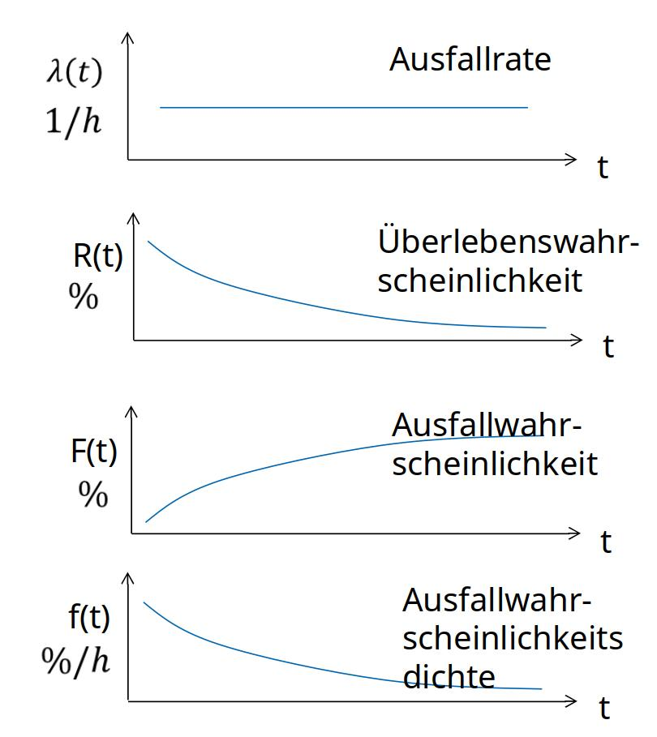

<!--
author:   Sebastian Zug, Karl Fessel & Andrè Dietrich
email:    sebastian.zug@informatik.tu-freiberg.de

version:  1.0.1
language: de
narrator: Deutsch Female

icon: https://upload.wikimedia.org/wikipedia/commons/d/de/Logo_TU_Bergakademie_Freiberg.svg

import: https://raw.githubusercontent.com/liascript-templates/plantUML/master/README.md

-->


[](https://liascript.github.io/course/?https://github.com/TUBAF-IfI-LiaScript/VL_DigitaleSysteme/main/lectures/12_Fehlertoleranz.md#1)


# Fehlertoleranz

| Parameter                | Kursinformationen                                                                                                                                                                    |
| ------------------------ | ------------------------------------------------------------------------------------------------------------------------------------------------------------------------------------ |
| **Veranstaltung:**       | `Vorlesung Digitale Systeme`                                                                                                                                                      |
| **Semester**             | `Sommersemester 2025`                                                                                                                                                                |
| **Hochschule:**          | `Technische Universität Freiberg`                                                                                                                                                    |
| **Inhalte:**             | `Fehlertoleranz in Eingebetteten Systemen`                                                                                            |
| **Link auf den GitHub:** | [https://github.com/TUBAF-IfI-LiaScript/VL_DigitaleSysteme/blob/main/lectures/10_XMEGA_Abgrenzung.md](https://github.com/TUBAF-IfI-LiaScript/VL_DigitaleSysteme/blob/main/lectures/11_Debugging.md) |
| **Autoren**              | @author                                                                                                                                                                              |


---


## Motivation

> Warum ist Fehlertoleranz für eingebettete Systeme so zentral?

Eingebettete Systeme interagieren unmittelbar mit der Umgebung. In sicherheitskritischen Anwendungen, wie z.B. in der Automobilindustrie, der Luftfahrt oder der Medizintechnik können Fehler in einem solchen System schwerwiegende Folgen haben, einschließlich Sachschäden, Verletzungen oder sogar Todesfälle. Daher ist es entscheidend, dass eingebettete Systeme so konzipiert sind, dass sie auch bei Hardware- oder Softwarefehlern weiterhin funktionieren.

### Beispiele


### Quantifizierung des Risikos

<!-- data-type="none" -->
| Paramter                          | Flugzeug                    | Auto      |
| --------------------------------- | --------------------------- | --------- |
| Einheiten                         | 10 k                        | 100 Mio   |
| Betriebsstunden/Jahr              | 55 Mio                      | 30000 Mio |
| Kosten/Einheit                    | 65 Mio                      | 20 k      |
| Unfälle/Jahr                      | 170                         | 21 Mio    |
| Todesfälle/Jahr                   | 350                         | 42 k      |
| Todesfälle/$10^6$ Betriebsstunden | 6,4                         | 0,71      |
| Bedienertraining                  | hoch                        | niedrig   |
| Redundante Komponenten            | alle flugkritischen Systeme | Bremsen   |

Zuverlässigkeitsanfordererungen für sicherheitskritische Systeme der Flugzeugtechnik: $10^{-9}$ Fehler/h für eine Missionszeit von 10 h.

Kann man die Ansätze der Flugzeugtechnik übernehmen?

+ zu teuer.
+ unterschiedliche Betriebsbedingung.
+ schwer durchzusetzende Wartungsintervalle.
+ schlecht ausgebildete Benutzer.

Anforderungen im Automotive Sektor

+ Anfangszuverlässigkeit: im 1. Jahr    Fehler: < 1000 • 10\-9
+ System\-Lebenszeit: 	3500 _ h _ (ca. 5 Jahre bei 2 _h_ /Tag)
+ Garantie:			 ≥ 1 Jahr, Ersatzteile ≥ 10 Jahre
+ Umgebungsbedingungen:	- 40 bis +85 °C
+ Vibration:			10 Hz_bis 1 kHz, zufällig 5 g, sinus 2-5 g
+ Shock:			30  _g_
+ Versorgungsspannung:	8-16 _V_ (für 1 _min_  umgekehrte Polarität 13,5 _V_)

## Definitionen

Zuverlässlichkeit (Dependability): _"Doing the right thing at the right time!"_

> Die Zuverlässlichkeit eines Systems ist die Qualität einer vom System erbrachten Funktion (Service), in die begründbar und berechtigter-weise Vertrauen (reliance) gesetzt werden kann.

Die Funktion ist das an der Schnittstelle zu anderen Systemen, die mit dem betrachteten System interagieren, beobachtbare Systemverhalten.  __Die Qualität bezieht sich auf die Übereinstimmung der erbrachten mit der spezifizierten Systemfunktion.__

Fragestellungen:

Attribute: 	Welche Aspekte der Verlässlichkeit werden besonders hervorgehoben?
Fehler:     	Welche Klassen von Fehlern werden berücksichtigt?
Maße: 	Wie lässt sich die Verlässlichkeit quantitativ erfassen?

### Aspekte der Zuverlässigkeit

| Aspekt                                 | Beschreibung                                                                                                                                              | Sektor                       |
| -------------------------------------- | --------------------------------------------------------------------------------------------------------------------------------------------------------- | ---------------------------- |
| **Überlebensfähigkeit**  (Reliability) | Zuverlässigkeit im Hinblick auf ein ununterbrochen korrektes Systemverhalten                                                                              | Luft- und Raumfahrt          |
| **Verfügbarkeit**  (Availability)      | Zuverlässigkeit im Hinblick auf momentane Bereitschaft des Systems, d.h. die Wahrscheinlichkeit ein in einem beliebigen Zeitpunkt fehlerfrei anzutreffen. | Automobilindustrie           |
| Prozesssicherheit (Safety)             | Zuverlässigkeit im Hinblick auf die Verhinderung katastrophaler Auswirkungen auf die Umgebung                                                             | industrielle Automatisierung |
| **Sicherheit** (Security)              | Zuverlässigkeit im Hinblick auf Vertraulichkeit und Integrität                                                                                            |                              |
|                                        |                                                                                                                                                           |                              |

> Für die Anwendbarkeit müssen wir die Zuverlässigkeit mathematisch modellieren.

### Fehlerdefinitionen

```text @plantUML.png
@startuml
skinparam backgroundColor #FFFFFF
skinparam node {
    BackgroundColor #FFFFFF
    BorderColor Black
    FontSize 14
}
skinparam ArrowColor Black
skinparam ArrowFontColor Black

' Definition der Hauptknoten
node "Fehlerursache\n(Fault)" as Fault
node "Fehler\n(Error)" as Error
node "Funktionsausfall\n(Failure)" as Failure

' Beschreibungen rechts
note right of Fault
  Ausfall einer physischen
  Komponente, fehlerhaftes
  Programm (statement)
end note

note right of Error
  fehlerhafter Zustand,
  z. B. Speicherinhalt,
  Registerinhalt
end note

note right of Failure
  Abweichung vom spezifizierten
  Systemverhalten

  Kann vom System nicht mehr
  behandelt werden.
end note

' Kommentare links
note left of Fault
  kann prinzipiell nicht vollständig
  vermieden werden.
  
  <b>Methoden Fehlervermeidung</b>
end note

note left of Error
  muss in fehler-
  freien Zustand
  zurückgesetzt werden.
  
  <b>Methoden Fehlertoleranz</b>
end note

note left of Failure
  muss unter allen Umständen
  vermieden werden.
end note

' Verbindung der Hauptknoten
Fault --> Error : bewirkt möglicherweise\nfehlerhafte Zustandsänderung
Error --> Failure : bewirkt möglicherweise\nAbweichung vom Verhalten


@enduml
```

### Klassifikation von Fehlerursachen 

```text @plantUML.png
@startuml

@startmindmap
* Fehlerursache
** Art
*** zufällig
**** <color:red>Socke blockiert Bürste
*** beabsichtigt
**** <color:red>Uups, draufgetreten
** Ursprung
*** Wesen
**** physisch
***** <color:red>Antriebsmotor überhitzt
**** menschlich
***** <color:red>Falsche Bedienung
*** Systemgrenzen
**** intern
***** <color:red>Akkuspannung fällt plötzlich ab
**** extern
***** <color:red>WLAN-Ausfall während Kartenübertragung
*** Entstehungsphase
**** Entwurf
***** <color:red>Falscher Datentyp
**** Laufzeit
***** <color:red>Kontaktfehler
** Dauer
*** permanent
**** <color:red>Sensor dauerhaft defekt
*** temporär
**** <color:red>Lichtverhältnisse führen zu Navigationsfehlern
@endmindmap

@enduml

```

> ... am Beispiel des Staubsaugerroboters

## Fehlermodellierung

+ Ausfallwahrscheinlichkeit F(t) ... ist die Wahrscheinlichkeit für eine Komponente bis zum Zeitpunkt T < t auszufallen.

  $F(t) = \int_0^t f(t) , dt$

+ Überlebenswahrscheinlichkeit R(t) ... ist die Wahrscheinlichkeit, dass eine Komponente zum Zeitpunkt t noch nicht ausgefallen ist. F(t) ist das Komplement zu R(t). 

  $R(t) = 1 - F(t)$


> Das Beispiel nutzt eine Wahrscheinlichkeitsdichtefunktion $f(t)$, die die Ausfälle mit einer Normalverteilung modelliert. Ist das aber ein relistisches Modell?

### Ausfallrate

Der Produktlebenszyklus ist in drei Phasen unterteilt:

+ **Anlaufphase** ... in dieser Phase ist die Ausfallrate hoch, da viele Komponenten aufgrund von Fertigungsfehlern oder anfänglichen Belastungen ausfallen.
+ **Nutzungsphase** ... in dieser Phase ist die Ausfallrate relativ konstant und niedrig, da die Komponenten stabil arbeiten.
+ **Abnutzungsphase** ... in dieser Phase steigt die Ausfallrate wieder an, da Komponenten aufgrund von Alterung und Abnutzung ausfallen

Modelliert wird dieses Verhalten mit der Ausfallrate $\lambda(t)$. Sie stellt die Änderung pro Zeitfenster $f(t)$ in Relation zum aktuellen Bestand $R(t)$ dar:

$\lambda(t) = \frac{f(t)}{R(t)} = -\frac{dR}{dt} \cdot \frac{1}{R}$

, Gemeinfrei, https://commons.wikimedia.org/w/index.php?curid=40403865")

Für die Periode Konstanter Ausfallraten gilt dabei

$$
\begin{aligned}
\lambda(t) &= -\frac{dR}{dt} \cdot \frac{1}{R} = const \\
\frac{1}{R} \cdot dR &= -\lambda dt \\
ln(R) &= -\lambda t + C \\
R(t) &= e^{-\lambda t + C} = e^C \cdot e^{-\lambda t}\\  
R(t) &= R_0 \cdot e^{-\lambda t}
\end{aligned}
$$

<!-- style="width: 30%;" -->

### Beispiel 

Für ein elektronisches Bauteil wird eine konstante Ausfallrate angenommen.  Im Test ergaben sich für 1500 Teile in 1000 Stunden 20 Ausfälle. Wenn ich von 25000  Teilen ausgehe, wie viele sollten in 20000 Stunden noch funktionieren?

+ Falsch !!!

$$
\begin{aligned}
\frac{20 \text{Ausfälle}}{1500 \text{ Teile} \cdot 1000 \text{ Stunden}} &= \frac{x}{25000\cdot 20000} \\
x&= 6667 \text{ Teile} \\
R(20000)&= 25000 - 6667 = 18333\text{ Teile}
\end{aligned}
$$

+ Richtig !!!

$$
\begin{aligned}
\lambda = \frac{20}{1500 \cdot 1000} = 0,00001333 \text{ Ausfälle/Teil/Stunde}
\end{aligned}
$$

$$
\begin{aligned}
R(t) &= R_0 \cdot e^{-\lambda t} \text{ mit } R_0 = 25000 \text{ und } t = 20000 \\
R(t) &= 25000 \cdot e^{-0,00001333 \cdot 20000} \\
R(t) &\approx 25000 \cdot 0,766 \\
R(t) &\approx 19150 \text{ Teile}
\end{aligned}
$$

### Wiederauffrischung

> Was passiert bei der Wartung? Die Überlebenswahrscheinlichkeit $R(t)$ wird abermals auf $R_0$ zurückgesetzt. 


In der Grafik ist das Ganze übersteigert dargestellt :-)

### MTTF (Mean Time To Failure)

IEC 60050

+ Bisherige Betrachtungen zielten auf den Ausfall des Systems und damit die Überlebensfähigkeit
+ Nunmehr soll der Blick auf dem Wechsel von Betriebs- und Wartungsphasen liegen

MTTF (Mean Time To Failure) definiert  die mittlere Dauer bis zum Ausfall des Systems


$$
\begin{aligned}
MTTF = E\{x\} &= \int_0^\infty t \cdot f(t) dt \\
&= \int_0^\infty t \cdot \lambda(t) \cdot R(t) dt \\
&= \int_0^\infty t \cdot \lambda_0 \cdot e^{-\lambda_0 t} dt \text{ mit } \lambda_0 = const \\
&= \frac{1}{\lambda_0}
\end{aligned}
$$  


$MTTF = \frac{\sum(t_{down}-t_{up})}{n}$

### Definition Verfügbarkeit 

+ MTTR (Mean Time To Repair) definiert die mittlere Dauer bis zur Wiederherstellung des Systems   
+ MTBF (Mean Time Between Failures) definiert die mittlere Zeit zwischen zwei Ausfällen des Systems


Daraus ergibt sich die Verfügbarkeit $A$ des Systems    
$$
\begin{aligned}
A &= \frac{MTTF}{MTTF + MTTR} \\
&= \frac{MTTF}{MTBF} \\
&= \frac{E\{x\}}{E\{x\} + E\{y\}} \\
&= \frac{\int_0^\infty t \cdot f(t) dt}{\int_0^\infty t \cdot f(t) dt + \int_0^\infty t \cdot g(t) dt}
\end{aligned}
$$

### Typische Fehlerraten 

Die nachfolgenden Tabellen geben typische Fehlerraten für verschiedene Komponenten bieten aber allenfalls eine Orientierung. In einem typischen Mikrocontroller-Datenblatt finden sich solche Fehlerraten (λ) in der Regel nicht.

| Komponente                           | Typische Fehlerrate λ (pro Stunde) |
| ------------------------------------ | ---------------------------------- |
| Hochzuverlässiger Mikrochip          | $10^{-9} - 10^{-7}$                |
| Standard-Mikrocontroller             | $10^{-6}$                          |
| Leistungselektronik (MOSFETs, IGBTs) | $10^{-6} - 10^{-5}$                |
| Relais, Schütze                      | $10^{-5} - 10^{-4}$                |
| Kondensatoren (Elkos)                | $10^{-4} - 10^{-3}$                |

Für einen Elektrolytkondensator folgt aus $$\lambda = \frac{1}{MTTF}$$ eine mittlere Lebensdauer von 10.000 Stunden, was einer Fehlerrate von $10^{-4}$ entspricht.

| ASIL-Stufe | Typische λ (pro Stunde)    | Beispielhafte Systeme            |
| ---------- | -------------------------- | -------------------------------- |
| **ASIL D** | $\leq 10^{-8}$             | Brems-, Lenksysteme              |
| **ASIL C** | $\leq 10^{-7}$             | ABS-Steuerung                    |
| **ASIL B** | $\leq 10^{-6}$             | Lichtsteuerung, Wischersteuerung |

## Zusammengesetzte Systeme

Strukturbasierte Modellierung:

+ identifizierbare unabhängige Komponenten, die das System über eine Abhängigkeitsrelation bilden
+ jede Komponente besitzt eine bestimmte Zuverlässigkeit
+ die Konstruktion des Modells basiert auf der Verbindungsstruktur zwischen den Komponenten

<!-- style="width: 30%;" -->


```ascii 
             Schnittstellen             Schnittstellen               Schnittstellen
                   :                           :                          : 
                   :        +--------------+   :       +--------------+   :  
                   :        | Komponente C |---:------>| Komponente F |---:----+
                   :    +-->|              |   :   +-->|              |   :    |                 
                   :    |   +--------------+   :   |   +--------------+   :    |                   
                   :    |                      :   |                      :    |
+--------------+   :    |   +--------------+   :   |                      :    |
| Komponente A |---:----+-->| Komponente D |---:---+                      :    +--> ...
|              |   :    |   |              |   :                          :    |
+--------------+   :    |   +--------------+   :                          :    |
                   :    |                      :                          :    |
+--------------+   :    |   +--------------+   :       +--------------+   :    |                                                      
| Komponente B |   :    +-->| Komponente E |---:------>| Komponente G |---:----+ 
|              |---:------->|              |   :       |              |   :                                      
+--------------+   :        +--------------+   :       +--------------+   :                                        
                   :                                                                                                            :                                                                                                                 .
``` 

### Zuverlässigkeits-Schaltbilder

Zuverlässigkeits-Schaltbilder (Reliability Block Diagrams, RBDs) sind eine grafische Darstellungsmethode, die es ermöglicht, die Zuverlässigkeit eines Systems zu modellieren und zu analysieren. Sie bestehen aus Knoten, die Komponenten repräsentieren, und Verbindungen, die die Abhängigkeiten zwischen diesen Komponenten darstellen.

Für jeden Teil eines Systems werden zwei Zustände betrachtet:
+ intakt (funktionstüchtig)
+ defekt (ausgefallen)

> Ein System ist fehlertolerant, wenn es intakt sein kann, ohne dass alle Komponenten intakt sind.

Zuverlässigkeits-Schaltbilder dürfen nicht mit elektrischen Schaltbildern verwechselt werden. 

```ascii 
                      +--------------+     +--------------+         
                      | Komponente B |     | Komponente C |
                  +-->| 95 %         |---->| 93 %         |--+
                  |   +--------------+     +--------------+  |                                  
+--------------+  |                                          | 
| Komponente A |--+                                          +-->  
| 99 %         |  |                                          | 
+--------------+  |   +--------------+                       |               
                  +-->| Komponente D |-----------------------+                                              
                      | 99 %         |                                                           
                      +--------------+                          
                                                                                                                                    .
```

### Seriensysteme

```ascii        
      +--------------+      +--------------+      +--------------+ 
----->| Komponente 1 |----->| Komponente 2 |----->| Komponente 2 |----->
      | 99 %         |      | 95 %         |      | 93 %         | 
      +--------------+      +--------------+      +--------------+               
                                            
                                                                                                                                    .
```

Das System funktioniert nur, wenn alle Komponenten intakt sind.

$R_{serie} = P (K_1 \text{ intakt}) \text{ und } P(K_2 \text{ intakt}) \text{ und } ...  \text{ und } P(K_3 \text{ intakt})$   

> Annahme: Die Eigenschaften (Ki intakt) (i=1,..,n) sind unabhängig. Es tritt also keine Störung auf, die alle Komponenten gleichermaßen beeinträchtigt!

$R_{serie} = P (K_1 \text{ intakt}) \cdot P(K_2 \text{ intakt}) \cdot ......  \cdot P(K_3 \text{ intakt})$   

mit $R_i$ : Intaktwahrscheinlichkeit der Komponente i:

$R_{serie} = R_1(t) \cdot  R_2(t) \cdot  ..... \cdot R_n(t)$

Für eine angenommene Intaktwahrscheinlichkeit jeder Komponente $R_i(t)$ = 0,9 ergibt sich die Intaktwahrscheinlichkeit des Systems $R_{serie}$ zu:

<!-- data-type="none" -->
| Anzahl der Komponenten   | 1   | 2    | 3     | 4     |
| ------------------------ | --- | ---- | ----- | ----- |
| Intaktwahrscheinlichkeit | 0.9 | 0.81 | 0.729 | 0.651 |

### Parallelsysteme

Parallelsysteme kommen überall dort zum Einsatz, wo ein Ausfall einzelner Komponenten nicht zum Ausfall des Gesamtsystems führen soll – also typischerweise in sicherheitskritischen oder hochverfügbaren Anwendungen. 

+ Redundante Stromversorgung (USV + Netz + Generator)
+ Redundante Bremssysteme in Flugzeugen oder Zügen
+ Mehrfache Steuergeräte (ECUs)
+ Redundante Monitoringsysteme
+ ...

```ascii        
      +--------------+  
  +-->| Komponente 1 |----+
  |   | 99 %         |    |
  |   +--------------+    |
  |                       |
  |   +--------------+    |
--+-->| Komponente 2 |----+-->
  |   | 95 %         |    |
  |   +--------------+    |
  |                       |
  |   +--------------+    |
  +-->| Komponente 3 |----+
      | 93 %         |      
      +--------------+
                                                                                                                                    .
```

> Hier drehen wir die Frage nach der Intaktwahrscheinlichkeit um ... Wie wahrscheinlich ist es, dass alle Komponenten ausfallen?

Defektwahrscheinlichkeit = 1 - Intaktwahrscheinlichkeit 

$R_{parallel} =  1 – (P (K_1 \text{ defekt}) \text{ und } P(K_2 \text{ defekt}) \text{ und } .......P(K_n \text{ defekt}))$

> Annahme: Die Eigenschaften $(K_i \text{ defekt})$ $(i=1,..,n)$ sind unabhängig. 

mit $R_i$ : Intaktwahrscheinlichkeit der Komponente i:

$$
\begin{aligned}
R_{parallel} &=  1- (F_1(t) \cdot F_2(t) \cdot ... \cdot (F_n(t)))\\
R_{parallel} &=  1- ((1-R_1(t)) \cdot (1-R_2(t)) \cdot ... \cdot (1-R_n(t)))
\end{aligned}
$$

<!-- data-type="none" -->
| Anzahl der Komponenten   | 1   | 2    | 3     | 4     |
| ------------------------ | --- | ---- | ----- | ----- |
| Intaktwahrscheinlichkeit | 0.9 | 0.99 | 0.999 | 0.9999|

### Beispiel

> Wie groß ist die Intaktwahrscheinlichkeit für folgendes System (Ausfallwahrcheinlichkeiten sind angegeben)?
Wie ändert sich diese wenn auf Bauteil C verzichtet wird?

```ascii        
                          +--------------+  
                      +-->| Komponente B |----+
                      |   | 97 %         |    |
   +--------------+   |   +--------------+    |
-->| Komponente B |---+                       +-->
   | 96 %         |   |                       |
   +--------------+   |   +--------------+    |
                      +-->| Komponente C |----+
                          | 95 %         |   
                          +--------------+   

                                                                                                                                    .
```

Wie ändert sich diese wenn auf Bauteil C verzichtet wird?

Variante A:

$$
\begin{aligned}
0, 96 · 0, 97 · 0, 95 &= 0, 88464 \text{ - Alle Komponenten funktionsbereit}\\
0, 96 · 0, 97 · 0, 05 &= 0, 04656 \text{ - Komponente C ausgefallen}\\
0, 96 · 0, 03 · 0, 95 &= 0, 02736 \text{ - Komponente B ausgefallen}\\
R = \sum &= 0, 96856
\end{aligned}
$$

$$
\begin{aligned}
R = 0.96 · (1 − (0.05 · 0.03)) = 0, 96856 \text{ entspricht  P = A ∩ (B ∪ C)}
\end{aligned}
$$

Variante B ohne Redundanz:

<!-- data-type="none" -->
| Beschreibung  | Intaktwahrscheinlichkeit |
| ------------- | ------------------------ |
| mit Bauteil B | 0, 96 · 0, 97 = 0, 9311  |
| mit Bauteil C | 0, 96 · 0, 95 = 0, 9119  |

## Mechanismen der Zuverlässigkeit

### Fehlervermeidung

* __Fehlervermeidung__  – Aufgabe des Entwicklers zu Designzeit, des Betreibers zur Laufzeit

  * - Schirmung von Kabeln
  * - Schulung von Personal
  * - Überwachung des Entwicklungsprozesses

Strukturierter Ansatz am Beispiel: FMEA


Wie sicher ist sicher?

__SOTIF-Standard ISO 21448 __


### Fehlertoleranz

* __Fehlertoleranz__  - Fähigkeit eines Systems, auch bei einer begrenzten Zahl fehlerhafter Subsysteme eine spezifizierte Funktion zu erfüllen

  * - Mittelwertbildung bei Sensordaten
  * - Multisensorsysteme

Fehlertoleranzniveaus

<!-- data-type="none" -->
| Typ           | Verhalten des Systems                             |
| ------------- | ------------------------------------------------- |
| _go_          | System- und Anwendungsprogramm sicher und korrekt |
| _fail-soft_   | Systembetrieb sicher, aber Leistung vermindert    |
| _fail-save_   | Nur Systemsicherheit gewährleistet                |
| _fail-unsave_ | unverhersehbares Systemverhalten                  |
| _fail-stop_   | Abbruch (kein Fehlertoleranzmodus)                |

### Redundanzen

+ Aktive Redundanz:  Mehrere Komponenten erbringen dieselbe Dienstleistung nebenläufig.
+ Passive Redundanz: Redundante Komponenten sind nicht an der Erbringung der Dienstleistung beteiligt. 

+ Cold Standby: die redundante(n) Komponente(n) werden erst aktiviert, wenn eine aktive Komponente ausgefallen ist. Der Zustand der Berechnung zum Zeitpunkt des Ausfalls der aktiven Komponente muss auf der redundanten Komponente rekonstruiert werden.
+ Hot Standby: die redundante(n) Komponente(n) ist aktiv, erzeugt aber keine Ausgaben. Die redundante Komponente enthält beim Ausfall der aktiven Komponente bereits deren Zustand und kann sie sofort ersetzen.


### Mechanismen der Fehlertoleranz

+ explizite Fehlerbehandung (dynamisch Redundanz)

   + Fehlererkennung
   + Schadensermittlung und Begrenzung
   + Rekonfiguration
   + Wiederherstellung

+ Fehlermaskierung (statische Redundanz)

   + Fehlerkorrigierende Codes
   + n-aus-m Mehrheitsentscheidung

Beispiel: K aus n System - Mehrheitsentscheidung anhand einer ungeraden Zahl von Zustandsbewertungen

Wir gehen von einem System aus, das drei Komponenten $K_1$, $K_2$ und $K_3$ besitzt. Jede Komponente kann einen Zustand annehmen, der entweder intakt oder defekt ist. Die Intaktwahrscheinlichkeit jeder Komponente betrag 0,9, der Voter selbst hat eine Intaktwahrscheinlichkeit von 0,99.

```ascii        

         +---------+  +---------+  +---------+     
    +--->| "$K_1$" |--| "$K_2$" |--| "$K_3$" |--+
    |    +---------+  +---------+  +---------+  |  
    |                                           |     
    |    +---------+  +---------+               |     
    +--->| "$K_1$" |--| "$K_2$" |---------------+  
    |    +---------+  +---------+               |   +---------+
----+                                           +---| Voter   |--->   
    |                 +---------+  +---------+  |   +---------+
    +---------------->| "$K_2$" |--| "$K_3$" |--+ 
    |                 +---------+  +---------+  |
    |                                           |  
    |    +---------+               +---------+  |   
    +--->| "$K_1$" |---------------| "$K_3$" |--+ 
         +---------+               +---------+  
                                                                                                                                    .
```

$$
\begin{aligned}
R(t) = \sum & P(K_1 \text{ intakt}) \cdot P(K_2 \text{ intakt}) \cdot P(K_3 \text{ intakt}) \\ 
            & P(K_1 \text{ intakt}) \cdot P(K_2 \text{ intakt}) \cdot P(K_3 \text{ ausgefallen}) \\
            & P(K_1 \text{ ausgefallen}) \cdot P(K_2 \text{ intakt}) \cdot P(K_3 \text{ intakt}) \\
            & P(K_1 \text{ intakt}) \cdot P(K_2 \text{ ausgefallen}) \cdot P(K_3 \text{ intakt}) \\
            & \cdot P(Voter \text{ intakt})\\
\end{aligned}
$$

$$
\begin{aligned}
R(t) &= (P(intakt)^3 + 3 \cdot P(intakt)^2 \cdot P(ausgefallen)) \cdot P(Voter \text{ intakt})\\
R(t) &= (0,93 + 3\cdot 0,92 \cdot (1 -0,9)) \cdot 0,99 = 0,96228
\end{aligned}
$$

> Das mehrfache Erscheinen der Komponenten $K_1, K_2, K_3$ illustriert die Besonderheiten des Zuverlässigkeitsschaubildes.

## Diversität

Reine Replikation schützt nicht vor Entwurfsfehlern (fehlerhafte Problemanalyse, Übervereinfachung, Grenzfälle)!

> Tolerierung durch verschiedene Implementierungen einer Funktion - Diversitäre Exemplare reagieren unterschiedlich auf gleiche Fehlerauswirkungen. In ihrer Gesamtheit bleibt eine diversitäre Komponente somit häufiger fehlerfrei!

Unterscheidung: 

+ Hardwarediversität, 
+ Softwarediversität

> Beispiel: Gleichzeitige Datenspeicherung auf Halbleiterspeichern (ROM, RAM, Flash) und Magnetplattenspeichern (Festplatten) - 	Elektromagnetische Störungen beschränken sich eher auf erstere, mechanische Stöße eher auf letztere

### Umsetzung 


Voraussetzung: Spezifikation muss Entwurfsspielraum erlauben:

+ zu wenig = keine Diversität möglich
+ zu viel = missverständliche Aufgabenstellung

Statische Evaluation des Systems schwierig, da unterschiedliche Implementierungen untersucht werden müssen

Annahme: Verschiedene Entwickler begehen eher unwahrscheinlich die gleichen Fehler -> Implementierung aller Varianten durch separate Teams

### Beispiel: Redundanz im Airbus A320

<!-- style="width: 50%;" -->

Das System wird durch verschieben Steuerelemente (Elevator, Aileron) und durch die Trimmung des horizontalen Stabilisators (THS) stabilisiert. Diese sind jeweils redundant ausgelegt, um die Fehlertoleranz zu erhöhen. 


> Beachten Sie dabei, das sowohl die Hardware als auch die Programmiersprache variiert.

Man hat nicht nur ein redundantes System (z.B. zwei ELACs), sondern jedes einzelne Computer-Modul (ELAC1, ELAC2, SEC1 usw.) ist intern noch einmal redundant aufgebaut. Der Command mode führt die primäre Aufgabe aus, während der Monitor mode ihn ständig überwacht. Wenn die Ergebnisse übereinstimmen, läuft das System normal. Weichen sie ab, wird ein Fehler erkannt und entsprechende Maßnahmen ergriffen, um die Sicherheit des Flugzeugs zu gewährleisten. 

