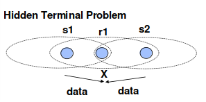

<!--
author:   Sebastian Zug, Karl Fessel & Andrè Dietrich
email:    sebastian.zug@informatik.tu-freiberg.de

version:  1.0.3
language: de
narrator: Deutsch Female

import:  https://raw.githubusercontent.com/liascript-templates/plantUML/master/README.md
         https://raw.githubusercontent.com/liaScript/mermaid_template/master/README.md
icon: https://upload.wikimedia.org/wikipedia/commons/d/de/Logo_TU_Bergakademie_Freiberg.svg

-->


[](https://liascript.github.io/course/?https://github.com/TUBAF-IfI-LiaScript/VL_DigitaleSysteme/main/lectures/13_Anwendungen.md#1)


# Sensornetze

| Parameter                | Kursinformationen                                                                                                                                                                                |
|--------------------------|--------------------------------------------------------------------------------------------------------------------------------------------------------------------------------------------------|
| **Veranstaltung:**       | `Vorlesung Softwareentwicklung für eingebettete Systeme`                                                                                                                                         |
| **Semester**             | `Sommersemester 2025`                                                                                                                                                                            |
| **Hochschule:**          | `Technische Universität Freiberg`                                                                                                                                                                |
| **Inhalte:**             | `Grundlagen / Herausforderungen Sensornetze`                                                                                                                                                     |
| **Link auf den GitHub:** | [https://github.com/TUBAF-IfI-LiaScript/VL_DigitaleSysteme/blob/main/lectures/13_Anwendungen.md](https://github.com/TUBAF-IfI-LiaScript/VL_DigitaleSysteme/blob/main/lectures/13_Anwendungen.md) |
| **Autoren**              | @author                                                                                                                                                                                          |


---

## Motivation

> Drahtlose Sensornetzwerke (WSN) sind Netze von räumlich verteilten und dedizierten Sensoren, die die physikalischen Bedingungen der Umgebung überwachen und aufzeichnen und die gesammelten Daten (an eine zentrale Stelle) weiterleiten.[^1].

Ein WSN besteht aus "Knoten" - von einigen wenigen bis zu Hunderten oder Tausenden, wobei jeder Knoten mit anderen Sensoren verbunden ist. Jeder dieser Knoten besteht in der Regel aus mehreren Teilen: einem Funksender/Empfänger mit einer internen Antenne oder einer Verbindung zu einer externen Antenne, einem Mikrocontroller, einer elektronischen Schaltung für die Verbindung mit den Sensoren und einer Energiequelle, in der Regel einer Batterie oder einer eingebetteten Form der Energiegewinnung.

Sensorknoten bilden  drahtlose Ad-hoc-Netze, die sich selbsttätig aufbauen und konfigurieren. Diese werden als _(mobile) ad hoc network_ (MANets) oder Mesh-Netze bezeichnet. Moderne Netze sind bidirektional, d. h. sie sammeln sowohl Daten[^2] als auch sie ermöglichen die Steuerung von Sensoraktivitäten[^3] oder der Konfiguration der Verarbeitung (Edge Computing). 


| **Phase**                                     | **Zeitraum (ca.)** | **Forschungsschwerpunkte**                                                                                        | **Charakteristik / Ziel**                                                                                |
| --------------------------------------------- | ------------------ | ----------------------------------------------------------------------------------------------------------------- | -------------------------------------------------------------------------------------------------------- |
| **1. Konzeptionsphase**                       | 1998–2002          | Grundlegende Konzepte, Netzwerkarchitektur, Energieeffizienz, drahtlose Kommunikation                             | Erste Visionen: autonome, batteriebetriebene Mini-Knoten, Selbstorganisation, Militär-/Umweltanwendungen |
| **2. Protokollphase**                         | 2002–2006          | Routing-Protokolle, Medium Access Control (MAC), Clustering, Topologiekontrolle                                   | Entwicklung energieeffizienter Kommunikationsprotokolle, einfache Selbstheilung                          |
| **3. Systemphase**                            | 2005–2010          | Betriebssysteme (z. B. TinyOS, Contiki), Middleware, Sensorknoten-Hardware                                        | Aufbau vollständiger Plattformen für reale Anwendungen                                                   |
| **4. Anwendungsphase**                        | 2008–2015          | Umweltmonitoring, Gebäudeautomation, Gesundheitswesen, Sicherheitsanwendungen                                     | Proof-of-Concept in realen Szenarien, Pilotprojekte                                                      |
| **5. Integration mit IoT**                    | 2012–2020          | Internet-Protokolle (6LoWPAN, CoAP), Cloud-Anbindung, Interoperabilität, Standards (z. B. IEEE 802.15.4)          | WSN als Teil des Internets der Dinge (IoT), Fokus auf Skalierbarkeit und Integration                     |
| **6. Kommerzialisierung & Plattformisierung** | 2015–heute         | Plattformen wie LoRaWAN, Zigbee, Thread; Energieautarkie (Energy Harvesting); Edge Computing                      | Marktfähige Lösungen, modulare Sensorplattformen, kommerzielle Standardisierung                          |
| **7. Konsolidierung**                         | ca. 2020–heute     | WSN-Forschung oft in IoT, CPS oder Edge-Computing integriert, Fokus auf Anwendungen (z. B. Industrie 4.0, Smart City) | Reine WSNs weniger im Fokus, aber als Technologiebaustein in größeren Systemen weiterhin relevant        |

> Warum sollten wir uns trotzdem damit beschäftigen?

### Abgrenzung 

> Wie grenzen sich WSN von anderne drahtlosen Konzepten, zum beispiel dem "Internet der Dinge" (IoT) ab?

| IoT                                                                                           | WSN                                                                                                    |
|-----------------------------------------------------------------------------------------------|--------------------------------------------------------------------------------------------------------|
| Vernetzung von Geräten, Sensoren und Objekten über das Internet                               | Spezialisierte Netzwerke aus drahtlosen Sensoren                                                       |
| Breiter Anwendungsbereich (Smart Homes, Smart Cities, Industrie 4.0 usw.)                     | Fokus auf bestimmte Anwendungen (Umweltüberwachung, Gebäudeautomatisierung, Verkehrsüberwachung usw.)  |
| Verschiedene Gerätetypen (Smartphones, Tablets, Wearables, intelligente Haushaltsgeräte usw.) | Sensoren sammeln Informationen über die Umgebung (Temperatur, Luftfeuchtigkeit, Bewegung, Schall usw.) |
| Kommunikation über Internetprotokolle                                    | Kommunikation zwischen Sensoren über ressourcenbeschränkte drahtlose Netzwerktechnologien                                    |

> Sensornetze können Teil des IoT sein und Daten an übergeordnete IoT-Plattformen senden!

[^1]:  Ullo, Silvia Liberata; Sinha, G. R. (2020-05-31). "Advances in Smart Environment Monitoring Systems Using IoT and Sensors". Sensors. 20 (11): 3113. Bibcode:2020Senso..20.3113U. doi:10.3390/s20113113. ISSN 1424-8220. PMC 7309034. PMID 32486411.

[^2]:  FrancescoMario, Di; K, DasSajal; AnastasiGiuseppe (2011-08-01). "Data Collection in Wireless Sensor Networks with Mobile Elements". ACM Transactions on Sensor Networks. 8: 1–31. doi:10.1145/1993042.1993049. S2CID 15576441.

[^3]: Xia, Feng; Tian, Yu-Chu; Li, Yanjun; Sun, Youxian (2007-10-09). "Wireless Sensor/Actuator Network Design for Mobile Control Applications". Sensors. 7 (10): 2157–2173. Bibcode:2007Senso...7.2157X. doi:10.3390/s7102157. ISSN 1424-8220. PMC 3864515. PMID 28903220.

### Anwendungen und Herausforderungen 

                   {{0-1}}
*****************************************************************************

1. Great Duck Island

   Im Great Duck Island (GDI) Experiment, einem der ersten realen Umweltsensorprojekte mit drahtlosen Sensornetzen, wurden Mica Motes von Crossbow eingesetzt. Dieses Projekt wurde etwa ab 2002 von der University of California, Berkeley in Zusammenarbeit mit Intel Research durchgeführt. Ziel war es, das Verhalten von Sturmvögeln in ihren Brutstätten zu überwachen – möglichst ohne menschliche Störung.

   > Verwendung fanden die MicaMotes (Atmel ATmega103 oder später ATmega128L, 4 MHz, 128 KB Flash, 4 KB RAM, 512 B EEPROM) mit einer Funkübertragung von 916 MHz (868 MHz in Europa) und einer Reichweite von etwa 100 m. Die Sensoren waren mit einem Temperatursensor, einem Beschleunigungssensor und einem Mikrofon ausgestattet.

   Forschungsfragen

   1. Wie sieht das Nutzungsmuster der Nisthöhlen während des 24-72-Stunden-Zyklus aus, wenn ein oder beide Mitglieder eines Brutpaares die Brutzeit mit der Fütterung auf See abwechseln können?
   2. Welche Veränderungen lassen sich bei den Umweltparametern in den Nisthöhlen und an der Oberfläche im Laufe der etwa siebenmonatigen Brutsaison (April bis Oktober) beobachten?
   3. Welche Unterschiede gibt es in den Mikroumgebungen mit und ohne große Anzahl nistender Sturmvögel? [^Mainwaring]


*****************************************************************************

                   {{1-2}}
*****************************************************************************

2. ZebraNet (Pei Zhang, Christopher M. Sadler, Stephen A. Lyon, Margaret Martonos)

   Besondere Merkmale von ZebraNet:

   + Mobiler Sensorknoten: Jeder Knoten (an einem Zebra befestigt) hatte GPS (Positionserfassung alle 3 Minuten), Speicher, UHF-Funkmodul und begrenzte Batterie.

   + Peer-to-Peer Kommunikation: Wenn zwei Zebras (bzw. deren Knoten) nahe genug beieinander waren, konnten sie Daten austauschen.

   + Basisstation: Daten wurden gesammelt, wenn sich ein Zebra in die Nähe einer stationären Basisstation bewegte.

   + Store-and-forward: Ein Zebra konnte Daten von anderen Zebras mit sich tragen und später an die Basisstation weitergeben (DTN).


*****************************************************************************

                   {{2-3}}
*****************************************************************************

Aus den intendierten Anwendungen resultiert eine Zahl von Herausforderungen bei der Umsetzung:

+ die Dichte der Sensorknoten muss zum einen die Kommunikationsreichweite als auch die räumliche Überwachungsauflösung berücksichtigen.
+ Die Sensorfunktionen sollten unter den Sensorknoten verteilt und koordiniert werden.
+ ein Over-the-Air-Update (OTA-Update) wäre außerordentlich aufwändig - die Übertragungen über große Entfernungen wäre teuer und würde die Lebensdauer verkürzen / eine manuelle Ausbringung ist eine "undankbare Aufgabe".
+ Stromverbrauchsbeschränkungen für Knoten, die Batterien oder Energy Harvesting verwenden
+ Fähigkeit, mit Knotenausfällen umzugehen (Resilienz)
+ ggf. Mobilität der Knoten (für sehr mobile Knoten siehe MWSNs)
+ Heterogenität der Knoten
+ Skalierbarkeit für einen großflächigen Einsatz
+ mechanisch/elektrische Fähigkeit, rauen Umweltbedingungen zu widerstehen

*****************************************************************************

[^Zhang]: Pei Zhang, Christopher M. Sadler, Stephen A. Lyon, and Margaret Martonos, Hardware Design Experiences in ZebraNet (2004) 

[^Mainwaring]: A. Mainwaring, J. Polastre, R. Szewczyk, D. Culler, and J. Anderson, Wireless Sensor Networks for Habitat Monitoring, 1st ACM International Workshop on Wireless Sensor Networks and Applications (WSNA 2002), Atlanta, Georgia, September 28, 2002.

[^Hof]: Hof, Hans-Joachim. (2007). Applications of Sensor Networks. Algorithms for Sensor and Ad Hoc Networks, Advanced Lectures [result from a Dagstuhl seminar].. 1-20. 10.1007/978-3-540-74991-2_1. 

### Einordnung 

<!--
style="width: 80%; min-width: 420px; max-width: 720px;"
-->
```ascii
                Abstraktionsebenen
           +----------------------------+ 
  Ebene 6  | Anwendung                  |     (Application) 
           +----------------------------+  
  Ebene 5  | Darstellung                |     (Presentation) 
           +----------------------------+
  Ebene 4  | Sitzung                    |     (Session) 
           +----------------------------+
  Ebene 3  | Transport                  |     (Transport) 
           +----------------------------+ 
  Ebene 2  | Vermittlung-/Paket         |     (Network) 
           +----------------------------+      
  Ebene 1  | Sicherung                  |     (Data Link)  
           +----------------------------+     
  Ebene 0  | Bitübertragung             |     (Physical) 
           +----------------------------+                     .
```

## MAC (Sicherung) 

Die MAC ist die zweitunterste Schicht und umfasst Netzwerkprotokolle und Bauteile, die regeln, wie sich mehrere Rechner das gemeinsam genutzte physische Übertragungsmedium teilen. Sie wird benötigt, weil ein gemeinsames Medium nicht gleichzeitig von mehreren Rechnern verwendet werden kann, ohne dass es zu Datenkollisionen und damit zu Kommunikationsstörungen oder Datenverlust kommt.

### Lösungsansatz 1 - TDMA 

__Synchronous Time Division (STD)__

Beim Synchronen Verfahren wird jedem Sender durch den Multiplexer ein fester Zeitabschnitt zur Übertragung seiner Daten (Signale) auf dem Übertragungskanal zugeordnet.

Dies hat den Vorteil, dass jede Verbindung eine konstante Datenübertragungsrate erhält. Zusätzlich ist jederzeit ein Sender durch seine Position auf dem Übertragungskanal identifizierbar. Dies vereinfacht am Ziel den notwendigen Prozess des Demultiplexens.

Der Nachteil ist, dass, wenn ein Sender keine Daten (Signale) sendet, der entsprechende Zeitabschnitt ungenutzt bleibt. Der Übertragungskanal wird in einem solchen Fall nicht optimal ausgelastet. 


Durch das asynchrone Verfahren (Abk. ATD für Asynchronous Time Division) wird dieser Nachteil vermieden - ungenutzte Zeitabschnitte können auch von anderen Datenquellen belegt werden. Weil aber die eindeutige Zuordnung von Zeitabschnitt und Datenstrom so verloren geht, ist es notwendig, jedem Datenpaket eine Kanalinformation (andere Bezeichnungen: Header, Channel Identifier) hinzuzufügen. Anhand dieser Kanalinformation kann der Demultiplexer am Ziel des Übertragungskanals die Datenpakete dem richtigen Strom wieder zuteilen. Deshalb wird das asynchrone Verfahren auch teilweise als Adressen-Multiplexen oder label-multiplexing bezeichnet.


> Flexible Zeitmultiplexverfahren variieren die Größe der Zeitslots.  


Das Verfahren ist vorteilhaft, wenn geringe Anforderungen hinsichtlich der Latenzzeit bestehen.

[^BockSynch]: Matthias Bock, Schematische Darstellung des synchronen Zeitmultiplexverfahren, 2004 [Link](https://commons.wikimedia.org/wiki/File:Zeitmultiplex-synchron_1.jpg)

[^BockAsync]: Matthias Bock, Schematische Darstellung des asynchronen Zeitmultiplexverfahren, 2004 [Link](https://commons.wikimedia.org/wiki/File:Zeitmultiplex-asynchron_1.jpg)

[^Pfeiffer]: Ralf Pfeifer, Wikimedia, https://de.wikipedia.org/wiki/FlexRay#/media/Datei:Flexray.svg

### Lösungsansatz 2 - CSMA/CA

                        {{0 - 1}}
********************************************************

Carrier-sense multiple access with collision avoidance (CSMA/CA) in Computernetzwerken ist Zugriffsverfahren, bei dem Carrier-sense verwendet wird, die Knoten aber versuchen, Kollisionen zu vermeiden, indem sie erst dann mit der Übertragung beginnen, wenn der Kanal als "frei" erkannt wird.Wenn sie senden, übertragen die Knoten ihre Paketdaten vollständig.

Dies ist besonders wichtig für drahtlose Netze, in denen die Alternative mit Kollisionserkennung CSMA/CD nicht möglich ist, da die drahtlosen Sender ihre Empfänger während der Paketübertragung abschalten (desensen).

********************************************************

                        {{1 - 2}}
********************************************************

Probleme
----------------

Eine Hidden Station / Terminal bezeichnet in asynchronen und nicht zentral koordinierten Kommunikationsnetzen, Funknetzen oder Rechnernetzen den unerwünschten Umstand, dass bei einer Übertragung zwischen zwei Teilnehmern (s1 und r1) ein weiterer potentieller Sender (s2, das Hidden Terminal) in der Nähe des Empfängers (r1) ist, der vom eigentlichen Sender (s1) nicht gesehen werden kann. 



> Herausforderung: Kollision von Datenpaketen -> Wir brauchen einen Mechanismus für die Kontrolle des Zugriffs

Unter einer Exposed Station / Terminal versteht man die Situation, das im Szenario die Station s1 an r1 sendet und nun s2 an irgendeine andere Station r2 senden möchte, die nicht im Sendebereich von s1 liegt. s2 erkennt die Signale von s1 und wartet, bis die Übertragung zwischen s1 und r1 vorbei ist. Da die Funkwellen von s2 aber Station r2 aber gar nicht erreichen können, wäre es gar nicht nötig zu warten. Durch das unnötige Warten wird Bandbreite verschwendet. 


> Herausforderung: Blockieren wir uns ggf. unnötig? 

********************************************************

                        {{2 - 3}}
********************************************************


RTS/CTS Koordination
----------------

> RTS = Request To Send (Anfrage zum Senden) / CTS = Clear To Send (Freigabe zum Senden)


1. Zuerst wird das Medium abgehört („horcht“, „Carrier Sense“).
2. Ist das Medium für die Dauer eines DIFS frei, wird eine Backoffzeit aus dem Contention Window ausgewürfelt und nach Ablauf dieser gesendet.
3. Ist das Medium belegt, wird der Backoff bis zum Ablauf des _Network Allocation Vectors_ (NAV) gestoppt, bevor er nach einem weiteren DIFS entsprechend weiter läuft.
4. Nach vollständigem Empfang des Paketes wartet der Empfänger ein SIFS, bevor das ACK gesendet wird.
5. Eine Kollision durch gleichzeitigen Ablauf des Backoffs führt zu einem ACK-Timeout – nach welchem ein EIFS gewartet wird, bevor sich der gesamte Vorgang wiederholen kann ( DIFS → BO .. ).

> Es können jedoch immer noch zwei voreinander versteckte Geräte gleichzeitig RTS an einen gemeinsamen Empfänger senden. Diese kollidieren dabei und gehen verloren. In diesem Fall warten die Sender eine zufällige Zeitspanne ab und senden erneut RTS.


********************************************************

[^jjgarcia]: jjgarcia, wikimedia, https://commons.wikimedia.org/wiki/File:Csma_ca.svg

[^Kaiser]: Jörg Kaiser, Vorlesungsunterlagen, OVGU Magdeburg

### Übersicht zur MAC Schicht

```text @plantUML.png
@startmindmap
* MAC-protocols
** controlled access
*** Reservation based
**** dynamic
*****[#lightblue] ATM
**** static
*****[#lightblue] TDMA
******[#lightgreen] TTP, Maruti
*** Token-based
*** Time-based
****[#lightblue] CSMA/CA
*** Master-Slave 
****[#lightgreen] ProfiBus, CAN-OPEN
** Collision resolution
*** Priority-based
****[#lightgreen] CAN
*** Probabilistic
****[#lightblue] CSMA/CD
*****[#lightgreen] Ethernet
@endmindmap
@enduml
```

### Beispiele 

                        {{0 - 1}}
********************************************************

| Status         | Bedeutung                                                                                                                                                                                                                               |
| -------------- | --------------------------------------------------------------------------------------------------------------------------------------------------------------------------------------------------------------------------------------- |
| aktives Warten | Wenn ein Knoten nicht weiß, wann er eine Nachricht erwarten kann, muss er immer im Empfangszustand bleiben                                                                                                                              |
| Überhören      | Ein Knoten empfängt eine Nachricht, für die er nicht das Ziel ist. In dieser Zeit sollte er schhlafen.                                                                                                                                  |
| Kollisionen    | Die Energie, die durch das Senden einer Nachricht während einer Kollision verbraucht wird, geht verloren. Das entsprechende Paket muss komplett neu gesendet werden. Kollisionen können nicht während des Sendens nicht erkannt werden. |
| Protokoll      | Jede zusätzliche Maßnahme wie RTS/CTS oder ein Acknowledge-Schema erhöht den Overhead: den  Protokoll-Overhead.                                                                                                                         |
|  Dynamisches Verhalten              |  Eine unausgewogene Last erhöht die Wahrscheinlichkeit von  Kollisionen.                                                                                                                                                                                                                                       |

> Energieeffiziente Protokolle versuchen, die Zeit des aktiven Zuhörens zu minimieren!

********************************************************

                        {{1 - 2}}
********************************************************

S-MAC
----------------

Wie aber kann die Aktivierung der Knoten synchronisiert werden?


Der Nachteil ist offensichtlich. Die Präambel-basierten Protokolle benötigen eine periodisch wiederkehrenden Synchronisation. Zwar reduziert diese, den Aufwand auf Seiten des Empfängers, gleichzeitig bleibt aber die Last auf Seiten des Senders hoch.


S-MAC gibt den Sensorknoten mit regelmäßigen Wach-und-Schlaf-Zyklen einen festen „Tagesablauf“ vor. Dabei sollten möglichst viele Knoten demselben Tagesablauf folgen, um die sichere Kommunikation während der gemeinsamen Wachzeit zu gewährleisten. Die Abstimmung der Tagesabläufe erfolgt über Synchronisationsimpulse (SYNCs), kurze Nachrichten mit dem sinngemäßen Inhalt: „Es ist jetzt … Uhr. Ich gehe in x Sekunden schlafen.“ Nach dem Anschalten wartet jeder Sensorknoten auf eine SYNC-Nachricht eines anderen Knoten. Empfängt er keine, sendet er nach einer zufälligen Zeitdauer selbst eine. Wer ein SYNC empfängt, passt sich dem darin angegebenen Tagesablauf an. War es das erste empfangene SYNC, ermittelt er den Zeitunterschied d zwischen seiner aktuellen Uhrzeit und der Uhrzeit der Nachricht und sendet ein neues SYNC mit Inhalt: „Es ist jetzt … Uhr. Ich gehe in x - d Sekunden schlafen.“ Jeder Knoten merkt sich die Tagesabläufe seiner Nachbarknoten, um bei Bedarf durch Bruch mit dem eigenen Tagesablauf Kontakt herzustellen.

Da mehrere Synchronisationsimpulse gleichzeitig oder zeitlich versetzt an verschiedenen Enden des Netzes starten können, kann das Netz bei diesem Verfahren in Verbünde zerfallen, die unterschiedlichen Tag-und-Nacht-Rhythmen folgen. An den Grenzen dieser Gruppen sitzen dann Sensorknoten, die den Tagesabläufen aller benachbarten Verbünde folgen. Dies stellt zwar die Kommunikation zwischen den Knotenverbänden sicher, da die Grenzknoten aber mehr Wachzeiten haben als innere Knoten verbrauchen sie mehr Energie und fallen früher aus.

********************************************************

                        {{2 - 3}}
********************************************************

IEEE 802.15.4 Standard
----------------


Der IEEE 802.15.4 sieht zwei Typen von Netzknoten mit jeweils unterschiedlichem Funktionsumfang vor: 

+ Ein Reduced Function Devices (RFD) besitzt nur eine Teilmenge des standardisierten Funktionsumfangs, wodurch ihm nur die Kommunikation mit Full Function Devices (FFDs) möglich ist, er jedoch auch einfacher und kostengünstiger entwickelt werden kann. RFDs sind typisch Sensoren oder Aktoren im Netzwerk, die nur sehr selten Daten senden oder empfangen, keine Verwaltungsaufgaben übernehmen und so die meiste Zeit in einem stromsparenden Zustand verweilen.
+ FFDs hingegen besitzen den vollen Funktionsumfang und können sowohl mit RFDs als auch mit anderen FFDs kommunizieren. Ein FFD pro Netz übernimmt die spezielle Funktion des PAN-Koordinators. Er legt den PAN-Identifier fest, der das Netzwerk von anderen IEEE-802.15.4-Netzen in Funkreichweite abgrenzt. Des Weiteren übernimmt er im Slotted Mode die Synchronisation aller Netzknoten. 

Ein Netz kann bis zu 254 Knoten besitzen. 

Der Standard definiert zwei Übertragungsverfahren. 

+ unslotted Mode ... die Netzteilnehmer versenden ihre Daten asynchron. 
+ slotted Mode  ... der PAN-Koordinator synchronisiert die Zugriffe, indem er die Übertragungszeiträume in sogenannte Superframes einteilt. 

Die Wahl zwischen dem unslotted Mode und dem slotted Mode hängt von den Anforderungen des Kommunikationssystems ab. Der unslotted Mode bietet eine größere Flexibilität, während der slotted Mode eine strukturiertere und koordinierte Kommunikation ermöglicht. Die Entscheidung basiert auf Faktoren wie der Anzahl der Geräte im System, der benötigten Synchronisation, der Effizienz der Kanalnutzung und der Art der zu übertragenden Daten.

********************************************************

[^Blanco]: Rob Blanco, Wikimedia, 2007, https://commons.wikimedia.org/wiki/File:ZigBee_protocol_stack.png

[^Petinrin]: J.O. Petinrin, Mohamed Shaaban, Overcoming Challenges of Renewable Energy on Future Smart Grid, 2012, CC BY-NC-ND, https://www.researchgate.net/publication/314879332_Overcoming_Challenges_of_Renewable_Energy_on_Future_Smart_Grid/figures?lo=1

[^Kaiser]: Jörg Kaiser, Vorlesungsunterlagen, OVGU Magdeburg

## Networking Layer (Vermittlung)


Zielgrößen beim Routing:

- Energieeffizienz (Verringere die Gesamtsumme des Energieaufwandes für die Übermittlung einer Nachricht, Maximiere die minimale noch verfügbare Energiemenge)
- Verzögerung (Suche den kürzesten Weg (Minimale Hop-Zahl), Suche den Weg mit dem geringsten Jitter)

### Anforderungen

Anforderungen an die Routingalgorithmen:

- Komplexität / Rechenaufwand
- Skalierbarkeit
- Robustheit

```text @plantUML.png
@startmindmap
* Routing protocol classes
** Network Organization
*** Flat-Based 
*** Hierachical-Based 
*** Location-Based 
** Route Discovery 
*** Reactive
*** Proactive
*** Hybrid
** Protocol Operation
*** Negotiation-Based 
*** Multi-Path-Based 
*** Query-Based 
*** QoS-Based 
*** Coherent-Based 
@endmindmap
@enduml
```

```text @plantUML.png
@startmindmap
* Node Centric
* Data Centric 
** SPIN
* Source Initiated 
* Destination Initiated
** DD
@endmindmap
@enduml
```

### Beispiele 

Flooding & Gossiping
----------------

Flooding kann für das Routing drahtloser Sensornetzwerke verwendet werden. Beim Flooding sendet ein Knoten ein empfangenes Paket an alle seine Nachbarn mit Ausnahme des Nachbarn, der das Paket an ihn gesendet hat, wenn das Paket nicht für ihn selbst bestimmt ist oder die maximale Anzahl von Hops, die ein Paket passieren kann, nicht überschritten wird. Flooding ist sehr einfach zu implementieren und ist ein reaktives Protokoll, da es keine Routing-Tabelle (Topologiepflege) führt und keine Entdeckung von Routen erfordert.

Nachteile:

+ doppelte Nachrichten werden an denselben Knoten gesendet
+ dieselben Ereignisse können von mehr als einem Knoten wahrgenommen werden, da sich die Erfassungsbereiche überschneiden 
+ die verfügbare Energie wird nicht berücksichtigt 

> Gossiping reduziert die Redundanz, in dem die Weiterleitung an eine Wahrscheinlichkeit geknüpft wird. Damit ist aber nicht mehr sichergestellt, dass die Nachrichten alle Knoten erreichen.

Sensor Protocol for Information via Negotiation (SPIN)
----------------

Die Verbreitung wird in 3 Phasen aufgeteilt - eine Ankündigung, die Abfrage und die eigentlichliche Datenübertragung:

* Verwendet drei Arten von Nachrichten: ADV, REQ und DATA.
* Wenn ein Sensorknoten über neue Informationen verfügt, sendet er eine Advertisement-Paket (ADV), das die neuen Daten beschreibt, also die Metadaten.
* Interessierte Knoten senden ein Anforderungspaket (REQ).
* Daten werden durch DATA-Pakete an die Knoten gesendet, die eine Anfrage stellen.
* Dies wird wiederholt, bis alle Knoten eine Kopie erhalten.

Directed Diffusion (DD)
----------------


## Betriebssysteme für Sensornetze

### TinyOS (WSN)

TinyOS ist ein Open-Source-Betriebssystem, das speziell für die Entwicklung von drahtlosen Sensornetzwerken (WSNs) entwickelt wurde. Es ist ein kompaktes und energieeffizientes Betriebssystem, das auf Mikrocontrollern mit begrenzten Ressourcen läuft, wie sie in Sensorknoten üblich sind.

[](https://www.researchgate.net/profile/Aleksander-Malinowski-2/publication/4065213/figure/fig3/AS:279833369169932@1443728882948/TinyOS-Component-Layers-WiseDB-is-a-custom-application-that-interfaces-with-TinyOS-at_W640.jpg)

+ Komponentenbasierte Architektur: TinyOS verwendet eine komponentenbasierte Architektur, bei der einzelne Softwarekomponenten (Komponenten) unabhängig voneinander entwickelt und wiederverwendet werden können. Dies ermöglicht eine flexible und modulare Entwicklung von Anwendungen.

+ Ereignisgesteuerte Programmierung: TinyOS basiert auf dem ereignisgesteuerten Programmiermodell, bei dem Komponenten auf Ereignisse reagieren und entsprechende Aktionen ausführen. Dadurch wird eine effiziente Ressourcennutzung ermöglicht, da die Ressourcen nur aktiviert werden, wenn sie benötigt werden.

+ Energiesparsamkeit: Energieeffizienz ist ein wichtiger Aspekt von TinyOS, da Sensorknoten häufig mit begrenzten Batterien betrieben werden. Das Betriebssystem bietet Mechanismen zur Reduzierung des Energieverbrauchs, wie zum Beispiel das Schlafen der Knoten, wenn sie nicht aktiv sind, und das effiziente Verwalten der Kommunikation.

+    Netzwerkstack: TinyOS enthält einen schlanken Netzwerkstack, der auf den Anforderungen von drahtlosen Sensornetzwerken optimiert ist. Er unterstützt verschiedene drahtlose Kommunikationsprotokolle wie IEEE 802.15.4 und bietet Funktionen für das Routing, die Adressierung und das Datenmanagement.

+ Programmierumgebung: TinyOS wird in der Programmiersprache nesC (Networked Embedded Systems C) entwickelt. Es bietet eine spezielle Entwicklungsumgebung, die Werkzeuge und Bibliotheken für die Entwicklung, das Testen und das Debuggen von TinyOS-Anwendungen bereitstellt.

### RIOT (IoT)

!?[](https://www.youtube.com/watch?v=uOic3r67EKs)

+ Energieeffizienz: Riot OS wurde entwickelt, um ressourcenarme Geräte mit begrenzter Energieversorgung zu unterstützen. Es implementiert verschiedene Energieverwaltungsfunktionen, um den Energieverbrauch zu minimieren und die Batterielebensdauer zu verlängern.
+ Skalierbarkeit: Riot OS kann auf einer Vielzahl von Geräten mit unterschiedlichen Ressourcen und Prozessorarchitekturen ausgeführt werden. Es ermöglicht eine effiziente Nutzung von Speicher und Prozessorleistung, was wichtig ist, wenn es um die begrenzten Ressourcen von IoT-Geräten geht.
+ Echtzeitanforderungen: Riot OS unterstützt echtzeitfähige Anwendungen, bei denen es auf präzise Zeitplanung und Ausführungszeiten ankommt. Es bietet Echtzeitplanungsalgorithmen und -mechanismen, um die zeitlichen Anforderungen von Anwendungen zu erfüllen.
+ Netzwerkprotokolle: Riot OS bietet eine Reihe von Netzwerkprotokollen, die für IoT-Anwendungen relevant sind. Dazu gehören IPv6, 6LoWPAN, CoAP (Constrained Application Protocol) und MQTT (Message Queuing Telemetry Transport). Diese Protokolle ermöglichen die Kommunikation zwischen IoT-Geräten und anderen Netzwerkressourcen.
+ Modularität: Riot OS ist modular aufgebaut, was eine flexible Konfiguration und Anpassung ermöglicht. Entwickler können die benötigten Module auswählen und unabhängig voneinander einbinden, um den Speicherplatzbedarf und die Funktionalität ihrer Anwendung zu optimieren.
+ Unterstützung für verschiedene Plattformen: Riot OS unterstützt eine Vielzahl von Hardwareplattformen, darunter ARM, AVR, MSP430 und x86. Dies ermöglicht Entwicklern die Wahl der Plattform, die am besten ihren Anforderungen entspricht.
+ Entwicklerfreundlichkeit: Riot OS bietet eine einfache und intuitive API (Application Programming Interface), die Entwicklern den Zugriff auf die Funktionen des Betriebssystems erleichtert. Es gibt auch umfangreiche Dokumentation und eine aktive Community, die bei Fragen und Problemen unterstützt.